## soru

> quest": "1 aylık eğlenceli ve öğretici serüvenin ardından şöyle bir yazı yazmaya karar verdim umarım hepimiz için faydalı bir ay olmuştur. Değerli yorumlarınızı bekliyorum :) Link](https://medium.com/@emrekarakoc36/yeni-başlayanlar-i̇çin-makine-öğrenimi-projeleri-76f940da6bd8)

> comments: 

1. ->  Kesinlikle çok faydalı bir yazı olmuş bence, işin pratiğine başlamak isteyenler için nerden başlanacağına (genelde veri seti bulmak da bu sürecin içinde) birebir 🙂 Tebrik ederim, yazıların devamını bekliyorum 🙂."

2. -> ->  teşekkürler ederim fethi 🙂 sayende de birçok şey öğrendik eksik olma🙂.",
3. ->  Başarılı bir çalışma olmuş eline sağlık 🙂 güncellemek ister misin bilmiyorum ancak:Sınıfılandırma çalışmasında bir klasik olan Titanik'i ve Regresyon çalıması için Boston House Prices'ı da dahil edebilirsin istersen :))İyi çalışmalar 🙂.",
4. -> ->  hali hazırda kendi çalıştıklarımla bir yazı yazmak istedim söylediklerine en kısa zamanda bakıcam yorumun için çok teşekkür ederim 🙂.",
5. -> Güzel fikir belki herkesin desteğiyle daha da büyüyebilir 🙂 belki faydası olur ilgilenenlere diye ben de önceden yazidigim bir yazıyı paylaşmak isterim sorun olmazsa .Makina öğrenmesi ile EEG sinyalleri den epilepsi hastalığı tahmini [EEG Sinyallerinden Makine Öğrenmesi ile Epilepsi Hastalığı Tespiti](https://medium.com/kodluyoruz/eeg-sinyallerinden-makine-%C3%B6%C4%9Frenmesi-ile-epilepsi-hastal%C4%B1%C4%9F%C4%B1-tespiti-542aa61e2337) 

## soru

> quest": "Merhabalar, öncelikle emeği geçen herkese çok teşekkürler.  Final sınavı ile ilgili olarak bir sorum olacak. 17. soruda \"classifier that trains to 99% accuracy or above\" geçiyor ama if koşul yapısı içerisinde \"if(logs.get('accuracy')>0.99): \" denmiş. >=0.99 olması gerekmiyor mu? Ben bu şekilde olması gerektiğini düşündüğüm için diğer şıklara bakmadan #1 olarak işaretledim.",

> comments: 

1. -> ben altı okuyamadan 2 dedim çünkü if satırının altında girinti olması gerekirdi diye tabiki yanlış çıktı 🙂.

2. -> -> bu dediğinizi önce ben de düşündüm ta ki en alttaki epoch=12 yi görene kadar ,bu noktada da şöyle düşündüm burada syntax hatasından ziyade semantic hata istiyorlar bizden ve o soruda da 10 epochdan fazla olmasın tarzı bir bilgi vardı o yüzden 4. Şıkkı seçtim sonradan 🙂.

3. ->  -> Evet. Şu an fark ettim, haklısınız. #2 de yanlış.

4. ->  Merhaba, hayır,bende aynı hatayı yaptım ya hep karıştırırm, " veya " ifadesi olduğu için bu şekilde oluyor. " ve " olmuş olsaydı o zaman >= kullanırdık. Diye düşünüyorum.

5. ->  ->  Bildiğim kadarıyla o şekilde olmuyor. Eğer \"veya\" kullanılmışsa \"veya\" ile bağlanmış koşullardan herhangi birinin sağlanmış olması sonucun doğru olmasını sağlar fakat \"ve\" kullanıldıysa \"ve\" ile bağlanmış koşulların tümünün doğru olması bir gerekliliktir. Bakınız Boolean Algebra: [Link](https://medium.com/i-math/intro-to-truth-tables-boolean-algebra-73b331dd9b94)"

 6. ->  ->  bende işte sürekli karıştırırım bunları( python üzerinde sadece) o yüzden hataya düşerim sorgularım ama sizde şunu bi inceleyin isterseniz [Link](https://charon.me/posts/tf1)  örneğin aynısı bu şekilde yapılmış bu durumda bizim final sınavındaki soruya göre girdide sıkıntı var ve epoch 12 hatası var1. Introduction to TensorFlow for AI, ML, and DLcharon.meA new programming paradigm Traditional Programming Paradigm V.S. Machine Learning Paradigm V.S. ML is all about a computer learning patterns that distinguish things E.g. X = -1, 0, 1, 2, 3, 4 Y = -3, -1, 1, 3, 5, 7 What is the pattern between them? Answer: Y = 2X - 1 Code: model =…."

7. ->  ->  Bence bu sadece düz bir if statement ve \"=\" koşulu olmadığı sürece 99% accuracy'de koşul sağlanmamış olacak.Aynı hatanın farklı bir websitesinde yapılmış olması hatanın doğru olduğunu ispatlamaz diye düşünüyorum.

8. ->  ->  birden fazla sitede cevabı böyle ve bu operatörlerin mantıksal karşıtlıklarıda var ama burda oda değil, onu geçtim şöyle düşünüyorum bu soruyu mesela 18 yaş ve üstü ehliyet alabilir bu durumda iki koşuluda sağlamak gerekiyor >= kullanmamız lazım, cevapları merakla bekliyorum bende.
9. ->  Ben de 3 numaradan yana kullanmıştım tercihimi, sonra benim de gözüm 2'ye kaydı girinti olması gerekirdi diye ama doğru cevap 3 değilmiş. Yanlış diyen var demek ki 1 ve 2 de değil. Neden 4 acaba doğru yapan biri bizi aydınlatabilir mi?

 10. -> ->  En fazla 10 epoch yapılmasını istemişti soruda, ama kodda 12 epoch koşturulmuş. 2 weeks ago 3 people like this. Like ReportReply"

11. ->  Epoch maksimum 10 olmalı diyordu soruda yani istediğimiz accuracy rate çıkmasa bile 10 epoch ile modelimiz sınırlı kalmalıydı fakat 4. soruda epoch = 12 yazılmış yanlış bundan dolayı diye düşünüyorum.

12. -> Haklısınız, >= 0.99 olması gerekiyor ve if'in altında indentation eksik, bu benim de dikkatimi çekti ancak #4 daha kavramsal bir yanlış olduğu için tercih ettim."

13. ->  Doğru cevaplar açıklandı mı? İkinci satırda indentation problemi var, program hata verir, hatta altındaki satır da girdili olmalı. Cevabın iki olması gerekmez mi? 

14. ->  bence bu soruda hangisi doğruydu diye sorulmalıydı. #1 için = sembolü yok , #2 için if'e girmese hata alacağız #4 zaten epoch 10 dan fazla. Ben 4 yapmıştım fakat üzerine gerçekten düşündüm en açık yanlış bu geldi bir ara soru yanlış mı sorulmuş diye #3'ü bile işaretlemeyi düşündüm. (Yanlış düşünüyorsam lütfen düzeltin.)"

15. ->  ->  Ne yazık ki, if içerisine girmese bile yazdırma durumu söz konusu değil, ilgili fonksiyon tetiklendiği gibi IndentationError verecektir. Python da kod blokları girintiler ile belirlendiği için, #2 deki ifade python syntax'ında bir hata olarak karşılanmakta.İyi çalışmalar."

16. ->  ->  evet haklısın hata alırız , düzelttim.

17. ->  Benim görüşüm; \"if(logs.get('accuracy')>0.99) hatası ile epoch=12 hatası arasında bir fark yok gibi. 2si de yazım hatası ve hatalı çalışmaya sebep oluyor. 2si de traningin farklı sonlanmasına sebep olmaz mı?

18. ->  Arkadaşlarıma katılıyorum, 1 ve 4 kesinlikle yanlış evet, ayrıca ne tür bir hata(semantic/syntax) olması gerektiği ile ilgili bir bilgilendirme yok soruda ve şu ifade geçiyor net bir şekilde \"When it reaches 99% or greater it should print out the string\" fakat indentation hatası sebebi ile stringi yazdırması da söz konusu değil bu sebeple sorunun iptal edilmesi veya 1 ve 2'nin de doğru kabul edilmesi gerektiğini düşünüyorum.

 19. ->  Ben de bu şekilde düşünerek #1 olan seçeneği işaretledim..",
 20. ->  99 'a eşit ve büyük diye metinde ifade edilirken kodda sadece 99'dan büyük olarak yazılmış. Diger taraftan ise, bu kadar kompleks bir kod bloğunda indent hatası yüzünden bir şık işaretlenmemeli. Çünkü soru çok güzeldi ama cevap bu kadar basit olmamalı 🙂

 21. ->  Merhaba -> , bence hangi cevabın daha doğru olduğunu tartışmıyoruz, birden fazla doğru cevap var ortada ifade edilmeye çalışılan şey de bu.

 22. ->  Merhaba ->  , aslında hangi cevabın daha doğru olduğu konusunda bir tespitte bulunmadım. Indent hatası gibi veya syntax hatası gibi hatalar compile yapan editor ler tarafından tespit edilebilir. Çünkü if in altında hiç kod yok. Daha kod çalışmadan evvel gerçekleşecek bir hata. bu güzel soruda böyle cevap olmamış ama haddime değil naçizane

 23. ->  Ben de #3 yaptım. activation function değişkeni tanımlanmadığı için \"tf.nn.softmax\" Normalde \"softmax\" veya \"relu\" yazmak yeterliydi. Tanımlı değişken olmazsa kullanılmamalı diyor class içinde diye #3 yaptım. Did it right? 🙂

## soru 

> quest": "Merhabalar,  Final sınavının ilk sorusunda bir yazım hatası olabilir mi?  İkinci şık; \"The regressor might overfit to test set if we don't use validation sets.\" Burada \"overfit to test set\" yerine \"overfit to training set\" olması gerekmiyor mu?"

> comments:

1. -> Merhaba Toygar,Hayır bir yazım yanlışı yok. Şöyle açıklayayım, elimizde sadece training ve test setleri olduğunu düşünelim. Modelimizi train seti ile eğitip, hem train hem de test seti için iyi bir sonuç verecek şekilde hiper parametrelerimizi ayarladık. Ancak burada modeli eğitirken elimizdeki tüm setleri kullandık, yani hem train hem de test datamızı iyi bir şekilde öğrendik. İşte bu noktada test datasına da overfit oluşabiliyor.Bunu engellemenin yolu da validation seti oluşturmak. Yukarıdaki işlemler gibi, train seti ile modeli eğitiyor, validation seti ile hiperparametrelerimizi ayarlıyoruz. Hem train hem de validation seti üzerinde tatminkar bir model kurduktan sonra modelimizi daha önce hiç görmemiş olduğu bir test seti ile test ediyoruz. Bu sayede modelimizin performansını gerçeğe yakın bir şekilde ölçmüş oluyoruz.Dolayısıyla validation seti kullanmak test datasına overfit etmeyi engelleme konusunda işe yarıyor.İyi çalışmalar.

 2. ->  Eğitim setinden elde ettiğin ağırlıkları test setindeki sonucu değerlendirerek güncelliyorsun. Yani eğitim setine test setinin sonucuna göre şekil veriyorsun. Kısacası overfit olma durumu ya validation sete ya da test setine göre olabiliyor.

 3. -> İlk haftanın quzinde de sorulmuş olan bu sorunun cevabı için yazılan açıklamayı aşağıya bırakıyorum. Umarım faydalı olur. \"Bu soruya veriye validation set eklemezsek ne olur'la baksak çok daha iyi olacak. Siz bir modelgeliştiriyorsunuz, training ve test seti ayırdınız, 100 örnekten 80'i training 20'si test. Ev fiyatlarınıtahminlemeye çalışıyorsunuz. Bir regresyon modeli train ettiniz, sonra içine test verisinden 4 odalı ve ikibanyolu bir ev koydunuz o da size bu evin fiyatının 100 bin lira olması gerektiğini söyledi, ama gerçekte oev (test verisindeki ev fiyatı kolonu) 120 bin lira, buna göre hatanıza baktınız, parametrelerinizi değiştiripyeniden train ettiniz. Zamanla kendinizi bu test verisinden aldığınız hatalara göre adapte ediyorsunuz,yani test verisine overfit ediyorsunuz. Farkettiyseniz test verisiyle hem parametreleri değiştiriyoruz hemde test ediyoruz, bu yanlış, bu yüzden validation set ekliyoruz, hataya bakıp parametre değiştirmeişlemini validation set'te yapıyoruz, ardından yeni çıkan modeli test verisiyle test ediyoruz, böylecemodelin gerçekten iyi bir performans sergileyip sergilemediğini görebiliyoruz.

 4. ->  İlk haftanın quizinde bu soruyu yanlış okumuş olmalıyım.Öyleyse burada modelin *sadece* test setine overfit olmasından bahsetmiyoruz. Ki bu zaten mümkün değil. Test setine *de* overfit olmasından bahsediyoruz. Sorunum cümleyi yanlış yorumlamamla ilgili demek ki.

## soru

> quest": "Merhaba, konuları tekrar ederken şu kısımı tam kavrayamadığımı fark ettim. Açıklayabilir misiniz lütfen.

> comment

1. -> merhaba kendim öğrendiğim kadarıyla cevap vereceğim yanlışım olabilir; Vanishing gradient için; Bu problem sadece derin ağlarda karşımıza çıkıyor oraya özel denebilir. Biz derin ağlarda ne yapıyorduk? Katmanlar arası inputtan outputa Forward propagation Outputa geldiğimizde hatamız yüksek olacağı için katmanlarda aralardaki weightleri güncellememiz lazım. Yani geri (back propagation) gelmemiz lazım. Bu ileri geri tüm epochlarda defalarca oluyor. Bu geri gelme esnasında türev alıyorduk, ancak işte tam burada vanishing problem başlıyor, aralarda activasyon fonksiyonları var, bu sigmoid olduğunda değerleri 0-1arasına indiriyordu. Biz türevi aldığımızda değer 0-1(örn 0.5) aralığında ise türevini alabiliyoruz ve güzel bir weight güncellemesi yapabiliyoruz. Ancak değer 0ya da1 e çok yakın olduğunda tekrarlayan back propagationlarda artık modelimiz çok düşük türev sonuçlarıyla weightleri cezalandıramamaya başlıyor. Böylece Vanishing gradient yani benim tabirimle model boşa kürek çekiyor ve öğrenme bir türlü gerçekleşmiyor. Bunu önlemek için aktivasyon fonksiyonunu değiştirip ReLU yapıyorlar ki + değerlerde Vanishing olmasın.

### soru

> quest": "Merhaba, ilgilenenler için yeni bir makale Matthews correlation coefficient (MCC) değerinin F1 score üzerine olan üstünlüğünü tartışıyor: [Link](https://bmcgenomics.biomedcentral.com/articles/10.1186/s12864-019-6413-7)

# soru

> quest": "Arkadaşlar merhaba,  Aşağıda sizinle paylaştığım değerler hakkında görüşleriniz nedir ?  Teşekkür ederim"

> comments: : 

1. ->  F1 Score Test ve Train'de güzel bir şekilde 200 Epoch'da maximum(Test set'i Train set'den ayrı olarak aldığınızı düşünürsek gayet güzel sonuç). 200'den sonra accuracy Test'de verimsizleşiyor. Loss'da pek değişiklik olmuyor. 200 Epoch'un optimum değer, öncesinde ve sonrasında verimsiz olduğu görülüyor.

# soru
> > quest "Merhaba arkadaşlar, Genel bir tekrar yapıyorum ve özellikle kod kısmında kafama takılan bazı sorular oluyor. Öncelikle Validation ve test set bölümünde eklediğim kodda validation_set=0.2 demek training setin'den mi %20 ayır demek istiyor. Böyle ise aslında daha ilk başta Train_set, Validation_set ve test_seti ayırmak daha mantıklı olmaz mı? Veya bir fark yaratır mı?  İkincisi Train_set ve test_seti kod yazarak nasıl ayırabiliriz? Çünkü burada hazır olan train ve test setlerini kullanmış.  Yardımcı olursanız sevinirim. Teşekkürler"

> comments: ": 

1. -> [Link](https://scikit-learn.org/stable/modules/generated/sklearn.model_selection.train_test_split.html) 
scikit-learn 0.22.2 [documentation](scikit-learn.org) ve diğer [Link](https://scikit-learn.org/stable/modules/generated/sklearn.model_selection.train_test_split.html)

2. ->  validation_set parametresi train datasından alır (yanlış hatırlamıyorsam listenin son elemanlarını alıyordu). bundan dolayı yukarıda yolladığım fonksiyonu iki kere kullanıp train,test,validation datasi ayarlamak daha mantıklı.

3.  ->  model.fit(x_train,y_train,validation_data=(x_val, y_val))bu şekilde validation datasını verebilirsin.

4. ->  x0, x1 ve x2 değişkenlerine bağlı olarak değişen y0 outputunun bulunduğu .csv olarak formatlanmış uydurma bir veri seti için aşağıdaki şekilde veriyi train ve test olarak ayırabilirsiniz. Eğer networkunuz keras ile oluşturulmuşsa fit ederken x_train, y_train verilerinden bir kısmı validation için ayırabilirsiniz. Okuduğunuz veri pandas dataframe'i yerine düz numpy array olsa bile yine bu şekilde veriyi ayırıp networkünüze bağlı olarak yine numpy array olarak kullanabilir ya da tensora çevirebilirsiniz.

5. -> [Link](https://github.com/metobom/basit-cnnler-ve-keras-ile-uygulanislari) Biraz daha kafa açmak isterseniz repodaki get_data.py'ı inceleyebilirsiniz.GitHub - metobom/basit-cnnler-ve-keras-ile-uygulanislarigithub.com 

6. ->  Örneğin 10000 gözlemimiz varsa slicing özelliğini kullanarak df_1[0 : 1000], df_2[1000 : 10000] uygulayarak 1000 e 9000 şeklinde ayırabiliyoruz. İlk işlem, 0. indexten başlayıp 1000. indexe kadar olanları almamızı sağlıyor. ikincisi de aynı mantık. 

## soru

> quest": "Herkese merhaba, 4 haftayı bitirdik ve son bir sınavımız kaldı, herkesi tebrik etmek istiyorum.   Benim bu alana adım atma sürecimde faydalandığım kaynakları sizlerle paylaşmak istiyorum. Özellikle yeni başlamışsanız işinize yarayacığını düşünüyorum.  Bence kursu bitirmemiz demek Machine Learning temelimizi çok daha sağlam hale getirdiğimiz anlamına geliyor. Neden mi? Bir süredir bu alanla ilgileniyorum ve projeler üzerinde çalışıp pratik yapıyorum hatta şu anda da elimde bir proje var fakat teorik açıdan sürekli eksiklikler hissediyordum ve bu kurstan sonra bu açığımın büyük oranda kapandığını farkettim. Konulara daha hakimim.  Kurs boyunca her hafta Türkçe notlar aldım, hem kağıt üzerinde hem de Jupyter Notebook üzerinde. Bunları her hafta Github repo'mda güncelledim. Notların düzenlemesini bitirdim. Sizlerle paylaşmak istiyorum. Genel hatları ile konuları hatırlatacak notlar olduklarını düşünüyorum. Son sınavda işinize yarayabilir.   Blog tutmak, online notlar almak gerçekten faydalı oluyor. Kesinlikle tavsiye ederim. Birçok kişinin faydalanabilecek olması da güzel hissettiriyor.  GitHub Repo: [Link](https://github.com/enesoriginal/ML-crash-course-notes) Son olarak, böyle bir organizasyonu bizlere sunup aynı zamanda süreç boyunca emek veren ve zaman ayırıp bizlere destek olan başta [Link](https://community.globalaihub.com/community/profile/aslii/)  -> olmak üzere tüm mentorlerimize ve arkadaşlarıma teşekkür ediyorum.   Bu bir son değil, büyük bir maceranın ilk adımını atmış bulunuyoruz.  ML kariyerinizde başarılar…   Bahsettiğim ek kaynakları yorum olarak bırakıyorum.

> comments: ": 

 1. -> Youtube kanalları:StatQuest Machine Learning Playlist - Teorik açıdan çok faydalı oluyor. [Link](https://www.youtube.com/playlist?list=PLblh5JKOoLUICTaGLRoHQDuF_7q2GfuJFSentdex) Hem eğlenceli hem öğretici bir kanal [Link](https://www.youtube.com/playlist?list=PLQVvvaa0QuDfKTOs3Keq_kaG2P55YRn5v) Bu sitelerin Medium Bloglarını öneririm:Machine Learning Mastery [Link](https://machinelearningmastery.com/start-here/Towardsdatascience) - Veriler üzerinde hakimiyeti artıracak bir sürü makale ve daha fazlası [Link](https://towardsdatascience.com/machine-learning/homeEğitim) öncesi veriyi görmemiz ve üzerinde işlemler yapabilmemiz açısından Pandas ve Matplotlib kütüphanelerini bilmek de çok işe yarıyor.Deep Learning Türkiye'den Mert Çobanoğlu - Pandas Egzersileri [Link](https://www.youtube.com/playlist?list=PLk54I7lqQSsaV8SxQDj19JVKfE_cM-Skp)Learningwww.youtube.comMachine Learning covers a lot of topics and this can be intimidating. However, there is no reason to fear, this play list will help you trough it all, one st.

 2. ->  Öncelikle Enes eline sağlık. Teorik bilgileri githubta derlemen çok faydalı oldu ben ve bu alana yeni başlayanlar için. Tekrar teşekkür ederim.Bir de  [Link](https://pybilim.wordpress.com/) ilgilenler için tavsiye edebilirim özellikle kaynakça kısmından çok faydalanıyorum.
    "PythonBilimpybilim.wordpress.comPython ile bilimsel programlama, sayısal analiz, simülasyon.

 3. -> Ellerine sağlık çok yararlı oldu fakat hafta 3ün classification konularında precision tanımlaman biraz yanlış olmuş sanırım, unutmadan güncellemeni öneririm.

 4. ->   -> Tanımın ikinci cümlesinden bahsediyorsan eğer ? evet yanlış yorumlanabilir. Onun yerine \"Çobanın dürüstlüğünü ölçüyoruz\" diyebiliriz. Teşekkür ederim.

 ## soru

> quest": "Easy to let this grow stale(static model) Will adapt to changes, staleness issues avoided(dynamic model)  Merhabalar. Bu cümlelerde anlatılmak istenen ne ve stale kelimesi hangi anlamda kullanılmış?

> comments: ":

 1. ->  Static modelde elinizdeki sabit bir veriyle öğretiyorsunuz. Örneğin 2019 senesi İstanbul ev fiyatları veri setinizi kullanıyorsunuz. Bu veriyle eğittiğiniz sistem bir süre sonra eskiyecektir(stale). Dynamic model ile ise 2020 verilerini de kullanacağınız için, daha doğrusu sürekli veriyle besleyeceğiniz için; değişikliklere uyum sağlayacaktır.

## soru

> quest": "Herkese merhaba. Keras kullanarak bir model eğitiyorum.Bu eğitimden sonra ben bu eğitilmiş modeli bir uygulamada kullanmak istiyorum.Yani bu modelde öğrendiğim parametrelere göre başka bir programda sadece karar vermek istiyorum.Bunu nasıl yapabilirim? Aramam gereken şeyler neler yönlendirebilirseniz sevinirim.

> comments: 

 1. ->  Merhaba, [Link](https://machinelearningmastery.com/save-load-keras-deep-learning-models)  linki size yardımcı olacaktır.İyi çalışmalar.3 weeks ago 2 people like this.

 2. -> Keras'ta eğittiğiniz modeli bir dosyaya kaydedin, kullanmak istediğiniz uygulamada bu dosyayı load edip ilgili modele tahmin yaptırabilirsiniz. Modeli kaydetme şurada anlatılıyor: [Link](https://keras.io/getting-started/faq/#how-can-i-save-a-keras-model) , Prediction yapmak istediğiniz programlama ortamına göre load ve prediction aşamaları değişiklik gösterecektir.FAQ - Keras Documentationkeras. x[Link](https://keras.io/getting-started/faq/#how-can-i-save-a-keras-model3) 
    " "
x

## soru

> quest": "ML modelimizdeki bias sadece modelimizi beslediğimiz veriden mi kaynaklanır? Modelimiz kendiliğinden bir önyargı geliştirebilir mi?

> comments: ": 

 1.  ->  Merhaba, sanırım böyle bir durum söz konusu. Linkini ekelediğim videoda 1:28den itibaren bahsettiği latent bias buna örnek olabilir. Kurduğumuz algoritamalar bazen cinsiyet, ırk ya da herhangi bir başka özellikle yanlış bağlantılar kurabiliyor. Hatam ya da eksiğim varsa düzeltirseniz sevinirim. Kolay gelsin. [Link](https://youtu.be/59bMh59JQDoMachine) Learning and Human Biasyoutu.beAs researchers and engineers, our goal is to make machine learning technology work for everyone.3 weeks ago 6 people like this.
 
 1.   ->  video süper teşekküler. yine de bizim modele vermiş olduğumuz veri ile alakalı. bence model kendi kendine bir bias oluşturmuyor, eğer bir çocuğa sürekli erkek fizikçi resimlerini gösterirsek, çocuk, kadın fizikçi olamayacağını düşünebilir, onun gibi bir şey. aslında çok ilginç ve derin bir konu yapay zekanın etiksel boyutu. küçük bir hikaye duymuştum bu konularla ilgili;bir araç sigortası şirketi yapay zeka kullandığında kadın sürücülere aylık olarak daha fazla ücret çıkartıyormuş. kadınların kaza oranı daha yüksek olduğu için (en azından verilen veride öyle). ama iyi araç kullanan kadınlar haksız yere fazla para ödemiş oluyor. ama olayın doğruluk kısmı da var. milyonlarca gözlem tesadüf olamaz, kadınlar % olarak daha çok kaza yapıyormuş. bilmiyorum üzerine çok düşünülmesi gereken şeyler 🙂3,
    
 2. ->  ->  Evet haklısın, bir çocuğa fizikçiler data setinden random bir şekilde fizikçi resimleri göstersek halihazırda erkek fizikçi yüzdesi daha fazla olduğu için ona karşı bir bias geliştirebilir. Yani günümüzdeki mevcut durumda çocuğun bias geliştirmemesi için data setini manipüle etmemiz(yani kadın fizikçileri daha görünür yapmamız) gerekebilir. Bu anolojinin makine öğrenmesindeki karşılığı ne olur ya da sağlıklı bir anoloji olur mu emin değilim. Gerçekten 
    ucu açık bir konu

 3.  ->  ->  Bunu da izlemenizi tavsiye ederim [Discrimination / Bias ](https://www.youtube.com/watch?v=jEcDzHYonLU) playlist [Link](https://www.youtube.com/playlist?list=PLuyk1nLMhRm5aV6_eeUIuj_MKEekvwGDR3) 

 ## soru

> quest "Merhaba, 9. soruyu anlayamadım yardımcı olabilir misiniz acaba? Ağırlıkları input'tan başlayarak ileriye veya output'tan başlayarak geriye doğru güncelleyerek ilerleyebiliriz tamam fakat niye bu 3 boyutlu olmalı, regresyon olduğu için mi? Bu bir sınıflandırma problemi olsa 2 boyut yeterli olur muydu? Sadece feed forward veya sadece back propagation kullanılması gereken durumlar var mı? Çok teşekkürler şimdiden.

> comments: 

 1.  Merhaba,Burada 3 boyutlu bir embedding'imiz var. Her boyut ayrı bir nöronu işaret eder. (Örneğin film verisetimizi daha düşük boyutlu bir düzleme indirgemek istediğimizde ve film türünü bir boyut olarak düşündüğümüzde bu aslında bir nöron olur ve ayrı hesaplama gerektirir. 4 boyutlu düzleme indirirsek 4 nöron olur.)Feed Forward modelimizin eğitilme şeklidir ve feed forward ile modelimizi eğitebilirsiniz. Ancak bu nural networkte eğittiğiniz modelin costunu minimize etmek isterseniz (-ki muhtemelen isteyeceksinz) gradient descent yöntemine başvurmalısınız. Burada da işin içine back propagation giriyor çünkü back propagation ile her nöronun weight'ini tekrar ayarlayabiliyorsunuz. (Çünkü neural networkte layerlar arasında geri gidebiliyorsunuz)Hatalı olduğum yer varsa düzeltilmesinden memnun olurum.İyi çalışmalar.

 ## soru

> quest "Merhabalar,herkese çok teşekkürler. Böyle soru -cevap platformuna hep ihtiyacımızın olduğunu düşünüyorum. Yani kendi adıma söyleyecek olursam benim ihtiyacım var çoğu şeyin mantığını buradaki soru cevaplardan kavradım ve cevaplara eş zamanlı ulaşmak gerçekten çok güzeldi. Bu platform gibi soru-cevap platformu açmayı düşünüyor musunuz? Herkesin eline emeğine sağlık bağlandığım benimsediğim bir kurs oldu teşekkürler

> comments: 

 1.  Merhaba Tuğba, Turkish AI Hub içerisinde tüm sorularını Türkçe olarak dilediğin zaman paylaşabilirsin 😉
1.   ->  Teşekkür ederim iyi ki varsınız 🙂
 2. ->  Program tamamen sonlandıktan sonra \"Machine Learning Crash Course\" bölümüne de girme fırsatımız olacak mı? Girebilirsek faydalı olur çünkü burada güzel bir geçmiş var.,
 3. ->  Merhaba, tabii bu hub hep açık kalacak sadece 15 Mayıs'tan sonra soru sorabilme durumunu kapatıyoruz. Sorularınızı Turkish AI Hub içinden sorabilirsiniz bu tarihten sonra 🙂

 ## soru

> quest "Merhaba,  Hafta 4 - Soru #8 ile ilgili olarak,  \"Classifying people as eligible for a credit (positive) or not (negative)\" şıkkı için de precision'a odaklanmamız gerekmez mi?  Modelin, bir kişinin kredi verilmeye uygun olup olmadığını tespit için bankalar tarafından kullanıldığını düşünelim. Model iki türlü yanılabilir;  1 - Gerçekte krediye uygun olmayan birini \"krediye uygundur\" olarak etiketleyebilir (false positive) 2 - Gerçekte krediye uygun olan birini \"krediye uygun değil\" olarak etiketleyebilir (false negative)   Banka burada herhalde 1 no'lu hata tipinden (false positive) kaçınmak isteyecektir zira bu hata diğerine nazaran daha maliyetli. Kredinin geri ödemesini yapamayacak birine kredi verildi.  False positive'lerin sayısını azaltmak da precision'ı artıracağı için, ilgili şıkkın da doğru cevap olması gerektiğini düşünüyorum."

> comments: 

 1.   Ben de size katılıyorum. Sistemin eligible olmayan birini eligible olarak tahmin etmesi bankaya zorluk çıkarabilir. Yani false positive sayısının azaltılması gerekiyor.

 2.  Ben de böyle düşünüyorum. Mail olayının precisiona önem verdiğini bilmeme rağmen sırf kredi durumunun daha elzem olduğunu düşündüğüm için kredi şıkkını seçtim.

 3.  Ben de sizin gibi kararsız kalarak yanlış yaptım. Hala da kararsızım bu konuda ama en son şu sonuca vardım kendimce 🙂 Aslında kredi verme kararında banka için FP i azaltmak daha önemli ancak kredi alabilecek olumlu müşteriye kredi verilmemesi de kaynakların verimsiz kullanılmasına yol açar aslında. O nedenle FN i de azaltmak önemli aslında. Bu nedenle F1 skoruna bakmak daha doğru olacak sanırım. Ek olarak gerçek hayatta ise bu probleme ilişkin müşterilerin kredi batma olasılığı hesaplanırken logistic regresyon ile modellenip accuracy ratio ve roc curve e bakıldığı uygulamalar biliyorum.
    
 1.   Aynı mantık ile düşünerek bende aynı şıkkı işaretledim. Diğerlerinde recall daha önemli bir durumdayken kredi için precision bence daha önemli konumda çünkü hatalı kredi verme lüksü yok.
 2.  Bana da öyle geldi, Precision: positive tanımlamaların ne kadarının doğru olduğuyla ilgileniyor. Bu durumda credit (positive) , bunun dışında kalan kısım negative ile bilgi vermez mi diye düşünmedim değil 🙂

 3.  Bence sadece fp değil fn lere de bakılması gerekildiği için ben o şıkkı işaretlemedim. Ne de olsa krediye uygun olan birine kredi vermemekte sıkıntı çıkarabilir.,
 4. ->  Zaten mesele iki hata türü arasında seçim yapmakta, krediye uygun olmayan birine onay vermek mi, krediye uygun olan birine red vermek mi ? Hangisi daha maliyetli?

## soru

> quest "Merhaba, Kurs içeriklerine son erişim tarihi hakkında bilgi verebilir misiniz?  10 Mayıs'a kadar genel tekrar yapmayı planlıyorum

> comments: 

 1. Merhaba, kurs[Link](https://developers.google.com/machine-learning/crash-course) içeriklerine erişim için bir zaman kısıtlaması yok, istediğin zaman erişebilirsin.

## soru

> quest "İyi günler  Machine Learning Crash Course'un 15 mayısta kapanacağını söylemiştiniz, peki kursun devamındaki data prep, clustering, testing and debugging, GANs.. gibi konular bulunan o kısımlarda mı 15 mayısa kadar açık kalacak? Bunun hakkında bilgi verebilir misiniz?

> comments: 

 1.  Global AI bünyesindeki 'Machine Learning Crash Course' tan bahsedilmiş, ([Link](https://developers.google.com/machine-learning/crash-course) tamamıyla Google bünyesinde bir kurstur 🙂

 ## soru

> quest "Merhaba herkese. Fairness: Types of Bias bölümündeki bias çeşitlerini tam olarak anlayamadım. Bu konuda yardımcı olabilirseniz sevinirim

> comments: 

 1.  Merhaba,Bu konu ile alakalı bir yazı yayınladım. Buradan inceleyebilirsiniz: [Link](https://medium.com/@ftfethi/hatas%C4%B1z-kul-olmaz-makine-%C3%B6%C4%9Frenmesinde-i%CC%87nsan-yanl%C4%B1l%C4%B1%C4%9F%C4%B1-ede8dc2255f1Aklınıza) takılan bir yer olursa sorabilrsiniz.İyi çalışmalar.

 2.  ->  Allah razı olsun. Türkçe olunca o kadar kolay anladım ki, google kursta sağolsun ilk defa duyduğum kelimelerle cümleleri uzata uzata anlatmaya çalışmış.

 3.  ->  Hepimizden razı olsun 🙂 Yorumunuz için çok teşekkür ederim yardımcı olabildiysem ne mutlu bana 🙂

## soru

> quest "Merhabalar, Data Dependencies konusunu tam anlayamadım. Özellikle  correlations ve feedback loops kısımlarında kafam biraz karıştı. Yardımcı olabilir misiniz?"

> comments: 
 
 1. Merhaba,Bu kısımda datalarımızın olması gereken şekliyle alakalı bilgiler verilmektedir.1.Reliability:Datamız reliable olmalı. Örneğin biz datalara her zaman erişebilecek miyiz yoksa güvensiz bir kaynaktan mı geliyorlar? Eğer başka bir serverdan geliyorsa server sıkıntı çıkardığında modelimizi de etkileyecektir. Veya bu datalar sadece ağustos ayında tatile giden insanları mı içeriyor.(burada stationary'i de bozuyor)2.VersioningBurada modelimiz değişecek mi sorusunu sormalıyız. Eğer değişecekse ne sıklıkla ve değiştiği zaman nasıl bileceksiniz? Datalarımız bir kaynaktan geliyorsa bu kaynak sorun çıkardığında datalarımızı almakta sorun yaşayacağız. Burada bu sorunalra karşı bu kaynaktan aldığımız verilerin bir kopyasını oluşturabilirsiniz.3.NecessityBir feature değeri gerçekten gerekli mi bunu sorar. Burada kısa süreliğine modelinizin performansını yükseltecek bir feature bulup onu eklediğinizde oluşacak ekstra costu göz önünde bulundurmalısınız. Eğer yeni bulduğunuz bu feature bozulmaya uğrayabilir bu yüzden bu feature'ı monitörlemeniz gerekir.4.CorrelationsBurada bazı featureların diğer featurelar ile korele olabilecekleri söylenmiştir. Veri setinizde bu şekilde birbirine bağlı bulunan ve ayırmak için ekstra strateji gerektiren başka featurelar var mı?Correlated featurelar modelimizi her zaman geliştirecek veya her zaman kötü etkileyecek diye bir şey diyemeyiz ama onları istemememiz için nedenlerimiz:a)Algoritmamızın daha da hızlı çalışması: Curse of dimensionality nedeniyle ne kadar az feature'Imız olursa algoritmamız o kadar hızlı çalışır.b)Modelimizin yorumlanabilirliği artar: Ockham'ı hatırlarsanız bir model ne kadar basitse o kadar iyidir. Buradaki basitlik feature değerlerinin az olması olarak yorumlanabilir.Burada correlated feature kötü bir şeydir diyemeyiz modelinizin yapısına göre değişen bir olgudur bu.5.Feedback Loops:Bu kısmı uzun bir şekilde [Link](https://community.globalaihub.com/community/status/1321-1321-1588419875/#comment.5489.5298.5298) linkinde açıklamıştım.Takıldığınız bir yer olursa sorabilirsiniz. Yanlışım var ise düzeltilmesinden memnun olurum.İyi çalışmalar.
    "Global AI Hubcommunity.globalaihub.comCome and join our community. Expand your network and get to know new people!

 2.  ->  Burada sizin corralated featureların bize kazanç sağlamayacağını söyleyerek şunu mu kastetmeye çalışyorsunuz. Correlated featurelarımızı birleştirip modele katmalıyız öbürtürlü tek başlarına bir anlam ifade etmeye biliyor ve bize ek yük oluyor.

 3.  ->  Merhaba,Eğer imkanımız var ise featureları birleştirip yeni feature elde etmemiz daha iiyi olacaktır ancak bazen bu correlated featurelardan oluşan yeni feature değerimiz label ile korele olamayabilir. Zaten correlated feature her koşulda kötüdür ve kullanmamalıyız diyemeyiz evet feature sayısı olarak yük oluyor ve modelimzi kompleks hale getiriyor ama unutmamalıyız ki istediğimiz basitlik ve komplekslik arasındaki en optimum yeri bulmak.İyi çalışmalar

## soru

> quest "Selamlar, önceki konularımızdan aklıma takılan bir soruyu sormak istiyorum. Aşağıda soruldu ise göremedim.  Classification: Prediction Bias kısmında bias ın kök sebeplerin biri olarak Buggy pipeline da listelenmiş. Buggy pipeline nedir? nasıl oluşur?

> comments: 

 1. Emin olmamakla birlikte, düşüncemi paylaşıyorum: Bir tahminleme modeli oluşturmak için işletilen süreçlerim tümü (veri toplama, temizleme, feature engineering, training, evaluation vb.) pipeline. Bu adımlardan herhangi birinin uygulanışında bir hata varsa elde ettiğimiz pipeline \"buggy\" oluyor. Yani bu sanki biraz mevcut kategorilere ait olmayan hataların kategorisi. Örneğin, uygulamanın matris çarpımında bir hata yaptın, bu diğer hata kategorilerinin hiçbirine girmiyor ama buggy pipeline olarak düşünülebilir.

 2.  Merhaba,Pipeline, makine öğrenmesindeki akışları otomatize etmek için kullanılır. Pipeline hesaplamaların bir derlemesi olan bir bileşen dizisinden oluşur. Veriler bu bileşenler aracılığıyla gönderilir ve hesaplama yardımı ile işlenir. Eğer pipeline da bug olursa verilerimiz yanlış tahmin edilecektir.Pipeline ile ilgili daha fazla bilgi için: [Link](https://medium.com/analytics-vidhya/what-is-a-pipeline-in-machine-learning-how-to-create-one-bda91d0ceacaİyi) çalışmalar.
    "WHAT IS A PIPELINE IN MACHINE LEARNING?HOW TO CREATE ONE?medium.comMachine Learning Is Burgeoning3,

## soru

> quest "Static vs. Dynamic Inference ve Data Dependencies konularını pek anlamadığımı düşünmüyorum, sorularında yanlışlarım var

> comments: 

 1. Merhaba,Inference kavramı modelimizin tahminde bulunması demektir diyebiliriz kaba ve kısa bir tabirle. Burada static ve dynamic inference dediği onlibne offline inference diyebiliriz.Offline inference'ta statik bir veri kümeniz vardır.Online inference'ta sorgu geldikçe eğitime sokulur.Online inference'ta daha fazla veriniz vardır fakat zaman kısıtlamanız vardır.Offline inference iyi(+) ve kötü(-) yönleri:+ Tahmin costunu düşünmek zorunda değilsiniz+ Tahminlerimizi verify edebiliriz çünkü verisetinde olmayan bir şey tahmin etmiyoruz.-Sadece bildiğimiz şeyleri predict edebiliriz.Online inference iyi(+) ve kötü(-) yönleri:+Yeni veri geldikçe onun hakkında tahmin yapabiliriz.-Yoğun hesaplama gerektirir, gecikmeye çok duyarlıdır. Bu da modelin kompleksitesini kısıtlayabilir.-:Modelinizi daha yoğun monitörlemeniz gerekmektedir.Data Dependencies konusunu [Link](https://community.globalaihub.com/community/status/1338-1338-1588435795/#comment.5507.5315.5315)linkinde açıklamaya çalıştım. Sorunuz olursa sorabilirsiniz.İyi çalışmalar.

 2.  Online inference i sürekli canlı veri akan bir sistemdeki sorgulama yapmaya çalışmak gibi düşünebilirsin. Örneğin twitter to tt olan bir konu üzerinde sorgulama yapıyorsun. Offline inference te ise stream olmayan bir veri setinin sonuçlarından bahsedebiliriz.

## soru

> quest "Merhaba,  Embedding kısmında Logit Layer'ın foksiyonunu tam olarak anlamadım. Yardımcı olabilirseniz sevinirim.

> comments: 

 1.  Merhaba,Logit layer kısmı aslında output katmanı yani bizim outputumuz.0 dan 9 a kadar elle yazılmış rakamları tespit eden bir modelimiz olsaydı logit layerımız yani outputumuz, her biri farklı bir rakamı temsil eden 10 farklı nörondan oluşacaktı, en yüksek outputu veren nöron da bizim cevabımız olacaktı.Movie recommendation örneğinde de amacımız 500 bin film arasından 2-3 tane film izlemiş bir izleyiciye bu filmler arasından hangi filmleri önerebileceğimizi hesaplayan bir model oluşturmak. Outputumuz örneğin 500 bin den 4-5 tane film olacak. Bunun için, her bir film için bir nöron olacak şekilde 500 bin nöron içeren bir logit layer katmanı oluşturuyoruz, modelimiz hangi filmleri önerdiyse o filmlerin nöronları çıkış veriyor.

## soru

> quest "Merhaba arkadaşlar,  ML Engineering bölümü Data Dependencies başlığının altındaki soruyu tam yapamadım ve bahsedilen feedback loop kavramını anlamadığımı farkettim. Yardımcı olabilir misiniz?

> comments: 

 1. Merhaba, anladığım kadarıyla feedback loops dediğimiz kavramda modelin kendi ya da başka modelin verilerini etkilemesi söz konusu, mesela model a model b'nin sonuçlarını doğrudan ya da dolaylı olarak input feature olarak kullanabilir. Sistemin kalitesi input featureların kalitesine bağlı, çöp giren çöp çıkar mantığıyla modelimizi test, verify, monitoring dediğimiz aşamalardan geçirmeliyiz. Sorunun doğru cevabında olan seçeneklerimizi açıklamaya çalışayım.1)\"A book-recommendation model that suggests novels its users may like based on their popularity (i.e., the number of times the books have been purchased)\" Kullanıcılara popülerliğe göre roman öneren kitap tavsiye modelinde en çok satılan kitapların daha çok önerilmesi satın almayı arttırabilir. Girdi olarak geri beslediği için aynı kitapları önerme olasılığı artar.2) \" A traffic-forecasting model that predicts congestion at highway exits near the beach, using beach crowd size as one of its features.\" sahile yakın otoyol çıkışlarının tıkanıklığını tahmin eden model, plaj kalabalığı boyutunu feature olarak kullanmış ve trafik yoğun olduğu zaman insanlar alternatif planlar yapar ve döngü böylece devam eder. 3) \"A university-ranking model that rates schools in part by their selectivity—the percentage of students who applied that were admitted.\" burada anladığım kadarıyla okulları seçiciliklerine göre değerlendiren bir üniversite ranking modeli var. Ve sıralamada en yüksek dereceli okullar daha çok ilgi göreceği için bu diğer senenin sonuçlarını etkiler.

 2. Not: Yazdıklarımın tamamı gözükmediği için devamını resim olarak paylaşıyorum.Merhaba,Feedback Loop bir modelin outputunun kendisini veya başka modeli etkilemesidir. Örneğin elimizde A ve B modelleri olsun ve A'nın outputunu B'yi etkiliyor olsun. A eğer hatalı bir model ise outputu da hatalı olacaktır ve B de dolayısı ile hatalı olacaktır.Crash Course'taki örnek üzerinden ilerlersek:A modelimiz hatalı olup X hissesini almaya karar veriyor olsun. Bu stok alımı stok fiyatını yükseltecektir. B modelimiz de bu stok fiyatlarını input alıyor olsun. B modeli kolayca X hissesinin fiyatı konusunda hatalı bir sonuca ulaşacaktır. Bunun nedeni kendisini etkileyen A modelinin hatalı hatalı olmasıdır. B modeli bu fiyata göre bu hisseyi alıp satmaya karar verebilir. Aynı zamanda B'Nin sonucu da A'yı etkileyebilir.Dipnot: Makine Öğrenmesinde modellerimiz hep hatalıdır(gerçek değere yakın tahmin üretse de gerçek değeri üretmez). Burada hatadan kastımız buggy durumu yani mdoelimizin normal dışı hatalı olmasıdır.Soruya gelirsek de sorumuzda bize hangi modelin feedback loop olmaya açık olduğunu soruyor;Burada doğru cevaplar üzerinden açıklamamı yapayım önce:1.A book-recommendation model that suggests novels its users may like based on their popularity (i.e., the number of times the books have been purchased).Burada satılan kitap sayısına göre kitapların popülaritesi ölçülür ve kulalnıcıya bununla ilgili bir öneride bulunulur. Modelin inpute değerine kitapların satılma sayısı diyelim outputa da önerilecek kitap diyelim. Öneride bulunulan kitapların ise satışlarının artması olasıdır yani bu modelin kendi outputu aslında kendi inputunu etkilemiştir. (Output kitap önerisi - input bu öneriye bağlı artan satış sayısı)2.A university-ranking model that rates schools in part by their selectivity—the percentage of students who applied that were admitted.Burada okulları seçiciliklerine göre derecelendirmek istiyoruz. Burada seçcilik dediğimiz şey de başvuranlardan kabul edilen öğrencilerin yüzdesidir. Burada ise şu etkiyle karşılaşırız: en yüksek derecede olan okula ek ilgi uyanabilir ve aldıkları başvuru sayısı artabilir. Bu okullar kontenjanı aynı tutup aynı sayıda öğrenci kabul etmeye devam ederse seçicilik artacaktır. (çünkü başvuran sayısı artıyor.) Bu şekilde modelin outputu inputunu etkilemiş diyebilriz. (input seçicilik oranı, output derece)3.A traffic-forecasting model that predicts congestion at highway exits near the beach, using beach crowd size as one of its features.Burada modelimiz sahile yakın otoyol sıkışıklığını tahmin ederken plajdaki kalabalığı feature olarak kullanıyor.Burada plaja gitmeyi düşünen insanlar trafik olduğu tahmin edilirse plaja gitmekten vagzeçebilir böylece kalabalık azalır ve kalabalık azalırsa otoyol açılacağı için bu sefer plaja gitmeyi düşünenler plaja gitmek isteyecek ve orayı kalabalıklalştırarak trafiği arttıracaktır. (input plaj kalabalığı, output sahile yakın otoyolun sıkışıklık durumu)Hatalı olanlara gelirsek:1.A face-attributes model that detects whether a person is smiling in a photo, which is regularly trained on a database of stock photography that is automatically updated monthly.Burada modelimizn yüzümüzdeki mimikleri tahmin etmesinin kendisine veya başka bir modele etkisi yoktur. Modelimiz bu tahminyle bir döngü durumu oluşturmamaktadır. Sadece gülen yüz, ağlayan yüz vb tahminlerde bulunmuştur.2.A housing-value model that predicts house prices, using size (area in square meters), number of bedrooms, and geographic location as features.Burada modelimizin outputu modelimizin featurelarını etkilememektedir. Örneğin Londrada 6 odalı 300 metrekare 2 yatak odalı bir evin fiyatı 500000 pound olarak tahmin edilirse bu tahmin bizim yatak odası

 ## soru

> quest "Merhabalar herkese, keyifli haftasonları :)  Ben \"Fairness: Evaluating for Bias\" içeriğinden bir soru sormak istiyorum. Verilen örneği tekrar özetlersek; 500 erkek ve 500 kadın hastanın tıbbi kayıtlarını almışlar ve tümör olup olmadığını tespit eden bir model geliştirmişler. Model performansı sonucu recall %80, precision %73 çıkmış. Sonrasında test datasını kadın ve erkek olarak ikiye ayırıp performansı incelediklerinde;  Kadın hastalar için perfomans: precision %91, recall %91 Erkek hastalar için performans: precision %67, recall % 54 olduğu görülmüş, buradan bias ın önemini anlıyoruz demiş.  Burada tam olarak hangi tip bias olabilir (selection, reporting, implicit vs.) ? Dataset imbalanced (negative sayısı pozitif sayısından daha fazla) ama erkek-kadın ayrıldığında iki grup için de oran aynı. Bu hata farkı erkeklerde görülen tümörün tespit edilmesi daha zor olduğu için olabilir mi?  Çözüm olarak sample sayısını artırmaktan başka modelde nasıl bir değişiklik yapılabilir? Cinsiyeti (e-k) ilave bir feature olarak versek performansımız artar mıydı?  Tartışmaya açıktır, teşekkürler 🙂",

> comments: 

 1. Validation set 500E/500K olarak ayrılmış ancak training set hakkında bilgi verilmemiş. Training set'te bir coverage bias sözkonusu olabilir. Sadece validation set sonucuna bakarak cinsiyeti bir feature olarak eklemek doğru olmayabilir (gerçekten de bias var ise). Bu noktada, eğitim materyelinde de anlatıldığı gibi, bir tıbbi uzmana danışıp, cinsiyetin hastalığa etkisinin biyolojik temeli olup olmadığı öğrenilebilir. Eğer böyle bir temel var ise feature olarak eklenebilir.

## soru

> quest "Merhaba. Static vs. Dynamic Training kısmında anlamadığım bazı kısımlar oldu. Fotoğrafta altı çizili olan maddeleri açıklayabilir misiniz ? 

> comments: 

 1.  Burada anlatmak istediği şeyler şu, monitoring'ten kastı modele girdilerin izlenmesi gerekiyor. modele giren şeylerin, eğitilmiş modelin yapısını bozmamasını bekleriz, o yüzden inputlar (eğer feedback odaklı bir sistem kullanıyorsak) çok önemli. Statik model için diyor ki, yine girdileri izlemeniz gerekiyor ve bu modelin geçerliliğini kaybetmesi çok kısa bir zaman alır. Dinamik model için de, giren datayı izlemeniz ve gerekmektedir. Data karantinasından aslında ne demek istediğini az çok anlarsınız. Son altı çizili yer de şunu söylüyor, statik modelimiz geçerliliğini kısa zamanda kaybederken, dinamik modelimiz bu süreçten daha yavaş etkileniyor çünkü sürekli güncel veri geliyor ve model bunlara göre kendini yeniliyor

 ## soru

> quest "Merhaba Arkadaşlar, \"Embeddings as lookup tables\" bölümünü anlayamadım. Yardımcı olabilir misinz?  Çok teşekkürler"

> comments: 

 1.  Merhaba,[Link](https://community.globalaihub.com/community/status/1002-1002-1588159848) bu postun altında bu konu tartışıldı, kafanızda soru işareti olursa yanıtlamaktan memnuniyet duyarım.İyi çalışmalar.

## soru

> quest "Merhaba nu haftaki konumuza alakalı olmamakla birlikte geçmiş haftalarda konu olan back propagation konusunun ne olduğunu pek anlayamadım bunu biz neden kullanıyoruz?

> comments: 

 1. Neural network ta basitçe; girdiler, hidden layers, çıktı katmanı. Modelimizi kurduk. Forward propagation ile başladık. Burada biz farazi değerler vererek işlemleri giriş katmanından çıkış katmanına kadar götürüyoruz ancak tabiki hatamız sonunda yüksek çıkıcak. Ne yapmamız lazım geri dönüp (back propagation) parametreleri güncelleyeceğiz. Bu geri dönme direk en başa dönme olarak değil, nasıl geldiysek tek tek katmanlar arası dönüş yapıyoruz. çıkış- hidden layers- girdilerin ilk ağırlıklarına kadar. Bu geri dönme işlemini türev alarak yapıyoruz tabi ki. Backpropagation'ı tamamladığımızda en başa yani inputların ağırlıklarına gelmiş oluyoruz. Sonra tekrar forward propagation yapıyoruz çıktıya geliyoruz, hatamıza bakıyoruz, olmadı mı tekrar back propagation ....Back propagationa başladığında her parametre için aldığın türevler hatanın yüksek çıkmasına sebep olan parametreler için ceza değeri oluyor.

 2.  Merhaba,Back propagation yapmamızın sebebi neural network'ümüzün hatasını minimize edebilmek. Back propagation yaptığımızda gradient descent yapmaya olanak sağlıyoruz. Aşağıdaki resmi düşünün. Burada hidden layerımızdaki her nöronun weight hata oranımızı etkiliyor. Bizim bu weight değerleriyle oynama yaparak hata oranımızı minimize etmemiz lazım. Ama hidden layer weightleir de input layer weightleri tarafından etkileniyor yani hidden layerı değiştirmek için input layer'a kaddar uzanıp oaradaki weightleri değiştirmemiz lazım. Bu sayede neural network'ümüz layerlarda geri giderek uygun weight ayarlamalarını gradient descent kullanarak yapabilir.İyi çalışmalar.

 3. Merhaba Özkaya,Back propagation işlemi aslında modelimizi train ettiğimiz işlem oluyor.Modelimizi hiperparametrelerini ayarladıktan sonra rastgele weight değerleri ile train datası üzerinde tahmin yapacak şekilde çalıştırıyoruz. Bu işlem sonucunda elde ettiğimiz değerler modelimizin tahmin ettiği değerler oluyor ve gerçekte olması gereken değerler ile karşılaştırıyoruz.Bu karşılaştırma sonucunda çıkan loss değerleri ile modelimizin weightlerini geriye doğru güncelliyoruz. Bu işleme back propagation deniyor. Bu işlem ile amacımız lossu mümkün olduğunca azaltmak.İşlemde türev kullanılıyor çünkü hangi neuronun sonucu ne kadar değiştirdiğini bularak her bir neuronun optimum weight değerini set etmeye çalışıyoruz.Aşağıda paylaştığım linki incelemen çok faydalı olacaktır. Basitçe bir neural network üzerinde feed forward ve back propagation işlemleri gösteriliyor.İyi çalışmalar.[Link](https://developers-dot-devsite-v2-prod.appspot.com/machine-learning/crash-course/backprop-scroll) [Developersdevelopers-dot-devsite-v2-prod.appspot.com](https://developers-dot-devsite-v2-prod.appspot.com/machine-learning/crash-course/backprop-scroll) 

## soru

> quest "Merhaba, Neural Networkler ile ilgili bulduğum yararlı olabileceğini düşündüğüm bir kaynağı sizlerle paylaşmak istedim. Oldukça açıklamalı ve eğlenceli anlatım tarzıyla anlamanıza yardımcı olacağını umuyorum. [Link](https://www.youtube.com/watch?v=XJ7HLz9VYz0&list=PLRqwX-V7Uu6aCibgK1PTWWu9by6XFdCfh\) Bu playlist neural networkler ile ilgilidir daha fazlası için kanalı inceleyebilirsiniz. Herkese iyi çalışmalar dilerim.",

> comments: 

 1. Güzel paylaşım teşekkürler. 3-4 gün kadar önce Embedding konusunu çalışırken bu kanalı keşfetmiştim ve word2vec konusunu daha iyi kavrayabilmemde kanaldaki şu video oldukça yardımcı olmuştu:[What is word2vec](https://www.youtube.com/watch?v=LSS_bos_TPI12.1) 

 ## soru

> quest "Merhaba, Neural Networks->Structure bölümünde lineer olmayan modelimizi hidden layer yardımıyla lineer bir modele çevirebiliyoduk biliyorduk. Bir hidden layer işimizi görürken neden ikinci bir hidden layere ihtiyaç duduk.

> comments: 

 1.  Merhabalar,Daha fazla katman demek,teorik olarak daha fazla detay demektir.Hidden Layer'larda,özellik çıkarımı yapılır yani 'özellikler öğrenilir.'Daha fazla katman,daha fazla node ve weight demektir,biliyoruz ki modelimiz veriyi tahmin gücünü 'node' ve 'weight' lerden alır.Bu yüzden dir ki,birden fazla hidden layer kullanıyoruz.Bunu,beynimizden ilham alarak hayal edebiliriz.Beynimiz milyarlarca birbirinie bağlı nöronlardan (node) oluşan ve bu nöronlar arasındaki iletişim (weight) sayesinde düşünür. Ki 'Artificial Neural Network' alanı da tamamıyla buradan ilham almıştır.Lütfen eksik veya yanlış olduğum bir yer varsa bilgilendiriniz 🙂

 2.  'Linear olmayan modeli hidden layer yardimiyla linear modele ceviriyoruz' ifadesi butunuyle yanlis.Hidden layer ekleyerek modelini daha komplex hale getirerek modelin daha fazla feature ogrenmesine olanak veriyorsun..Layer larinda kullandigin non-linear activation function ile non-lineariteyi yakalamis oluyorsun.

## soru

> quest "merhabalar, bu haftanın konusu değil ama aklıma takıldı. Scale ve kategorik dönüştürme(encoding) işlemlerini modeli split etmeden önce mi yapmak gerekir yoksa split ettikten sonra mı? Eğer split ettikten sonraysa y test ve train için de bunları yapmak gerekiyor mu?

> comments: 

 1. Evet,en azından kategorik dönüştürmeyi kullanacağınız tüm veriler üzerinde gerçekleştirip,modelin işleyebilmesi için encode en iyisidir. Scale işlemine gelirsek, y_test ve y_train gibi Label yani sınıf-çözüm-çıkış belirten setler,genellikte Encoding işlemi ile kullanıma hazır hale gelebilirler.Verisetindeki anlam,işlem yükü,işlem hassasiyeti vs gibi parametlere göre scale ve encoding işlemlerinin yeri değişebilir.Ancak kodlama esnasında,en azından kendi gördüğüm ve yazdığım örneklerde,ayırma işlemi yapıldıktan sonra Scale-Encoding-Preprocessing gibi işlemler yapılır,kodun okunabilirliği arttırılır. Ayrıca,aynı verisetinden split edilmiş alt-grupların farklı işlemlere tabi tutulabileceğini unutmamak lazım.Kısaca,tutorial ve state-of-art çalışmalarını inceleyip,kendinize göre bir yol haritası çıkarmayı denemenizi tavsiye ederim.Eksik veya yanlış ifade ettiğim bir şey varsa söylemekten çekinmeyin lütfen 🙂,

## soru

> quest "Merhabalar, genel tekrar yaparken iki konuda anlamadığım yerler olduğunu farkettim.  1-) playground exercise bölümlerinde turuncu ve mavi alanlar arasında bazen çok net ve keskin bir beyaz çizgi olurken bazen arada kalan bu beyaz alan daha geniş ve bulut gibi dağınık olarak bulunuyor bunun anlamı nedir?  2-) Sparse vektör ve sparse representation kavramlarını tam oturtamadım. bir vektör eğer çok fazla zero içeriyorsa buna sparse vektör diyoruz ancak sparse representation bunun tam tersi olarak sadece non-zero elemanların gösterimi olarak karşımıza çıkıyor. Burada anlam karmaşası yaşadığım bir yer olduğunu ve gözden kaçırdığımı düşünüyorum.  Cevaplarınız için teşekkür ederim.

> comments: 

 1.  Merhaba,1. Modeliniz eğitilirken eğitim ve test seti random olarak dağıldığı için eğitiminiz her seferinde aynı performansı vermez. Bu yüzden her zaman aynı sonucu elde edemezsiniz.3. Sparse Vektörümüz one hot veya multi hot encoding vektörü olabilir ve içserisinde 0lara nazaran çok az 1 değeri vardır çok gereksiz 0 değeri vardır. Sparse representation'ımız ise sparse vektörlerdeki 0 olan değerleri değil 1 olan değerleri alıp feature olarak kullanma işlemimizdir. Bunu yapma sebebimiz ise 0 olan değerlerin çok olduğu bir vektör hem performans hem de storage olarak problem oluşturmaya yaklaşmış olacaktır.İyi çalışmalar.

 2. ->  cevaplar için teşekkürler ancak birinci sorumu doğru soramamışım sanırım. İki alan arasındaki çizginin net olmasından ne gibi bir anlam çıkarabiliriz? mesela turuncu ve mavi arasındaki beyaz alan ince bir çizgi oluyorsa model daha iyi öğrenmiş veya karmaşıklığı daha yüksektir gibi bir yorum çıkarmamız mümkün müdür?

 3.   ->  Renk çok yoğunsa modelimiz tahminlerini daha emin bir şekilde gerçekleştiriyoe, yoğun değilse de tam tersini söyleyebiliriz. Beyaz çizgimiz hipotez fonksiyonumuzun grafiğe dökülmüş halidir ve tam emin olmamakla beraber bu alanın çok genişlemesi veya çok daralması bu modelimizin performansının kötü olduğunu göstermektedir.İyi çalışmalar.3,

## soru

> quest "Merhaba, bu kısımda neden native_country ve occupation'ı embeddings olarak alırken diğerlerini one-hot encoding olarak aldık?

> comments: 

 1. Merhaba,Bunun nedeni indicator_column parametre olarak kategorik bir veri alır, embedding_column ise sparse bir vektör alır.occupation = tf.feature_column.categorical_column_with_hash_bucket(\"occupation\", hash_bucket_size=1000)native_country = tf.feature_column.categorical_column_with_hash_bucket(\"native_country\", hash_bucket_size=1000)Kod satırlarında bu iki feature için possible range'i bilmememizden ötürü her bir feature değerini sayı değerine çevirmeyi amaçlıyoruz.Bu nedenle de bu iki feature değerimiz sparse vektör olmuş oluyor ve embedding_column ile bu iki sparse vektör olan feature değerlerini daha düşük boyutlu bir düzleme oturtuyoruz.

 2.   ->  buradaki hash_bucket dediğimiz şey nedir? teşekkürler,
 3. ->  Merhaba,[Link](https://community.globalaihub.com/community/status/687-687-1587030142/#comment.4200.4092.4092) yorumumda hash_bucket'ı anlatmıştım.

## soru

> quest "Merhabalar herkese ve kolaylıklar dilerim.LSTM- Long Short Term Memory networks nedir? Hangi durumlarda kullanırız? Dört katmandan oluşmasının sebebi nedir? Tam anlayamadığım bir konu oldu.  Açıklamalar için şimdiden çok teşekkür ederim. ",

> comments: 

1.  Aşağıdaki urlye bak aradığın soruların cevabını bulacaksın.[Uzun-Kısa Süreli Bellek (Long Short-Term Memory](https://devhunteryz.wordpress.com/2018/07/14/uzun-kisa-sureli-bellek-long-short-term-memory/) 
2.   ->  teşekkür ederim,

### soru 

> quest "Merhabalar, herkese kolay gelsin öncelikle. Prediction bias konusunda kafama takılan birkaç soru var. California'daki ev fiyatları örneğinden yola çıkarsak evlerin gerçek ortalama fiyatları ile bizim tahmin ettiğimiz fiyatların ortalaması aynı çıkarsa prediction biasımız 0 olur gibi bir sonuca vardım yanlış anlamadıysam. Ancak ortalama değer kullandığımız için aslında her bir örneği tek tek ele aldığımızda çıkacak hataları gözden kaçırmış oluyoruz. 40 -60 ile 10-90 ikililerinin ortalamasının aynı olması gibi. Bu yüzden prediction biasın sonucunu yorumlarken neye dikkat etmeliyiz? Ayrıca ortalamaların bir fonksiyonu olmasına rağmen positive labelların frekansı(sıklığı) ile ilgili bilgiye bizi nasıl yönlendiriyor? Aralarındaki ilişkiyi çözebilmiş değilim, yardımcı olabilirseniz sevinirim.",

> comments: 

1.  Merhaba, dediğiniz gibi hataları gözden kaçırabiliriz. o yüzden 0 olması modelimizin mükemmel olduğu hakkında sağlıklı bir bilgi veremez. ancak 0'a uzak bir değer elde edersek modelimizin yanlış olduğunu belirleyebiliriz. doğruluğu değil de problemi tespit etmek için kullanılıyor diye düşünüyorum. positive label için ise; prediction bias kavramı logistic regression başlığında anlatılmış. logistic regressionda binary classification yapıyorduk. dolayısıyla değerlerimiz 0 ve 1 olduğunda ve ortalamasını aldığımızda direkt olarak positive labelların frekansı hakkında bir fikir edinebiliriz. prediction bias 0.20 çıkarsa olduğundan daha fazla positive tahmin yapmışız diyebiliriz mesela.",
2.   ->  çok teşekkürler
3.  Sizin verdiğiniz örnekten yola çıkarsak gerçek değerlerin ortalamasının 50 olduğu bir veride 40-60 ve 10-90 tahminlerini üreten modellerin ikisinde de prediction bias = 0 dır. Fakat ikincisinde prediction variance çok daha yüksek. İlk model daha iyidir diyebiliriz. Hatta 51-52 tahminlerini üreten bir model, küçük bir pred.bias ortaya çıkarsa bile prediction variance neredeyse sıfır olduğu için daha kabul edilebilirdir.",

### soru

> quest "Merhabalar, 2.haftanın quizi ile ilgili bir sorum vardı. 8.soruda sparse representationları ne zaman kullandığımızı sormuş ve cevap olarak da \"When data size is large and most of feature value that we are interested in is zero. \" demiş. Ancak açıklama kısmında yalnızca sıfır olmayanların depolanmasından bahsettmiş. Sadece sıfır olmayanları depoluyorsak non-zero olanlarla ilgileniyor olmaz mıyız? Bu kısım biraz kafamı karıştırdı. Şimdiden açıklamanız için teşekkürler.",

> comments: 

1.  Gökçe merhaba,\"When data size is large and most of feature value that we are interested in is zero.\" ile anlatılmak istenen, datadaki çoğu feature'ın sıfır olması durumu. Dediğin gibi non-zero olanlarla ilgilenmiş oluyoruz, açıklama kısmından anladığın doğru.Verilen şıkkın anlamı ile ilgili bir yanlış anlaşılma var sanırım.",
2.  ->  Yardımlarınız için teşekkür ederim,
3.  Merhabalar, ne zaman ve niçin seyrek (sparse) gösterim kullanılır sorusunun cevabını görsel olarak ekledim. Burada seyrek gösterimin amacı çok fazla sayıda niteliğin (feature) değerinin sıfır olması ve veri setimizinde büyük olduğu durumlarda kullanılmaktadır. Senin sorunun cevabı, bir çok nitelik sıfır olduğu için (beni ilgilendiren durum) geri kalan az miktarda niteliği saklıyorum. Tersten bakarsak eğer bir çok değer sıfır olmasaydı (yine beni ilgilendiren durum) seyrek gösterim kullanamazdım. Yani burada az sayıda niteliğimiz sıfır olmadığı için değil,çok sayıda niteliğimiz sıfır olduğu için seyrek (sparse) gösterim kullanılıyor. Umarım açık olmuştur 🙂",
4.  ->  Teşekkürler 🙂

### soru 

> quest "Merhaba arkadaşlar, Embeddings>Obtaining Embeddings bölümünde yer alan \"Training an Embedding as Part of a Larger Model\" kısmını pek anlayamadım. Yardımcı olabilir misiniz?",

> comments: 

1.  Merhaba,Word2vec işleminin amacı sınıflandırma yapmak değil kelimelerimizi numerik veriye çevirmektir. Word2vec işlemi sonucunda embedding elde ederiz. Bu word2vec işlemini daha geniş bir modelimizin bir parçası olarak kullanabiliriz. Bu yaklaşımla daha özelleştirilmiş bir embedding elde ederiz ancak bu iş embedding'in ayrı eğitilmesine oranla daha uzun sürer.[Link](https://developers.google.com/machine-learning/crash-course/embeddings/obtaining-embeddings) sayfasındaki figür 5'te pembe nöronlar ekstra embedding katmanımız olup diğer feature ve hidden layerlarla da birleştirilebilirler böylece modelimiz daha özelleştirilmiş bir embeddinge sahip olur. Embedding layerımızdan çıkan sonucumuz numerik olur. Burada kısacası embedding işlemi yapan yeni bir hidden layerı modelimize yerleştirdik böylece daha büyük bir modelin parçası olarak embedding işlemini gerçekleştirmiş olduk.İyi çalışmalar.",
[Embeddings: Obtaining Embeddings  |  Machine Learning Crash Course](https://developers.google.com/machine-learning/crash-course/embeddings/obtaining-embeddings3)
2. ->  Bu yapıyı anlamakta güçlük çekiyorum. Buradan sormanın daha uygun olacağını düşündüm.,
3.  ->  teşekkür ederim şimdi anladım.
4.  -> Merhaba yorumunuzu geç farkettim kusuruma bakmayın.Bu yapı bizim modelimizin yapısı. Modelimizde kullanıcıların filmler i ve diğer featureları belirlediğimiz 3 boyutlu embedding iişlemine sokup 3 boyutlu düzleme indirgiyoruz. Burada pembe nöronlar ekstra embedding katmanlarımız olur. Bu katmanlar sayesinde embedding daha özelleştirilmiş olur. Burada logits dediğimiz katman softmax katmanımızdır yani sonuç katmanı. Softmax seçilen softmax tipine göre (full veya candidate) belli output seti için bir probabilty hesaplaması yapar. Bu softmax sonuçlarıyla sağdaki sarımsı dikdörtgenin temsil ettiği gerçek değerlerini kıyaslarız ve softmax loss hesaplarız.İyi çalışmalar.,

### soru

> quest "Merhaba, Embeddings: Translating to a Lower-Dimensional Space kısmında biraz kafam karıştı. Bag of words'un embedding ile ilişkisini ve matrix multiplication'u anlayamadım. Yardımcı olabilir misiniz? Teşekkür ederim. [Link](https://developers.google.com/machine-learning/crash-course/embeddings/translating-to-a-lower-dimensional-space)

> comments: 

1.  Merhaba, matrix multiplication'u özet olarak çizmeye çalıştım, umarım okunur4 weeks ago 13 people like this.Like ReportReply",
2.  ->  Teşekkür ederim 🙂
3. Merhaba,Öncelikle Word Embedding'i açıklayayım. Word Embedding kelimeleri daha düşük boyutlu bir düzleme oturtup (vektör olarak) bu vektörler arasında matematiksel işlemler yaptıkça yeni anlamlı vektörler(bunlara diğer textler de diyebiliriz) elde ettiğimiz bir NLP sürecidirMakine öğrenmesi algoritmamız plain textleri oldukları formunda işleyemediğinden word embedding yöntemine başvuruyoruz.Burada word embedding ile textlerin dil anlamlarını oldukça yakalamaya çalışıyoruz.Her bir wordümüz kategorik bir veriydi ve bunları one hot-multi hot encoding ile numerik veriye çevirerek işleme sokabilirdik ama bu sefer de oluşacak sparse vektörümüz performans sorunlarına yol açacaktı.(örneğin 100000000 kelimelik bir dictionarynizde cat kelimesini one hot encoding ile göstermek istediğinizde vektörünüzde sadece 1 adet 1 değeriniz ve 99999999 tane 0 değeri olacaktır ve elinizde sparse bir vektör olacaktır)Örneğin şöyle bir cümlemiz olsun: \"Word Embedding kelimeleri numaralara çevirir.\"Dictionary: Cümlemizdeki unique kelimeler listesi. Yukarıdaki cümlemize göre dictionary'miz: ['Word','Embedding','kelimeleri','numaralara','çevirir']Vektörlerimizi One Hot Encoding kullanarak gösterebiliriz örneğin numaralara kelimesi için vektörümüz: [0,0,0,1,0] olur. Tek bir kelime öğesi için dense vektörü elde etmek için, o öğeye karşılık gelen sütunu alırsınız.Sparse multi-hot encoding türünde olan bir vektörü çevirebilmeniz için her embeddingi alıp bunları birbiriyle toplayabilirsiniz.Count Vector cümlenizde unique kelimelerin tekrar sayısını tutar. Örneğin elimizde aşağıdaki gibi bir dictionary'miz olsun:['müdür','gerçekten','kedi']Örneğin \"müdür gerçekten müdür müdür\" sorusunu count vector'e çevirdiğimizde:['müdür','gerçekten','kedi']3 1 0Burada söylenen de eğer bu vektörü dense vektöre çevirmek istersek her birininn embeddingini almadan önce görüntülenme sayısı kadar çarpabiliriz. Burada bu toplama ve çarpma işlemi aslında vektör toplama ve çarpımıdır. Matrix çarpımı kuralına göre ilk vektörünüz(sparse'ımız) 1xM boyuttaysa ve ikinci vektörünüz(Embedding'imiz) MxN boyuttaysa çarpım sonucu 1xN boyutta olur.Not: -> 'ın eklemeleriyle açıklama yeniden düzenlenmiştir.İyi çalışmalar.3 weeks ago 6 people like this.Like ReportReply",
4.  Teşekkür ederim 🙂 -> ,
5.  ->  Burada embedding konusunda yaptiginiz aciklamalar maalesef pek saglikli degil Bu sebeple bu aciklamanin baska arkadaslara tavsiye edilmesini dogru bulmuyorum.,
6.  ->  Merhaba,Eleştiriniz için teşekkür ederim. Sağlıklı olmadığını düşündüğünüz yerde bana yardımcı olmanızı ve ben de size olabileceksem yardımcı olmaya çalışmak isterim. Eğer yardımcı olamayacaksam da mutlaka yerime yardımcı olacaklardır.
7.  ->  Word embedding taniminizi ve neden word embedding kullaniyoruz konusundaki aciklamalarinizda sorun var.Sorun tam olarak 'word embedding icin textleri numerik yapiya cevirmemizdir ' cumlesi ve 'Makine öğrenmesi algoritmamız plain textleri oldukları formunda işleyemediğinden word embedding yöntemine başvuruyoruz.'cumleleridir.,
8. ->  Düzeltmeleriniz ve yorumunuz için çok teşekkür ederim.Burada word embeddingin text'i numerik yapıya çevirmek için olduğunu söylediğimde aslında bu textlerin dil anlamlarını oldukça yakalamaya çalıştığımızı da eklemeliydim. Burada makine öğrenmesi algoritmamız textleri(kategorik veri oldukları için) one veya multi hot encoding kullanarak da eğitebilirdi fakat bu sparse vektör sorununa yol açardı bu yüzden bunun yerine word embedding tercih ediyoruz demeliydim. Son olarak Word embedding için kelimeleri daha düşük boyutlu bir düzleme oturtup (vektör olarak) bu vektörler arasında matematiksel işlemler yaptıkça yeni anlamlı vektörler(bunlara diğer textler de diyebiliriz) elde ettiğimiz bir NLP sürecidir diye de bahsetmeliydim. Halen yanlışlarım var ise düzeltmenizden ve doğrularını öğrenmekten memnun olurum, eğer yanlışım yoksa yukarıdaki cevabımı bu şekilde güncellemek isterim.İyi çalışmalar.
9.  ->  Bu aciklamanizda one hot coding veya multi one codig kullanmak sparse vektor sorununa yol acar kisminda sorun var.Sparse vektor sorunu diye bir sorun yok Sorun curse of dimensionality olabilir.,
10.  Embedding konusunu duzgun Turkce kelimelerle anlatabilecegim bir yaziya basladim ancak Turkce ifade etmek kolay degil.Ama yazimi tamamlayip paylasacagim,
11.  ->  Şöyle ki bu problemde çok fazla kelime içeren bir dictionaryniz varsa bu kelimeleri one hot encoding ile ifade etmek sparse sorununa yol açacaktır örneğin 100000000 kelimelik bir dictionarynizde cat kelimesini one hot encoding ile göstermek istediğinizde vektörünüzde sadece 1 adet 1 değeriniz ve 99999999 tane 0 değeri olacaktır ve elinizde sparse bir vektör olacaktır bu da performans problemlerine yol açacaktır. Sparse vektör sorunundan kastım buydu. Yazınızı sabırsızlıkla bekliyorum okuyup bilmediklerimi öğrenmek isterim ama şu an hatalarımı düzeltip burada kurs alan arkadaşlarıma bilgiyi daha hızlı iletmek isterim. Yazım süresince kolaylıklar ve iyi çalışmalar dilerim.3,
12.  ->  Tesekkur ederim

### soru 

> quest "Merhabalar, Embeddings bölümünde \"Lack of meaningfull \" kısmında  anlatılmak istenileni tam anlayamadım. Bu kısımda yardımcı olabilir misiniz?",

> comments: 

1. Merhaba,Lack of Meaningful Relations Between Vectors, Sparse representation'da oluşabilecek problemlerden biridir. Örneğin siz RGB kanallarının piksel değerlerini image sınıflandırıcısna sokarsanız vektörlerin yakınlıklarından söz etmek mantıklı olur. Örneğin kırmızımsı mavi saf maviye daha yakın olur. Bu yakınlık hem anlamsal bir yakınlık hemde düzlemdeki geometrik yakınlıktır.Ancak \"at\" için 1247. indeksi 1 olan bir vektör, \"antilop\" için 50.430. indeksi 1 olan bir vektöre \"televizyon\" için 238. indeksinde 1 olan bir vektöre yakın olduğu kadar olmayacaktır. Yani at, televizyona daha yakın olacaktır ama antilopa daha yakın olması gerkiyordu mantık olarak.Bunları da embedding yaparak aşabiliriz. Embeddingde kendi belirlediğimiz boyut kadar düzleme tüm eğitim örneklerimizi oturtturup yakınlıklarına göre tahminlerde bulunuyoruz. Burada kendi belirlediğimiz düzlem boyutları sayesinde filmleri daha sistematik şekilde daha küçük boyutlu bir düzleme oturtuyoruz.İyi çalışmalar.4 weeks ago 7 people like this.Like ReportReply",
2.   ->  Teşekkür ederim, böyle daha açık oldu",

### soru 

> quest "Merhabalar herkese , embeddings kısımını kafamda tam oturtamadım . Anladığım kadarı ile daha iyi bir prediction için uzay üzerinde ağırlıklarına göre vektörler belirliyoruz . Böylelikle daha rahat sınıflandırabiliyor ve feature'lar arasındaki ilişkiyi daha net görebiliyoruz. Bundan sonrasında bunu yapmak için modelimizde tam olarak ne yaptığımızı ve özellikle \"Embeddings: Translating to a Lower-Dimensional Space\" , \"Embeddings: Translating to a Lower-Dimensional Space\" kısımlarını tam olarak oturtamadım yardımcı olabilirseniz çok sevinirim , şimdiden teşekkür ederim...",

> comments: 

1. Merhaba,Embedding kullanılan senaryolarda input değerlerimiz continuosu bir valur değil discrete bir değerdir. Yani inputlarımızın çeşitliliği sınırlıdır örneğin kullanıcının izlediği filmlere göre bir öneri yapma modelimizde inputlarımız bizim izlediğimiz filmler olacaktır ve bu filmler de sistemde tanımlı olan filmlerden biri olmak zorundadır.Burada bu öneri sistemini kullanabilmek adına elimizdeki filmleri bir düzleme oturtup farklı özelliklere göre kategorilendirmemiz daha sağlıklı olacaktır. Tüm bu kategoriler bir boyutu temsil eder örneğim filmlerimizi (Yaş kategorisi, ve filmin korku olup olmadığı) bu iki kategoride ele almak istersek iki boyutlu bir düzlemde filmlerimizi yerleştirmiş oluruz. Burada yaptığımız elimizdeki input değerlerini daha az boyutlu (2,3 veya daha fazla boyut sayısı size kalmış) bir düzlemde inceleyebilmek ve birbirilerine yakınlıklarına göre aynı kefeye koyabilmek. Burada birbirine yakın olarak konumlandırılan filmleri önerebilirsiniz. Örneğin Silent Hill filmi korku türünde ve yaş sınırlaması +18 olan bir filmdir. Star Wars ise Fantastik ve Silent Hill filmine göre hiç korkunç değildir bu yüzden düzlemimizde ilgili eksenin korku tarafına göre negatif tarafında olacaktır. ([Link](https://developers.google.com/machine-learning/crash-course/embeddings/motivation-from-collaborative-filtering#arrange-movies-in-a-two-dimensional-space) altındaki resmi 2 boyutlu olarak örnek alabilirsiniz.) Bu yüzden de Silent Hill filmini izlemiş birine Star Wars filmini önermezsiniz. Gerçek dünyada bu saydığım iki kriterden çok daha fazla kriter vardır hatta filmin açıklaması bile bir kriter sayılabilir. Kısacası embedding dediğimiz şey büyük sparse (içinde çok 0 ve az 1 bulunan vektörler) vektörleri aralarındaki semantic ilişkiyi koruyarak daha düşük boyutlu bir düzlemde gösterir. Bir diğer tanımı ise kategorik inputları continuous valuelara çevirir diye yapabiliriz. Çünkü düzlemdeki konumları bir nokta ifade edecek ve bu noktalar artık ilgili kategorik verimizi tanımlayan değer olacaktır. (Boyut sayısı ve kadar fazlaysa noktanın bileşenleri daha fazladır örneğin 2 boyutlu embeddingde bir input değerimizi x1,x2 ile tanımlayabiliyorken 3 boyutlu embeddingde bu x1,x2,x3 olacaktır.)Embeddings: Translating to a Lower-Dimensional Space kısmında ise yukarıda bahsettiğim gibi yüksek boyutlu verilerinizi daha düşük boyutlu bir alana eşleyerek sparsity sorunlarını çözebilirsiniz. Bu yeni oluşacak düzlemde artık bulunan noktalarımızın (eğitim setimizden örnekler örneğin film eğitim setimizden Braveheart) birbirilerine olan uzaklıkları baz alınarak işlem yapılacaktır. Örneğin Silent Hill ve Star Wars filmlerinin birbirine bu düzlemde yakın olmalarını beklemeyiz. Pozisyon, semantiğe göre verileri ayırabilir. Bu semantik ayırması da makine öğrenmesi algoritmamızın öğrenmeye yararı büyük olan belli patternleri de tespit etmesine yardımcı olur. Yalnız burada dimension sayısına dikkat etmemiz lazım ne çok büyük ne de çok az olmalı. Çok büyük olması öğrenmeyi daha da iyileşitirirken süreden ve kaynaktan götürür, Çok küçük olmaıs ise hızı arttırır ama eğitim tam anlamıyla performanslı olmaz. Her bir embedding aslında içindeki değerlerin vektör hallerini kapsar. Örneğin 2 boyutlu düzlemimizde spider man filmi bizim film listemizde 2.sıradaysa ve bizim 9999 filmimiz varsa [[0.2,1.2],[1.3,4],,....[-17,17.6] olacaktır. (Spider-man [1.3,4] noktasındadır. Elinizde birden fazla film içeren bir sprase vektör varsa buradaki 1 olan değerlerin hepsi için ayrı ayrı embedding alıp bunları toplayabilirsiniz.Eğer yanlışım varsa düzeltilmesinden memnun olurum.İyi çalışmalar dilerim.4 weeks ago 15 people like this.Like ReportReply",
2.  Ayrıntılı ve anlaşılır bir açıklama olmuş . Çok Teşekkür ederim , iyi çalışmalar dilerim4,

### soru 

> quest "Merhaba arkadaşlar, sizin içinde faydalı olacağını düşündüyüm makaleyi paylaşıyorum. İyi okumalar 🙂  [Link](https://hackernoon.com/memorizing-is-not-learning-6-tricks-to-prevent-overfitting-in-machine-learning-820b091dc42)

> comments: 

### soru 

> quest "Merhaba, Embedding'i tam olarak oturmadı. Yardımcı olabilir misiniz?",

> comments: 

1. Evet beni de çok zorladı. Bu konuda biraz açıklama yapılırsa memnun olurum.",
2.  1xN bir sparse vector'ü NxM bir embedding table ile çarpıp 1xM dense vector elde ederiz diyor ama bu embedding table'ın dnn'de nasıl hesaplandığını anlayamadım.",
3.  Embedding konusunu ben de anlayamadım. Farklı kaynaklardan yararlanmamız gerekecek.",
4.  Embeddings temelde bir kategorik değişkenin mappingini ifade ediyor. Aslında olay manaya matematik katabilmek. Örneğin; King - Man + Women = Queen demek gibi aslında. Bu yöntemi One-hot encode vs ile yaparsam anlam işin içinde olmuyor. Ben basitçe böyle anladım. Yanlış anladıysam düzeltirseniz sevinirim.4,
5.  Merhaba, embedding veya gömme işlemini yapay sinir ağlarında üç temel iş için kullanıyoruz. Bunlar;1- \"Embedding space\" dediğimiz bu düzlemde en yakın komşuyu bulup, \"öneri\" sistemlerinin daha efektif çalışmasını sağlayabilmek.2- denetimli öğrenimde bir girdi olarak kullanabilme.3- Kategoriler arasındaki ilişkileri ve konseptleri görselleştirebilme.Neden one-hot encoding kullanmıyoruz sorusunun da iki temel cevabı var ;1-Yüksek kardinalite değişkenleri için (birçok benzersiz kategoriye sahip olanlar) one-hot vektörün boyutları yönetilemez hale gelir.2- One-hot encoding'te, gömme kategorilerinde olduğu gibi birbirine yakın değerler, yakın yerlere yerleşmiyor.Temel mantığı bu, ileri okuma için bakabilirsiniz. [Neural Network Embeddings](https://towardsdatascience.com/neural-network-embeddings-explained-4d028e6f0526)
6.  Yorumlarınız için teşekkür ederim. Olayın mantığını bir nebze kavradım. Bu işlemin nasıl yapıldığını araştırdığımda işin içine co-occurence, co-variance gibi matrixler girdi ve sanırım bir de prediction yoluyla(ki kursta bu yol anlatılıyor sanırım) hesaplama yapılıyor ben bu işlemi anlayamadım.",

### soru 

> quest "Neural Networks bolumu, playground exercise, Task 3 yanitinda gecen su ifade ile ilgili: \"3 neurons are enough because the XOR function can be expressed as a combination of 3 half-planes (ReLU activation).\" Ornegin bu task'da tek hidden layer'da filtreler gorsellestirilmis. her bir filtre gorunumu, ogrenilen weigth'ler kullanilarak b+w1*x1+w2*x2 linear kombinasyonu hesaplandiginda elde edilen ciktiya ReLu uygulandiginda elde edilen goruntu, degil mi? Burada bahsedilen XOR islemi nedir? Neden XOR anlamadim, bilginiz var mi?  Ikinci olarak, Task 4 yanitinda: \"A single hidden layer with 3 neurons can model the data, but there is no redundancy, so on many runs it will effectively lose a neuron and not learn a good model. A single layer with more than 3 neurons has more redundancy, and thus is more likely to converge to a good model.\" neden pek cok run yapildiginda bazi neuron'lar silinsin (regularization kullanmiyorum) ? neuron sayisinda redundancy olmasi istenen birsey mi? optimal neuran ve hidden layer sayisina nasil karar verecegiz?  Cok tesekkur ederim. ",

> comments: 

1.  XOR işlemi doğrusal olmayan bir işlemdir. AND,OR işlemleri doğrusal işlemlerdir. XOR işleminde 1,0=0 0,1=0 1,1=1 0,0=1 değerleri vardır. Bunları grafiğe döktüğümüz zaman iki sınıfa ayırmak için linear bir çizgi çizemiyoruz. Yani bu problem linear bir modelle çözülemez. Doğrusal bir model inşa ederek bu problem çözülebilir. Bu yüzden gizli katmanlara gelen linear girişleri doğrusal olmayan çıkışa dönüştürmek için aktivasyon fonksiyonları(ReLu gibi) kullanılır. Bu sayede verinin doğrusal olmayan özelliklerini öğrenmiş olur.",
2. ->  Doğrusal 'olmayan' bir model inşa ederek bu problem çözülebilir. mi olucak? fakat relu islemi ile XOR islemi ayni sey degil. ReLu ile surece nonlinear'lik katildigini anliyorum. XOR'un buradaki fonksyonu nedir? lineer combination yerine XOR ile mi onceki layer'in ciktilari birlestirilip sonraki layer'a iletiliyor?",
"3. -> -> eğer simulator'ı çalıştırmadan datanın dağılımına bakarsan, noise 0 iken daha da net gözüküyor, sorun aslında bu datanın dağılımının bir XOR problemi olması. XOR linear olmadığı için onun nonlinear bir biçimde modellenmesi gerekiyor. Senin de dediğin gibi ReLU modele nonlinearity katmak için kullanılıyor. Zaten senin soru içinde paylaştığın ingilizce textte de bundan bahsedilmiş. XOR fonksiyonu ReLU aktivasyonu olarak ifade edilebilir diyor. Tekrar özetlemek gerekirse linear olan layerlardan, XOR fonksiyonunu temsil edebilecek nonlinear bir network oluşturabilmek için ReLU aktivasyonu kullanılıyor.",
4.  XOR sadece non-lineariteyi anlatmak icin kullaniliyor.Grafikte degerleri yerine koyup tek bir dogruyla iki farkli data grubunu ayiramadigini goruyorsun.Non lineariteyi perceptronla cozemeyecegini acikliyor. Ve artik non_linear olan problemini neural network olusturarak cozuyorsun.",
5. ->  siz ne dusunuyorsunuz?",
6. -> Merhaba,Burada her hidden layer kendisinden önceki layerdaki nodeları daha da komplike ve nonlineer hale getirir. Yani 1 hidden layerımız var ise kendisinden önceki input layer'ındaki nodeları (bu nodelar bizim feature değerlerimiz olur. Bu feature değerleri ile birlikte weight değerleri olur.) Burada bizim fonksiyon eşleşmesini (nodeların her biri bir fonksiyon olduğu için aslında node eşleşmesi) kontrol eden weight matrisleri olur. Bu matirsleri feature değerlerimizle çarptığımızda o layer için ilgili node çıktılarını elde ederiz. (Resim ile ekledim.) Burada bu lineer bağıntılarda aslında sigmoidi alınmış bir fonksiyonun tekrar sigmoidi alındığında daha komplike bir fonksioyon elde edeceğimiz görülebilir. (Örneğin a1,a2,a3 sigmoid bir fonksiyondur. h(x) fonksiyonunda ise bu sigmoid fonksiyonların direk olarak olmasa da tekrar sigmoidlerinin alındığı görülebilir.)XOR olmasını sebebi aslında şu, XOR'un bizim düzlemimizi ayırış şekli bizim problemimize uyuyor bu yüzden de çözümümüzü XOR'a göre uyarlamak istedik. Burada AND yöntemiyle çözebileceğimzi bir problem olsaydı nöronlarımızı AND problemini implemente edebilecek şekilde tanımlayacaktık. Bunu yapmanın bir yolu ise tek hidden layerda 3 nöron kullanmaktı. Bu nöronlardan her biri aynı çıktıyı üretmez bunun sebebi ilgili weight matrixleri ve ilgili nöronun feature değerinin çarpımlarıdır. (Resmdeki denklemde theta2n 2.nörün için, theta3n(n burada herhaangi bir sayı) 3.nöron için işleme sokulacak weight değeridir.)2. şık için ise şunu söyleyebilrim. Nöronlarınız ve layerlarınız arttığında kompleksiteniz artar ve modeliniz çğrenmekten çok ezber yapar yani overfit olur.Burada 3 nöronun problemi çözmeye eyetebileceğini, fazlasının overfittinge yol açarak fazlalık oalcağını söylemek istemiş.Problemlerin büyük çoğunluğu tek katman kullanılarak yapılabilir ama modelinizin loss değeri tek katmanla azalmıyorsa daha komplike bir yapıya yani ekstra bir layera ihtiyacınız vardır. Nöron sayısı ise genelde input ve output nöron adetleri arasında olur. Bu nöron ve layer değerlerini bir anda kafamızdan belirleyemeyiz problemimizin kompleksitesine göre problemimizi bazı metriklerle analiz edip bu analizlere göre layer ve nöron değerlerimizi belirleyebilriz ama belirlerken yukarıda söylediğim kısımlara dikkat etmeliyiz.Kaynak: [Link](https://stats.stackexchange.com/questions/181/how-to-choose-the-number-of-hidden-layers-and-nodes-in-a-feedforward-neural-netw) Anlamadığınız bir yer olursa sorabilirsiniz.İyi çalışmalar.",

### soru 
 
> quest "Merhaba, hangi durumlarda L1, ve hangi durumlarda L2 regularization sececegimizin bir kurali var mi? Feature dimension cok buyukse her zaman L1 regularization mi seciyoruz?",

> comments: 

1.  Benim fikrime göre hayır herhangi bir kural yok. L1 ve L2 modelden modele farklı sonuçlar sergileyebilir. Her ikisinide deneyip optimum sonuca ulaşılabilir diye düşünüyorum. Burada bizim hedeflerimizde önemli, örneğin hesaplama açısında RAM kullanımı fazla olmayacak bir model hedefliyorsak elbette L1 daha uygun bir seçenek olacaktır.",
2. ->  tesekkurler.",

### soru

> quest "Merhabalar, bu haftaya tamamlarken tam olarak hidden layer in modellerimize eklendiğinde ne işe yaradığını kavrayamadım. Ben modele hangi durumda hidden  layer ekliyorum? Hangi durumlarda hidden layer lara  neuron ekliyorum? Teşekkürler şimdiden",

> comments: 

1. Merhaba,Sınıflandırma problemlerimizde lineerlik kullanamıyoruz bunun nedenini Modelimizin inputlarını nonlineer olarak hesaplamak için [Link](https://medium.com/@ftfethi/makine-%C3%B6%C4%9Frenmesinde-s%C4%B1n%C4%B1fland%C4%B1rma-problemlerine-neden-lineer-regresyon-i%CC%87le-yakla%C5%9Fm%C4%B1yoruz-5ede1e3b12d4) yazımda anlatmaya çalıştım. Bu yüzden nonlineer yöntemlere başvurmak zorundayız. Modelimiz çok karmaşık nonlineeritelik içerebilir. Bunun için neural networklere başvururuz. Neural networklerin amacı Inputlarımızı karmaşık nonlineer hale getirerek belli nonlineer problemleri çözebilmek. Input ve output arasına lineeritemizi nonlineer yapacak hidden layerlar ekliyoruz.(nerual networkte input ve output layerları dışındaki her layer hidden layerdır). Bu hidden layer'da nöronlar bulunur ve bu nöronlar farklı nonlineer işlemler yapabilirler (ReLU, Sigmod vs) Nöronlarımızın artması ilgili layerdan önceli layerdaki nöronların bilgilerinin daha komplike bir şekilde yorumlanmasına neden olur, fazladan hidden layer eklersek de modelimizin karmaşıklığını arttırmış oluruz. Yani modelimizin karmaşıklığı o problemi çözmeye yetmiyorsa neuron ve hidden layer eklemeyi düşünebiliriz. Resimde hidden layer ve nöronu anlatmaya çalıştım.İyi çalışmalar.",
"Makine Öğrenmesinde Sınıflandırma Problemlerine Neden Lineer Regresyon İle Yaklaşmıyoruz?medium.comMerhabalar, Malum bu sıralar Covid-19 yüzünden evdeyiz. Ben de kendimi nasıl geliştirebilirim diye düşünmeye başladığımda senelerdir…4,
2.  Hidden layerlar modelin daha kompleks featureları öğrenmesine yardımcı olur. Normal bir XOR datasını öğrenirken 1 tane hidden layer iş görecektir. Ama modele öğretmeye çalıştığımız veri seti daha karmaşıksa ([Link](https://developers.google.com/machine-learning/crash-course/introduction-to-neural-networks/playground-exercises) buradaki spiral data gibi) 1 hidden layer öğrenmeye yeterli olmayacaktır. Daha kompleks özellikler öğrenmek için daha derin nöron katmanları gerekiyor kısaca.Ama gereğinden fazla hidden layer kullanırsak ve/veya hidden layerlara gereğinden fazla node eklersek de modelimiz veri setine overfit olacaktır. O yüzden veriyi inceleyerek gerekli sayıdaki hidden layer-node ayarını tutturmak gerekiyor. (az kullanıp underfit kalmamak ve çok kullanıp overfit olmamak için)",
3.  Hidden layer ın amacı verideki önemli özellikleri ortaya çıkarmaktır. Örneğin bir köpek resmimiz olsun. Modelimizde sadece bir gizli katman varsa modelimiz öğrenemez. 50 tane gizli katman olursa köpeğin burnunu,kuyruğunu,gözünü,gövdesini vb. özelliklerini öğrenir. Gizli katmanlara aktivasyon fonkisyonları uygulanarak doğrusal gelen girişleri doğrusal olmayan çıkışlara dönüştürür.4 weeks ago 4 people like this.Like ReportReply",
4.   ->  teşekkür ederim",
5.   ->  ->  ->  açıklamalar için çok teşekkür ederim şimdi daha iyi anladım",

### soru 

> quest "Merhaba, Accuracy icin derste sorulan su soruyu anlamadim: In which of the following scenarios would a high accuracy value suggest that the ML model is doing a good job?  Neden asagidaki secenek dogru? In the game of roulette, a ball is dropped on a spinning wheel and eventually lands in one of 38 slots. Using visual features (the spin of the ball, the position of the wheel when the ball was dropped, the height of the ball over the wheel), an ML model can predict the slot that the ball will land in with an accuracy of 4%.",

> comments: 

1.  Merhaba,--> Hangi senaryoda sağlanmış olan yüksek accuracy(doğruluk) değeri, modelimizin iyi bir iş çıkardığını gösterir?Doğru olan seçenek: Rulet oyunu örnek olarak verilmiş, ortada dönmekte olan bir bir tekerliğin içerisine bırakılan bir topun 38 hazneden birine düşmesidir. Görsel özelliklerin kullanılması ile bir ML modelinin %4 lük bir accuracy ile topun nereye düşeceğini tahmin edebilmektedir.Sebebi ise normal de herhangi bir işlem yapılmaksızın bir tahmin yapacak olsak doğru olarak tahmin etme oranımız: 1/38 olacak ki bu da yaklaşık 2.63% değerine kaşılık gelmektedir. ML %4 'lük bir oran ile herhangi bir işlem yapılmaksızın yapılacak olan bir tahminden daha iyi sonuç vermektedir.. Burada 2.63% değerinden daha büyük oranlara sahip olan her ML modeli için iyi bir iş çıkarmıştır diyebiliriz.İyi çalışmalar.4 weeks ago 5 people like this.Like ReportReply",
2. Merhaba,Burada öncelikle neden %99.99 accuracy oranı olan modelimizin her zaman iyi bir iş yapamayacağını açıklamaya çalışalım. Siz hastalıkların %99.99'unu iyi tahmin edebilen bir modele sahipsiniz fakat belki modeliniz bütün hastalık ihtimallerini hasta değil olarak tahmin ettiğinde de %99.99luk bir accuracy başarısı elde edeceksiniz.Buradaki mantık [Link](https://community.globalaihub.com/?status/1133-1133-1587498846/ linkindeki soru altında konuşuldu.Burada eğer hasta olan birine modelimiz hasta değil derse (%99.99 accuracy oranlı hep hasta değil tahmini yapan modelimiz var.) hasta ölecektir.Rulet oyununda ise bir topun bir slota gelme oranı %2.6'dir. Yani accuracy değerimiz %2.6'dir. Bu bağlamda bir tahminin gerçekleşme oranı her seferinde 1/38'dir. Ancak burada modelimizin accuracy'si %4 olduğu için ve beklediğimiz acuracy'den(%2.6) daha büyük bir tahmin accuracy'sine sahip olduğu için modelin doğruluğu \"sadece\"% 4 olmasına rağmen, başarının faydaları başarısızlığın dezavantajlarından çok daha ağır basacaktır.İyi çalışmalar.Community",

### soru 

> quest "Merhabalar Precision ile Recall arasında tam olarak fark nedir ?  Teşekkürler",

> comments: 

1.  Merhaba,[Link](https://community.globalaihub.com/?status/1482-1482-1587492075/#comment.4714.4568.4568) linkinde bunu açıklamaya çalıştım. Sorunuz olursa yanıtlamaktan memnuniyet duyarım.İyi çalışmalar.Community4,

### soru 

> quest "Merhabalar,   - İlk sorum neden test ve eğitim setlerini neden ayırmıştık x ve y olarak yani 4 değişkene...    - Bir diğer sorum da Flatten ve Dense layerler arasındaki fark nedir?  (Resimler ektedir.)  Şimdiden teşekkürler! 🙂",

> comments: 

1.  Günaydın,ilk soru ile başlayayım. Verimizi ilk görselde 2 grup olarak DÜŞÜNÜYORUZ aslında.Train ve test seti. Oradaki kodda MNIST setini yüklerken bize 4 adet array dönüyor; 1-)Train verisetinin örnekleri (Example) yani x_train değişkeni , 2-)Train setinin etiketleri (labels yani ne oldukları kedi köpek vs.) yani x_test değişkeni 3-)Test setinin örnekleri (Predict edilmesini istediğimiz örnekler) 4-)Test setinin etiketleri (labels-yani predict/true değerlerin kontrolü için kullanılacak liste) y_test. Modelin eğitimi ve değerlendirilmesi için gerekli veriler ayrılmış kısaca 🙂",
2.  İkinci soru için; Gizli Katman (Hidden Layer) dediğimiz yapının tf.keras modülündeki adı Dense.Modelimize bir katman eklemek için Dense modülünü çağırıyoruz.Zaten aldığı parametrelerden de anlaşılabiliyor. Flatten ise , N-boyutlu olarak gelen matrisin tek boyuta indirgeyerek (Height * Weight) tek boyutlu bir vektör matrise çevrilmesini sağlar.Şu linkten ([Link](https://www.superdatascience.com/blogs/convolutional-neural-networks-cnn-step-3-flattening) nasıl çalıştığını inceleyebilirsin.",
3. Çok teşekkür ederim",

### soru 

> quest "Herkese merhabalar,  Playground Exercises : A First Neural Network : Task 3 cevabı olarak verilmiş aşağıdaki ifadenin ne anlatmak istediğini tam olarak anlayamadım. Yardımcı olursanız sevinirim. Teşekkürler. :) \"3 neurons are enough because the XOR function can be expressed as a combination of 3 half-planes (ReLU activation). You can see this from looking at the neuron images, which show the output of the individual neurons. In a good model with 3 neurons and ReLU activation, there will be 1 image with an almost vertical line, detecting X1 being positive (or negative; the sign may be switched), 1 image with an almost horizontal line, detecting the sign of X2, and 1 image with a diagonal line, detecting their interaction.\"",

> comments: 

1. Merhaba,Burada modelimizin nonlinear fonksiyonunu ReLU ve 3 nöronlu tek bir hidden layer ile oluşturabileceğimizi ama loss açısından efektif olmayacağını söylemiş. Hidden Layer'ımızın XOR fonksiyonunu ifade etmek istemesinin sebebi lineer fonksiyonumuzu bu sayede daha karmaşık nonlinear bir yapıya çevirmek. (XOR çözümünü kullanarak yapmış. Burada her mantıksal operatör farklı çıktılar üretir örneğin AND, NAND, XOR gibi operatörler. Burada bu problemin tanımına uyan operatörümüz ise XOR poeratörüdür ve 3 yarı düzlem şeklinde (her nöron bir yarı düzlemi ifade eder.Her bir nöronumuz farklı bir fonksiyondur ve farklı bir iş yapar.Hidden layerdaki ilk nöronumuz x1 input'unun pozitif veya negatif olduğunu algılayan, neredeyse dikey bir çizgiyi output olarak verir.Hidden layerdaki 2. nöronumuz x2 inputunun pozitif veya negatif olduğunu algılayan neredeyse yatay bir çizgiyi output olarak verir.Hidden layerdaki 3.nöron ise bu iki inputun etkileşimlerini algılayan çapraz bir çizgi döndürür. Bu 3 nöron output'u ise bizim output layer'Imıza gönderilir. Modelimizde loss oranı optimum yakınsamayacaktır çünkü daha çok nonlinearity içeren bir problemle karşı karşıyayız.İyi çalışmalar.4 weeks ago 8 people like this.Like ReportReply",
2.  ->  Teşekkür ederim.",

### soru 

> quest "Merhabalar, Neural Networks kısmındaki hem Playground hem de Programming egzersizlerinden sonra sormak istediğim problem için hidden layer sayısı ve bu layer'lardaki nöron sayısı deneme yanımalar sonucu mu saptanabilir ? Tabi ki overfitting ile karşılaşmamak için çok kompleks modeller tercih etmeyebiliriz ama daha iyi test loss yaratan kombinasyonu bulmak için deneme-yanılma mı yapılmalı ? Çok teşekkürler.",

> comments: 

1.  Malesef kitapta yazılı olan bir kuralı yoktur bu işin,güzel yanı da o zaten.Araştırmaların amacı aslında dediğiniz konuda bir yol oluşturmak ancak,düşündüğümüz zaman 'overfitting','underfitting','gradient vanish' vs gibi durumların hepsi araştırmalar yani deneme yanılmalar sonrasında bulunmuştur.Örneğin Programming Exercise kısmındaki eğitim süreci 2-3 dakika bile sürmüyorken,daha yüksek çözünürlük ve özellikli (RGB-dimensions) görüntülerde,donanım gücüne ve veriseti boyutuna göre saatlerce hatta günlerce süren eğitim süreçleri vardır.Bu gibi durumlarda, deneme-yanılma aşırı verimsiz bir yöntem olur. Şahsen en mantıklısı, benzer problemler üzerinde çalışılmış çalışmaları inceleyerek,kendi yol haritanızı çıkarmanızdır.4 weeks ago 5 people like this.Like ReportReply",
2.  Gizli katman sayısı, neuron sayısı ve öğrenme katsayısı gibi bütün hiper parametreler denem yanılma yöntemiyle optimum seviyeye çıkarılır. Zaten \"tuning\" ile kastettiğimiz de bir nevi deneme yanılmadır. Fakat bu tuning işlemini daha organize ve sistematik bir hale getirmek için çeşitli yöntemler mevcut. (bkz. Grid Search) Bununla birlikte daha çok model geliştirerek tecrübe edindiğinizde, yeni bir model oluştuturken nasıl hiper parametreler seçmeniz gerektiğine dair zihninizde bir takım sezgiler oluşacaktır, bu da tuning kısmını hızlandıracaktır.",

### soru 

> quest "Merhabalar,   Regularization: Sparsity konusunda L0 regularization'ın tam olarak ne yaptığını ve neden kullanamadığımızı anlayamadım. Yardımcı olabilir misiniz?   Şimdiden teşekkürler.",

> comments: 

1.  L0, L1'in daha ilkel hali olarak düşünebiliriz. L0 modelimizde sıfır olmayan weightleri sürekli sayıyor ve bunları bir şekilde sıfırlamaya çalışıyor. Bu tarzda bir metod ancak modelimizde belli bir kazanç varsa, iyi fit ediyorsa, mantıklı olabilir. Fakat sezgisel olarak mantıklı görünen bu durum, pratikte modelimizi dış bükey olmayan (non-convex) bir hale sokuyor ve dış bükey olmayan modelleri optimize etmek diğerlerine oranla daha zor. Çünkü maliyet fonksiyonunda global minimum noktayı bulmak zorlaşıyor, bunun yerine modelimiz yerel minimum noktaya yakınsayabiliyor. Bu sebeble L0'a nispeten yakın bir metod olan L1'ı kullanmak daha mantıklı. L1 her gördüğü weighti sıfırlamaya çalışmak yerine bilgi çekemediği weightleri sıfırlıyor.4 weeks ago 12 people like this.Like ReportReply",

### soru 

> quest "Merhaba,  \"Multi-Class Neural Networks: Softmax\" başlıklı konuda \"Softmax layer must have same number of nodes as output layer.\" ifadesi geçiyor.  Burada softmax layer, output layer'ın kendisi değil mi? Zaten resimde de ayrı bir output layer gösterimi yok, son layer olarak softmax çizilmiş.  Neden bu şekilde ifade etmiş olabilirler?",

> comments: 

1.  Merhaba,Softmax layerımız tipik olarak son layerımızdır. Burada benim anladığım şey oluşturacağımız ihtimaller dizisi(sınıf diye geçer) kadar (Kedi mi?Hayır. - Köpek mi? Evet. -Yumurta mı?Hayır gibi) node a sahip olmalı çünkü her sınıf için bir değer hesaplaması yapıyoruz. (Örnekte 5 node var çünkü 5 sınıfımız var)İyi çalışmalar.4 weeks ago 4 people like this.Like ReportReply",
2. ->  Anladım. Ayrı bir output layer sözkonusu değil. Önceki örneklerdeki output layer'a işaret etmişler muhtemelen. Teşekkürler.",
3.  Ornekle aciklayayim.Classification yapacagiz.Classes = {agac : 0, insan : 1, araba: 2} olsun.Yani 3 tane sinifimiz olsun.Son layer da 3 tane node a ihtiyacim var cunku 3 tane output var.Kac tane sinifin varsa son layerda o kadar node a ihtiyacin var.Cok cok yaygin olarak networkteki diger layerlarda RELU activation function kullanilip, son layer da Softmax kullaniliyor cunku Softmax bize probabilistic distrubition sagliyor.Boylece siniflandirma yapilmis oluyor.4 weeks ago 5 people like this.Like ReportReply",

### soru 

> quest "Merhabalar herkese,  Benim sorum multi-class neural networklerde candidate sampling ile softmax yapılması üzerine olacak. Anladığım kadarıyla çok fazla class ın olduğu bir classification probleminde tüm class lar için softmax işlemi yapmak çok uzun sürüyor ve computational cost yüksek oluyor. Bunu önlemek için training esnasında bir sample için train ederken o sample a ait class ın output nöronunu ve random seçtiğimiz diğer classlardan bazı nöronları alarak softmax işlemi yapıyoruz.  Burada random seçtiğimiz  classların  sayısını biz mi belirliyoruz, bu da bir hyper parametre midir?  Teşekkürler 🙂",

> comments: 
   
1.  Sizinde bahsettiğiniz üzere, softmax, sınıf sayısı az olduğunda oldukça maliyetsiz bir yöntem, ancak sınıf sayısı arttıkça aşırı derecede pahalı hale gelebiliyor. Candidate Sampling eğitim metodu, çok sayıda sınıfa sahip problemlerde verimliliği artırabilir. Candidate Sampling metodunda olasılıklar pozitif etiketlerin hepsi için hesaplanırken, negatif etiketlerden rastgele seçilenler için hesaplanır. İncelediğim dökümanda (bkz. [Link](https://www.tensorflow.org/extras/candidate_sampling.pdf) bu sınıfların nasıl belirlendiğine dair çeşitli formüller verilmiş. Kısaca sınıfların sayısını biz belirlemiyoruz, bunu algoritma toplam sınıf sayısına göre belirliyor. Bunun yanında candidate sampling metodunu kullanan alt algoritmalar mevcut, bunların her birinde farklı formüller kullanılıyor olabilir.[Link](https://www.tensorflow.org/extras/candidate_sampling.pdfwww.tensorflow.org[Link](https://www.tensorflow.org/extras/candidate_sampling.pdf) ",
2.  ->  Bahsettiğiniz dökümanı ben de incelemiştim ama orada class ların seçilme probabilitysi ile ilgili formüller var, kaç adet seçildiğine dair herhangi bir bilgi yok. Sizin gördüğünüz bir kısım varsa paylaşabilirseniz sevinirim. Teşekkürler.",
3.  ->  Net bir biçimde belirtmemiş olsalarda kaç adet seçildiğini bu formülün ifade ettiğini düşünüyorum. (Ci = Ti ⋃ S) Burada Ci: Adaylar Kümesi (Küme elemanı sayısı kadar rastgele sınıf seçiliyor), Ti: Hedef Sınıflar, S: Diğer Sınıflar olarak belirtilmiş. Anladığım kadarı ile açıklamaya çalıştım, zira bende sizinle beraber öğreniyorum umarım yardımı dokunmuştur, ben teşekkür ederim",
4.  ->  Anladım, benim gözümden kaçan bir kısım olabilir, varsa paylaşabilir misiniz anlamında sordum. Bahsettiğiniz kısıma tekrar bakacağım. Yardımlarınız için çok teşekkürler. İyi çalışmalar 🙂",
5.  Normalde multi- class problemlerde modelimiz her mumkun sinifin olasiligini hesapliyor.Ancak candidate sampling sirasinda sadece iliskili olan siniflarin olasiligini hesaplayip karar veriyor.Bir ornek verecek olursak siniflarimiz agac, kalem, masa, kopek, kedi, kamyon ve tir olsun. Biz modelimize kamyon resmini verip siniflandirmasini istedigimizde ilgisiz siniflarin olasiligini hesaplamakla ugrasmayip kamyon ve tiri hesaplayacaktir.Hangi siniflarin gozonune alinacagina modelimiz karar verecek ve gozonune alacagi class sayisi classlarin birbiriyle icinde bulundugu yakinliga ve bizim modele neyi verdigimize gore degisir.",
6.  ->  Paylaşım için teşekkürler 🙏 Peki bahsettiğiniz örnekte tırın yanında köpeği almaması gerektiğine nasıl karar veriyor, classların birbirine yakınlığını nasıl hesaplıyor ve thresholda nasıl karar veriyor, neden köpeği de dahil etmiyor? Onun dışında training işleminde ilk sample ı eğittiğini düşünün, hiçbir class ın weigthleri belirli değil, kamyon için bir tane tır class ı ile softmax yapacağına nasıl karar veriyor? Sizin bahsettiğiniz random candidate sampling olmuyor gibi, doğrudan candidate seçiyorsunuz.",
7.  -> Verdigim ornek senin icin kafa karistirici olmus gibi gorunuyor.Ornegi degistirelim.Mesela siniflar hayvanlar olsun.Kedi, maymun, zurafa, fil, guvercin, kopek, muhabbet kusu.Kus resmi verdigimizde guvercin ve muhabbet kusu icin olasilik hesaplayacak.Digerleriyle ugrasmayacak.Mantigi bu ancak teknik olarak neyin nasil oldugunu anlamak icin modelin mimarisini gormeliyiz.GIthub a baktim bir iki ornek bulabilir miyim diye bulamadim.Konuyla ilgilisin gordugum kadariyla iyi bir ornek bulursan modeli beraber aciklamaya calisiriz.Bu arada upsampling ya downsampling gibi kavramlar bildik kavramlar ancak candidate sampling enteresan ybir kavram benim icin. de.",

### soru 

> quest "Merhaba Arkadaşlar, Backpropagation'un hata caselerinin birisi olan \"Dead ReLU Units\" i anlayamadım. Yardımcı olur musunuz? Teşekkürler",

> comments: 

1.  ReLu fonksiyonunun doğası gereği negatif girdi değerleri sıfır çıktısını üretiyor. Bu durum ReLu için negatif girdi olacak olan ağırlıklı özelliklerin toplamının modele hiç bir katkıda bulunmamasına sebeb oluyor dolayısıyla geri yayılım algoritması gradient hesabı süresince bu girdi değerleri üzerinden bir akış sağlayamıyor. Çünkü sıfırın türevi yine sıfırdır. Bu durumu çözmek için daha küçük bir öğrenme katsayısı veya \"Leaky ReLu\" aktivasyon fonksiyonu kullanılabilir. Leaky ReLu'nun orjinalin ReLu'dan farkı negatif değerler içim direk sıfır çıktısı üretmeyip, nispeten sıfıra yakın fakat sıfır olmayan çıktılar üretmesidir. Böylece ağırlıklı toplamları negatif olan özelliklerin de azda olsa modele bir katkısı olabiliyor. Umarım yardımı dokunur. İyi çalışmalar.",
2.  ->  Learning rate i degistirmek Dead RELU units sorununu cozmez.",
3.  -> ",
4.  Ders içeriğinde en altta böyle bir açıklama yapılmış",
5.  ->  Dead RELU Unit sorunu activation functioni degistirerek cozulebilir.Ilk akla gelenler sigmoid ya da tanh activation functions.Tabiki bunlarda neuronlar olmesede vanishing gradients ya da exploding gradients problemleriinden kurtalamayacagiz.Leaky RELU cozum olabilir.Yada Leky RELU nun gelistirilmis sekli olan SELU kullanilabilir.Yalniz SELU yu lecun_normal initialization ve Alpha Dropout ile kullanmalisiniz.4,
6.  ->  İnternet üzerinde birden fazla kaynakta learning rate'in dead relu için çözüm olabileceği yazılmış. Learning rate'in weightleri güncellemeye doğrudan etkisi bulunduğu açık bir durum. Bu noktada düşük bir güncelleme oranının ağırlıklı toplamların belli bir seviyenin üstünde olmasına, dolayısıyla sıfırın altında negatif değerlere düşmesini engelleyebileceğini düşünüyorum.",
7. Merhabalar,Bildiğimiz gibi relu nun esprisi önceki katmandan gelen input sıfırdan büyükse o inputu doğrudan bir sonraki katmana aktarıyor, sıfırdan küçükse sıfır çıkışı veriyor yani sonraki katmana bir çıkış vermiyor.Eğer olur da training sırasında reluya önceki katmandan gelen input değeri sıfırın altına düşürse relu sonraki katmana çıkış vermiyor. Çıkış vermediği için de final outputta o relu nöronunun bir etkisi olmuyor. Weightleri update etme işlemi back propagation ile yapıldığı için (output katmanından başlanıp türev alınarak katmanlardan geriye doğru weightler update ediliyor) ve çıkış vermeyen relunun outputta hiç etkisi olmadığı için back propogation işleminde o relu nöronunun sonrasındaki ve öncesindeki weightler hiç değişmiyor, değişmediği için de ona gelen input değeri sıfırdan küçük kalmaya devam ediyor, bu yüzden de nöron hiç çıkış veremiyor. Böylece o nöron sonraki iterasyonlarda hep ölü kalıyor :)Çözüm olarak learning rate i azaltabilirsiniz deniyor.4 weeks ago 9 people like this.Like ReportReply",
8.  Teşekkürler arkadaşlar değerli bilgileriniz için. İyi çalışmalar.",

### soru 

> quest "Merhaba , Neural Networks kısmında ki playground exercises bölümündeki A First Neural Network alıştırmalarını tam anlayamadım. Yardımcı olur musunuz 🙂",
> comments: 

1.  Merhaba Duygu, bu alistirmalarda neuron sayilarini ve hidden layer sayilarini arttirip azaltarak farkli activation functions lari sectigimiz ya da secili dataya gore degistirerek, L1 veya L2 regularizasyon tekniklerini deneyerek gozlem yapiyoruz.Oyun gibi.Degerleri degistir, farkli kombinasyonlari dene ve gozlem yap.",
2.  Tamamdır teşekkür ederim 🙂",
3. Merhaba,Neural Networks bizim daha komplike nonlinear modelleri eğitmemizde kullanılır. Neural networks'te input ve output layerları arasında koyacağımız hiddden layerlar vardır. Bu layerlar isteğimize göre activation layer yani nonliner işlem yapan layerlar olabilir. (Bir layerda nodelar -neuron diye de geçebilir- bulunur ve bunodeların lineer mi non lineer mi olduğunu seçebilirsiniz. Activation layer içideki inputla output arasında matematiksel köprü gören bir layer diyebiliriz.) Activation layer'daki nodelar ReLU, Sigmoid benzeri fonksiyonlardır ve lineerliği nonlineerliğe çevirebilir. Böylece daha karmaşık veri dağılımlarına sahip bir eğitim setini öğrenebilir.Task 1: Modelimizde lineer olan hidden(input ve output layer'I arasında kalan her layer) bir layerımız var. Bu model doğal olarak hiçbir nonlinearity öğrenemez ve veri dağılımı daha komplike olan eğitimleri efektif gerçekleştiremez.Task 2: Burada hidden layer'daki nöron sayısını arttırmanız bir anlam ifade etmeyecektir çünkü yine nonlinearlığı sağlayamıyorsunuz.Task 3: Burada hidden layerımızdaki nöron sayısını arttırıp 3 yapmamız ve activation function olarak ReLU kullanmamız modelimizi lineerlikten çıkarıp nonlineerliğe sokacaktır.(Burada 3 nöronun XOR işlemi yaptığından bahseder. 1. nöron x1 değerini düzlemde ayırır, 2.nöron x2 değerini düzlemde ayırır, 3.nöron ise bunların arasındaki ilişkiyi belirler.) Burada verilerin nondeterminisitk olması sebebiyle her çalıştırma esnasında aynı sonucu elde edemeyiz. Ancak burada nonlineerliğe erişmek sadece bir başlangıç. Bu nonlineerliği modelimizin hatalarını minimize edecek şekilde efektif olarak bulmalıyız. Burada layer arttıkça modelimiz daha komplike işlemleri gerçekleştirip modelimizi daha komplike hale getirir. (Modelimiz komplike oldukça overfitting riski artar) Şu anda tek hidden layerımız var ve bu layerdaki 3 nöron lineer inputlarımızın toplam ağırlıklarının ReLU fonksiyon değerini hesaplar.Task 4: Burada hidden layer ve bu layerlara nöron ekleyerek optimum lossu sağlayacak modeli oluşturmamızdan bahsediyor. Burada bilmemiz gereken şey hidden layer arttıkça problemimizin outputunun daha da komplike olacağıdır. Activaton Layerlar'daki nöronlardan her biri bir önceki layerda hesaplanmış olan toplam weight değerlerini alıp o değerleri akyivasyon tipi ne ise (sigmoid, lineer, ReLu vs) o işleme tabi tutmaktadır. Modelimizde kullandığımız layerlar ve içindeki nodelar sayesinde modelimizin bir çok şekli göz önünde bulundurmasında yardımcı olduk. (Şekilden kastımız düzlemde verileri ayırırken oluşan şekil.) Bu bilgileri kullanarak hidden layer ve bu layerlardaki nöron sayılarımızı azaltıp/Arttırarak optimum modelimizdeki hidden layer, nöron sayıları ne olur?İyi çalışmalar.4 weeks ago 9 people like this.Like ReportReply",
4.  Anladım teşekkür ederim 🙂",

### soru 

> quest "Arkadaşlar Merhaba,   Sigmoid activation function ile ReLU arasında farkı tam olarak anlayamadım. Yardımcı olabilir misiniz? Teşekkürler.",

> comments: 

1. Merhaba,Neural Network'te non-linear işlemleri activation fonksiyonları yardımıyla yaparız sigmoid ve ReLU iki farklı aktivasyon fonksyonudur.Sigmoid fonksiyonumuzu bir ihtimal elde etmeye çalışırken kullanıyoruz çünkü çıkacak output değerimiz 0-1 arasındadır.ReLU'da ise eğer değerimiz negatif ise bizde dönecek ReLU değeri 0 olur, eğer pozitif ise sayının kendisini döndürür. Yani pozitifse inputu olduğu gibi output üzerinden döndürür.ReLU'nun daha çok tercih edilmesinin sebebi:-Sigmoid backpropagation esnasında modelimizin vanishing gradient sorununu yaşamasına neden olabilir çünkü her adımda hatamızı önemli ölçüde azaltır.Vanishing gradient inputa yakın olan nöronların weight değerlerinin çok küçük olması demektir ki bu da ilgili layeırın çok yavaş veya hiç eğitilmemesine yol açar.- Büyük nöral networklerde sigmoid'e göre daha hızlıdır.Ancak ReLU'da negatif x değerinin sıfıra eşitlenmesi ReLU'nun negatif değerleri çok iyi maplemeyip eğitemediği anlamına gelir.İyi çalışmalar.1 month ago 7 people like this.Like ReportReply",
2.   İlk fark ReLU'nun Sigmoide göre daha az hesaplama gerektirmesi. İkinci fark Sigmoid fonksiyonunun gradient tabanlı modellerde Gradient Vanishing diye adlandırılan bir probleme sebep olması. Bu problemin sebebi Sigmoidin yüksek değerli negatif ve pozitif inputlarda (weightler) düşük türev değerlerine sahip olması. İnputlar yüksek değere sahip olmasa bile layerlarda aktivasyon fonksiyonu olarak Sigmoid kullanırsak layer sayısı arttıkça yine Sigmoidin türev değerlerinin küçük olmasından dolayı değerler gittikçe küçülüp anlamsızlaşacak. ReLU'da Gradient Vanishing problemi olmadığı için tercih ediliyor. Fakat ReLU'da da negatif değerlerde 0 değeri verdiği için weight kaybı oluyor. Eğer olur da bir çok negatif weightimiz olursa bir çok kayıp oluyor. ReLU'nun bu sıkıntısı için de Leaky ReLU diye adlandırılan bir fonksiyon tercih ediliyor :D. Aşağıdaki grafik Leaky ReLU'ya ait.1 month ago 7 people like this.Like ReportReply",
3.   Sigmoid ve türevinin grafiği:1 month ago 5 people like this.Like ReportReply",
4.  Oncelikle activation functioni matematiksel bir gecis kapisi ya da esik gibi de dusunebilirsin.Diyelimki 10 tane layerimiz var.Her birinde 10 tane neuron olsun.Ilk layerimiza inputlarimizi girdik.Bunlar weight degerleriyle carpiliyor ve activation function dan elde ettigimiz outputlar bir sonraki layerin noronlarina input olarak aktariliyor. Sigmoid ve Relu non linear activation fonksiyonlardir.Her ne kadar RELU nun grafigi linear gibi gorunsede non-lineardir.Non linear activation functions arificial neural network ve deep neural network te kullanilir.Bunun sebebi turevleri vardir ve bu durum backpropagationa olanak saglayarak ogrenmeyi gerceklestirir..Linear bir functionin turevi bir sabittir dolayisiyla neural networku tek bir layer a donustureceginden kullanilmaz..Sigmoid binary classification yapmak icin logistic regression da kullanilir.Softmax ise sigmoid in ozel bir halidir.Cok onemlidir.4 weeks ago 9 people like this.Like ReportReply",
5.  Yardımlarınız için çok teşekkürler arkadaşlar.4,

### soru
> quest "Merhabalar , ben Mentorlarımıza şunu sormak istiyorum. Bu kursa hergün 1 saatte bakılabilir veya 1 gün de 1 haftalık konular da bitirilebilir  saçma gelebilir ama siz bu olayı iş olarak yapıyorsunuz ve günlük nasıl bir çalışma düzeniniz var. Bir öneri sorusu olarak soruyorum sadece kurs için değil günlük hayatta iş olarak yaptığınız için soruyorum Verimliliği arttırmak adına nasıl bir yol önerirsiniz ya da siz nasıl bir yol izliyorsunuz kaç saatinizi hangi konuya ayırıyorsunuz ?",
> comments: 
    "",
1.  bende şunu merak ediyorum detaylarla uğralırken çokzaman harcıyorum bu seferde normalden çok geri kalıyorum alt yapı eksikliğimde var bize bi yol gösterin lütfen4,
2.  Merhabalar,Nacizane kendi fikrimi belirtmek istersem sadece bu konuda değil hayatınıza tatbik edeceğiniz her iş için önerim şu olurdu. \"Taşı Delen Suyun Gücü Değil, Damlaların Sürekliliğidir\".Saygılarımla",

### soru

> quest "Merhabalar, sanırım sitedeki bir değişiklikten dolayı sorularım kendi profilimde paylaşıyormuşum hep, dolayısıyla görünmediği için cevap alamadım. Bazılarını kendim hallettim fakat bazılarını hala anlamış değilim.  Yorumlara ekliyorum.   Şimdiden teşekkür ederim..",

> comments: 

1. L1 ve L2 regularizationu kafamda tam oturamıyorum. Ama anladım yüzeysel olarak...** Mesela regularization sparse kısmının exercise kısmında işaretlediğim değeri L1 neden sıfırlamamış, yanındaki weightte sıfırlama olmuş. Sanırım anlamadım :/.",
2.  -> Merhaba,L1 regülarizasyonu weight değerlerini sıfırlar. her adımda weight değerinden sabit bir değeri çıkarır. Gereksiz feature değerlerinin (genelde sparse matrixteki 0 olan featuerları düşünebilirsiniz) weight oranlarını sıfırlarıp onları yok etmek için kullanılır.L2 regülarizasyon overfit olmayı önlemek için vardır ve weight değerlerini sıfırlamaz. Çünkü weight değerlerini sıfırlarsa o weight'e bağlı feature'ı da yok etmiş olur.1 month ago 4 people like this.Like ReportReply",
3.  ->  Sadece L2 degil, L1, L2 ve Dropout her ucu de overfitting probleminin onune gecmek icin uygulanan regularization tekniklerdir.L1 i L2 ile karsilastirirsak, L2 weightslerin degerini cok kucultur ve bir kismini ihmal ederken, L1 weightsleri sifir yapar, daha radikaldir.Bunun icin cok genis datasetleriyle kullanmak yerinde olacaktir.Tensorflow dan emin degilim ancak Keras L1 ve L2 yu birlikte kullanmayi mumkun kiliyor.Hatta birde Dropout bile ekleyebilirsin ancak beraber kullanilmasi tavsiye edilmez.Regulerize edelim derken cok fazla feature kaybetmek istemeyiz..",
4.  ->  evet pratikte baktığınız zaman hepsi weight değerlerini düşürdüğü için overfiti önleyen bir seçenektir. Burada dikkat çekmek istediğim nokta L2 regülarizasyonunun feature kaybı olmadan regülarize etmesi, L1 regülarizasyonunun ise gereksiz feature değerleirni sıfırladığıydı. Bilgilendirme için teşekkür ederim.İyi çalışmalar.4 weeks ago 4 people like this.Like ReportReply",
5. -> Yukarida ben de Fethi de L1 ve L2 hakkinda birseyler soyledigimizi ama senin sorunu cevaplamadigimizi farkettim.Aslinda 2 soru var.Neden 0.39 olan weight degerini sifirlarken 0.37 degerini sifirlamayip 0.31 e indirgemis ? Oncelikle L1 in degeri kucuk olan etkisi az olan weightsleri sifirlamasini bekliyoruz.Ancak ya weightslerin cok buyuk kisminin degeri kucukse o zaman hepsini sifirlayacak mi? Hayir.Belli bir kismini, modelin ezberlemsinin onune gececek kadar olanini sifirlasa yeter.Dropout da bu orani belirliyorsun.Mesela diyorsun ki % 50 sini etkisiz hale getir.Demekki ilk olarak bazi dusuk degerli weightslerin kalmaya devam etmesi normal.Peki eger dusuk degerli bir weight kalacaksa kotunun iyisi olsun yani dusuk degerlilerin en buyuk degerlisi kalmali dusuncesi mantikli geliyor.Dolayisiyla neden L1 in hepsini sifirlamadigini anliyoruz ancak neden sifirlamak icin 0.37 degerini degil de 0.39 u sectigini tam olarak anlayamiyorum.Belki soyle dusunebiliriz.Birbirinee cok yakin degerler dolayisiyla birini secmis. diyebiliriz:)",
6. ->  Evet aslında iki soru vardı bir de resimli olarak sormuştum 🙂 Ama benim soruş tarzımla alakalı anlayamamış olmanız çok normal, karışık sormuşum ikinize de ayrı ayrı cevaplarınız için çok teşekkür ederim. şimdi daha iyi oturdu kafamda... -> ",
7.  Merhaba. Buradan sormak daha doğru geldi. Peki L1 ve L2 Düzenlemelerinin hangilerini hangi datasetlerde kullanmak daha mantıklı? Yani şöyle diyebilir miyiz; eğer datasetiniz büyük, ayrık verileri içeriyor, çoğunluğu 0 ise L1 düzenleme kullanın",
8.  ->  Oncelikle L1, L2 ve Dropout cok katmanli neural network lerde overfitting i engellemek icin kullaniyoruz.Eger datasetin buyukse den ziyade soyle ifade etmek istiyorum:Feature larinin sayisi fazla ise L1 ile bunlarin bir kisminin gitmesinde cok sakinca yok geriye hala yeteri kadar feature kalacaktir diye dusunebilirsin.Ama sunu bilmelisin L1 in sifirladigi feature lari kaybediyorsun.Ancak L2 bu feature lari zero yapmiyor sadece daha da kucultup ignore ediyor.Dolayisiyla L2 daha guvenli gorunuyor..Multi Class programing orneklerinde MNIST dataseti icin verilen ornek uzerinde regulator lari degistirerek sonuclari karsilastirabilirsin.",
9.  ->  Teşekkür ederim",
10. AUC eğrisi çizilirken farklı Thresholds değerleri alınarak çiziliyor. Peki, buradaki koda baktığımızda bu kısmı oluşturan kod blogu hangisidir? (Classification Programlama Egzersizi Kısmında Son Task).",
11.  -> Merhaba,tf.keras.metrics.AUC metodunda auc u hesaplamak içn kullanılan True Positive, True Negative, Falpse Positive ve False Negative değerleri oluşturuluyor. Bu threshold sayısını da num_of_thresholds parametresi belirliyor. Thresholdlar auc metodu tarafından otomatik belirlendiği gibi thresholds parametresiyle de siz belirleyebilirsiniz.Kaynak: [Link](https://www.tensorflow.org/api_docs/python/tf/keras/metrics/AUCİyi çalışmalar.tf.keras.metrics.AUC  |  TensorFlow Core v2.1.0www.tensorflow.org[Link](https://www.tensorflow.org/api_docs/python/tf/keras/metrics/AUC1 month ago 3 people like this.Like ReportReply",
12. 3- Yine regularization playground exercise kısmında weight değerlerine baktığımızda sorulara cevap verirken kafam karıştı (-) değerlerden dolayı, yani eksi olan weight değerlerinin artıp azalması ile alakalı - değerden 0'lanması ya da 0'a yakınsaması acaba azalma olarak mı değerlendiriliyor? Bir yeri kaçırdım galiba.",
13.  -> Merhaba,Weightler azaldığında veya arttığında durumundan ziyade en optimum weight değerlerinde modelimiz efektif çalışır. Weight değeri sıfıra yakınsarsa bu weighte bağlı feature değerinin modelimizde o kadar az etkisi olur.Sorunuzu yanlış anladıysam beni aydınlatın lütfen.İyi çalışmalar.1 month ago 4 people like this.Like ReportReply",
14.  -> Merhabalar,(-) weight değerleri 0'a yakınsarken değerleri artmaktadır. Bu matematiksel olarak böyledir. Ancak weightler için negatif veya pozitif olmaları farketmeksizin 0'a yakınsadıkça etkinlikleri azalır. Burada negatifliği, etkinin yönü olarak düşünebilirsiniz.Dolayısıyla sorunuzun cevabı da (-) değerli bir weight'in 0'a yakınsaması etkinliğinin azaldığının göstergesidir.Edit: ->  uyarısı üzerine, ilk cümleden \"mutlak\" kelimesi çıkarıldı.İyi çalışmalar.1 month ago 3 people like this.Like ReportReply",
15.  ->  Matematiksel olarak negative degerler 0 a yaklastikca mutlak degeri artmaz,0 dan uzaklastikca mutlak degeri artar..",
16.  ->  Teşekkürler, yazarken dikkatsizliğime gelmiş..",
17.  ->  Rica ederim 🙂.",
18.  Eger weights leri hesaplarken kullandigimiz formulu gozonune alirsak weight degerinin negative olmasi, bir onceki weight degerinin yani formuldeki eski, update edilmemis weight degerinin learning rate ile loss degerinin carpimindan kucuk olmasi demektir.Bu durum bizi su soruya goturuyor.Negative weight degerinden sonra update edilen weight degerleri hep negative mi olur? Evet deseydik, loss degerinin her zaman pozitif bir deger oldugunu soyluyor olurduk ki loss negative olabilir.ornek:Negative Log Loss1 month ago 2 people like this.Like ReportReply",
19. L2'den L1'e geçişi yorumlayamadım aslında... Şu kısım.. ->  ->  ->  (-) değerler kafamı karıştırdı.. (-) değerden 0'a yakınsamış, etkinlik azaldı dememiz mi gerekiyor sonuç olarak.",
20.  L1 regülarizasyonunda siz weight değerinizin mutlak değerinden bir k sabiti çıkarırsınız bu da L2 regülarizasyonuna göre daha çabuk 0'a yakınsaması demek. Mutlak değerden k sabiti çıkardığımız için negatiflik pozitiflik L1 regülarizasyonunda fark oluşturan bir etmen değildir yani negatiften yakınsaması ile pozitiften yakınsaması arasında etkinlik farkı yoktur.Dolayısıyla L2'den L1'e geçerseniz öğrenilen tüm ağırlıklar azalır. Bunun yanında L2'den L1'e geçiş test kaybı ve eğitim kaybı arasındaki aralığı da oldukça azaltır.L1 regularization rate'inin arttırılması öğrenilen weight değerlerini azaltır ancak, düzenlenme oranı çok yükselirse, model yakınsama yapamaz ve buna bağlı olarak loss değerleri çok yüksek olur.1 month ago 2 people like this.Like ReportReply",
21. çok teşekkür ederim",

### soru 

> quest": "Merhaba Grafiği yorumlamakta güçlük çektim yardımcı olursanız sevinirim.  3 çizgi neyi temsil ediyor x ve y eksenleri açıklanmış. -7 olarak tahmin edilmiş ortalama skor aslında datada -8 e mi denk geliyormuş ? bunu anlamlandıramıyorum bu benim için ne ifade ediyor eksenlerin logaritmik oldugu söylenmiş fakat herhangi logitmik artışta göremiyorum belkide gözden kaçırıyorum. Bu kötü sınıflandırmaya ait bir grafikse iyi bir sınıflandırmaya grafigi neye benzemeliydi teşekkürler."

> comments":

1. -> Öncelikle şunu söyleyeyim ki; eksenler logaritmik olarak ölçeklendirilmiş. Herhangi bir logaritmik artıştan bahsetmemizi gerektirecek bir grafik değil, yalnızca modelin tahminleri ile gerçek değerler arasındaki örtüşmeye baktığımız bir grafik.X ekseni modelin yaptığı tahmini, Y ekseni ise gerçekteki değeri göstermekte. Ortada yer alan pembemsi lineer çizgi bizim tahminimiz ile gerçekteki (actual) değerinin tam örtüştüğü durumda çizilecek çizgidir. Yani tahmin -6.000'da iken gerçek değeri de -6.000'da ise o point tam olarak pembemsi çizginin üzerine düşer. Üst ve altındaki açık mavi ve yeşilimsi çizgiler ise tahmin ediyorum ki üst ve alt güven aralığı limitleri. Tabiki her noktayı hatasız olarak tahmin edemeyebiliriz bir miktar (%1, 5 belki 10) hata kabul edilebilir. Bu mavi ve yeşil çizgiler de bu güven aralığını temsil ediyor diye düşünüyorum. Tahmin verilerinin daha düşük olduğu (-6.000 ve daha düşük) noktalarda çizgilerin dışında yer alma durumu söz konusu. Bunlar bizim veriyi -en azından bir kısmını- iyi tahmin edemediğimizi gösteriyor. Bunun birkaç sebebi olabilir: İlk sebebi heteroscedasticity, yani değişken varyans. Verinin belli bir kısmı daha fazla gürültü içeriyor olabilir. Lambda değerini olması gerekenden yüksek tutarak fazla regülarize etmiş olabilir ve training setimiz ana verimizin belli alt kümelerini yeteri kadar iyi temsil etmiyor olabilir.
2. ->  ->  eksenlerin logaritmik ölçeklendirildiği crash course içerisinde yer alıyor fakat eksenlerdeki değerlere bakınca logaritmik artış göremediğim için anlamada güçlük çektim. 64 49 36 olarak yazılsaydı mantıklı olurdu gibi ?",
3. ->  ->  Eksenler 10 100 1000 10000 şeklinde olsa idi logaritmik olur du..",
4. -> -> Burada Lambda cok kucukse de, yani model training set'e overfit olduysa, yine prediction bias fazla olmaz miydi? (yani over-regularization'in tam zitti da bu soruna yol acmaz mi?) Neden sadece Lambda'nin cok buyuk olmus olabilecegi dusunuluyor?",
5. -> -> Yaklaşım doğru lambda olması gerekenden fazla küçük olursa overfit olur fakat prediction bias'ın tanımı ile alakalı bir durum söz konusu. Formülü bize şunu söylüyor:Tahminlerin ortalaması - Actual değerlerin ortalaması değerinin olabildiğince az olmasından bahsediyor. Lambdayı olması gerekenden çok büyük seçersek underfitting olacağından bizim modelin tahmin değerleri actual değerlerden uzak kalacaktır ve bu prediction bias'a sebep olacaktır. Fakat lambdayı fazlaca küçük seçersek overfitting olacak ve bizim modelin tahmin değerleri actual değerlere oldukça yakın olacaktır.Bu noktada dolaylı bir problem söz konusu olabilir. O da overfitting'den dolayı test verisinin prediction bias'ının istenenden fazla olması. Dolaylı bir etki olarak lambdayı küçük de seçmek training verisi için değil ancak test verisi için prediction bias yaratabilir diyebiliriz.

### soru

> quest": "Merhaba arkadaşlar. Burada kutucuk içerisine aldığım yeri anlayamadım . Muhtemelen bir yeri kaçırdım , yardımcı olabilirseniz çok sevinirim.",

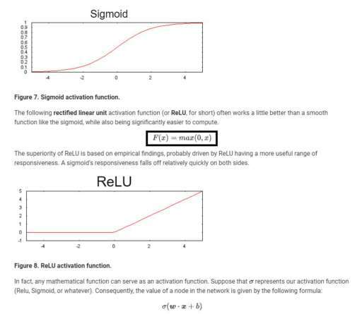

> comments": 

1. ->  Merhaba,Kutucuk içerisine aldığınız ifade ReLU fonksiyonu, max(0, x)-> 0 ile x'den hangisi büyükse onu geri döndürür.",
2. ->  ->  çok teşekkür ederim şimdi anladım..",
3. ->  ReLU fonksiyonu 0'a kadar (negatif değerlerden 0'a kadar) 0 değeri, 0'dan sonra da kendi değerini (x değerini) verir.örn: x=-2 olsun f(x)=0 olur.x=3 olsun f(x)=3 olur.",

### soru

> quest": "Merhaba, konularla tam bağlantılı olmasa da bir şey takıldı kafama. Bu kurs sürecinde, temel kavramlar gördük. Epoch, learning rate, batch size gibi.. Bunlar, makine öğrenmesinin temeli diyebilir miyiz? Demek istediğim, flapy bird veya snake oynayan/öğrenen bir yapı ile spam mail ayıran yapıda benzer kavramlar bulunuyor mu? Yoksa, başka alanlarda başka kavramlar, başka temeller mi giriyor?", 

> comments":

 1. -> Tabii düşününce, veri seti olmazsa neyi batchlere ayıracağız gibi bir soru da çıkabiliyor ortaya ama genel olarak anlaşıldığını düşünüyorum..",
 2. ->  Flapy bird oynayan yaoiyi bilmiyorum 🙂 Ancak spam mail ayiran yapi olarak tarif ettigin sey binary classification yapiyor,.",
 3. -> Flappy Bird/Snake gibi oyunları öğretmek için kullandığınız metoda göre, temel kavramlar değişiklik gösterecektir. Örneğin, yılan oyununu kendi kendine oynayan bir yazılım için farklı çözüm yaklaşımları olabilir.1 - Algoritmik yaklaşım: Oyunun state'ine göre bir sonraki hamleyi verecek algoritmayı kendiniz kodlarsınız. Burada herhangi bir makine öğrenmesi sözkonusu değil.2 - Supervised Learning: Modelinize yüzbinlerce etiketlenmiş training data verirsiniz. Burada inputlar farklı oyun state'leri, label'lar da ilgili state için oynanması gereken doğru hamle olabilir. Önceden oynanmış oyunlar ile model eğitilebilir.3 - Reinforcement Learning: Yapılan hamle serilerinin sonucunda ödül/ceza sistemi uygulayarak modelin kendi kendine oynayarak öğrenmesi sağlanabilir.4- Genetik Algoritmalar: Bir neural network'ün parametrelerini (weights & biases) yılanın genetiği olarak düşünebiliriz. Mutasyonlar ve crossoverlar ile yeni nesil yılanlar türetilir ve en iyi performansı gösterenler seçilir. Bu bir döngü halinde tekrar edilir ve giderek daha başarılı (fit) yılanlar elde edilmiş olur.Bu başlıklar için benzer kavramlar mutlaka vardır ama hepsinin kendine özgü temel kavramlara sahip olduğu aşikar.",
 4. -> Çok teşekkür ederim, çok açıklayıcı yorum olmuş..",

 ### soru 

> quest": "Merhabalar, ROC curve ve Auc 'un işlevini pek anlayamadım biz bunları nede kullanıyoruz bu bir zorunluluk mudur acaba?",

> comments":
1. ->  Merhaba,[Link](https://community.globalaihub.com/?status/1482-1482-1587629584/#comment.4782.4624.4624) yorumumda bunları açıklamaya çalıştım. Zorunlu değillerdir ama yapmamız modelin performansını ölçmemiz açısından önemlidir.İyi çalışmalar.Community."
2. ->  Precision/recall, F1-score, error rate, accuracy , ROC curve ve AUC classification icin kullanilan performans metriclerdir.Burada classification kisminin altini cizmek istiyorum cunku amacimiz prediction iyapmaksa RMSE, Pearson's correlate coefficient ve coefficient of determination kullanilir.Bu performans metrikleri genel olarak error analizi yapip modelimizi gelistirmeye yarar.",

### soru 

> quest": "Merhaba arkadaşlar,  Roc curve'de neden TPR ve FPR adı verilen iki parametreyi kullanıyoruz? ve bir de FPR 'de neden True negativ'i hesaplamak yerine False positive'i hesaplıyoruz?"

> comments": 

1. ->  Merhaba,TPR dediğimiz parametre Recall metriğidir aslında. Recall şunu sorar True Positivelerin kaç tanesi modelimiz tarafından tahmin edildi? TPR değerimizin kullanım amacı budur.TPR ve FPR değerleri birbirileri ile korelasyonludur ve curve'ümüzü (1,1) noktasında sınırlayabiliyoruz. Farklı threshold değerlerinde bir değer(TRP örnreğin) artarken diğer değer de (FPR örneğin) buna bağlı olarak artış gösterecektir. Bu değerleri kullandığımızda aynı tahmin setinin tpr ve fpr değerlerini görebilmek, eğer modelimizde bir problem var ise  [Understanding AUC - ROC Curvetowardsdatascience.comIn Machine Learning,](https://towardsdatascience.com/understanding-auc-roc-curve-68b2303cc9c5) linkindeki How to speculate the performance of the model? kısmında bunlara değiniliyor) bu kolayca tespit edilebilir.İyi çalışmalar.",
2. ->  ->  merhaba, [Link](https://towardsdatascience.com/understanding-auc-roc-curve-68b2303cc9c5) şu linkte tpr ve fpr değerlerinin birbirlerini pozitif yönde etkilediği ifade edilmiş. Bu değerler birbirlerini hangi yönde etkiliyor. Ayrıca FPR =1-specifity olarak tanimlanmiş. Specifity kavramı crash courseta açıklanmamış ama. Specifityden ne anlamalıyız? Teşekkür ederim.",
"Understanding AUC - ROC Curvetowardsdatascience.comIn Machine Learning, performance measurement is an essential task. So when it comes to a classification problem, we can count on an AUC ….",
3. ->   ->  Merhaba,Evet orada ufak bir anlaşmazlık olmuş.TPR değeri sizin Recall değeriniz. Specifity değeriniz ise Recall değerinizin Positive classlar için değil negative classlar için hesaplanmış değeridir.FPR değeriniz 1-Specifity'dir. Bu bağlamda biz thresholdu arttırdığımızda TPR zaten artacaktır, specifity değerimiz düşeceği için FPR değerimiz artacaktır. Oradaki anlam karmaşasını da düzelttim. Uyarı için teşekkürler.İyi çalışmalar..",
4. -> True Positive Rate = TPR = Recall =TP/(TP+FN) False False Positive Rate = FPR = FP / (FP+TN) = 1-(True Negative Rate) True Negative Rate = TNR = TN/(FP+TN) Roc Curve, True Positive Rate ile False Positive Rate arasindaki iliskiyi ifade ediyor.Ne yaptigimizi iyi anlayalim.Classification yapiyoruz.Bunun icin Precision/recall, F1-score, error rate, accuracy ve ROC curve performance metriklerimiz ve bunlardan yararlanarak hata analizi yapip modelimizi gelistirecegiz.Classification yaparken labellar probabilistic distrubition sonucunda belirleniyor.Roc curve icin true ya da false farketmez kesinlikle pozitif degerlerle ilgileniyoruz ve True, false olasiliklarin degisimine bakiyoruz.Ve tabiki TPR ve FNR 0 ve1 arasinda degerler aliyor.Son olarak sordugun soruya geldigimde FPR yi hesaplarken True Negative Rate i hesapliyorsun, false negativi degil..",
5. ->  [Link](https://youtu.be/4jRBRDbJemMROC) and AUC, Clearly Explained!youtu.beROC (Receiver Operator Characteristic) graphs and AUC (the area under the curve), are useful for consolidating the information from a ton of confusion matric...",
6. ->  ->  Videonun ozetle kismi cok iyi aciklamis.Roc corves threshold degerini belirlemeyi kolaylastiriyor.AUC ise hangi classification methodunun daha iyi oldugu konusunda karar vermemize yardim ediyor..",
7. ->  teşekkürler.",
8. -> Yalniz ROC egrisinden hangi threshold degerinin hangi sonuca vardigini cikarsayamiyoruz (thr degerine gore sirali degiller). O zaman bu egri uzerindeki noktalar bize threshold degerinin ne oldugu bilgisini vermiyor. degil mi? -> ",
9. ->  ->Evet, burada eğri noktalar bize threshold değerini vermez. Burada AUC ile hesapladığımız zaten bütün threshold değerlerinde nasıl bir performans elde edebileceğimiz. ROC curve'ünde ise TPR ve FPR değerleriyle threshold'u elde edemeyiz."

### soru

> quest": "Merhabalar, birkaç sorum var onları sırayla sormak istiyorum. Her soruyu yorum olarak atıyorum.",

> comments": 

1. -> Diğer Metriclerde, “classification_threshold” değerini kullanırken (ki bu değer de 0.52) neden AUC için kendimiz bir değer atadık? Ayrıca bu değeri neye göre belirledik?.",
2. -> Burada, model.add diye başlayarak yeni katmanlar ekliyoruz ve units’de de katmanların ne kadar nöron içereceğini belirliyoruz. Peki, neye göre belirliyoruz? Kaç katman olacağını, kaç nöron olacağını neye göre belirliyoruz?.",
3. -> -> Oncelikle novel bir model yaratirken kac layer ekleyecegini kimse sana soyleyemez.Mesela Oxford tarafindan yayinlanan vgg16 modelini dusun.Neye gore layer sayisini belirlediklerinin belli bir cevabi yok.Ayni sekilde 50 layerdan olusan Resnet 50 ya da Resnet 101.Ancak layer sayisi arttikca ve azaldikca neler oluyor sorusunun cevabi var.Layer sayisi arttikca modelin derinlesir komplex hale gelir.Overfitting probleminin ortaya cikma olasiligi artar..",
4. -> ->  Peki ama şu da var, overfittingden kaçınma yollarımız; learning ratei ayarlamak, öğrenmeyi erken bırakmak gibi yöntemler.. Yani optimum noktaya ulaşana kadar, elimizdeki her şeyi ayarlayarak ilerleyeceğiz, kimse bize neyin ne olduğunu söylemiyor diyorsunuz, öyle mi?.",
5. ->  -> Kimse sana kac layer kullanacagini ya da kac tane kullanman gerektigini soyleyemez cunku kimse bilmiyor.Sadece cok layer eklenince ne oluyor az sayida layer ile ne oluyor kismini tecrube ederek ogreniyorsun.Dedigin gibi overfitting problemleri icin regularization tekniklerini kullaniyorsun.Son olarak, fazla sayida layer daha iyi model anlami tasimaz.Bazen daha basit bir modelle iyi sonuclar alirsin..",
6. -> Belki kaç kez soruldu ama… Sorularımızı cevaplayan mentörlerimiz ve diğer yazılarda da görüyorum, bu değerleri tecrübe edindikçe ve benzer çalışmaları inceledikçe neler vereceğimizi anlıyoruz diyorlar. Fakat, örneğin learning rate’in aşırı veya çok düşük olduğunu loss’taki sapmalardan veya hiç düşmemesinden anlayabiliyorum. Fakat Epoch, batch size’ları gerçekten neye belirleyeceğiz? Bu noktaya geldim hala kafam almıyor...",
7.->  Oguzhan epochs ve batch_size konusunda ne kadar zamanin oldugu , en az kullanacagin datsetinin genisligi kadar onemli.Oncelikle epboch ve batch_ size in anlamini kavradigindan emin olmalisin.Bunun icin sunun gibi bir sorulara rahatlikla cevap vermelisin.Mesela training dataseti=32000 olsun.Eger batch_size = 32 ise training sirasinda kac iterasyon olacak? 1000 olacak.1000 iterasyonun tamamlamasi 1 epoch oldu demek degil mi? Daha hizlica 1 epoch tamamlansin modelimin performansi hakkinda hizlica fikir edinmek istiyorum dersen batch_size ini arttir. Training sirasinda total kaybini ve accuracy yi goreceksin.Traininge devam ederek kaybini azaltmaya accuracy i arttirmaya modelini gelistirmeye devam edebilirsin.epeochs = 10 yap ne kadar zaman aldigina bak.See zaman!",
8. -> ->  Anladım, çok teşekkür ederim 🙂.",
9. ->  ->  training dataset/batch_size = 1 epoch mu ediyor yani",
10. ->  ->  Yukarida verdigim ornege gore yazayim.Training_dataset / batch_size = 1000 iterasyon. Bu 1000 iterasyon tamamlandiginda yani training datasetindeki tum veriler bir kez training safhasindan gecip tamamlandiginda 1 epoch ediyor.",

### soru

> quest": "auc'un diğer metriklerle mi yoksa yalnız başına konması mı daha mantıklı olur? ayrıca auc ve roc kavramlarını anlayamadım. Teşekkürler."

> comments": 

1. -> Merhaba,Positive Rate curve'ü çeşitli threshold değerlerinde precision ve recall arasındaki dengeyi gösterir. AUC'ta ise True Positive Rate(zaten recall oluyor, TP/TP+FN) ve False Positive Rate (FP/FP+TN) arasındaki ilişki grafiğinin alanı alınarak her threshold değeri için performans ölçülmeye çalışılır.(Yani modelin toplam performansı). Bu yüzden AUC'u kullandığınızda precision ve recall kullanmayabilirsiniz.Precision ve recall metrikleri sınıflandırma modelimizin performansını farklı açılardan ölçer. Herhangi biri diğerinden daha iyi diyemeyiz iki metriğin de performansı farklı açılardan ölçtüğünü bildiğimizden threshold değerini ikisini de optimum düzeyde tutacak şekilde ayarlayabiliriz.ROC grafiği her threshold değeri modelimizin için True Positive Rate (namı diğer recall) ve False Positive Rate (negatif örnekler içindeki yanlış pozitiflerin oranını ölçer) değerlerinin plot edildiği bir grafiktir. Bu grafikte TPR değerlerinin FPR edğerlerine göre daha büyük olmasını bekleriz nedenini [Link](https://community.globalaihub.com/?status/1133-1133-1587507559/#comment.4733.4585.4585) linkinde açıklamaya çalıştım. En performanslı durum TRP değerinin 1, FPR değerinin 0 olmasıyken en performanssız durum tam tersidir.( TPR 0, FPR 1 burada negatifleri pozitif, pozitifleri negatif diye tahmin eder.)AUC ise bu grafiğin altında kalan alanı integral ile hesaplayarak aslında her threshold değeri için TPR ve FPR hesaplamasının yapılmasını kolaylaştırmış olur. Her threshold için bu hesaplamaları tek tek yapmaktansa AUC (Area Under the Curve) kullanarak bu hesaplamayaı integral ile kolayca yapar. Bu linkte de bazı yararlı açıklamalar bulabileceğinize inanıyorum. [Link](https://community.globalaihub.com/?status/875-875-1587486608/#comment.4706.4558.4558) İyi çalışmalar.Community",
2. ->  ->  açıklamanız için teşekkür ederim..",

### soru

> quest": "Merhabalar,  Alttaki L2 regularisation konusu ile ilgili olarak, sayet feature'lardan birisi label ile korrole ise, regularisation olmasa bile bu feature'un weight'i yuksek cikmayacak mi? Yani baska bir deyisle non-informative feature'larin learning modelde weight'inin yuksek cikmasinin nedeni L2 regularisation mu yoksa aslinda zaten bu feature'larin label'lar ile korrole olmasi mi? Bu durumda \"non-informative ama label ile korrole feature'larin weight'inin L2 regularisation nedeniyle yukselmesi\" ifadesi dogru olur mu?  Tesekkurler,  L2 regularization may cause the model to learn a moderate weight for some non-informative features. Surprisingly, this can happen when a non-informative feature happens to be correlated with the label. In this case, the model incorrectly gives such non-informative features some of the \"credit\" that should have gone to informative features.",

> comments": 

1. -> Merhabalar, label Ile korrole olan non informative feature in katsayısı L2 regularization olmadan da yüksek çıkacaktır. Ancak L2 ile korrole olmayan featurelarin katsayıları sıfıra yaklaşırken , korrole olan non informative featureimizinda katsaysi korrole olması sebebiyle artacaktır. Yani başlangıçta düşük bir katsayiya sahip olup L2 sebebiyle yükselmiyor. Korrole olması nedeniyle zaten diğer korrole olmayan featurelardan yüksek bir katsayiya sahip oluyor. Eğitim sonunda da label Ile arasında bulunan korrelasyondan dolayı katsayısı artiyor.Edit: but durum spurious correlation (sahte korelasyon) olarak tanımlanmaktadır. Mesela yazin dondurma tüketimi artmaktadır, aynı şekilde denizde boğularak olmelerde artmaktadır. Boğularak ölmeleri arastirdigimiz modelimize dondurma tuketiminide ekledigimizi düşünecek olursak bu durumda dondurma tüketimi yazın gerçekleşen ölümler için etkin bir değişken gibi görünecektir ve yüksek bir weight'e sahip olacaktır.İyi çalışmalar.",
2. -> ->  Merhaba,Bunu 1 hafta kadar önce sormuştum fakat yanıt alamamıştım. Benzer bir konu olduğundan hazır sizi bulmuşken tekrar sorayım. Yukarıda x değişkenleri ile y arasındaki bir korelasyondan söz edilmiş. Eğer modelimizdeki x değişkenleri kendi arasında 0.7 veya 0.8'den daha büyük bir korelasyona sahipse hiçbir şey yokmuş gibi modeli çalıştırmaya devam mı etmeliyiz?.",
3. ->  -> Bu problem MultiCollinearity problemi olarak tanımlanır. Açıklayıcı değişkenlerin(X'lerin) arasında yüksek korelasyon olması sebebiyle karşımıza çıkar. Bu sorunu görmezden gelerek çalışmamıza devam edebiliriz. Ya da soruna sebep olan değişkenlerden birini modelden çıkartabiliriz. Hangisi olacağına karar vermek için her değişkenle deneyerek model performansımıza bakabiliriz. Ya da Temel Bileşen Analizi, Faktör Analizi gibi bir yöntemler ile bu çoklu doğrusal bağlantı sorununu ortadan kaldırmaya çalışabiliriz.Özetle ne modelimizi optimal formuna getirmek için her türlü yaklaşımı deneyip çalıştığımız model için en uygun yöntemi tespit edip, bu şekilde çalışmaya devam etmeliyiz..",
4. -> ->  VIF skorları gözetilerek Ln veya sqrt gibi bir dönüşüm veyahut faktör analizi yapmanın mümkün doğru ama benim yukarıda asıl sormak istediğim (Bunu net sormadım üstü kapalı olarak sormak istemiştim) niçim multicollinearity durumunu derslerdeki hiçbir videoda veya dökümanda görmüyoruz. Bu durum niçin es geçiliyor? Aynı şekilde stationary durumu da birçok örnekle es geçilmiş. Normalde istatistiksel bir analizin temeli olan heteroscedasticity, multicollinearity ve autocorrelation gibi durumlar sırf analizi devam ettirilmek adına görmezden geliniyor gibi geldi. Bu ne derece anlamlı?.",
5. ->  -> ML ile İstatistiksel Analiz birbirlerinden ince bir çizgi ile ayrılır. Bu noktada amacına göre bahsettiğiniz yaklaşımlardan birini ya da bir kaçını tercih ederiz. Amacımız tahmin değil yorumlamak ise, multicollinearity, heteroscedasticity/ homoscedasticity, stationarity gibi faktörler dikkate alınmak durumunda iken, bütün bunlaramacımız tahmin olduğunda model etkinliğimizi artırabilecek bileşenler haline gelebilmekte.Eğitim içeriği makina öğrenimi üzerine olması sebebi ile, verinin işlenmesi model için feature seçimi, bunların anlamlılık testleri ve bahsettiğiniz durumların testleri gibi istatistiksel yaklaşımlara yer verilmemiş. Bütün bunlar, görmezden geliniyor gibi değil de farklı bir eğitim konusu olarak düşünülebilir.",
6. -> ->  Anladım teşekkürler..",

### soru

> quest": "Arkadaşlar merhaba ben L1 Regularization'ı ve feature cross ların ne olduğunu tam anlamadım galiba. Yardımlarınızı bekliyorum. Çok teşekkür ederim 🙂",

> comments": 

1. -> Merhaba, [Link](https://community.globalaihub.com/?status/774-774-1586937745/#comment.4123.4009.4009) linkinde feature cross kısmını açıklamaya çalıştım ama ulaşamazsanız aşağıya alıntılıyorum.\"Merhaba,Öncelikle Feature Cross yapmamızın sebebi modelimizin verileri tek bir lineer çizgiyle ayıramamasıdır. Bu yöntemle yeni bir feature elde edip bu yeni feature modelimizin eğitim sırasında verileri daha etkili ayırıp daha etkili bir hipotez fonksiyonu elde etmesinde yardımcı oluyor. Örneğin elinizde \"dil\" ve \"ülke\" kategorik featureları olsun.Örneğin dil feature değerleri: \"Türkçe, İngilizce, Japonca\"Ülke değerleri de: \"Türkiye, İspanya, Kanada\" olsun.Bu iki kategorik veriyi One Hot Encoding kullanarak binary vector'e çevirdiniz ki modelimiz numerik veri üzerinde çalışabilsin.Eğer siz bu iki feature'ı yani iki binary vector değerini çarparsanız elinizde 9 elemanlı bir binary vector olur. Bu binary vector değerlerinden her biri bir ihtimali temsil eder. Örneğin:[Türkçe ve Türkiye,Türkçe ve İspanya,Türkçe ve Kanada, İngilizce ve Türkçe,.......] gibi.Siz ilgili ihtimalin olduğu indeksteki değere 1 koyduğunuz anda artık o eğitim örneği için o değer geçerlidir. Örneğin [1,0,0,0,0,0,0,0,0] yaptığınızda artık Türkçe ve Türkiye değerini o eğitim örneği için değer belirlemiş olursunuz. Buradaki amaç featureların tek tek tahmine katkısından daha çok katkı sağlamalarını sağlayabilmek. Örneğin dil ve ülke featureları kend başlarına feature olarak katkı sağlarlar ama iki feature'ı çarpıp elde ettiğimiz yeni feature tahminde daha çok katkı sağlayacaktır.\"L1 regülarizasyon yapmamızın sebebi feature cross sonrası oluşacak sparse matrixlerdeki 0 olan feature değerlerinin weightlerini 0layıp onları ortadan kaldırmaktır. L1 regülarizasyon weight değerlerimizden her adımda sabit bir k değerini çıkarır ve sıfırlar. L2 ile karıştırılmamalıdır L2 overfit olmayı engellemek için her adımda weightten kendisinin belli bir yüzdelik dilimini çıkarıp onu 0'a yakınsatır ama asla sıfırlamaz. L1 ise sparse matrixteki 0 değerindeki featureların weight değerlerini sıfırlarlar.Sorunuz olursa sorabilrsiniz.İyi çalışmalar.Community",
2. -> MerhabalarFeature Cross: En basit hali ile elimizde bulunan featurelarımızı çarpmak anlamına geliyor. Mesela:OdaSayısı = [3,5,6,3] ve Konum = [12,25,9,8] olsun: Feature Cross, bu iki feature'mizi eleman düzeyinde çarparak : KonumaGöreOdaSayısı = [3x12, 5x25, 6x9, 3x8] olarak yeni bir sentetik feature elde etmiş oluyoruz. Aslında yaptığımız işlem her iki diziden aynı indise sahip olan elemanları alıp çarparak yeni bir diziye atamak oluyor.L1 Regularization ise, modelimize bir ceza parametresi olarak eklediğimiz katsayısı LAMBDA olan yeni bir parametre. Ve matematiksel formülü: model katsayılarımızın mutlak değerlerinin toplamı olarak ifade edilmekte.(sum(abs(W_i)), i = 1,2,... p, p= feature sayısı.) AMACIMIZ optimal bir ceza ile modelimizi en sade ve en etkin formuna getirebilmek. Optimal cezayı uygulayabilmek için LAMBDA parametresinin optimum değerini tahmin etmemiz gerekmektedir.Lambda'yı 0 almamız halinde kurduğumuz model ile çalışmaya devam etmiş oluruz. Çok büyük bir değer seçersek bu sefer de underfit gibi bir sorun ile karşılaşmış oluruz. Bunlara dikkat ederek optimal değeri bulup modelimizi kuruyor olacağız.Umarım yeterince açık olmuştur 🙂İyi çalışmalar.",
3. ->  ->  Hocam burada yapmaya çalıştığımız şey şu mu? Yani örneğin amacımız dünya üzerindeki yerleşim yerlerindeki median_house_value değerlerini tahmin etmek olsun. Bunun için örneğin latitude değerleri için 200 bucket oluşturalım, longitude değerleri için de 300 bucket oluşturursak. Toplamda 200x300 = 60000 hash_bucket ımız olacak. Dünyanın % 70inin su olduğunu(kara parçası olmadığını) varsayarsak burada bir yerleşim olmayacağı için bunların neredeyse 60000x0.7=42000 gereksiz bu yüzden bunların weight değerini 0 yapmayı amaçlıyoruz. Doğru mudur acaba ? Çok saçma bir soru olmuşsa kusura bakmayın ben de kafamda tam oturtamadığım için sordum..",
4. ->  ->  merhabalar, evet dediğiniz gibi modelimizde bulunan gereksiz değişkenlerin weightlerini sıfırlamak amaç..",
5. ->  ->  Teşekkür ederim..",
6. ->  Çok teşekkür ederim 🙂.",

 ### soru

> quest": "Merhaba Arkadaşlar, Eklediğim kısmı anlayamadım. Yardımcı olur musunuz? Teşekkürler"

> comments": 

1. -> Merhaba,Öncelikle scale invariant şu demek; özelliklerden birini ölçeklendirmek(örneğin 0'dan farklı bir sayı ile çarpmak) tahmin değerini değiştirmez. AUC'un scale invariant olmasının özelliği AUC'un hesapladığı değer bizim tahminlerimizin mertebe sırası, örneğin üst kısımdaki output of log reg kısmına bakarsanız burada hesaplanılan seçilen herhangi bir pozitif değerin seçilen herhangi bir negatif değerin sağında olmasıdır.(modelin rastgele bir pozitif örneği rastgele bir negatif örnekten daha yüksek sıralaması olasılığıdır.) Bunu açıklamam gerekirse;[Link](https://towardsdatascience.com/understanding-auc-roc-curve-68b2303cc9c5) linkindeki resimler üzerinden anlatımımı yapayım. Bu linkteki Image 6 ve 7'ye bakarsanız bizim istediğimiz en performanslı model yaklaşımı budur. TN ve TP değerlerimizin Threshold değeri itibariyle TN solda TP sağda olacak şekilde ayrılmasıdır. Ama biz genelde Image 8 ve 9'daki bir curve ve plot elde ederiz. Bunun nedeni işin içine FP ve FN girmesidir yani false tahminlerimizin girmesidir. AUC'un en optimum olduğ zaman predictionların TN ve TP olarakl sıralandığı zamandır ve bu yüzden predictionlarımızı prediction değerine göre sıraladığımızda TN değerinin TP değerinin solunda kalması beklenir. AUC zaten bunu hesaplar.1.AUC scale-invariant'tır çünkü burada biz bir prediction değerlerinin mutlak değerleriyle değil dizilim sıralarıyla ilgileniyoruz. Tekrar hatırlatmam gerekirse istediğimz şey TN değerlerinin TP değerlerinin solunda olması (rank olarak TP'den düşük olması) böylece TN ve TP değerlerimiz iyice ayrılıp AUC değerimiz 1 olabilsin.2.AUC classification-threshold-invarianttır çünkü burada hangi threshold'un seçildiğine bakılmaksızın modelin tahminlerinin kalitesini ölçer.Ancak bu iki durum da bazı zamanlarda AUC'un kullanılabilirliğini kısıtlamaktadır.1.Scale invariant olması her zaman istenen bir durum değildir çünkü probability outputlarımızın iyi bir şekilde kalibre edilmesini isteyebilirz. Bu da ranklerden ziyade absolute valuelarına ihtiyaç duyduğumuz anlamına gelit ama AUC absolute valuelar ile değil TN ve TP değerlerinin dizilim rankıyla ilgileniyordu.2.Classification-threshold-invariant da her zaman istenen bir durum değildir. Bunun nedeni ise FN ve FPler arasında fazla bir cost açığı olan durumlarda bir tip classification error değerinini(Örneğin sadece FP) mimize etmenin kritik olabileceğindendir. azaltmak kritik olabilir. Bu minimize işlemini thresholdu yeniden ayarlayarak yapabilrisiniz ama burada hatırlarsak classification-threshold-invariant sayesinde modelin performansı seçilen threshold değerine bakılmaksızın ölçülüyordu. O yüzden classification-threshold-invariant özelliği bu tür optimizasyonlar için pek kullanışlı olmayacaktır.İyi çalışmalar.",
[Understanding AUC - ROC Curve]([Link](https://towardsdatascience.com/understanding-auc-roc-curve-68b2303cc9c5)
2. ->  ->  açıklayıcı yazı için çok teşekkürler.",
3. ->  ->  Biz threshold değerini değiştirdiğimizde TPR ve FPR'i dolayısıyla ROC'i grafiğinin şeklini değiştirmiş oluyoruz. Mesela threshold değerini arttırdığımızda yanlış hesaplamıyorsam TPR'nin de FPR'nin düşmesini, en iyi ihtimal sabit kalmasını bekliyoruz. İkisindeki değişim oranının aynı olması çok zor olduğu için (yani değişim oranları farklıysa birbirlerini kompanse etmeleri zor olduğu için) grafiğinin integrali yani AUC de aynı kalamazmış gibi geliyor. Bu düşünüşteki hata nereden kaynaklanıyor, çelişkinin sebebi nedir bir türlü bulamadım. Yardımcı olabilirseniz sevinirim.",
4. ->  ->  Merhaba,ROC curve'unu farklı TPR ve FPR değerleri için çiziyoruz. Bu değerler fakrlı thresholdlarda değişen değerlerdir. Threshold arttığı zaman TPR değerimiz azalır. Bunu nedeni TP/(TP+FN) formülündeki FN değerinin threshold değeri ile artması olacaktır. FPR de 1-TPR olduğu için TPR düşerken FPR'nin artmasını bekleriz ama bu artış iki tarafta da aynı şekilde olmaz (simple lineer bir artış sergilemez.) ROC, farklı threshold değerleri için belirlenen bu TPR ve FPR değerlerinin çizildiği bir grafik bu grafikte de TPR ile FPR'nin değişim oranları aynı olmadığı ve hata oranı (FP,FN) içeren bir modelimiz olduğunu varsayarsa ROC curve'ümüz parabolik bir görüntü alacaktır. Her threshold değeri için farklı bir ROC curve'ü çizilmez, ROC curve'ü her threshold değeri için TPR ve FPR değerlerini içerir. Bu mantıkla ROC curve'ü sabit kalacağından AUC değeri de sabit kalacaktır.İyi çalışmalar..",
5.  ->  ->  ROC curve zaten farklı thresholdlar için bütün senaryoları üzerinde barındırıyor. Kavramları karıştırmışım bir an. Anladım, çok teşekkür ederim..",
6. ->  Çok net açıklayıcı bilgilerin için çok teşekkürler ->  iyi çalışmalar,

### soru

> quest": "Merhaba Arkadaşlar, Accuracy kısmında eklediğim yeri tam olarak anlayamadım. Yardımcı olabilir misiniz? Teşekkürler",

> 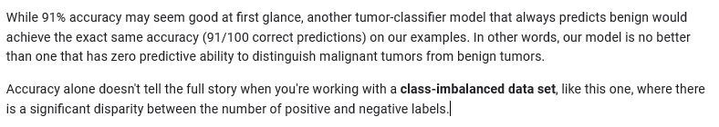

> comments": 
    
1. -> Merhaba,Burada demek istediği %91 accuracy değerinizin olması ilk başta güzel görünebilir ama her seferinde benign tahmin eden bir modelin de %91 accuracy değeri olur. Yukarısındaki örneğe bakacak olursak elimizdeki tablo şu şekilde olacak;- M - BM 1 1B 8 90Bu kısmın accuracy değeri 90+1/90+1+1+8=91/100Hepsi benign tahmin edilseydi oluşacak tablo:- M - BM 0 0B 9 91Çünkü 100 tane tahminimiz vardı 100'ünü benign olarak tahmin ettik ve bunların 9 tanesi malignanttı yani false negative oldu. 91 tanesi ise true negative oldu. Bu durumda 91+0/91+9=91/100 olur yani burada accuracy'nin veri dağılımının dengesiz olduğu(negatif ve pozitif değerler arasında ayrıklık olduğunda) veri setlerinde tek başına yeterli olmayacağını söylemekte.Hatalı gördüğünüz yer olursa düzeltmekten çekinmeyin.İyi çalışmalar.",
2. ->  Accuracy hesaplandığında %91 çıkıyor. Buna bakarak sınıflandırmanın başarılı olduğunu düşünebiliriz ama confusion matrixi incelediğimizde daha farklı bir tabloyla karşı karşıya kalıyoruz. FP ve TN değerlerine bakarsak, iyi huylu tümöre(benign) sahip 91 hastamız var ve 90 kişide benign olduğu tahmin edilmiş. 1 kişi yanlış tahmin edilmiş. Bu başarılı bir tahmin. Ancak, TP ve FN değerlerine bakarsak toplam 9 kişide kötü huylu tümör(malignant) var fakat modelimiz sadece 1 kişide olduğunu tahmin etmiş. Kalan 8 kişide kötü huylu tümör tespit edilememesi oldukça kötü bir tahmin olduğunu gösterir. Burada da diyor ki dengesiz sınıflandırılmış veri setlerinde(class-imbalanced dataset) yalnızca accuracy e bakmak ve buna göre modelin iyi tahmin yapıp yapmadığına karar vermek yeterli değildir. Bu veri setimiz de oldukça dengesiz, pozitif ve negatif etiket sayısı arasında önemli derecede bir eşitsizlik var.",
3. ->  Çok teşekkürler ->  ->  arkadaşlar şimdi gayet iyi anladım 🙂.",

### soru 

> quest": "Burada prediction ve identifie arasındaki fark nedir? Teşekkür ederim.",

> comments":

1. ->  Before/After aralarındaki fark.Yani sonuçlar çıkmadan önce \"predict\" kelimesi kullanılırken, sonuçları alıp yorumladıktan sonra \"identified, addressed, classified\" vb. daha net anlamı olan kelimeler kullanırız. Ki bu şekilde sonuçların elimizde olduğunu onlara göre yorum yaptığımızı belirtmiş oluruz.Edit: Pardon dikkatsizliğime geldi, Recall sonucu için yorum yapılıyormuş orada.Modelin etkinliğinden bahsederken x% doğru tahmin ediyor şeklinde ifade edilir. Ancak Recall bir ölçüm birimidir. amacı da What proportion of actual positives was identified correctly? sorusuna cevap vermektir. Yani tahmin ile ilgili değil de sonuç ile ilgilidir. Hali ile elimizde bulunan bilinen birşeyi yorumlarken x% doğru tahmin etmiş gibi bir şey kullanmayız. Yukarıda yazmış olduğum ilk paragraf kısmi olarak doğruydu.İyi çalışmalar.",
2. ->  ->  Teşekkür ederim..",
3. -> Kesinlik (Precision) ise Positive olarak tahminlediğimiz değerlerin gerçekten kaç adedinin Positive olduğunu göstermektedir.Duyarlılık (Recall) ise Positive olarak tahmin etmemiz gereken işlemlerin ne kadarını Positive olarak tahmin ettiğimizi gösteren bir metriktir.İlk cümlede eğer bizim modelimiz 0.5 precision değerine sahipse bir tümörün kötü huylu olduğunu %50 oranında doğru \"tahmin\" eder demiş.İkinci cümlede ise eğer modelimiz 0.11 recall değerine sahipse tüm kötü huylu tümörlerin %11'ini doğru \"teşhis etmiş\" demektir demiş.Burada aslında anlam olarak kelimeler arasında bir fark yok. Buradak fark precision ve recall arasındaki farktır.Precision şunu sorar, olumlu tanımların ne kadarı gerçekten doğruydu?Ne demek istiyorum?Örneğin positive değerimiz kurdun tehdit oluşturması olsun. Biz kurdun tehdit oluşturuşunu kaç kere tahmin etmişiz ve bu tahminlerin kaçı doğruydu bunun oranını yakaladığımızda precision'I bulmuş oluyoruz. Örneğin biz 7 kez kurdun tehdit oluşunu doğru tahmin edip, 5 kez de kurt tehdit oluşturmuyorken tehdit oluşunu tahmin edersek precision oranımız 7/7+5'ten 7/12 olur. Yani benim kurt benim için tehdit oluşturuyor dediklerimin kaçında kurt gerçekten bizim için tehdit oluşturuyordu?Recall ise şunu sorar, gerçek pozitiflerin ne kadarı doğru bir şekilde tahmin edildi? Örneğin kurt gerçekten tehdit oluşturuyorken ben bu tehditlerin kaç tanesini doğru tahmin edebildim. Kurdumuz bize 20 kez tehdit oluşturuyor olsun. Biz bunların 13 tanesini doğru bir şekilde kurt tehdit oluşturuyor olarak tahmin edip, 7 kez yanlış kurt tehdit oluşturmuyor dersek bizim recall oranımız (13/13+7=13/20) olur. Yani kurdun benim için her tehdit oluşturuşunda ben bunların kaç tanesini doğru bir şekilde tahmin edebildim?Daha faydalı bir link için: [Link](https://medium.com/@gulcanogundur/do%C4%9Fruluk-accuracy-kesinlik-precision-duyarl%C4%B1l%C4%B1k-recall-ya-da-f1-score-300c925feb38) İyi çalışmalar."
4. Doğruluk (Accuracy) , Kesinlik(Precision) , Duyarlılık(Recall) ya da F1 Score ?medium.comVeri bilimi projelerinde en doğru modelin hangisi olması gerektiğine karar vermek için iş birimlerinden gelen talepleri iyi…1 month ago 13 people like this.Like ReportReply",
5. ->  ->  Teşekkür ederim..",

### soru 

> quest": "Merhaba, Genel olarak classification modelleri hakkında birkaç sorum var. 1) AUC ve ROC Curve modelimizde tam olarak nasıl kullanılıyor? Farklı thresholdlara göre tp rate ve fp ratelerimizi hesaplayıp ROC curve'ü oluşturuyoruz. ROC Curve'ün altında kalan alan da AUC oluyor. Bu alan bize modelin pozitif ve negatif örnekleri ne kadar iyi ayırt ettiğini veriyor. F-score'u en yüksek threshold da en iyi threshold oluyor. Ancak bu threshold modele nasıl dönüyor? Yani gradient descentin weightleri değiştirdiği gibi bir mekanizma var mı yoksa thresholdu kendimizin mi belirlemesi gerekiyor? (ki programlama örneğinde kendimiz belirliyorduk) 2) Lojistik regresyonun hata fonksiyonu neye göre belirlendi? Çalışma mantığını tam anlayamadım. 3) Regularization kısmını eklemeden önce weightleri  kendisinden learning rate * kayıp fonksiyonunun türevini çıkartarak değiştiriyorduk. Regularization kısmını ekleyince weightlerden bir de ilaveten lambda * regularizationun türevini çıkartarak mı güncelliyoruz? Umarım açık olmuştur. Cevaplarınız için teşekkür ederim.

> "comments": 

1. -> Merhaba,Anladığım kadarıyla:1. Threshold modele dönüyor derken biz numerik bir verimizi alıp, bu numerik verimizi threshold değerinden büyük küçük olma durumlarına göre yeni sentetik bir feature üzerinden ayırıyoruz. (Yeni featureımız değer>threshold ise 1, değilse 0). Biz her gradient descent yaptığımızda aynı threshold üzerinden modelimiz bu tahminleri öğreniyor ve test set üzerinde yaptığı tahminlerini güçlendiriyor. Programlama egzersizinde de accuracy değeri 0.8 çıkıyordu. Burada ROC, AUC ve F skorlarının amacı sınıflandırma modelimizin performansını ölçüp optimum threshold değerini bulmamıza yardım etmek. Burada belli threshold değerlerine göre accuracy, recall, precision, ROC, AUC ve F skoru değerlerimiz değişiklik gösterecektir. Burada yapmamız gereken uygun threshold değerini bu metriklere bakarak bulabilmek.2.Hata fonksiyonundan kastınızı L1 ve L2 regülariazsyonu olarak anladığım için soruya bu şekilde cevap vereceğim.L1 regülarizasyonu sparsity matrix gibi (içinde milyonlarca trilyonlarca 0 olup az sayıda 1 olan matrixler) RAM'de fazlasıyla yer kaplayan matrixlerin weight değerlerini sıfırlamaya yarar böylece gereksiz 0 değerlerini RAM'de tutmak zorunda kalmayız. Yani önemsiz feature değerlerini de böylece yok etmiş olur. Çünkü L1 regülarizasyon her adımda theta'nın mutlak değerinden sabit bir değer çıkarır. Bu metodu feature selection için kullanabiliriz.L2 regülarizasyonu ise theta değerlerini 0'a yaklaştırır fakat tamamen sıfırlamaz. Her adımda theta değerinin belli bir yüzdesini eksiltir bu nedenle theta değeri asla 0 olamaz (0'a çok yaklaşsa bile) L2'yi ise overfitting durumunu önlemek amacıyla theta değerlerini cezalandırmak için kullanabiliriz. L2'de hiçbir weight sıfırlanmayacağı için feature değerleri eksilmez.3. Link yönlendirmeleri çalışıyor mu emin olmadığım için ekteki resmi ekledim. Regularizasyon yaptığınızda (L2) normalde cost function'ınızın sonuna theta0 dışındaki (çünkü onun feature değeri yok) tüm theta değerlerinin karelerinin ortalaması*lambda ekliyordunuz. Gradient descent'te de her adımda cost function'ın türevini her theta değeri için aldığınızdan dolayı formülde Repeat kısmının altında kalan şekle döner ver aslındaa lambdamız thetamızı cezalandırmış olur.Hatalı kısımlarım varsa düzeltmelere açığım.İyi çalışmalar.",
2. ->  ->  Görseldeki alpha learning rate mi?.",
3. ->  ->  Evet, alpha değeri learning rate..",
4. ->  Hata fonksiyonundan kastım Log Loss idi..",
5. -> ->  Hata fonksiyonunun log loss olmasınn sebebi şu(binary classification mantığında yani iki farklı label çıktımızın olduğnu düşünerek anlatacağım. Örnek iyi huylu veya kötü huylu tümör.):Lojistik regresyon 0 veya 1 arasında olur çünkü tahmin değeri döndürür. Sigmoid fonksiyondur. Buna istinaden de log loss fonksiyonumuz hatayı tespit ederken label değeriyle tahmin değerini karşılaştırır, bir değerin doğru tahmin edilip edilmediğini kontrol eder. Aşağıdaki resimde log loss ve sigmoid fonksiyonlarının 1 ve 0 arasında olduğunu görebilirsiniz. label değeriniz 1 ise ve siz 1 tahmin etmişseniz cost 0 olur, aksi halde -sonsuza kadar gider. Burad istediğimiz label değerimizin doğru tahmin edildiğindeki ve edilmediğindeki costu hesaplamak. Eğer siz continuous ve sonsuz bir değer kümesi içerisindeki costu hesaplamak isteseydiniz değerlerinizi 1-0 ile kıyaslamanız mantıksız olacaktı.Umarım açıklayıcı olabilmişimdir.İyi çalışmalar.."

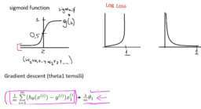

6. ->  Merhaba, resimdeki yi'ler gerçek değerlerimiz. p(yi) ise tahminimiz (0 ile 1 arasında). Dikkat ederseniz bizim gerçek y değerimiz yani label = 1 ise eşitliğin sağ tarafı tamamen 0 oluyor(1-y). label = 0 ise sol taraf tamamen 0 oluyor. Yani aynı anda sadece bir taraf aktif oluyor. Tahminimiz de sol taraf için 1 olma olasılığı sağ taraf için 0 olma olasılığı. Tahminimiz label'dan ne kadar uzaksa hatayı ona göre buluyoruz..

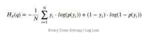

### 2.hafta quizi

> quest": "2. hafta quizi

### soru 

> quest": "Merhaba. Classification: True vs. False and Positive vs. Negative kısmında, pozitif ve negatif durumlara göre hikaye göz önüne alındığında False positive(FP) ve False negative(FN) durumlarının yer değiştirmesi gerekmez mi ?  Teşekkürler.",

> comments": 

1. ->  Burada negatiflik kafa karıştırıyor olabilir. Kanser testi yaparken kanserli hücre bulunursa sonuç Pozitif çıkar. Bulunmazsa Negatif çıkar. Bu örnekten daha iyi anlaşılabilir anlamlar 🙂 Doğru kanserli teşhis : True Positive. Kanser olmayana Kanser Teşhisi : False Positive. Kanser olup da Kanser değil teşhisi : False Negative. Burada testin pozitif çıkması gerekirken negatif çıkıyor. Kanser olmayana da Kanser değil sonucu : True Negative. Sonuç olarak : False Positive, normalde olmaması gereken şeyi olmuş gibi tahmin etmek. False Negative ise, olması gereken şeyi olmamış gibi tahmin etmek.Yerine göre FP yerine göre de FN'ler tehlikeli olabiliyor..",
2. ->  ->  Teşekkür ederim..",
3. ->  Confusion matrix oluşturulurken modelin sonuçları ile gerçek durumun uyumuna göre çıktılar isimlendirilir.Positive --> Wolf (Pozitif sınıf)Negative --> No Wolf (Negatif sınıf)True ve False etiketi de gerçek durumla modelin uyumuna göre atanır. Eğer uyum varsa True yoksa False etiketi atanır. Shepherd(model) No Wolf dediğinde Negative ve yanlış karar olduğu için False yani False NegativeShepher Wolf dediğinde Positive ve yanlış karar olduğu için False yani False PositiveBu şekilde düşünmen Confusion matrisini doğru bir şekilde oluşturmana yardımcı olabilir..",
4. ->  ->  Pozitiflik ve negatiflik durumu modelin söylediğine mi bağlı yoksa reality'ye mi ?.",
5. ->  ->  ->  un cevabi yeterli oldu sanirim.",
6. ->  ->  Evet teşekkür ederim..",
7. -> Confusion matrix'te kendimize y=1 değeri seçeriz bu da true olur. Örneğin y=1 değeri kurdun tehdidi (positive) olsun. y=0 kurdun tehdit etmiyor oluşu (negative) olsun.Eğer kurt tehdit ediyorsa ve modelimiz bunu doğru tahmin etmişse true positive olur. (gerçek değer y=1, tahmin edilen y=1)Eğer kurt tehdit etmişse ve modelimiz kurdun tehdit etmediğini tahmin etmişse false negative. (gerçek değer y=1, tahmin edilen y=0. Negatif tahmin edlmş ama yanlış)Eğer kurt tehdit etmiyorsa ve modelimiz bunu yanlış tahmin edip kurdun tehdidini tahmin etmişse false positive olur. (gerçek y=0, tahmin edilen y=1. Positive tahmin edilmiş ama yanlış )Eğer kurt tehdit etmiyorsa ve modelimiz bunu doğru tahmin etmişse true negative olur. (gerçek değer y=0, tahmin edilen y=0)Yani y=1 olma durumu positive, y=0 olma durumu negative.Tahmin ile gerçek değerin eşleşme durumu true, tahmin ile gerçek durumun eşleşmeme durumu false olur.İyi çalışmalar.",
8. ->  ->  Mantığında yanlışlık yok ancak en son paragrafında belirttiğin \"Tahmin ile gerçek değerin eşleşme durumu positive, tahmin ile gerçek durumun eşleşmeme durumu negatif olur.\" önermesi tam olarak doğru değil çünkü positive ve negative burada label ya da classlarımız oluyor. Tahmin ile eşleşip eşleşmeme durumuna göre True veya False olarak adlandırılıyor.İyi çalışmalar, kolay gelsin..",
9. ->  ->  Düzeltme için teşekkürler, ilgili düzeltmeleri yapıyorum.İyi çalışmalar..",
10. ->  ->  Eğer kurt tehdit etmişse ve modelimiz kurdun tehdit etmediğini tahmin etmişse false positive. demişsiniz ancak tabloda bu durum false negative olarak gösterilmiş. Ben de sizin dediğiniz gibi düşünmüştüm. Galiba yanlış düşünmüşüz..",
11. ->  ->  Hayır tabloda yanlışlık yok. Şöyle açıklayayım:- shepherd kurt var derse positive, kurt yok derse negative.- shepherd kurt gerçekten varken kurt var derse true positive, kurt yok derse false negative.- shepherd kurt gerçekten yokken kurt var derse false positive, kurt yok derse true negative.Buradaki yanlış anlaşılmaya tabloya reality açısından bakmanız yol açıyor. Reality değil shepherd'ın söylediğine göre positive ve negative'i yerleştirmelisiniz..",
12. ->  ->  Teşekkür ederim. Şimdi anladım..",
13. ->  Buradaki yazıyı okuyabilirsiniz, yararlı olacağını düşünüyorum. [Link](https://medium.com/@sengul_krdrl/hata-matrisini-anlamak-7035b7921c0f)
"Hata Matrisini Anlamakmedium.comVeri aldığımızda ön işleme , veri temizleme ve kurulduktan sonra ilk adım onu bitmemiş bir modele beslemek ve tabii ki olasılıklarda çıktı…",

### soru

> quest: "Merhaba, tf.keras Linear Regression egzersizlerinin kodlamalarına çalışırken bu hatayı alıyorum. Versiyonumu da kontrol ettim 2.1.  tf.keras.metrics'ler arasında RootMeanSquaredError çıkmıyor. Bu durumu nasıl çözebilirim ? Bunun yanında diğer hatayı da açıklayabilirseniz sevinirim. Sayfadaki kodda da aynen bu şekilde yazıyor. Şimdiden teşekkürler.",

> comments:
  
1. ->  Import ettiğiniz paketlerinizi gözden geçirin muhtemelen importlarınızda bir hata olabilir.Edit: kodunuzu paylaşırsanız daha sağlıklı çözüm yolu sunulabilir..",
2. -> import pandas as pdimport tensorflow as tffrom matplotlib import pyplot as pltdef build_model(my_learning_rate):model= tf.keras.models.Sequential()model.add(tf.keras.layers.Dense(units=1, input_shape=(1,)))model.compile(optimizer=tf.keras.optimizers.RMSprop(lr=my_learning_rate), loss=\"mean_squared_error\", metrics=[tf.keras.metrics.RootMeanSquaredError()])return modeldef train_model(model,feature,label,epochs,batch_size):history=model.fit(x=feature, y=label, batch_size=None, epochs=epochs)trained_weight=model.get_weights()[0]trained_bias=model.get_weights()[1]epochs=history.epochhist=pd.DataFrame(history.history)rmse=hist[\"root_mean_squared_error\"]return trained_weight, trained_bias, epochs, rmseprint(\"Defined create_model and train_model\")def plot_the_model(trained_weight, trained_bias, feature, label):plt.xlabel(\"feature\")plt.ylabel(\"label\")plt.scatter(feature, label)x0=0y0= trained_biasx1=my_feature[-1]y1=trained_bias + (trained_weight*x1)plt.plot([x0,x1], [y0,y1], c='r')plt.show()def plot_the_loss_curve(epochs, rmse):plt.figure()plt.xlabel(\"Epoch\")plt.ylabel(\"Root Mean Squared Error\")plt.plot(epochs, rmse, label=\"Loss\")plt.legend()plt.ylim([rmse.min()*0.97, rmse.max()])plt.show()print(\"Defined the plot_the_model and plot_the_loss_curve functions.\")my_feature = ([1.0, 2.0, 3.0, 4.0, 5.0, 6.0, 7.0, 8.0, 9.0, 10.0, 11.0, 12.0])my_label = ([5.0, 8.8, 9.6, 14.2, 18.8, 19.5, 21.4, 26.8, 28.9, 32.0, 33.8, 38.2])learning_rate=0.01epochs=10my_batch_size=12my_model = build_model(learning_rate)trained_weight, trained_bias, epochs, rmse = train_model(my_model, my_feature,my_label, epochs,my_batch_size)plot_the_model(trained_weight, trained_bias, my_feature, my_label)plot_the_loss_curve(epochs, rmse).",
3. ->  ->  Kodunuz sorunsuz çalışmakta, herhangi bir sıkıntı yok, paketlerinizi manuel kurmuş iseniz versiyon sorunu yaşıyor olabilirsiniz, paketlerinizi kaldırıp yeniden kurmayı deneyebilirsiniz..",
4. ->  ->  İlginiz için teşekkür ederim. Tensorflow 1.12'ydi onu 2.1 olarak da güncelledim ama sorunum çözülmedi. Kaldırmayı tekrar denerim..",
5. ->  Pycharm kullaniyor iseniz , keras kütüphanesini ayrı yüklemeyi deneyin. Nedense tensorflow dan import edince saçma hataları bende alıyordum. Ayrı ayrı kütüphaneleri yüklenince ortadan kalktı..",
6. ->  ->  merhaba , muhtemelen ben de bu problemi yasiyorum fakat pycharm da keras kutuphanesini nasil ayrica yukleyecegmi bilmiyorum. nasil yukleyebilirim? teşekkurler.",
7. ->  Bugüne kadar Google Colab,Spyder(Anaconda Distributed) ve Jupyter Notebook (Anaconda Distributed) platformlarında çalışıp bir hata ile karşılaşmadım.Bu platformlardan birinde çalışıyorsanız ve tensorflow versiyonunuzda herhangi bi sıkıntı yok ise, [Link](https://keras.io/) sitesinden optimizer modüllerini inceleyip sorununuzu çözebilirsiniz.
    
### soru

> quest: "Merhaba Arkadaşlar, Genel bir tekrar yaparken ekteki örneği tam anlayamamışım. Yardımlarınızı rica ediyorum. Teşekkürler.",

> comments:
  
1. -> Regülarizasyonda değişkenlere atanan ağırlıkların karelerinin toplamının olabildiğince düşük tutulması hedeflenir. Ancak bunu yaparken ağırlıkları olması gerektiğinden fazlasıyla düşürmek underfitting'e; olması gerekenden az düşürmek (yani regülarisyonda kullanılan lambda değerini 0 veya 0'a yakın seçmek) overfitting'e sebep olur. Bu örnekte ilk şıkta bir tane feature'ın ağırlığını büyük seçmekten bahsediyor. Yukarıdaki açıklamama göre bu istenmeyen bir durum. Ayrıca diğer feature'ların ağırlıklarını 0 değerine eşitlemek onları regresyon denkleminden çıkartmak anlamına gelir. Yani denklemimiz y = B0 + w1* b1 olmakla kalır ki bu da istemediğimiz bir durum. Diğer değişkenleri boşuna denklemde kullanmamıştık. Böyle yaparak muhtemel bir underfitting'e sebep olduk. İkinci şık da ilk şıkka benzer. 1 feature yüksek ağırlığa sahipken diğerlerinin ağırlığı 0'a yakınsak durumda. Tek farkı feature'ları direkt denklemden atmaktansa düşük ağırlıklar vererek model öğrenme kapasitesini sınırlandırmış oluyoruz. Bu da yine bir underfitting ile karşılaşmamızı muhtemel kılıyor.Genel manada düşünürsek; anlamlı bir regülarizasyon için tek ve/veya birden fazla (ancak tüm featurelar değil) feature'a odaklanmak yeterli bir regülarisyon sağlamıyor. Kısa bir örnek ile bitireyim. İlk şık için 4 feature ile açıkladığımız bir denklemimiz olsun ve ilkinin ağırlığı 5 iken diğerleri 0 olsun. Kareler toplamı 25 edecektir. 3. şık için yine 4 feature'umuz olsun fakat ağırlıkları sırasıyla 0.2, 0.5, 0.1 ve 0.2 olsun. Bu durumda kareler toplamımız yalnızca 0.34 edecektir. 3. şıkkın doğru olmasının mantığı da budur.,
2. -> Merhaba,Soruda bir modelimiz ve bu modelimizde birbirine karakteristik olarak benzeyen, korelasyonlu ama birinin küçük miktarda rastgele noise içerdiği feature'ımız olduğunu söylemiş. Eğer bu modeli L2 regulazosyonu ile eğitrsek bu iki feature'In weight değerleri ne olur demiş.1.şık için: Bir feature büyük weight değerine sahip olurken diğer feature'In weight'İ 0 olur demiş. Bu şu yüzden yanlıştır:L2 regularizasyonumuz ağırlıkları neredeyse 0'a yakınsamaya zorlar. Bu yüzden diğer weight 0 olmaycakağından bu cevap elendi.2.şık için: l2 regularizasyonumuz büyük weightleri küçük weightlere göre daha çok cezalandırır ve 0'a yakınsatır. [Link](http://community.globalaihub.com/community/status/1191-1191-1587125026/#comment.4315.4196.4196) linkindeki yorumumdaki resimde gradient descent formülüne bakarsanız thetaj ne kadar büyük olursa düşüşü o kadar fazla olur. (1-alpha rate*(lambda/m)) theta j ile çarpılır thetaj ne kadar büyükse küçülme o kadar fazla olur. Bu yüzden küçük weight değerleriyle büyük weight değerlerinin sıfıra yakınsadıkları değerler arasında uçurum olmaz.3.şık için: Bu sorunun cevabını 2.şıkta verdim. Büyük weight değerleri küçük weight değerlerine göre daha çok ezalandırılacağı için 0'a yakınsadıkları değer aynı olacak birbirine fazlasıyla yakındır.İyi çalışmalar.",
3. ->  Şimdi kavramlar net oldu bende arkadaşlar çok teşekkürler ->  -> .",
    
### soru

> quest: "Bu denklemdeki log(x) in amacı nedir yani içindeki değişkene ne yaptığı için çok fazla kullanıyorlar. Eğer logaritmayla alakalı bi şeyse logaritmanın machine learningdeki işlevinide kısaca açıklayabilir misiniz?. Teşekkürler.",

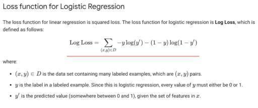

> comments:
  
1. ->  Merhaba,Burada log kullanmamızın sebebini aşağıdaki resimdeki log loss fonksiyonlarımızın grafikte gösteriminden görebiliriz. Resmimizde kırmızı ile altını çizdiğim kısmı alırsak y=1 ve y=0 iken neden cost function farklılığı olduğunu görebilriz. Lojistik regresyonda amacımız 1 ve 0 arası bir olasılık elde etmek olduğu için cost function'ımızda da 0-1 arasındaki logaritmik bir doğru elde etmeliyiz.(0-1 çünkü sigmoid fonksiyonumuz y ekseninde 0-1 arasında ). Lojistik regresyonda y=1 için sonucu için h(x) sonucumuzun da 1 olmasını bekleriz yani tahmini doğru gerçekleştirmesini bekleriz, eğer h(x) 0 olursa costumuz -sonsuza yaklaşır yani costumuz oldukça artar. Lojisik regresyon problemlerimizi lineer regresyonla çözemeyeceğimiz için farklı bir yaklaşım sergilememiz gerekti. Aklınıza takılan bir şey olursa sormaktan çekinmeyin.İyi çalışmalar.",

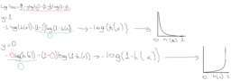

2. ->  ->  Merhaba, Niye squared loss oldugunu anlamadim.",
3. ->  ->  Merhaba,Squared loss derken nereyi kastettiniz? Sorunuzu tam anlayamadım. Loss function'da 0-1 arası bir çıktı üreteceğimiz için log kullanıyoruz..",
4. -> Modelin tahmin etmesini istediğimiz değerler 0 ve 1 olduğu için log loss kullanıyoruz.Örneğin, bir input için beklenen output 0 ise ve model 1 tahmininde bulunduysa, log loss'un büyük bir değer üretmesini bekliyoruz. (model kötü bir tahminde bulunmuş.)Bir input için beklenen output 0 ise ve model 0 tahmininde bulunduysa, log loss'un küçük bir değer üretmesini bekliyoruz. (model iyi bir tahminde bulunmuş.)Benzer şekilde, beklenen output 1 ise ve model 0.8 tahminini yaptıysa, log loss nispeten küçük olacak ancak 1 tahmininde bulunsaydı log loss daha da küçük olacaktı.",
5. -> Bunun ana temelini merak ediyorsan matematiksel olarak aynı sonuca çıkmaları. Olay kısaca şuModelinin tahmin ettiği değerlerin doğruluğunu ölçmen için şöyle bir örnek vereyimElinde kırmızı ve mavi noktalar var. Bu noktaları bulunan bir dikdörtgende mavi ve kırmızı noktalara yerleştirmesini istiyorsun. Yani kız ve erkek var diyelim kızları kızlarla gruplandırmak erkekleri erkeklerle gruplandırmak istiyorsun veya.Model 1 ve Model 2 aşağıda ki gibi tahminler üretiyor.( Tahmini Çizgi olarak düşün kırmızı ve mavi alanı ayıran)Buna göre kırmızı noktaların gerçekten kırmızıda olma olasılığı ve mavi noktaların doğru yerde olma olasıkları verilmiş. Bu modelin doğruluğunu anlamak için tüm olasılıkları çarpman ve çıkan sayıya bakman lazım. Örneğin sağda ki modelde kırmızı iki nokta için kırmızı alanda olma olasılkları , ve mavi noktaların mavi alanda olma olasılıkları verilmiş ( Bu model çıktıları olasılıkları)Burda gördüğün üzere daha düzgün modelde bu çarpım daha yüksek çıkıyor , daha kötü tahmin eden modelde daha düşük. Eee hala niye log yapıyoruz dersen olay şu ki burda 4 tane örneğimiz var ve bu örnek normal bir model kat kat fazla ve bu çarpım işlemi bilgisayarı / işlem gücünü gereksiz yorar. Bunun yerine matematiksel olarak aynı işlemi veren log yapıyoruz. Çarpım işleriminin logunu alınca toplama işlemi olur ( Lise matematiği 🙂 ) ve bu işlemi çarpmadan loga çevirdiğimizde logloss ve crossentropy loss gibi kavramlar ortaya çıkıyor (cross entropide log loss'un binary classification dışında kullanmak için) Tabi olasılıklar 1 ile 0 arasında olduğu için bunların logları - sayılar olucak malum log 1 = 0 log 0 = tanımsız , log 1 ile log 0 arasında ki değerler negatif değerler. Şimdi olasılıkların logunu alıunca misal log(0.8) ( bunlar 10 tabanında veya 2 tabanında farketmiyor çok ben 10 diye düşünüyorum şuan)log (0.8) = -0.096log ( 0.2) = -0.69gördüğün üzere sayı değeri düşük olan log , gene daha küçük çıkıyor ( negatif sayılarda - (sayı büyüdükçe - sonsuza yaklaşır )bu sebeple bunların çıktılarını direk karşılaştırırmak zor oluyor negatiflerini alıyoruz ve log'un negatifliğinden kurtuluyoruz. Burdan da toplama yapılınca daha demin gösterdiğim çarpma işleminin benzeri olayla Log sayılarının negatif alınmış toplamı büyük olanlar yüksek çıkıyor buda kötü demek yani . Misal log0.2 negatifi alınca 0.69 , bu tarz kötü tahminler sayıyı yükseltip yüksek bir loss yani fazla hata olmuş oluyorBiraz uzun oldu ama 🙂",

### soru 

> quest: "Quiz gayet güzel ve seviyeli olmuş kod kısmından ziyade mantık odaklı olmuş ki işin en önemli kısmı olduğunu düşünüyorum. Kodların arkadında neler olduğunu anlamak için makine öğrenmesini matematiğini anlamak adına YouTube da İlker Birbil Hocanın \"Makine Öğrenmesi\" dersleri var. Çok fayalı olduğunu düşünüyorum. Linkini burdan paylaşıyorum \"Google Machine Learning Crash Course\" beraber takip ederseniz çok faydalı olacağını düşünüyorum. Herkese iyi çalışmalar diliyorum. [Link](https://www.youtube.com/watch?v=eKrnMr--bDY&list=PLZcbvMjrj9DVU6g2A5e6voeigUtSMsAJH) 

> comments": 
    1. ->  çok teşekkürler, çok güzel bir içerik..",
    2. ->  ->  iyi çalışmalar.",
    3. ->  Kaynak için teşekkür ederim, çok yararlı bir paylaşım olmuş..",
    4. ->  ->  iyi çalışmalar.",
### soru 

> quest": "Merhabalar. Lojistik regresyonda  regularization un extrem önemli olduğu söylenmiş fakat önemini kavrayamadım. \"Without regularization, the asymptotic nature of logistic regression would keep driving loss towards 0 in high dimensions. \" Şu cümleyi matematiksel olarak açıklayabilir misiniz?",

> comments":

1. ->  Merhaba,Lojistik regresyonda hipotez fonksiyonumuz lineer değil sigmoid bir fonksiyon olur. (Resimde görebilirsiniz.) Asimptode fonksiyon olan sigmoid fonksiyonumuz 1 ve 0'a yakınsayarak x ekseni boyunca sonsuza gider. Burada doğası gereği yüksek boyutlarda 0'a yaklaşmaya devam eder dediği budur. Yüksek boyut dediği fazla feature olmasıdır ve fazla feature demek weight değerlerinin fazla ve komplikeye yakın olması demek. Regülarizasyonun weight değerlerini azalttığını biliyoruz bu yüzden kritik bir öneme sahiptir. [Link](http://community.globalaihub.com/community/status/1191-1191-1587125026/#comment.4315.4196.4196) linkindeki gradient descent fonksiyonu lojistik regresyon için de geçerlidir Yalnız tek fark hipotez fonksiyonumuz artık 1/1+e^(-thetatranspose*X vector) yani sigmoid fonksiyonumuzdur.İyi çalışmalar.",
2. ->  ->  Teşekkür ederim. Ben yüksek boyuttan 2 ve daha fazla featurelı datalar yani uzayda çok boyutlu vektörler oluşturan datalar olduğunu anlamıştım.",
3. ->  ->  Merhaba,Aslında orada demek istediğim adet olarak yüksek weight değerleriydi ama yanlış anlaşılmaya mahal vermemek için düzelttim. Düzeltme için teşekkür ederim. Yüksek boyu tdediğimiz fazla feature değerimiz buna bağlı olarak fazla ve yüksek sayıda weight değerlerimizin olmasıdır..",
4. -> ->  high dimensions durumunda loss'un 0'a gitmesini engellemek icin regularization yapilmasinin onemli oldugu belirtiliyor. Training'in amaci loss'u minimize etmek iken (normalde loss'un 0'a yaklasmasini isterken), burada loss'un kontrolsuzce 0'a gitmesini istemiyoruz, cunku bu senaryoda loss 0'a giderken ogrenme yapilamiyor, diyebilir miyiz?.",
5. ->  -> Regularizasyon bizim modelimizin basitlik ile karmaşıklığı arasındaki dengeyi sağlamalıdır. Loss 0'a giderken öğrenme yapılırken overfit olur ve modelimiz eğitim setini ezberler böylece artık test loss'umuz artmaya başlar.İyi çalışmalar..",

### soru 

> quest": "Regularization for Simplicity: Playground Exercise (L2 Regularization)'da bu sonuca nasıl vardık?",

> comments": 

1. ->  Merhaba,Modeli eğittikten sonra featurelar ile output arasındaki bağlantıların üzerine mouse ile gelirsen her bir feature için weight değerini gösterecektir. Verilen task 1'i çalıştırdığında regularization kullanmıyorsun, 500 epoch sonra her bir feature için weight değerlerini bir yere not al. Task2'de regularization rate değeri 0.3 olarak verip 500 epoch sonrası weight değerlerini kontrol et. Weight değerlerinin task 1'e göre 0'a yakın olarak konumlandığını göreceksin.Bunun sebebi L2 regularization işleminin modeldeki kompleksliği azaltması yani weight değerlerini 0'a yaklaştırmasıdır.İyi çalışmalar.",

### soru 

> quest": "Merhaba Arkadaşlar,  Regularization for Simplicity: Playground Exercise bölümünün Task 3'ünün cevabında :  \"Given the randomness in the data set, it is impossible to predict which regularization rate produced the best results for you. For us, a regularization rate of either 0.3 or 1 generally produced the lowest Test loss.\" demiş.  Ama ben regularization rate'i 0.1 yaptığımda 0.3 ve 1'e göre daha düşük test loss'u elde ettim. Ekte görebilirsiniz. Acaba ben mi bir yerlerde hata yaptım. Yardımcı olursanız sevinirim. Çok teşekkürler.",

> comments": 

1. ->  Merhaba,Bende de 0.1 lambda değeri en optimum test loss değerine sahip. Bir hata yaptığınızı düşünmüyorum, Bunun kontrolünü ben de yaptım ve sanırım o kısma yanlış yazılmış. Eğer bunun bir hata olduğunu düşünen varsa bizi düzeltebilir.İyi çalışmalar..",
2. ->  Bende de öyle, Kullandıkları dataset ile ilgili olduğunu düşünüyorum mesela sol üstteki dataset için dedikleri doğru.",
3. ->  tırnak içerisinde belirttiğin ifadeden anlayabildiğim kadarıyla playground exerciselerda generate edilen herbir dataset için belirli oranda bir rastgelelik sözkonusu. o nedenle optimum parametre değerleri değişebiliyor. bende de 0.3 lambda değeri optimum sonucu veriyordu mesela..",
4. ->  Merhabalar, lamda değerini biraz daha küçültmen lazım, görselde farklı lambda değerleri için elde edilen sonuçları ekledim,yeşil olanlardan herhangi biri iyi sonuç veriyor,aradaki fark 0.01 civarında.",

### soru  

> quest": "Merhaba. Regularization kısmında, lambda değerinin büyük olması durumunda modelin underfit olmasının ve tersi durumda overfit olmasının sebebini kafamda oturtamadım. Açıklayabilir misiniz ? Teşekkürler.",

> comments": 

1. ->  Merhaba Furkan,Lambda değeri L2 regularization işleminin sonuca ne kadar fazla etki edeceğini belirleyen hiperparametredir. Lambda değerini genellikle 0 ile 1 arasında konumlandırıyoruz. Eğer lambda değeri 0 olursa regularization uygulanmayacak demektir. Bizim regularization ile amacımız overfitting engellemek, dolayısıyla çok düşük lambda değeri overfittingi engellemeyecektir. Çok yüksek bir değer seçersek de bu sefer modeldeki çoğu weight hızlıca baskılanacaktır ve öğrenme tam anlamıyla gerçekleşemeyecektir, bundan dolayı underfitting oluşabilir.İyi çalışmalar.",
2. ->  ->  Teşekkür ederim..",
3. ->  anladığım kadarı ile regularization için loss ve complexity değerleri arasında bir denge sözkonusu. bu dengeyi lambda değeri ile sağlamaya çalışıyoruz. lambda değerini yüksek vermemiz durumunda model complexitysini azaltmaya odaklanıyoruz ancak daha basit bir model tahmin değerlerinin istenilenden düşük olmasına (underfit) neden olabiliyor. aksi durumda, yani lambda değerini düşük verdiğimiz durumda bu kez basit bir modelden ziyade daha doğru tahmini veriler verebilecek bir modeli önceliklendirmiş oluyoruz. bu da daha kompleks, overfitting nedeni ile test verileri ile daha uyumlu ancak yeni veriler ile tahminde muhtemelen daha başarısız olacak bir modele neden oluyor. bu nedenle lambda değerini optimize etmek gerekiyor diye anladım. yanlış anladıysam düzeltme gelirse sevinirim..",
4. ->  ->  Teşekkür ederim..",

### soru 

> quest": "Merhaba,  Regularization 'da playground exercise kısmında task2'de açıklama kısmında cok fazla feature cross kullanmak eğitim verisindeki gürültüye uyma fırsatı olur buda testte kötü başarıya neden olur mu demek istiyor?Yani training yaparken training verisindeki gürültüye uymaması mı lazım modelin?  Teşekkürler",

> comments": 

1. ->  Merhaba,Modelimiz ne kadar fazla feature içerirse o kadar weight içerir ve daha da komplike olur. Komplike oldukça hipotez fonksiyonumuz eğitim setindeki noise dataları bile ezberler böylece eğitim lossumuz çok düşük olur. Yalnız bu eğitim setimizi çok iyi ezberleyen ve karmaşık olan modelimiz yeni gelen veri tahminini yapamayacaktır çünkü sadece eğitim verisini ezberleyip hipotez fonksiyonunu sadece eğitim setini bilecek gibi oluşturmuştur. (Grafikte eğitim setini çok güzel ve hatasız şekilde ayırmıştır ama yeni gelen veriyi grafikte konumlandırmakta ve analiz etmekte başarılı olamayacaktır.)İyi çalışmalar.",
2. ->  ->  Teşekkürler:).",

> quest: "Regularization kısmında playgroundda regularization ratei arttırdığımda nedense test loss artmaya başladı. Cevapta 0 dan 0.3 e çektiğinde test lossda gözle görülür bir azalma göreceksin diyor.",

> comments:

1. ->  Merhaba,Modeli her eğittinizde aynı training ve test loss değerlerini almazsınız. Muhtemelen tekrar eğittiğinizde bu sonucun değiştiğini göreceksiniz. hger çalıştırdığındaki test ve training loss değişiminin sebebi modelimizdeki verilerin test,train ve validation olarak ayrılmadan önce shuffle edilmesidir.Regularization her gradient descent adımında weight değerlerini daha da 0'a yakındattığı için loss değerleri daha da düşüklük gösterecektir.İyi çalışmalar.",
2. ->  Merhabalar,Hatalı değilsem training data size ve batch size gibi değerlerde değişiklik yaparak test etmişsiniz.Sonucunuzun beklenen şekilde olmayışı bu parametrelerin hatalı seçiminden olabilir, varsayılan olarak gelen değerler ile testinizi yaparsanız azalma olduğunu görebilirsiniz.İyi çalışmalar.,
3. ->  Merhaba,aşağıdaki görsel ile lambda parametresini açıklamaya çalıştım.",
    

### soru 

> quest: "Merhaba Arkadaşlar, Lower Learning rate (with early stopping), güçlü L2 regularization ile aynı etki yarattığını anladım. Ama eklediğim 2 paragrafta tam ne anlatılmak isteniyor anlayamadım. Yardım olabilirseniz çok sevinirim. Çok teşekkürler.",

> comments:

1. ->  Merhaba,Datasetine sürekli olarak bir data akışı varsa yani sürekli yeni example'lar ekleniyorsa datanın trendi zamanla değişebileceği için elinizdeki datayla hatayı iyice düşürecek (converge edecek) kadar train etmiyoruz, training i erken bitiriyoruz çünkü yeni trendi anlayacak kadar elimizde data yok diyor. Bir de yeni gelen data için daha genel bir modelimiz olmuş oluyor ve test loss azalıyor.İkinci söylediği de early stopping ve regularization rate benzer etkilere sahip. Siz optimum regularization rate i bulmak istiyorsanız early stopping etkisi olmamalı, sadece regularization rate etkisi olmalı. Bu yüzden iterasyon sayısını büyük seçin ki early stopping olmasın sadece regularization rate in etkisini görün diyor anladığım kadarıyla 🙂",
2. -> Merhaba,Burada early stopping yani erken durdurmadan bahsetmiş. Erken durdurmak modelimiz eğitilirken modelimiz tam yakınsamadan eğitimi durdurmak demektir. Yazdığınız gibi lower learning rate kullanıp modelinizin eğitmini tam yakınsamadan durdurursanız lambdanın oluşturacağı etkiyi oluşturur. Nerede durduracağımızı da şöyle bilebiliriz: validasyon setimizin loss oranı artıyorsa eğitimi orada bitirirsiniz ki tahminleri optimum bir şekilde yapabilecek overfit olmayan bir model elde edebilelim.Lambda ile learning rate parametrelerinin etkilerini karşılaştırabilirsiniz. Bunu gözlemleyebilmek için ben şöyle bir şey yaptım(Her iki adımda da 1000 epoch ile eğittim):1.Playground'da Regularization:None dedim ve learning rate değerini 0.1'e ayarlayarak eğitim işlemini başlattım. Test ve Training loss değerleri önce düşmeye başladı ama epoch sayısı arttıkça training loss değeri minimum değerde sabit kalıyorken test loss değeri sürekli artmaya başladı. Eğer training loss en minimum değere gelmeden biraz önce early stopping yapsaydık ve eğitimi yarıda kesseydik hem test hem de training loss değerleri optimum seviyede olacaktı.2.Learning rate değerimi 0.1'den değiştirmeden regularization:L2 seçtim ve regularization rate değerimizi 0.1 olarak ayarladım. Eğitimi başlatıp beklediğimde hem test hem training datanın değerlerinin 0'a olabildiğince yakınsadıktan sonra minimum değerde kaldıklarını ve 1.adımımın aksine test loss değerinin artmadığını gözlemledim. Buradan çıkaracağımız sonuç learning rate eğer eğitimi erken durdurursak lambda ile aynı etkiyi oluşturur.İyi çalışmalar.",
3. ->  Çok teşekkürler arkadaşlar ->  ->  . İyi çalışmalar..",

### soru 

> quest: "Merhaba, şurada anlatılan açıklamaları tam anlayamadım. Yardımcı olabilir misiniz?",

> comments:
  
1. ->  Merhaba,Burada bu model karmaşıklığını iki şekilde ele aldığından bahsediyor.-Modelimizdeki weightler model karmaşıklığımızdır. Modelimizdeki weightlerin mutlak değeri ne kadar büyükse o kadar karmaşıktır. Örneğin 25x1+7x2 olduğunu varsayarsak x1 feature'ımızın weight değeri x2 feature'ımızın weight değerinden daha karmaşıktır diyebiliriz.Başka bir örnek olarak -150x1+77x2 dersek yine x1'in weight'i x2'nin weight değerine göre daha karmaşık olacaktır. Zaten regülarizasyon işlemimiz de karmaşıklığı azaltmak yani weight değerlerini olabildiğince 0'a yaklaştırmak. Weight ne kadar 0'a yaklaştırsa o kadar basit olur. (Fazla basit olursa underfitting, fazla komplike olursa overfitting olur.)-Diğer karmaşıklık yaklaşımı ise sıfırdan farklı weight değerlerine sahip feature sayısı modelimizin karmaşıklığı olur.İyi çalışmalar.1 month ago 13 people like this.Like ReportReply",
2. ->  ->  Teşekkür ederim şimdi anladım..",
    
### soru 

> quest: "Bucket enlem ve boylarımızı böldüğümüz zaman binnning yaptığımızda karşımıza çıkan [0,0,0,1,0,0,0] grubunun adı değil mi ya da bu işlemin adı? Şu kısmı ben tam anlayamadım. Bucket ve Crosses Feature arasındaki fark...  Bucket'te mi ayrı bir yöntem yani? Umarım derdimi anlatabilmişimdir. Şimdiden teşekkürler.",

> comments:
  
1. ->  Merhaba,Evet, bucket sizin yazdığınız her bir binary vectordür. Aralarındaki farkı [Link](http://community.globalaihub.com/community/status/519-519-1587052575/#comment.4259.4239.4239) linkinde bunu anlatmaya çalıştım. Sorunuz olursa tekrar sorabilirsiniz.İyi çalışmalar..",
    
### soru 

> quest: "Merhaba Arkadaşlar, Feature Crosses - Playground Exercises kısmında neden X1 ve X2 yerine X12 ve X22'yi seçtiğimizi anlayamadım. Ve X12 ve X22 neyi ifade ediyor tam anlayamadım.  Diğer bir sorum :  \"If you enter a negative value for the feature cross, the model will separate the blue dots from the orange dots but the predictions will be completely wrong. \" ifadesinde neden negatif değer girersek tahminler yanlış olur kısmı tam net oturmadı.  Çok teşekkürler",

> comments:
  
1. -> Merhaba,Burada verimizin dağılımına bakarsak bu problemimiz lineer regresyonla çözülemez yani y=w0+w1x1+w2x2+...+wmxm tarzında bir yaklaşım kullanamayız. Peki bunun için ne yapabiliriz? Elimizdeki feature değerlerindenm sentetik değerler üretmeyi deneyebiliriz veya elimizdeki feature değerlerini evaluate edebiliriz. Ama ben burada biraz matematiksel bir hileye kaçacağım.(Kaçmayacaksam de elimdeki featurelar üzerinden yeni featurelar ve feature değerleri elde etmeye çalışacaktım tabi bunu bir anda yapmayacak hangi feature verilerinin bu işlemlere gireceğini analiz ile belirleyecektim.) Veri dağılımlarını incelediğimizde mavilerin ortada dairesel şekilde toplandığnı ve turuncuların da çevresinde toplandıklarını görebiliyorum. Aşağıdaki resimde dairenin formülünün x^2+y^2=r^2 olduğunu biliyorum. Bu yüzden elde edeceğim yeni feature değeri kareli bir değer olmalı. Burada x12 x1'in karesi, x22 ise x2'nin karesi demek oluyor. Bu nedenle bizim de bu outputta dairesel bir çıktı elde edebilmemiz için featurelarımızın karesini alıp bu problemi linear regresyondan polynomial regression'a çevirmemiz gerekiyor. Bu yüzden x1^2 ve x2^2 kullandık.\"If you enter a negative value for the feature cross, the model will separate the blue dots from the orange dots but the predictions will be completely wrong. \" kısmında ise şunu demek istemiş: Siz eğer x1x2 feature'ına negatif bir değer verirseniz verileriniz yine düzgün ayrılacaktır. Ama negatif değer verdiğinz için grafikte görünen turuncu değerleri mavi değerler olarak, grafikte gördüğünüz mavi değerleri de turuncu değer olarak tahmin edecektir.İyi çalışmalar.1 month ago 25 people like this.Like ReportReply",
2. ->  Çok teşekkürler ->  çok net anladım. İyi çalışmalar.",
    

### soru 

> quest: "Merhabalar, Feature Crosses : Playground Exercises : More Complex Feature Crosses : Task2 de cevabın neden \"Using both x1^2 and x2^2 as feature crosses. (Adding x1x2 as a feature cross doesn't appear to help.)\" olduğunu anlayamadım. Yardımcı olabilirseniz sevinirim.",

> comments:
  
1. ->  Merhaba,[Link](http://community.globalaihub.com/community/status/1133-1133-1587160937/#comment.4376.4241.4241) linkinde bunu açıklamaya çalıştım. Sorunuz olursa sormaktan çekinmeyin.İyi çalışmalar..",
2. ->  ->  Teşekkürler, anlamama yardımcı oldunuz..",
    

### soru 

> quest: "Merhaba.  Bu histogramı tam olarak anlayamadım. Weight Frequency kavramı ile ne temsil ediliyor ?",

> comments:
  
1. ->  Merhaba,Öncelikle lambda'nın weight değerileri üzerine etkisini anlamak için [Link](http://community.globalaihub.com/community/status/1191-1191-1587125026/#comment.4315.4196.4196) yorumunu okuyabilirsiniz.Lambda değeri ne kadar büyük olursa weight değerleri o kadar küçülür yani 0'a o kadar yaklaşır. Aşağıda küçük bir kısmı çıkmış resimde de lambda değerini küçültürseniz histogramınız dikleşmeye başlar çünkü weight değerleriniz çok az bir küçülme gösterir yani 0'a çok az yaklaşım gösterir.İyi çalışmalar.,
2. -> Her çubuk belli bir değer aralığını (min_değer, max_değer) temsil ediyor. Çubuğun uzunluğu ise, weight'lerin kaç tanesinin o değer aralığında olduğunu ifade ediyor.,
3. ->  Teşekkür ederim..",

### soru 

> quest: "Merhaba ben feature crosses kısmını tamamen anladığımı düşünüyorum ama aklıma takılan bir konu var. Şu linkte [Link](https://developers.google.com/machine-learning/crash-course/feature-crosses/crossing-one-hot-vectors\) binned_latitude ve binned_longtitudede her ikisininde 5 elemanı var. ve bunların cross productının sonucu 25 elemanlı bir vektör olmuş oluyor cross product sonucunda normalde aynı boyutta bir vektör bulmamız gerekmezmiydi burda nasıl bir istisna oluştu.",

> comments:
  
1. ->  a = [0,1,2,3,4]b = [0,1,2,3,4]a x b = [(0,0),(0,1),(0,2),(0,3),(0,4),(1,0), ... ,(1,4),..(4,0), ... ,(4,4)]çarpım bu şekilde olduğundan 25 elemanlı vektör oluşuyor..",
2. ->  ->  Verdiğim linkte şöyle bir şey geçiyordu. The term cross comes from cross product. Ben aslında bu yaptığımız işlem 3 boyutlu vektörlerin cross productıyla bir ilgisi olup olmadığını merak etmiştim. Çünkü bildiğim kadarıyla 3 boyutlu vektörün ötesinde cross product alamıyoruz ve iki vektörün cross productı bize yine 3 boyutlu bu iki vektöre dik bir vektör daha veriyordu..",
3. ->  The term cross comes from cross product ifadesinin geçtiği yerin ss'ini gönderebilirmisin ?.",
r. ->  Yanlış link yollamışım pardon. ["Feature Crosses: Encoding Nonlinearity  |  Machine Learning Crash Course](https://developers.google.com/machine-learning/crash-course/feature-crosses/encoding-nonlinearity)
5. >  ->  Burada üçüncü değişkenin ilk iki değişkenin cross product'ı ile elde edildiğini söylüyor..",
6. ->  \"Çünkü bildiğim kadarıyla 3 boyutlu vektörün ötesinde cross product alamıyoruz \" kanısına nereden vardın..",
7. -> Aslında bin'ler arasındaki işlem kartezyen çarpım (cartesian product). Bence \"The term cross comes from cross product.\" ifadesindeki \"cross product\" referansı yanıltıcı olmuş. Zira burada matematikte bildiğimiz anlamıyla \"cross product\" işlemi gerçekleşmiyor..",

### soru {

> quest: "Merhaba, şu kısmı anlayamadım, neden binlere ayırıyoruz ve neden o şekilde encode ediyoruz?",

> comments:
  
1. ->  Merhaba,[Link](http://community.globalaihub.com/community/status/875-875-1586778150/#comment.3974.3871.3871) bu yorumda binning'İ anlatmaya çalıştım. Aklınıza hala soru takılırsa sorabilirsiniz.İyi çalışmalar.,
2. ->  ->  teşekkür ederim.",

### soru 

> quest: "Merhaba arkadaşlar. Ben L2 Regularization ve Lambda kısmını tam anladığımı düşünmüyorum. Yardımcı olabilir misiniz? Teşekkürler ????",

> comments:
  
1. -> Merhaba,Öncelikle regülarizasyon yapmamızın sebebi overfit durumunu önlemek. Gradient descent algoritmamız her seferinde optimum değere yaklaşmak için eğitim modelini validation modele göre ayarlar (yani ilgili weight değerlerinin ayarlamasını yapar.) Burada regularizasyonun görevi komplex modeli cezalandırmak.Kompleks model ne demek?Biz kompleks modelin iki tanımıyla ilgileneceğiz:1. Modeldeki tüm featureların ağırlıkları(weight değerleri)2. Değeri 0'dan farklı olan feature sayısımız.Kompleks modelimizi nasıl cezalandıracağız?Yukarıdaki kompleks model tanımından da anlayacağımız üzere burada weight değerlerini azaltarak modelin karmaşıklığını azaltmaya çalışacağız. Weight değeri yüksek olan featurelar modeli daha da karmaşıklaştırır. Bu yüzden weight değerleri 0'a ne kadar yakınsa model o kadar az kompleks yani basittir. Ama burada şöyle bir husus var. Weight değerlerinin 0'a acayip yakın olması y=w0+w1x1+w2x2+....+wmxm denkleminde tüm w değerlerini 0'a yakınsatacağından bu denklemi sadece y=w0 ele alırsak burada high bias durumu yani underfitting oluşur. Tam tersi durumu düşünürsek de weight değerleri training seti ezberleyecek kadar karmaşık olacağından overfitting (high variance) olur yani tahmin için yeni gelen datanın tahmininde başarısız olur.Cezalandırma işlemi için cost function denklemimize regularization term dediğimiz denklemi ekliyoruz. Yani yeni cost function'ımız resimdeki gibi oluyor.Burada her bir weight değerinin karelerinin toplamının ortlamasını alıp regularization parametremizle çarpıyoruz yalnız w0'ı eklemiyoruz çünkü w0 değerimiz herhangi bir feature'a ait bir weight değil, bias değeri. Bu parametrenin önemi gradient descent adımımıza baktığımızda ortaya çıkıyor. Burada hweight0 dışındaki tüm weightlere regularization uygulanıyor. Eğer yeşil kutucuğa aldığım yerde learning rate'i içeri dağıtıp thetaj parantezine alırsanız thetaj'nin kaysayısının (1-learningrate*(lambda/m)) olduğunu görebilirsiniz. Burada regularization parametresi çok önemli çünkü thetaj'yi 0'a fazla yakın veya fazla uzak bir değer yaparsanız yukarıda bahsettiğim overfitting ve underfitting problemlerine kapı açmış olursunuz. O yüzden burada lambdayı optimum seçebilmek çok önemli.Umarım resim ve anlatımım açıklayıcıdır :)İyi çalışmalar.,
    

### soru

> quest: "Bu koddaki -tf.feature_column.numeric_colum()- gibi fonksiyonların kullanımını ve mantığını bilmemiz şuanlık yeterli midir yoksa fonksiyonları tamamen ezberleyip bu şekilde yazmamız mı gereklidir. Teşekkürler.",

> comments:
  
1. ->  Mantığını ve kullanımını bilmeniz şimdilik yeterli. Zamanla kullandıkça mutlaka ezbere yapabileceksiniz..",
    
### soru 

> quest: "Merhaba, burada posta kodu nasıl daha iyi bir feature oluyor? Arada linear ilişki olmamasına rağmen posta kodlarını kullanırsak linear bir ilişki oluşturmaz mıyız?",

> comments:
  
1. -> Merhaba,Anladığım kadarıyla biz latitude ve longitude değerlerinden spesifik bir koordinat üretmeye çalışıyoruz ama bu koordinat değerleri aslında binlenmiş değerler ve örnek anlamları şu şekilde: 0<lat<60 ve 25<long<77 Yani iki feature'ı (latitude ve longitude) birbiri ile çarptık ve yeni bir feature elde ettik. Yeni bir feature elde etmemiz demek yeni bir weight değeri elde etmemiz demek ve bu da modelimizin daha karmaşık olması demek. (Model kompleksitemiz weight sayısı ve değerleriyle doğru orantılıdır.) Eğer siz aynı işlevi görecek ve binlenmeye (yani kategorize edilmeye) ihtiyaç duymayan numerik bir değer bulabilirseniz hem bu verileri binlemenize gerek kalmaz (ki bunun hem zaman hem space kompleksitesinden de kurtulmuş olursunuz) hem de model kompleksiteniz daha az olur. Neticede posta kodu her mahalle için unique'tir. Burada posta kodu kullanacaksanız ve sizin eviniz iki sokağın köşesindeyse multi-hot encoding yapıp bu değerleri binary vector'e alabilme imkanınız vardır veya tek yerdeyse one hot encoding ile de binary vector feature değerleri elde edebilirsiniz. Yalnız önceki örneğe nazaran iki feature değeri çarpıp 3.bir feature elde edip bu işlemlerimi ona göre yapmaktansa verisetimdeki posta kodu feature'ını yaparak tüm bu işlemleri gerçekleştirebildim.İyi çalışmalar.",

### soru    

> quest: "Ben crossing one-hot vectors kısmında verilen örneği anlayamadım. Feature Crosses kısmında biraz zorlandım galiba...   Cevaplarınız için şimdiden teşekkür ederim.",

> comments:
  
1. ->  binned_latitude ve binned_longitude değerleri belirli aralıktaki enlem ve boylamları temsil ediyor. Bunlara feature cross uyguladığımızda ise, AND operatorü uygulamış oluyoruz. Yani fiyatını tahmin etmek istediğimiz evimizin enlem değeri 15 derece ve boylam değeri 13 derece olsun. Feature cross kullanarak tüm olası enlem ve boylam aralıklarını yazıyoruz ve bizim örneğimizin içinde bulunduğu aralığı 1, diğerlerini 0 yapıyoruz. Örneğimiz; 10 < lat <=20 VE 0 < lon <=15 aralığında bulunuyor. Bunu aynı şekilde one-hot temsili ile gösterip tahmin oranı(predictive power) daha iyi bir feature oluşturmuş oluyoruz.",
2. ->  Anladığım kadarıyla Feature Crosses kısmında yapmaya çalıştığımız şey şuna benziyor; örneğin birinin boy ve kilo verisi var elimizde bu kişinin obezite olup olmadığını tahmin etmeye çalısıyoruz bunun için direk boy ve kiloyu kullanarak oluşturulcak model yerine bu 2 feature'ı kullanarak vücut kitle indexi olan sentetikbir feature oluşturup daha güzel bir temsil yapmayı istiyoruz. Aynı şekilde Feature Crosses kısmında da örnek üzerinde latitude ve longitude tek tek kullanmak yerine crosslayıp işlem yaparak daha iyi bir temsil yapmayı amaçlıyoruz. Hatam varsa düzeltirseniz sevinirm.",
3. -> Şimdi anladım cevaplar için çok teşekkür ederim 🙂.",

### soru     

> quest: "Merhaba, Neden train ve validation loss egrilerinin birbirine cok yakin olmasini saglamamiz gerektigi konusunda bir yerde takiliyorum. Bana cok yakin olmamalari generalization icin daha iyi bir sey gibi geliyor. Yani loss farki fazlayda iki kumenin birbirine daha az benzedigi gibi bir dusuncem oluyor. Bu da generalization icin istenen birsey olamaz mi? Validation set dersindeki programlama egzersizinde train, val, test hatalarinin birbirine cok yakin oldugu bulunuyor. Bu saglanmasi gereken ve ideal bir durum mu?",

> comments:
  
1. ->  Merhaba. Modelimizi train veri kümesi ile eğitirken, validation ve test setlerinde test ediyoruz. Eğer train loss’u düşük, validation loss’u yüksekse ve aralarında çok fark varsa, modelimizin hiç görmediği bir veri kümesinde kötü performans sergilediği için overfit olduğu ve kötü bir model olduğunu görürüz, test setinde test etmemize gerek kalmaz. Asıl amaç, modeli train ettikten sonra val ve train loss curvelerinin yakın olması, ardından test loss curve’nin diğer iki curve’e yakın olmasıdır, generalizationda asıl istediğimiz de bu zaten, overfitting olmaması. İyi çalışmalar.",
2. ->  ->  tesekkurler.",

### soru 

> quest: "Herkese merhaba  Ben Representation with a Feature Crossda kod parçacığına yazılan resolution_in_degrees değişkenini neden kullandığımızı anlayamadım",

> comments:
  
1. ->  Merhaba,Binning yapma işlemi sırasında verdiğiniz boundaries listesine göre numerik değerleri gruplandırma işlemi yapar. Örneğin elinizde yaşlar verileri var ve bunları binning ile gruplamak istiyorsunuz. Sizin boundaries listeniz: [10,20,30,40,50,60,70,80,90] olursa bu sınırlar için gruplandırmalar yapar. Buna göre 76 ile 77 aynı grupta olacaktır. Bunun için ise numpy'In arange metodu kullanılmıştır. np.arange(minimum değer, maksimum değer, minimumdan maksimuma giderken kaçar kaçar artacağı) buradaki resolution_in_degrees değişkeni ise bu artışın kaçar olacağını belirlemek için kullanılmıştır. Verdiğim yaş örneğinde bu değer 10 iken, Representation with a Feature Cross örneğimizde 1'dir.İyi çalışmalar.1 month ago 12 people like this.Like ReportReply",
2. ->  ->  çok teşekkür ederim 😀.",
3. -> ->  Merhaba, anlamadığım şey şu,Bu gruplara bucket denmiyor mu? Şu TASK 4'te takıldım. Teşekkürler 🙂.",
4. ->  Merhaba,Sanırım burada bucket olarak bahsettiği şey iki feature'ın ayrı ayrı binning yapılıp oluşturduğu bucketlar yani binningden sonra oluşan binary vectorler. (Longitude ve latitude featureları ayrı ayrı binning yapıldılar.) Feature cross dediği şey ise longitude ve latitude için bu ayrı yapılan binning featurelarının çarpılması ve ortaya çıkan yeni binary vector değeri. Burada sormak istediği şey ise siz bu featureları çarpmadan ikisini de binning yaparsanız performans ne olur (featurelar ayrı weight değerlerine sahip olursa ne olur?), iki feature'ın binninglerini çarparsanız ne olur? (İki feature'ı çarpıp sentetik bir feature elde ederseniz ve tek bir weight değeriniz olursa performans ne olur?).Umarım açıklayıcı olabilmişimdir :)İyi çalışmalar.",
5. -> ->  Çokk teşekkür ederim Fethi bey....",
6. ->  -> Ben teşekkür ederim iyi çalışmalar..",

### soru 

> quest: "Merhabalar , Representation kısmında one-hot encoding ile multi-hot encoding arasında farkı anlayamadı.Bunun dışında bir de mesela one hot encoding yaparken bütün streetleri sıfır yapıpı sadece bizim kendi feature olarak seçtiğimiz street'i mi 1 yapıyoruz mesela iki tane street verilirse iki tane mi 1 koyuyoruz?",

> comments:
  
1. -> Merhaba,Bunu bir örnek üzerinden anlatmam gerekirse: Elimizde bir veriseti var ve verisetinde sokak isminde bir feature'ımız var. Sokak isimlerimiz string yani kategorik bir veridir. Kategorik verileri modelimizin anlayabilmesi için numerik veriye sokmamız gerekir. Yalnız burada şuna dikkat etmeliyiz. Eğer iki tane sokak ismi içeren bir veri örneğimiz varsa? O zaman işin içine Multi-Hot Encoding giriyor.Sokaklarımızın hepsini One Hot encoding çevirme yöntemimizi kullanarak tekrar numerik veriye çevirdiğimizde bu sefer o sokak isimlerine karşılık gelen feature alanları 1 olmalıdır. Multi Hot Encoding'de One-Hot Encoding'in aksine birden fazla feature değeri 1 olabilir. Yani bir kişinin evi aynı anda iki sokakta da olabilir.Multi-Hot Encoding Örneği(Tek bir kategori seti için örneğin yaş aralıkları):[1, 0, 0 , 1]One Hot Encoding'i ise şu örnekle açıklayabilirim: Elimizde bir veriseti var ve verisetinde yaş isimli bir feature'ımız bu. Bu feature'ı binning kullanarak binary veri gruplarına binary vector ile grupladığımızı düşünün. Bu gruplamalarda yeni feature'ımızın binary vector değerleri yalnızca 1 adet 1 değeri içerebilir çünkü bir kişi aynı anda iki yaş grubuna giremez.One Hot Encoding Örneği (Tek bir kategori seti için örneğin yaş aralıkları): [0, 0, 0, 1]İyi çalışmalar.1 month ago 12 people like this.Like ReportReply",
2. ->  teşekkür ederim.",
    

### soru 

> quest: "Merhaba, bu soruda [binned longitude x binned latitude] ve [binned roomsperPerson] şeklinde iki feature kullanmak doğru cevaptan daha mı kullanışlı olurdu yoksa daha kullanışsız mı?",

> comments:
  
1. -> Merhaba,[binned longitude x binned latitude] ve [binned roomsPerPerson] kullanmak daha kullanışsız olurdu. Çünkü sizin istediğiniz şey longitude, latitude ve roomsPerPerson değerlerinin her biri için ihtimali featurelaştırıp modelnize sokmak çünkü hesaplanacak weight değerleri her ihtimal için farklı olacak. Örneğin sizin verdiğiniz örnek için ([binned longitude x binned latitude] ve [binned roomsPerPerson]):Latitude x Longitude roomsPerPerson37.79 ve 76.51 3Bu durumda latitude x longitude içn ayrı bir weight değeri, roomsPerPerson değeri için ayrı bir weight değeri hesaplanacaktır. Ama [binned longitude x binned latitude x binned roomsperPerson] kullanırsanız durum aşağıdaki gibi olur:Latitude x Longitude x roomsPerPerson37.79 v3 76.51 ve 3Yani bu ihtimal için tek bir weight değeri olur modelinizin hesaplayacağı bu weight değeri diğer ihtimale göre daha tutarlı olacaktır çünkü bu ihtimal için tek bir weight değeri varken aynı ihtimale karşılık gelen [binned longitude x binned latitude] ve [binned roomsperPerson] ihtimalinde 2 weight hesaplancaktır. (Bir tanesi [binned longitude x binned latitude] için, diğeri [binned roomsperPerson] için.)İyi çalışmalar.",
2. ->  bin etmesek ne olur, neden bin ettik.",
3. ->  Fethi nin soyledigi gibi iki weights degeri hesaplanacaktir. Daha kullanisli olur mu sorusunun cevabi hayir daha kullanisli olmaz.Cunku daha fazla weights demek daha fazla hesaplama demektir,.Bu da daha uzun training sureci ve yuksek computational cost demektir..",
4. -> ->  yan.",
5. -> ->  ->  yani daha çaba gerektiren şeyler olsada yinede doğru bir yöntem midir? Kullanışlı olmasa bile?.",
6. ->  -> Merhaba, hayır değildir çünkü bu durumda daha fazla weight sayımız olacak ve modelimizin karmaşıklığı daha da artacak, bu da modelimizi overfitting olmaya daha da yaklaştıracaktır. Burada bu argümanı sunmamın sebebi bu 3 feature'ın ayrı ayrı korelasyonu ile oluşacak yeni sentetik verinin korelasyonu arasında performans farkı vardır. Bu yüzden siz bu 3 feature'I çarpıp tek bir sentetik feature elde edip buna bağlı olarak tek bir weight değeri elde edebilliyorken 3 tame farklı feature kullanmanız hem performans açısından modelin training süresi ve costunu uzatacaktır hem de tahminleriniz label ile bu featurelar arasındaki korelasyonun daha az olması sebebiyle daha da az performanslı oluşacaktır.İyi çalışmalar..",

### soru 

> quest: "One-Hot Encoding kısmını anladım fakat burada anlatılan Sparse Representation kısmında 0 olan verilerin alınmamasını nasıl sağlayacağız ve verisetinde bu işlem nasıl bir etkiyle gözükecek ? Veri setine tablo şeklinde baktığımızda da 0 yerine boşluklar ya da \"Nan\" vb. şeyler mi göreceğiz. Daha önce sorulduysa görmedim kusura bakmayın  iyi günler",

> comments:

1. -> Merhaba arkadaşlar,Sparse representation kısaca şu demek oluyor. One hot encoding bildiğiniz üzere elimizdeki veriyi bir sözlüğe göre indeksleme işlemi şeklinde düşünebilirsiniz.Burada nasıl oluyordu mesela \"Ben bugün çalışıyorum\" cümlesi için \"Ben\" kelimesini kodlamam için (Sözlüğümüzün boyutu -kelime hacmi- 42000 kelime olduğunu varsayarsak). Sadece \"Ben\" kelimesini gösterim içinSözlük boyutunda bir tane dizi tanımlamam lazım ve bu dizininde sadece \"Ben\" kelimesine karşılık gelen indeks değerinin 1 diğerlerinin 0 olduğu bir dizi oluşturmuş olacağız.Diğer 2 kelime içinde aynı işlemi yaptığımızı düşürsek. Dikkat ettiğiniz üzere her bir kelime için sözlük boyutu kadar diziler oluşturuyoruz ve bu dizilerin büyük bir kısmı 0, boş, null veya ne derseniz artık.Böyle matrixlere sparse matrix denir. Bu hem hafız hemde işletim açısından zaman alacağından bu matriksleri daha az hafıza alanı kaplayan matriksler olara gösterebiliriz.Yine aynı cümle üzerinden gidecek olursak Ben sözlüğün 140. bugün 885. ve çalışıyorum 1987. kelimeleri olduğunu düşünelim.O zaman bu cümleyi kısaca [140, 885, 1987] şeklinde tanımlayabiliriz. Bu şekilde 42000 x 3 byte yerine sadece 3 byte hafıza alanı ile aynı gösterimi sağlamış olduk.Ek olarak burada bir açıklamayı faydalı görüyorum. Bu yeni indeksler her ne kadar sayı olsalarda aralarında büyüklük küçüklük vb. matematiksel ifadelerin kullanılmaması gerekir.Çünkü bunlar pointer değerleridir. Kategorik verileridir. Her ne kadar sayı olsalarda sayısal veriler değildirler..",
2. ->  ->  Teşekkür ederim.",
3. ->  ->  Buradan yola çıkarsak her durumda one hot encoding kullanmak yerine sparse representation kullanmak çok daha mantıklıdır diyebilir miyiz? Doğru mu anladım teyit etmek istedim..",
4. ->  ->  Benim anladığım kadarıyla veri kümesi aşırı büyük değilse One-Hot Encoding yeterli olarak görülüyor ama veri kümesi büyük ise Sparse Representation yapıyoruz ki hafıza alanından tasarruf edebilelim..",
5. -> ->  ->  One hot encoding yerine sparse kullanabilirsiniz.Bunun bir sakıncası yok genel olarak kullanım şöyle oluyor diyebiliriz.Encoding işlemi yapılacak olan özellik bir çok değer alıyorsa bunun bu özelliği sparse representation olarak kullanmak daha mantıklı oluyor.Bir örnek ile kısaca açıklayacak olursak 2 özelliğimiz olsun bunlar il ve sokak. İllerde de sadece istanbul Ankara ve İzmir geçtiğini düşünelim.Sokak isimleri ile bu 3 şehirin sokak isimleri olacağından bunu şehir özelliği için one-hot encoding yaparken şehir isimleri için sparse daha uygun olabilmektedir.Sparse'ın bir dezavantajı şu oluyor ilgili indeksin neye referans ettiğini bir yerde saklamanız gerekiyor. Ama one-hot encoding için yeni özellikler (feature'lar) oluşturduğunuz için verinize başka bir look-up table benzeri bir şeye ihtiyaçınız yok..",
6. ->  ->  anladım teşekkürler.",
7. ->  ->  Merhabalar. Tekrar yaparken bu konu hakkında size bir şey danışmak istedim. Önceki yorumlarda örneğin şehir kümesini one-hot yaptığımızda her şehir ismi bir feature oluyor ve bunu,is_istanbul is_bursa is_antalya1 0 0şeklinde gösteriyoruz. Tablodan düşünürsek sparse vektöre çevirince sizindediğinize göre yalnızca İstanbulun indeksi tutuluyor. Peki bu üstte verdiğim örnekteki şekilde tabloya görsel olarak etki ediyor mu? Yoksa sparse olayı sadece arka planda verinin tutulma şekliyle mi ilgili?.",
8. ->  ->  Merhaba açıklama için teşekkürler fakat son kısımdaki ifadenizi anlayamadım --\" Bu yeni indeksler her ne kadar sayı olsalarda aralarında büyüklük küçüklük vb. matematiksel ifadelerin kullanılmaması gerekir. Her ne kadar sayı olsalarda sayısal veriler değildirler.\"-- biraz daha açıklayabilirmisiniz bu sayıların indexleri arasında büyüklük küçüklük ilişkisi kurmayacaksak bilgisayara nasıl o indexte bulunduklarını anlatıcak yani bu indexte bulunan veri aynı zamanda başka bir featurun 1532. indexi ile korelasyon halinde oldugunu biliyoruz ve bu ilişkiyi kaybetmemeleri için index numaralarını kullanmamız gerekirse ne yapmamız gerekir ?.",
9. ->  Merhabalar -> ,Bir örnek ile açıklayacak olursam şöyle söylüyebiliriz. Örneğin Meslek adında bir özelliğimiz olsun. Ve bu bilgi karakter olarak tutuluyor. (Mühendis, Doktor, Öğretmen, Avukat vb.)Bu bilgileri sparse encoding şeklinde kodladığımızda Mühendis için 1, Doktor için 2, Öğretmen için 3 ve Avukat için de 4 numaralı indeksler ile ifade etmiş olduğumuzu düşünelim.Burada ( 4 > 1) Avukat Mühendis'ten büyük değildir. Elimizdeki değerler nümerik ama bunlar arasında matematiksel işlemler yapılmamalı..",
    

### soru 
"question_isim": 1. -> uploaded 1 photo",
> quest: "Sparse gösteriminde, one hot encoding yaptıktan sonra oluşan ve çoğunluğu 0'larla dolu vektörü kullanırken, sadece dolu kısımlarını ele alan bir representation'dan bahsedilmiş. Bu gösterimde (sağdaki tabloda yani) dolu olan kutunun indexi bulunan sütunu feature sütununa mı ekliyoruz? Eğer öyle yapıyorsak modelimizi kötü etkilemez mi? Bu kısmı tam anlamadım. Şimdiden teşekkür ederim",

> comments:
  
1. -> Burası benim de kafamı karıştırdı. Şu şekilde yorumladım; Sparse representation 0 harici değerleri indisleriyle birlikte tutuyor, bunu da vektör çarpımı vb. işlemlerde hız kazanmak için yapıyor (boşuna 0 olan elemanlar ile çarpma yapmamak için) Ancak bunu feature olarak kullanmak istediğimizde tekrardan \"dense\" haline çevrilmesi gerekiyor. Bkz: [TensorFlow Core v2.1.0](https://www.tensorflow.org/api_docs/python/tf/sparse/SparseTensortf.sparse.SparseTensor)
2. -> -> Feature matrisindeki sütun sayımız değişmiyor ve elimizdeki sparse tablosu featurelardan ayrıca bulunan bir bilgi, onu sadece işlem yaparken kolaylık olsun diye kullanıyoruz . Doğru anlamış mıyım?.",
3. -> -> Evet, en azından ben bu şekilde anladım. Mentor arkadaşlarımız da yorumlarsa daha net bilgi edinmiş oluruz..",
4. -> -> Tamamdır teşekkür ederim.",
5. ->  Merhabalar aynı soru olduğundan şurada cevaplamaya çalıştım.[Link](http://community.globalaihub.com/community/status/918-918-1587034561/#comment.4209.4144.4144)
6. -> ->  Açıklayıcı olmuş teşekkürler.",
    
### soru 
j
> quest: "Merhaba,  Feature Crosses Programming Exercise kısmında aşağıdaki parametrenin işlevini anlayamadım;  --------------------------------------- # Create a feature cross of latitude and longitude. latitude_x_longitude = tf.feature_column.crossed_column([latitude, longitude], hash_bucket_size=100) ---------------------------------------  Burada \"hash_bucket_size\" parametresi tam olarak neyi ifade ediyor ve değeri neye göre belirleniyor?  Teşekkürler şimdiden.",

> comments:
  
1. ->  Merhaba,Feature Crossing yaptığnız anda ortaya çıkacak yeni binary vector'daki eleman sayısını temsil etmektedir. Örneğin elinizde resimdeki gibi bir feature crossing output'u olsun. Burada binary vector listesindeki(bu listedeki binary vectorlerin her biri yeni bir feature değeridir çünkü biz iki feature'ı çarptığımızda yeni featurelar elde ederiz.) her bir binary vector hash bucket, her bir hash bucket içindeki eleman sayısı hash_bucket_size olur. Peki bu değeri az verirsek ne olur?Eğer hash_bucket_size'ı 100 değil de 10 verseydik kategorilenmiş verilerimizin çarpım sonuç verktörünün daha küçük bir binary vector'de toplanmasını zorlayacaktık. Bu da birbiri ile alakasız kategorilerin aynı alanda maplenmesine yol açabilirdi. Bu yüzden de modelimiz bu iki alakasız veriyi aynı kategoriden sayacaktı.İyi çalışmalar.",

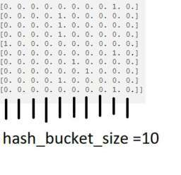

2. ->  ->  Cevabınız için çok teşekkürler. Peki bu değerin parametre olarak kullanıcı tarafından girilmesinin spesifik bir sebebi var mı? Yani tf.feature_column.crossed_column() fonksiyonuna latitude ve longtitude feature'larını verdiğimizde bu \"hash_bucket_size\" değeri kullanıcıya bırakılmadan da hesaplanabilirdi diye düşünüyorum. Tekrardan teşekkürler..",
3. ->  ->  Merhaba,Anladığım kadarıyla feature crossing verdiğimiz orjinal featureları alıp onları çarpar ve berlirlediğimiz hash_bucket_size kadar bucketlar içine bu çarpılan değerleri yerleştirir.hash_bucket_size değerini vermemiz, bütün ihtimal dahilinde kalan indis sayısını (featurelar çarpıldıktan sonra) bilmeden önce, modelimizi kayıp verme riski olsa dahi oluşturmamıza yaramaktadır. Kaynak: [what TensorFlow hash_bucket_size matters](https://stackoverflow.com/a/45219489/6139104) İyi çalışmalar.",
4. ->  ->  Teşekkürler..",
5. ->  10 buckets for latitude.10 buckets for longitude. Olduğu için hash_bucket_size=100 oluyor. Yanlışım varsa düzeltirseniz sevinirim.,
6. ->  ->  Doğru, 10x10 feature değeri size 100 feature değeri verir yani feature crossing yaptığınızda 100 elemanlı yeni bir binary vector elde edersiniz. Benim resimde verdiğim örnek longitude ve latitufe değerleri için değil, sadece bucket'ı gösterebilmek adına başka bir örnekti. Açıklamanız için teşekkürler, iyi çalışmalar..",
7. ->  ->  Ben teşekkür ederim. İyi çalışmalar dilerim..",
8. ->  ->  Cevabınız için teşekkürler..",
    
### soru 

> quest: "Merhabalar, log ve min fonksiyonları tam olarak ne işlev yaptığı için grafikler değişti ve neden 1.kodda( total_room/population+1) yani neden +1 dedik, 2.kodda  (total_room/population, 4) dedik ,4 ün işlevi nedir. Teşekkür ederim.",

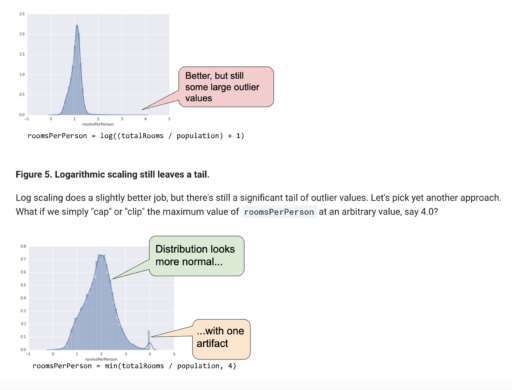

> comments:
  
1. ->  Merhabalar,Log fonksiyonu verisetindeki her roomsPerPerson verisinin logaritmasını alıyor. Logaritması alınan değerler küçülüyor ve küçülen bu yeni değerlerle yeni bir grafik oluşturulduğunda bile hala outlier yani diğer verilerden çok uzakta verilerin olduğu görünüyor. Bunun nedeni ise roomsPerPerson feature değerleri normalde 3-4-5 gibi değerler iken bizim outlier değerimiz 50 ve 5 ile 50'nin logaritması alınsa bile aralarında yine bir açıklık olacaktır.Bizim istediğimiz verisetimizdeki bu outlier sorununu gidermek. Bunun için ise yapabileceğimiz şey roomsPerPerson için kendimiz bir maksimum değer belirlemek (örneğin 4 belirlemiş olalım) ve o maksimum değerden büyük her değeri (örneğin outlier değerimiz 50) belirlediğimiz maksimum değere eşitleyelim.min fonksiyonu ise totalRooms/population işlemini yapıyor ama bu değer 4'ten büyük ise 4 değerini alıyor.İyi çalışmalar..",
2. -> ->  ama sonuçta 4 değeri normal değerlerden yüksek değil mi yinede.. YANİ, dağılımdan uzakta... Burada onun seçilmesinin nedeni nedir?.",
3. ->  -> ->  'nın paylaştığı resme bakarsanız burada değer dağılımlarının 4'ü de kapsadığını ve 4'ün outlier değer olmadığını görebilirsiniz. Siz sanırım logaritma alındıktan sonraki grafik için konuşuyorsunuz. Burada logaritma alıp bu işin içinde çıkacağınızı düşünebilirsiniz ama bu şekilde de outlier sorununu çözemediniz, o yüzden logaritma alma yaklaşımına girmeden cap veya clip yöntemini kullanabilirsiniz denmiş. 4 seçilmesinin belli bir nedeni yok, bu değerin ne olacağı tamamen size kalmış 5 de alabilirdik 3 de 6 da..",
4. ->  aykırılı değerleri onlemek adına 4 den büyük değerler alırsa bu değerler 4 olarak sabitleniyor diye anladım ben..",
5. -> +1 denmesinin sebebi \"log\" fonksiyonunun 0 değeri için tanımsız olmasından kaynaklanıyor. (totalRooms/population) = 0 olması durumunda roomsPerPerson hesaplanabilmesi için +1 değeri eklenmiş, +1 yerine +0.00001 de eklenebilirdi..",
6. ->  -> Merhaba, bu durum için +0.00001 değeri eklenmesi muhtemelen doğru olmazdı çünkü log fonksiyonunda 0-1 arası değerler negatif değerler vereceğinden tablomuz gerçekten uzaklaşmış olurdu diye düşünüyorum..",
7. -> ->  Evet +1 bu örnek için en doğrusu. İlgili feature'ın negatif değer alması bir anlam ifade etmiyor. (0,+] aralığında normalize olması dediğiniz gibi daha uygun..",
    
### soru 

> quest: "Öncelikle merhabalar, representation-qualities of good features kısmında bu ifadeyi tam olarak anlayamadım. Bu kısım ile ilgili bir açıklama yapabilir misiniz? Teşekkür ederim.

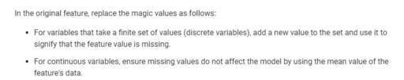

> comments:
  
1. ->  Merhaba,Az önce bu kısımları [Link](http://community.globalaihub.com/community/status/190-190-1586982868/#comment.4163.4048.4048) linkindeki yorumumda açıklamaya çalıştım 🙂 Aklınıza bir şey takılırsa tekrardan cevaplayabilirim.İyi çalışmalar..",
2. ->  ->  gayet anlaşılabilir bir yorum olmuş, açıklamanız için teşekkür ediyorum 🙂.",
    
### soru 

> quest: "Merhaba,  Resimdeki kısmı genel olarak anlayamadım.Burada tam olarak ne demek istiyor acaba?  Teşekkürler.

> comments:
  
1. -> Merhaba,Bu kısımda demek istediğini resimedki örnek üzerinden anlatayım.Elinizde bir verisetin var ve verisetinde quality_rating isimli bir feature var. Bu feature'ın değerinini girilmediği veri örnekleriniz olabilir. Siz burada şöyle bir yaklaşımda bulunabilirsiniz:Eğer quality_rating isimli feature'ınızın verisi girilmemiş ise siz el ile -1 atayabilirsiniz ve -1 olan quality_rating feature'ının aslında verisi girilmemiştir diyebilirsiniz. Ama bu yanlıştır çünkü siz -1 koyarak quality_rating feature'nın varsayılan aralığı olan 0-1 arasındaki değerlerden farklı bri değere girdiniz. Bu aynı zamanda modelinizin öğrenme sırasında da performansı düşürecek ve hatalı tahminlere yol açacaktır. Bunun önüne şöyle geçebilirsiniz:Bool tipinde (0 veya 1 alan) bir feature oluşturursunuz ve bu feature değeriniz sizin quality_rating feature'ınızın değerinin girilip girilmediği bilgisini tutar. quality_rating girilmişse yeni bool feature'ınıza 1, girilmemişse 0 verdiğinizi varsayalım. Peki işimiz bitti mi? Hayır ama çok az kaldı :)Eğer sizin quality_rating değeriniz discrete bir değer ise yani alabileceği değerler sınırlıysa: feature değerinin kayıp olduğunu belli eden bir değer ekleyin (örneğin elinizde sadece 0,1 değerleri var ise 2 değerini ekleyip bu 2'nin sadece girilmemiş değerler için kullanıldığını belirtebilrisiniz. resimdeki örnekte quality_rating continuos bir değer olduğu için bu yöntem orada işe yaramaz.).Eğer sizin quality_rating değeriniz continuous bir değer ise: bu kayıp değerlerin modeli etkilememesi için quality_rating feature datalarının ortalama değerlerini girilmemiş kısımlara yazın.İyi çalışmalar.1 month ago 13 people like this.Like ReportReply",
2. ->  ->  feature değerlerimizin continuous veya discrete olması, problemimizin classification veya regression olduğunu belirlemiyor diye biliyorum, yazdığınızdan öyle anlaşılıyor ya da ben mi yanlış anladım ? Ya da siz quality_rating'i bizim tahmin etmek istediğimiz değer olarak aldınız.",
3. ->  ->  Merhaba, anlık kafa karışıklığıyla quality_rating'i label olarak almışım. Düzeltme için teşekkürler 🙂",
4. ->  ->  is_quality_rating_defined bool feature yarattığımız yeterli değil mi? Continuous değerlerde ortalama ile değiştirmeye gerek yok diye düşünüyorum. Bu feature'i işlerken oluşturduğumuz bool feature bakarak bu boş değerlere goz ardi edebiliriz. Neyi etkiler bu eğer değiştirmezsek?.",
5. ->  ->  Bildiğim kadarıyla belli featureları göz ardı etme diye bir şey yok, sadece o feature'ın mensup olduğu veri örneğini göz ardı edebilirsiniz ama ya iki feature'ınız var ise ve biri boş biri doluysa o zaman bu veri örneğini göz ardı etmekten söz edemeyiz. Bu yüzden de bu veri örneğini alabilmek ama alırken de boş olan feature değerinin feature ortalamasına etki etmemesi için ortalamayı feature değeri olarak verebiliriz..",
6. ->  ->  Genel tekrar yaparken aklıma bir şey takıldı sormak istedim. Continuous ise ortalama alıyoruz. Discrete ise o değerin yazılmadığını belli eden bir sınıf oluşturuyoruz. is_quality_rating diye ekstra özellik açmanın gerekliliği nedir? Buradan modelin quality belirlenenlere daha yüksek bir ağırlık verdiği mi anlaşılmalı?.",
7. ->  ->  Merhaba,[Makine Öğrenmesi’nde Ham Veri’den Öznitelik](https://medium.com/@ftfethi/makine-%C3%B6%C4%9Frenmesinde-ham-veri-den-%C3%B6znitelik-%C3%A7%C4%B1karmak-8a6e234ada46) linkindeki yazımın 3.maddesinde bu konuya detaylı değinmeye çalıştım. Eğer aklınıza takılan bir şey olursa sormaktan çekinmeyin.İyi çalışmalar.",
8. ->  ->  Teşekkür ederim okuyacağım..",
    
### soru 

> quest: "Merhaba,  Representation kısmında kategorik değerler için one-hot-encoding kullanıldığını anlatıyor.Bu kullanımda feature için tek bir ağırlık var değil mi ?Bu ağırlık bu binary vector ile çarpılınca mesela [0,0,5.0] yada [5,0,0,0] oluyor ikisi içinde 5 değerimi toplanacak?  Birde seyrek temsilden bahsediliyor.Bunu nasıl kullanacağımızı anlamadım.Her bir kategorik değer için sayısal değer atıcaz fakat her biri için farklı ağırlıklar elde edicez olarak anladım ,ama peki nasıl her biri için farklı ağırlık elde edilcek?  Teşekkürler",

> comments:
  
1. -> Merhaba Buse,One-Hot-Encoding yaptığında bahsettiğin vektördeki her bir değer ayrı bir feature oluyor ve farklı weight değerleri alıyorlar. Örneğin elindeki datasette şehir adlarının olduğu bir feature var ve içerisinde [\"İstanbul\", \"Ankara\", \"İzmir\", \"Bursa\"] kategorik değerleri var. One-Hot-Encoding yaptığın zaman bu değerler datasete kolon olarak eklenirler. [\"İstanbul\", \"Ankara\", \"İzmir\", \"Bursa\"] kolon adları olmak üzere eğer satırda bu değerler geçiyorsa 1, geçmiyorsa 0 olur. Mesela ilgili satırda \"Ankara\" var ise [0,1,0,0] olur. Bu değerleri feature olarak eklediğimiz için her birinin weight değeri farklı olacaktır, çünkü normal şartlarda her bir şehir adının sınıflandırma sonucuna etkisi farklı çıkmalıdır.Seyrek temsil olarak bahsettiğin yani sparse represantation için ise yukarıda verdiğim örneğe ek olarak tüm dünya şehirlerini kullandığımızı düşünelim. Dünya üzerinde yaklaşık 2.5 milyon şehir var ve her biri için bir kolon oluşturup sadece ismi geçen şehri 1 ile işaretleyip diğerlerini 0 yapmak pek mantıklı değil.Bu gibi durumlarda kullanılıyor ve sadece 1 olan yani ilgili satırda geçen kategorik değerler gösteriliyor..",
2. ->  ->  Sparse representationın ne olduğunu tam olarak anlayamadım sadece kelime sayısı milyonları bulduğunda one hot encodinging yetersiz kaldığı durumlarda kullanılıyor diye anladım sparse repin kullanımı aklımda pek canlanmadı. İnternettede baya karmaşık formüller var yanlış anlamadıysam sparse rep. konusu sözlü olarak anlatmaya pek müsait değil?.",
3. ->  ->  Seyrek temsil için verdiğiniz örnekten gidecek olursak sadece Ankara şehir kolonunda 1 olan bir örnek için sadece \"Ankara\" feature'ı mı tutuluyor? Geri kalan kolonlara 0 değerleri feature engineering adımlarında mı ekleniyor?.",
4. ->  ->  Seyrek gösterimi (Sparse representation) şu şekilde açıklamaya çalışayım. Seyrek gösterim veri setinde sadece sıfır olmayan özelliklerin (feature) gösterildiği özellikle büyük (big data) veri setlerinde kullanılan bir gösterim şeklidir. Görsel ile açıklamaya çalıştım.",
5. ->  ->  Teşekkürler.Peki sparse representation 'da 1000 kategorik değer varsa 1000 feature eklemiyo muyum yani?Bu kısmı gene anlayamadım..",
6. ->  ->  Ama her örnek için O olmayan değer değişecek.Mesela şehir bir örnekte Ankara,diğerinde İzmir?Gene hepsi için feature olması lazım yoksa her example için aynı feature mı olacak yani?.",
7. -> ->  evet yine 1000 feature ekleniyor ancak sparse matrix olarak ekleniyorlar. Tensorflow üzerinde çalışırken bunun ile ilgili metodlar var.Bildiğin gibi bir yazılım dilinde(Python için konuşalım) variable içine matris tanımlarsan (Numpy ile) onun uzunluğu kadar hafızada yer kaplayacaktır. Eğer elimizde bahsettiğimiz ölçüde büyük bir matris var ise memory üzerine yazılamaz çünkü matris içerisindeki 0'lar da yer kaplar. Bu noktada sparse matrixler kullanılır, bu matrisler farklı mapping teknikleri ile 0 olan verileri boş olarak alır, sadece değer içeren veriler matris içerisinde depolanır. Dolayısıyla memory problemi oluşmaz. Sparse matrixleri kullanmak için Python'da Scipy kütüphanesini kullanabilirsin.Aşağıda bu konu ile ilgili yazıları bulabilirsin ancak Machine Learning için şimdilik bu konuların detaylarını bilmek zorunda değilsin, merak ettiğin için paylaşıyorum :)Farklı Sparse Matrix türleri:[Link](https://matteding.github.io/2019/04/25/sparse-matrices/)
8. -> One hot encoding yaptığımızda bir nitelikten, nitelikte bulunan düzey sayısı kadar yeni nitelik elde ederiz. Örneğin şehir niteliğimizde İstanbul,Ankara ve İzmir düzeyleri olsun. Şehir niteliğine one-hot encoding yaptığımızda is_İstanbul, is_Ankara , is_İzmir şeklinde yeni nitelikler elde ederiz.Örnek olarak şöyle bir verimiz olsunbuyukluk (m2), şehir, oda_sayisi, fiyat135 , İzmir, 3 , 270000buna one-hot encoding uyguladığımızda verimizdeki nitelikler ve değerleribuyukluk (m2), is_İstanbul, is_Ankara, is_İzmir, oda_sayisi, fiyat135 , 0, 0 , 1, 3, 270000e dönüşür. Artık modele girecek veri gösterimi son elde ettiğimiz gösterim. Yani her bir nitelik için ayrı bir ağırlığa sahip olacağız. Dolayısıyla is_İstanbul, is_Ankara ve is_İzmir niteliklerinin ağırlıkları birbirinden farklı olacak.",
9. ->  Fatih Bey'in örneğinden devam ederek anlatayım, farkettiyseniz burada sayı ile ölçülemeyen özelliğimiz \"şehir bilgisi\". One hot encoding ile şehir çeşidi kadar yeni özelliği (yani sütunu) tablomuza eklediğimizi düşünün, yani her bir şehir ismi için tabloya bir sütun daha ekliyoruz, bunlar İstanbul, Ankara ve İzmir için birer yeni sütun oluyor örnekte. Bizim gözlemimizdeki (yani satırımızdaki) ev hangi şehirde ise o sütunumuz 1, diğerleri 0 oluyor. Bu şekilde gözlemimizin o özelliğini kodlamış oluyoruz. Ben en basit haliyle bu şekilde kullanıyorum. Umarım anlatabilmişimdir.",
    
### soru 

> quest: "Arkadaşlar merhaba. Ben \"Feature Crosses\" bölümünü etkinliklere rağmen genel olarak anlayamadım. İnternet üzerinde faydalı bir site veya video şeklinde bir kaynak bulamadım. Bu konuyla ilgili bir site ya da herhangi bir kaynak bilgisi olan var mı? İyi çalışmalar 🙂",

> comments:
  
1. ->  Merhaba,[Link](http://community.globalaihub.com/community/status/774-774-1586937745/#comment.4123.4009.4009) linkinde Feature Cross'u genel hatlarıyla kabaca anlatmaya çalıştım. Eğer bu kısımda sorularınız eksik gördüğünüz veya anamadığınız yer olursa bu post altından daha açıklamalı halini yazmaya çalışabilirim. Ayrıca Andrew Ng'nin Coursera'daki Machine Learning kursununda da bunun açıklaması mevcut, o kursu da önerebilirim.İyi çalışmalar.",
2. ->  Çok teşekkür ederim..",
3. ->  Ufak bir sorum daha olacak : Feature Crosses bölümünün Playground Exercise kısmındaki Task 1'de learning rate'den bahsedilmiş, orada \"non-linear\" model'de learning rate'in yakınsama değerine etkili olmadığı mı anlatılmaya çalışılmış?.",
4. ->  ->  Merhaba,-> 'nün de dediği gibi lineer modelleme bu verisetini efektif bir şekilde modelleyemiyor. Learning rate değerini değiştirmemiz lossumuzu yine azaltacaktır yani etkileyecektir ama en kadar azaltırsa azaltsın loss halen kabul edilemez düzeyde yüksek bir değere yakınsar, optimum değere yakınsayamaz. Yani learning rate yakınsamamızı etkiler ama yeterli düzeyde etkilemez.İyi çalışmalar..",
5. ->  Merhaba Nil Hanım, bahsettiğiniz egzersizin \"Task 1\" bölümünde linear modeli verilen şekliyle çalıştırılması istenmiş. Verildiği şekliyle de \"feature\" olarak sadece x1 ve x2 var yani feature cross olmadan verilen data seti linear olarak modelleyebilir miyiz'in cevabını sorgulamamız isteniyor. Learning rate loss'u azaltsa da verilen data setten linear bir model çıkarmamız söz konusu değil anladığım kadarıyla..",
    
### soru 

> quest: "Merhaba, Representation: Cleaning Data bölümündeki, Scaling feature values başlığındaki maddeleri ve floating-point teriminin ne olduğunu anlayamadım, yardımlarınız için teşekkür ederim."

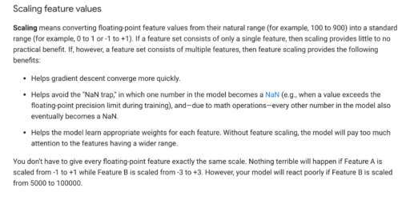

> comments:
  
1. -> Merhaba,1- Siz bir feature alanını scale ettiğinizde gradient descent algoritması, feature değeri daha da küçüldüğünden dolayı daha hızlı optimum değere yakınsar.2-Scale etmek NaN tuzağını engellemenize yarayacaktır. NaN tuzağı kavramı şudur, Eğer sizin verisetinizde NaN (gerçek hayatta sayılar sonsuzdur ama bilgisayar donanımının kısıtladığı bir sayı sınırı varıdr. Bunu aşması durumunda NaN olacaktır. Peki nasıl aşabilir? Büyük sayılarla matematik işlemleri yaparsa bu sayı NaN olabilir. O büyük sayıyı küçültmek ve belli bir range'e sokmak için scale yapılabilir.) bir veri var ise modeldeki diğer sayılarımızda eninde sonunda NaN olacaktır.3-Scale etmeniz modelinizin her bir feature'ınız için ilgili weight değerlerini öğrenmesi konusunda yardımcı olacaktır çünkü scale edilmemiş geniş aralığa sahip verilerde model weighr değerini öğrenmek için daha çok kaynak ve zaman harcayacaktır.Floating point kavramı aslında reel sayıların bilgisayar alanındaki adıdır. Bu kavrama reel değil de floating-point denmesinin sebebi ise sayı içerisindeki ondalık noktasının kayabilme özelliğinden dolayıdır. Gerçek dünyada sayılar sonsuza kadar giderken, bilgisayar ortamında bilgisayar donanımının getirdiği sınırlamalardan dolayı bütün sayıların gösterilmesi mümkün değildir. Bununla birlikte gerçekte sonsuza kadar giden birtakım değerler bilgisayar ortamında ortamın kapasitesine bağlı olarak yaklaşık değerlerle temsil edilirler. Bu sınırlamaların etkisini en aza indiren, sayıların maksimum miktarda ve gerçeğe en yakın şekilde temsilini sağlayan sisteme \"Kayan-Noktalı Sayılar\" sistemi denir. Kaynak ve daha fazlası için: [Kayan-Nokta](https://tr.wikipedia.org/wiki/Kayan_nokta) adresini inceleyebilirsiniz.İyi çalışmalar.
2. ->  ->  Açıklamanız için teşekkür ediyorum 🙂.",
3. ->  ->  peki scale işlemini nasıl yapıyoruz yani tam olarak neyi scale ettiğimizi ve neye göre sınırları belirlediğimiz anlayamadım.",
4. ->  ->  Feature olarak kullanacağımız veri aralıklarına bakıyoruz. Zaten tek bir feature'ımız var ise scale etmemiz gerekmiyor, birden fazla feature'ımız var ise değer aralıklarını karşılaştırabiliriz. Örneğin ev metrekaresi ve oda sayısı featureları değer aralığı olarak aynı düzlemde olmayacaktır. (ev metrekaresi 50-300 arası skalada diyelim, oda sayısı ise en fazla 10 olsun diyelim.) Bu durumda gradient descent fonksiyonumuzun daha hızlı çalışması için bu iki feature'ı benzer değer aralıklarına sokmamız performansı arttıracaktır. Benzer dememin sebebi örneğin ev metrekaresi feature'ını scale edip 50-300 aralığından -3Özellik Ölçekleme ve Normalleştirme (Feature Scaling and Normalization)",
5. ->  ->  Teşekkür ediyorum çok güzel açıklıyorsunuz ????galiba yarısı silinmiş yazının.",
6. ->  ->  Merhaba, yorumunuz için teşekkür ederim 🙂 evet edit diyince yazının tamamı geliyor ama save diyince yarısı gidiyor teknik bir problem var sanırım 🙂 Sizin için şöyle bir şey yapabilirim ama, edit dediğimde çıkan yazının tamamını ekran görüntüsü alıp atıyorum. Gözlerinizden şimdiden özür diliyorum, iyi çalışmalar diliyorum 🙂.",
7. ->  ->  olur mu öyle şey 🙂 saolun kafamdaki soru işaretlerini giderdiğiniz için, kolay gelsin..",
    
### soru 

> quest: "Merhabalar. Regularization bölümünün son kısmında check your understanding 2. sorusunda sıkıntı yaşadım. Cevap olarak 3 . şıkkı seçtim verilen bir feature içinde noise olduğu için. Anlatabilecek birisi varsa çok sevinirim.",

> comments:
  
1. ->  Merhaba Mehmet,Regularization ile kastedilen modelin karmaşıklığını azaltmaktır. Burada bahsedilen L2 ve daha sonra karşılaşacağın L1 regularization ile modeldeki weight değerleri mümkün olduğunca azaltılır. L2 regularization formülü gereği en yüksek weight değerini hızlı, düşük weight değerini ise yavaş şekilde 0'a yaklaştırır ancak tam olarak 0'a eşitlemez. İleride göreceğin L1 regularization ise bazı weightleri 0 yaparak model kompleksliğini azaltır.\"One feature will have a large weight; the other will have a weight of almost 0.0.\" seçtiğin şıkta bir feature'ın yüksek weight değerine sahip olacağı diğerinin ise 0'a yakınsayacağını söylüyor. Ancak L2 regularization yukarıda da açıkladığım gibi yüksek weight değerini daha hızlı bir şekilde azaltır ve modelde yüksek weight değeri kalmaz çünkü yüksek weight değeri modelin karmaşıklığına en çok katkı yapandır.",
    
### soru 

> quest: "Herkese merhaba. Crossing One-Hot Vectors kısmını tam oturtamadım yardımcı olursanız sevinirim 🙂",

> comments:
  
1. -> Merhaba,Öncelikle Feature Cross yapmamızın sebebi modelimizin verileri tek bir lineer çizgiyle ayıramamasıdır. Bu yöntemle yeni bir feature elde edip bu yeni feature modelimizin eğitim sırasında verileri daha etkili ayırıp daha etkili bir hipotez fonksiyonu elde etmesinde yardımcı oluyor. Örneğin elinizde \"dil\" ve \"ülke\" kategorik featureları olsun.Örneğin dil feature değerleri: \"Türkçe, İngilizce, Japonca\"Ülke değerleri de: \"Türkiye, İspanya, Kanada\" olsun.Bu iki kategorik veriyi One Hot Encoding kullanarak binary vector'e çevirdiniz ki modelimiz numerik veri üzerinde çalışabilsin.Eğer siz bu iki feature'ı yani iki binary vector değerini çarparsanız elinizde 9 elemanlı bir binary vector olur. Bu binary vector değerlerinden her biri bir ihtimali temsil eder. Örneğin:[Türkçe ve Türkiye,Türkçe ve İspanya,Türkçe ve Kanada, İngilizce ve Türkçe,.......] gibi.Siz ilgili ihtimalin olduğu indeksteki değere 1 koyduğunuz anda artık o eğitim örneği için o değer geçerlidir. Örneğin [1,0,0,0,0,0,0,0,0] yaptığınızda artık Türkçe ve Türkiye değerini o eğitim örneği için değer belirlemiş olursunuz. Buradaki amaç featureların tek tek tahmine katkısından daha çok katkı sağlamalarını sağlayabilmek. Örneğin dil ve ülke featureları kend başlarına feature olarak katkı sağlarlar ama iki feature'ı çarpıp elde ettiğimiz yeni feature tahminde daha çok katkı sağlayacaktır.İyi çalışmalar.1 month ago 19 people like this.Like ReportReply",
2. ->  ->  Doğru anlıyor muyum? Dil ülke örneği ile modelimizin verileri lineer olarak ayıramadığı durumda, featurelar çarpıldı ve yeni bir çıktı elde ettik(binary vektör). Dağınık halde olan verileri daha düzgün bir hale getirip tekrar bir doğru ile ayırıp ayıramadığımıza bakıyoruz bu şekilde. Peki bu yeni feature'ımız mı oldu yani diğer featurelarla birlikte nasıl değerlendiriyoruz bu durumu?.",
3. ->  ->  Evet, bu çarpılan feature sizin yeni feature'ınız oldu. x3 feature'ı olduğunu düşünelim. x3=x1 (x) x2 olsun. Yani x1 ve x2 feature'ımızın çarpımı ile x3 sentetik feature'ımızı elde edelim. Bu durumda y=w0+w1x1+w2x2 olan hipotez fonksiyonumuz artık y=w0+w1x1+w2x2+w3x3 olacak ve bu hipoetizimin doğru olarak gösterimi de bize verileri daha tutarlı ayırmış olacak. [Feature Crosses: Playground Exercises ](https://developers.google.com/machine-learning/crash-course/feature-crosses/playground-exercises) playground'ında w1 ve w2 ağırlıklarımızı 0, w3'ümüzü 1 olarak aldığımızda aslında yeni oluşturduğumuz feature'ın tek başına güzel bir veri ayırması yaptığını görebiliyoruz. Bu da yeni oluşturduğumuz feature x3'ün, x1 ve x2 featurelarından daha efektif çalıştığını gösteriyor.",
4. ->  ->  teşekkür ettim, çok iyi açıklıyorsun..",
5. ->  ->  teşekkür ederim 🙂.",
    
### soru 

> quest: "Herkese merhabalar. Feature crosses bolumundeki en son sorulan soruda (Check your understanding kisminda) neden one feature crossu diger featurelarinin binned halini alarak olusturduk. Binned hali olmadan alsak nasil bir sonuc dogurur? Binning konusunun uygulamasi kafamda tam oturmadi acikcasi. Bu konuda yardimci olursaniz cok sevinirim. Tesekkurler.",

> comments:
  
1. ->  Merhaba, bir şehirdeki boylam derecemiz 30 olsun ve kişi başına düşen oda sayısı da 1 olsun. Diğer şehirde de boylam derecesi 20 ve kişi başına düşen oda sayısı yine 1. Şimdi bunları binning yapmadan feature crossing yaparsak, derece ne kadar yüksekse biz ona daha çok değer biçmiş oluyoruz. Binning yaptığımızda, sadece şehrin bulunduğu boylamı 1, diğerlerini 0 şeklinde ifade ettiğimiz için, boylamın derecesine göre karar vermemiş oluyoruz.",
1. ->  ->  Ben de rooms per person özelliğinin neden bin yapıldığını anlamadım. Enlem ve boylam da gerekliliğini anlatıyor. Rooms per person diğer iki özelliğe göre daha stabil ve güvenilir. Bu kısmında 50 gibi bir outlier değer vardı onun etkisini kırmak için mi yine bin yapmamız gerekti ?.",
1. ->  ->  Sanırım o outlier değerlerini bu işleme gelmeden temizlemiş oluyoruz. Dediğiniz gibi rooms per person bin işlemi diğerleri kadar net görülemiyor. Bin yapılmayıp normal değerleri ile kullanılsaydı, roomsperperson = 1 ve roomsperperson = 2 değerleri için; 2 olan değere 2 kat önem vermiş oluyoruz ve ister istemez w değerine müdahele etmiş oluyoruz. Belki de fiyat olarak aralarında net olarak 2 kat fark yok. Onu modelin vereceği ağırlıklar ve hesaplayacağı hata ile kendisi tespit etmesini istiyoruz. Ağırlığa müdahale etmemiz bizi doğruluktan uzaklaştırabilir diye düşünüyorum.",
1. ->  ->  teşekkürler benim için faydalı oldu açıklama 🙂.",

### soru 

> quest: "Herkese Merhaba, umarım dolu dolu bir machine learning crash course haftası geçirirsiniz. Ben tam olarak Representation kısmındaki \"Account for upstream instability\" kısmını anlamadım. Yardımcı olursanız sevinirim.iyi akşamlar.",

> comments:
  
1. ->  Merhaba,Burada demek istediği feature'ınızın değeri zaman içerisinde değişiklik göstermemelidir yani Stationary durumda olmalıdır. Örneğin siz her şehirdeki oy oranına bakacaksınız ve her şehir içn o şehri tanımlayacak bir belirleyici feature'a ihtiyacınız var. Bu feature ismine sehir_id dediniz ve 1234567 değerini atadınız. Bu değer ilerleyen zamanlar değişkenlik gösterme potansiyeline sahip. Örneğin verisetinize yeni şehir eklendiğinde veya çıkartıldığında. Bunu yerine sehir_id feature değerinizi \"tr/istanbul\" yaparsanız bu değerin değişmeyeceği neredeyse kesindir (biri kalkıp da şehrin adını değiştirmezse).İyi çalışmalar.",
2. ->  ->  anladım teşekkürler. iyi çalışmalar..",
    
### 1. hafta sınavı 
  
    
### soru 

> quest: "Merhaba Arkadaşlar,  Representation: Feature Engineering bölümünde kategorik değerlerimize sayısal değerler tanımlayıp doğrudan modelimize dahil ettiğimizde sorunlu olabilecek bazı kısıtlamalar olduğundan bahsedilmiş. Buna istinaden eklediğim iki maddeyi tam olarak anlayamadım. Yardımcı olursanız çok sevinirim. Teşekkürler"

> comments:
  
1. -> Merhaba,1.Örneğin sizin sokak featureınız var ve string değerinde yani kategorik bir veri. Siz dediniz ki ben her bir sokak ismi için bir index kullanacağım yani ilk sokak için 0, ikinci sokak için 1 diye böyle gidecek. 10 sokağınız var ise son indexi 9 olur bu durumda. Burada ilk maddede diyor ki güzel index kullandın ama örneğin siz o feature değeri için ilgili weight'i 6 buldunuz bu sefer durum şöyle olacak 1.eğitim örneği için 6x0 2. eğitim örneği için 6x1......... 10.eğitim örneği için 6x9 (lineer regresyon formülündeki w (x) x kısmından). Burada sizin her sokak için bir weight değeri öğrenmeniz gerektiğinden bahsediyor çünkü sokakların hepsinin labelımıza farklı bir etkisi olur ama siz az önceki şekilde yaparsanız bütün sokaklar için aynı weight bulmuş olur ve sokakların labela etkisini gözlemleyemezsiniz. Buradaki indeksleme yöntemi her katgorik değeri bir int değere maplemekti. One Hot Encoding veya Multi-Hot Encoding kullanırsak bütün bu ihtimalleri featurelara ayırırız ve bu featurelardan her birinin değeri binary bir vector olur.2.Yukarıda sokak isimleri labelımız tek bir sokak ismi alyıyormuş gibi düşündük ve ona göre indeksledik. Bazen sokak featureımız string tipinde iki tane sokak ismi alabilir.(Örneğin evimiz iki sokağın köşesindeyse.) Eğer siz yukarıdaki gibi bunlar için de indeks kullanırsanız bu veriyi encode edemeyeceğimizden bahsediyor.İyi çalışmalar.",
2. ->  Çok teşekkürler ->  şimdi daha iyi anladım. İyi çalışmalar.",
    
### soru 

> quest: "Merhaba, Tensorflow'u pip ile yüklemek istediğimde böyle bir hata alıyorum. Çok yanlış bir şey mi deniyorum? Numpy ve Pandas'ı bu şekilde yüklemiştim. Pip sürümüm günceldir.  Yardımcı olabilir misiniz? Teşekkürler,",

> comments:
  
1. ->  sanırım versiyon söylemenizi istiyor.pip install tensorflow==2.0.0.",
2. -> eğer versiyon tanımı sorunu çözmez ise bunlara bakabilirsiniz python versionunuz nedir acaba? python 3.5 veya 3.7 versiyonlu olması gerekiyor. Şurada bir açıklaması var. [Link](https://www.tensorflow.org/install) ayrıca eğer bu versiyonları kullanıyorsanız \"pip3 install tensorflow\" olarak da bir dener misiniz? Bir de python2 kullanmayı tercih ediyorsanız ([Link](https://www.tensorflow.org/install/pip) şu link'te olduğu gibi tensorflow versiyonunu seçmeniz gerekiyor. Ayrıca şu siteden python3 indirebilirsiniz [Link](https://www.python.org/downloads/windows)
3. ->  Teşekkür derim Python 3.8.2 kullanıyordum o yüzden olmadı sanırım. Şimdi 3.7.7 indirdim ve pip ile versiyon belirtmeden yükleme yapabildim.Çok teşekkür derim,.",
4. ->  Anaconda kullanmak yeni başlayanlar için en iyisi. Kendisi paketler arasında uyumlulukları hallediyor ve gereklilikleri kuruyor..",
    
### soru 

> quest: "Merhaba arkadaşlar,  Geçen haftanın konusu ile ilgili bir yerde takıldım. Tecrübesi olanlar yardımcı olabilir mi?  Elimdeki bir veri setine eğitim gerçekleştiriyorum ancak bir türlü loss değerinde sürekli azalmayı yakalayamadım(converged olmuyor). Aşağıda denediklerimden 3 örnek görseli paylaşıyorum. Çok daha fazla denemem oldu. Geçtiğimiz haftadan nasıl yapmam gerektiğini tam anlayamadığımı fark ettim. Öğrenme oranını düşürdüm, epoch sayısını artırdım ve batch size ı azalttım. Grafik hep tırtıklı şekilde çıkıyor. Bunlardan kurtulmak için anladığım kadarıyla kesin geçerli bir yol yok. Parametre ayarlamalarını yaparken bildiğiniz dikkat edilmesi gereken başka noktalar nelerdir? Teşekkürler.

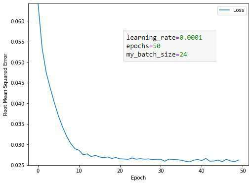
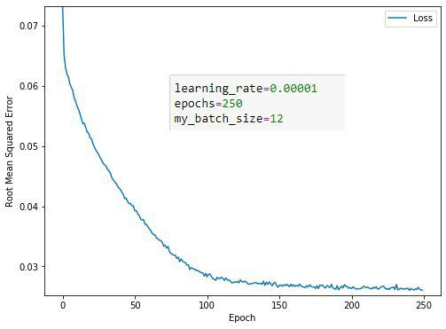
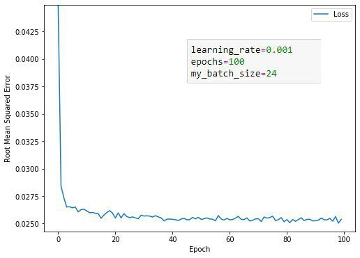

> comments:
  
1. ->  Batch-size'ı düşürmek osilasyon yapmasına yol açabilir. Stochastic gradient descent yani batch-size=1 aldığınızda daha fazla osilasyon yapacağını tahmini ediyorum. 128-256 gibi sayılar denediniz mi ?.",
2. ->  ->  Mantıklı geldi dediğiniz. Batch size büyüdükçe daha az tahmin gerçekleştirecek. Ama yine de olmuyor..",
3. ->  ->  Sürekli azalmasından ziyade, hatanın düşük olması daha önemli değil mi ? Hata miktarı yeterince düşük gibi geldi bana. Azalıp artmasından çok, en son ulaştığı noktada ne kadar az hata değerine ulaştığı daha önemli diye biliyorum. Pratik konusunda daha tecrübeli arkadaşlar belki daha iyi yanıtlayabilir, her zaman teorik bilgi ile pratik bağdaşmıyor. Belki sizin istediğiniz gibi daha iyi bir sonuç elde edilebilir 🙂.",
4. ->  ->  Şurada sürekli azalmalı diyor ama.",
5. ->  ->  Bence orada demek istediği genel olarak azalan bir grafiğe sahip olması, sizin grafik için konuşacak olursak 0.04 e gelip sonra 0.08 e tekrar atlıyorsa o zaman sorun var demektir. Ama 0.0310 dan 0.312 ye çıkarsa, bunda bir sorun yok diye düşünüyorum. Sizin çizdirdiğiniz grafiğin ölçeği de böyle gözükmesine sebep oluyor. Hatayı 0-100 arası çizdirirseniz büyük ihtimal bu titreşimler hiç gözükmeyecektir. Siz başka kaynaklarda gördüğünüz sürekli azalan grafikleri ölçeği 0 - 0.10 aralığına düşürüp incelerseniz büyük ihtimal onlarda da bu tarz dalgalanmalar olacaktır..",
6. ->  ->  steadily kelimesini sürekli olarak değil de yavaş yavaş ve düzenli bir şekilde olarak çevirebilirsin..",
7. ->  Modelinizin eğitiminde herhangi bir sorun görünmüyor. Bu kadarcık sizin deyiminizle tırtıklı olması çok normal. Epoch sayısı arttıkça azalma gerçekleşmiş ancak belli bir yerden sonra adımlar arası fark o kadar az ki grafikte net bir şekilde belli olmuyor. Bu azalışı net bir şekilde görmek istersen özellikle 0.04 değerinden düşük değerler için y ekseninde ki noktalara çok yakından bakabilirsin (yanlış hatırlamıyorsam matplotlib'de ticker fonksiyonu ile yapabilirsin )..",
8. ->  Evet bence de bazen daha kötü sonuçlara izin vermesi gerekir ki lokal minimumlardan kurtulabilsin. Örnekteki grafik sürekli azalan şeklinde olunca sormak istedim. Teşekkürler cevaplar için. Biraz araştırınca şu linke denk geldim. Çok faydalı oldu sizinle de paylaşayım: [Link](https://machinelearningmastery.com/learning-curves-for-diagnosing-machine-learning-model-performance/)
    
### soru 

> quest: "Merhaba.Representation kısmında verileri one hot encoding yöntemi ile kullanıyoruz fakat weight özelliğini nasıl kullanacağımızı anlayamadım.",

> comments:
  
1. ->  One hot encoding kullandığımızda örnekte verilen evin bulunduğu sokak değeri 1 oluyor, kalan sokaklar 0 oluyor. [0 0 0 1 0 0] şeklinde bir vektör oluşmuş oluyor (boyutları rasgele yazdım). Ve weight değerimizle çarparken sadece tahmin etmek istediğimiz evin bulunduğu sokak hesaba katılmış oluyor. 0 olan diğer sokakları değerlendirmeye katmamış oluyoruz (w * 0 = 0 olacağından). Umarım soruyu doğru anladım 🙂",
2. ->  ->  evet doğru anlamışsınız :). fakat bu değerleri sayısal olarak nasıl kullanıyoruz ?.",
3. ->  ->  evin fiyatı örneği için linear regression kullandığımızda, y' = w1*x1 + w2*x2 + .... + wn * xn + b şeklinde bir formulümüz vardı (n = feature sayısı). Bizim sokak ismi feature'ımız x2 olsun. (x2 * w2) -> sadece istediğimiz sokak için sayısal bir değer üretecektir. w2 değerimiz 5 ise oradan elde ettiğimiz değer yukarıda yazdığım formülde sadece o sokak için katkı sağlayıp modelin o sokağın ev fiyatını tahmin ederken ne kadar etkili olduğunu anlamasını sağlayacaktır. weight değerleri ilk olarak 0 veya random olarak belirleniyor. model training kısmında evin gerçek fiyatını görüp hatayı hesaplıyor. weight değerlerini hatanın azalması için gradient descent kullanarak güncelliyor. Biz belirlemiyoruz weight değerlerini. Son kısımları bütünlük oluşturması açısından yazdım, diğer arkadaşlar okurken daha faydalı olabilir.,
4. -> ->  Güzel açıklama teşekkürler. Çok ufak bir ekleme yapayım. Eğer bir ev 2 sokağın kesişiminde (2 sokağın kesiştiği köşede) bulunuyor ise vektörümüzde bahsi geçen 2 sokağın değeri de 1 oluyor. Vektör de örneğin [ 0 0 0 0 1 0 1 0 0] gibi bir şey oluyor. Ana regresyon denklemimizde de 2 farklı katsayının etkisini dikkate alıyoruz.,
5. ->  ->  teşekkür ederim gayet iyi açıklamışsınız 🙂.",
6. ->  Merhaba, benim anladığım kadarıyla; one-hot encoding yöntemi sayısal olmayan raw data ları feature a çevirip eğitimde öğrenilen weight ile çarpabilmek için kullanılan bir yöntem. Yani aslında önce verileri feature a çevirip ki bunu yaparken one-hot encoding yöntemi de kullanılıyor sonra eğitim esnasında weight leri buluyoruz. Umarım bende doğru anlamışımdır..",
7. ->  Çalıştığınız kısımda anlatılan, model weightlerinin anlamlı olması için neden kategorik değişkenlerde one-hot encoding yöntemini kullanmamız gerektiği. Bu anlayışla o kısma tekrar bakarsanız net bir şekilde anlayacağınızı düşünüyorum..",
    
### soru 

> quest: "Merhabalar herkese, keyifli ve verimli haftalar ???????? Ben sparse representation ı tam olarak anlamadım. Çok fazla farklı değer olan kategorik featurelarda multi-hot encoding yaparsak çok büyük bir vektörde çoğu 0, birkaç elemanı 1 olan bir gösterimin pek doğru olmayacağını, bunun için sparse representation yapılabileceği söyleniyor. Bunun için vocabularydeki her değeri indexliyor ve 1 milyon eleman tutmak yerine değeri 0 dan farklı elemanların değerlerini ve bu elemanların index ini tutuyor.  Benim anlamadığım index bilgisini training işleminde nasıl uyguluyor? Index için de ayrı bir weight mi kullanılıyor?  Teşekkürler ????",

> comments:
  
1. ->  Merhabalar,Doğru anlamışsınız. Yeniden bir indexleme yapılmıyor. Sadece elimizde tutacağımız dataları indexleri ile birlikte alınıyor. Ancak index bilgisi benzersiz olması sebebi ile ML için kullanılamamaktadır. Eğitime katkı sağlamaması sebebiyle veriden eğitim aşamasına gelmeden çıkartılır diye biliyorum.İyi çalışmalar. 🙂",
2. ->  Bu gösterimin teorik temeli seyrek matrisler (sparse matrices ). [Sparse matrix](https://en.wikipedia.org/wiki/Sparse_matrix) linkinden ekstra inceleme yapabilirsiniz.",
3. ->  Teşekkürler 🙂 ->  -> .",

### soru 

> quest: "Merhaba,  \"There's a Goldilocks learning rate for every regression problem. \" Goldilocks ile learning rate baglantisini, Goldilocks learning rate kavramini biraz acabilir misiniz?",

> comments:
  
1. ->  Merhaba,Goldilocks kavramı ve learning rate'in rolü [Link](http://community.globalaihub.com/community/status/1043-1043-1586253928/) postunun altında açıklanmıştı. Oradan bulabilirsiniz.İyi çalışmalar dilerim..",
2. -> gozden kacirmisim, tesekkurler..",
    

    
### soru 

> quest: "Merhaba. Binning ile feature'ı belirli sınırlara bölüp, bu sınır sayısı kadar yeni feature elde edip, bu featureları da binary vectorler ile mi ifade ediyoruz?",

> comments:
  
1. -> Merhaba,Bunu basit bir örnekle anlatabilirim. Örneğin sizin elinizde yaşları farklı 10 tane insan olsun. Bu insanların yaşları numerik veridir ve siz binningde bunu kategorik veriye çevirirsiniz ki feature ile label arasında lineer bir bağıntı oluşabilsin. Örneğin bu insanların yaşlarına göre diyabet olup olmadıklarını tahmin etmek istiyorsunuz bunun için ise elinizde her yaş grubu için belli diyabet risk değerleri var örmeğin 50-60 arası riskli siyabet 40-50 arası az riskli diyabet gibi. Burada yapmanız gereken şey bu yaşları kategorik veriye çevirmek. Bunun için Elinizde 10 tane insan var ise bu insanların yaş aralıklarını bulup bunları kategorik veriye çevirirsiniz (örneğin 19 yaş için 10lar, 28 yaş için 20ler.... gibi) Burada sınır sayısı kadar yani böldüğümüz kategorik veri sayısı kadar feature'ımız oldu. Bu featurelar binary vectorler ile ifade edilir örneğin 10lar feature'ımızın value'sı binary vectordür ve karşılığı sırasıyla [10lar,20şer,30lar,40lar,50ler,60lar,70ler,80ler,90lar] olacaktır. Eğer biz 19 yaşındaki bir insanı bu binary vectör ile ifade edeceksek [1,0,0,0,0,0,0,0,0] olarak yapmalıyız ki bu insanın hangi kategoride olduğunu belli edebilelim. (10- yaş arasında). Umarım açıklayıcı olmuştur eğer olmamışsa ekstra olarak şu linki de inceleyebilirsiniz: [Link](https://www.youtube.com/watch?v=iv_ec0EfXcE&t=204s) . Eksiğim veya hatam varsa düzeltilmelere açığım 🙂Machine Learning Tutorial 10 - Binning Datawww.youtube.comBest Machine Learning book: [Link](https://amzn.to/2MilWH0) (Fundamentals Of Machine Learning for Predictive Data Analytics). Machine Learning and Predictive Analyti...",
2. -> ->  Niçin yaş gruplarını 10-19, 20-29 vs. gibi gruplara ayırıyoruz. Örneğin; 10-14, 15-19, 20-24 vs. gibi ayırsak ne olurdu. Buna sezgisel mi karar veriyoruz?.",
3. ->  -> Merhaba, buna sezgisel karar verebilirsiniz. Örneğin yeni bir hastalık tipi beşerli yaş grupları için değiiklik gösteriyorsa bunun için yaşları beşerli gruplara ayırabilirsiniz..",
4. -> ->  O halde bir soru daha sorayım. Eğer bu aralıklarımızın sabit olduğunu (yani asimetri var) düşünmüyorsak yani 10-19, 20-29 gibi gruplar yapıyorken belli bir yaştan sonra (Örneğin 60 yaşından sonra grupları 60-64, 65-69 şeklinde yapmamız gerekiyor olsun) bu grupların daralması gerektiğini düşünüyorsak nasıl bir yol izlemeliyiz..",
5. ->  -> Merhaba, [Link](https://medium.com/hacktive-devs/feature-engineering-in-machine-learning-part-1-a3904769cd93) linkinde 3 şekilde binning yapabileceğimizden bahsediyor. Benim yukarıda bahsettiğim binning çeşidi Fixed-Width Binning çeşididir. Yani binning aralıklaları arasında sabit bir katsayı vardır. Sizin dediğiniz yöntem de gerçekleştirilebilir buna Binning By Instinct(İçgüdüyle binning) denir. Burada bin range aralıklarını siz belirliyorsunuz. Toparlamam gerekirse, dediğiniz yöntem için Binning By Instinct kullanabilirsiniz.",
"Feature Engineering in Machine Learning (Part 1)medium.comHandling Simple Numeric Data with Binning.",
6. -> buraya ek olarak bir şey sormak isterim, çok saçma olabilir ama kusura bakmayın lütfen, peki bunları bir sokakta yaşayan, yaş aralıklarını, diyabet durumlarını(az riskli, çok riskli, risksiz) ve yaşadıkları yerleri(latitude cinsinden) barındıran bir raw values olarak düşünürsek, yaş aralıklarını ve yaşadıkları yerleri binning ile diyabet olma durumlarını ise on-hot-encodingle kategorileştirip hepsi için yeni feature'lar (binary vectorler) elde ederek, bu sayede train modeli daha iyi tahmin verileri çıkarsın diye mi eğitiyoruz? Yoksa bunlar tamamen bu örnekten farklı, ayrı ayrı konular mı?1 month ago Like Reply Edit",
7. -> -> Makine öğrenme algoritmaları doğrudan kategorik veriler üzerinde çalışmamaktadır bu yüzden verilerimizin sayısal verilere dönüştürülmesi gerekmektedir.Öncelikle binning feature ile numerik verimizi kategorik karşılıklarına dönüştürüyoruz. Binning kullanarak yaşlarımızı 10-20,40-50 gibi kategorilere ayırıyoruz ki amacımız verideki gürültüyü ve non-linearity durumunu azaltıp modelimizin generalization oranını arttırmak. Yaş için konuşursak şu an elimizde 10-20,21-30.. kategorilerine karşılık gelen booelan featureları oldu. Yani bir kişi 18 yaşında ise 10-20 yaş aralığı feature'ı 1, diğerleri 0'dır. Bir eğitim örneği için bu yaş kategorilerinden aynı anda ikisi de 1 olamaz. Örneğin bir kişi hem 27 hem de 37 yaşında olamaz. Bu yüzden bu One Hot Encoding olarak geçer.Yaşadıkları yer için de tahminime göre bu değerleri de binning ile kategorik verilere sokup labelımızı bu kategorileşmiş veriler üzerinden yapmamız, yani regression problemimizi classification problemine çevirmemiz gerekiyor.Diyabet olma durumunu ise evet One Hot Encoding ile kategorileştirip bunu da numerik gösterime sığdırabilmek için binary vector elde ederiz ve tüm bu işlemlerimizin amacı kategorik verileri numerik veriye sokmak ve generalization'ı yani veri tahminini arttırmaktır. Gözden kaçırdığım veya eksik noktam varsa düzeltmekten eklemekten çekinmeyin 🙂 İyi çalışmalar.,
8. -> ->  çok teşekkür ederim,
    
### soru 

> quest: "Merhabalar, Validation and Test sets kısmında, loss eğrileri arasındaki farkı azaltmak için, veri setini shuffle etmemiz gerektiği anlatılmıştı(longtitude a göre azalan indekslendiği için, split ederken train ve validasyon setinin içeriği benzer olmuyor, bundan dolayı shuffle etmemiz gerekiyor), shuffle ettikten sonra da eğrilerin birbirine yakın konumlandığını görüyoruz. Ancak, shuffle edilmemiş kısımda validation_split i 0.4 e çekerek de aradaki farkı azaltabiliyoruz. Bu tamamen elimizdeki veri setine göre gerçekleşen rastlantısal bir durum mudur? İki yöntemin birbirinden farkı nedir teknik olarak? validasyona ayırdığımız veri miktarının yüzdesini artırmak genel olarak tercih edilmemesi gereken bir yol mudur? Teşekkür ederim şimdiden yorumlar için.",

> comments:
  
1. -> Merhaba,Shuffle edilmemiş veride calidation boyutunu değitirerek loss eğrilerini birbirine yakınlaştırabiliyoruz. İlk durumda train loss 70, validation loss 90 olsun, validation setin boyutunu arttırdıkça, train'in loss değeri artacak, validation'un azalacak yani 80 civarlarında bu iki eğri yaklaşık olarak birbirlerinin aynısı olacak. Ki bu durum loss da azalma yapmamakta aksine artışa sebep olmakta. Bu yüzden validation seti optimum boyutta tutarak, train seti olabildiğince büyük tutmayı amaçlıyoruz.Sıralı veri setinden rastgele örnek çekmiş olsak bile sıralı veri çekmiş oluruz. Bu durumda da çekmiş olduğumuz örnek ile train setimizi sağlıklı bir şekilde ifade edemeyiz.(Train ve Test setleri aynı dağılımdan seçilmeli - Generalization Assumption 3). Bu sebeple veri setimizi karıştırıyor sonrasında örneklem çekiyoruz. Böylece verimizi genelleyebileceğimiz bir örnek çekebilme ihtimalimiz sıralı veride olduğundan daha fazla olacaktır.Loss Eğrilerinin grafiğini inceleyerek bahsettiğim durumları gözlemleyebilirsiniz.İyi çalışmalar..",
2. ->  Validation ve train datasetleri icin shuffle = True dedigimizde randomization saglar ve modelin ezberlemesinin onune gecilmesine yardim eder.Tabiki ezberlemeyi yani overfitting i sadece shuffle = True diyerek engelleyemeyiz ve overfitting ortaya ciktiginda validation loss ile test loss arasindaki fark buyuk egriler uzak olur.Validation ve test loss egrilerini birbirine yaklastirmak demek validation sirasinda modelimizi check ederken aldigimiz iyi sonuclari(umarim iyi sonuclardir) test sirasinda da elde etmek, parallel sonuclara sahip olmak demektir.Yani bir anlamda overfittingi onlemek demektir.Iyi generalization demektir.Bunu yapmanin yolu validation setini buyutmek train setini kucultmek filan degildir..",
    
### soru 

> quest: "Merhaba arkadaşlar,  Öncelikle umarım herkesin sınavı verimli olmuştur, yeni hafta için de şimdiden iyi çalışmalar :)  Correlation matrix üzerine biraz düşündüm de, output ile yüksek corr. değerine sahip olanlar çok önemli onları kesinlikle traininge dahil etmeliyiz ama hem output hem de diğer feature’lar ile 0a yakın corr değerine sahip olan bir feature’ı traininge dahil etmeye gerçekten gerek var mı sorusu kafamı kurcaladı.  Ama sonuçta corr matrix bize aralarındaki bütün ilişkiyi vermiyordu sadece artış-azalış ilişkisi ile ilgili bir bilgi alıyorduk bu da feature’lar arasındaki farklı bir ilişkinin outputu etkileme ihtimalinin bu matrix ile keşfedilememe olasılığını ortaya çıkartıyordu.  Bunu bir örnekle açıklamam gerekirse mesela a b c featurelarımız ve y output olsun, (a-b)+c’nin outputa eşit olması gibi bir durumda a ya da b’nin bütün corr değerleri 0 olsa bile kendi aralarındaki farkın outputa etkisi olduğunu görebiliyoruz, yani corr matrix bir işimize yaramıyor. Peki bu gibi durumlarda hangi feature’ların elenmesi hangilerinin traininge dahil edilmesine nasıl karar vermeliyiz?  Zaman ayırdığınız için çok teşekkür ederim.

> comments:
  
1. -> Overfit'i engellemenin yollarından birisi \"removing useless/irrelevant features\". İlgisiz özelliklerin modelde kullanılması modelin verimini düşürebilir. Bu feature'lar ya veri setinden düşürülüyor ya da daha ilişkili olabilecek hale dönüştürülüyor.google crash course'da california housing data'yla çalışırken toplam oda sayısını nüfusa bölerek \"kişi başına düşen oda sayısı\" feature'ını oluşturduğumuzda bunu yaptık. Eğer modeli tek yerine çok sayıda özellik kullanarak eğitiyor olsaydık, \"evin kapısının rengi\"(mesela) gibi bir kolonu model dışında bırakmamız gerekirdi.Dolayısıyla, yanlış yorumlamıyorsam, bu üzerine çalışılan alanı iyi bilmemizi gerektiriyor. Çünkü, belki de kapının rengi bu bölge için zenginlik/lüks belirtisidir:Ör.Afrika'da birkaç sene önce yoksul hanelere yapılacak yardımların doğru kişilere ulaşmasını sağlamak için bir derin öğrenme çalışması yapıldı. Uydu fotoğrafları yorumlanarak yardıma talip bölgedeki evlerin ne kadarının metal çatılara sahip olduğu ayırt edildi. Böylece bu bölgenin diğer bölgelere kıyasla ne kadar fakir/zengin olduğu ayırt edildi. [Link](https://www.liebertpub.com/doi/pdf/10.1089/big.2014.0061) [Link](https://www.liebertpub.com/doi/pdf/10.1089/big.2014.0061www.liebertpub.com)
2. ->  Soruya detaylı bir yanıt veremeyeceğim fakat ufak bir ekleme yapayım; feature'lar arasındaki correlation çok yüksekse bunun tahminimiz üzerinde ekstra bilgi taşımadığını ve bu feature'ların elenmesi gerektiğini biliyorum. Mesela bir feature diğerinin 2 katı ise, correlation değeri 1 olur ve bir tanesini silmek verimlilik açısından faydalı oluyor..",
3. ->  ->  Bence de corr değeri 1 ise o feature'lardan birini silmek gayet mantıklı bir karar olur sadece ufak bir ekleme yapmak istiyorum, anladığım kadarıyla corr değeri bize artış/azalış katsayısını değil, olasılığını veriyor.(verdiğiniz örnekte bu yanlış anlaşılmalara yol açabilir diye eklemek istedim).",
4. ->  Merhabalar,Bu konu ile alakalı yakın bir geçmişte araştırma yapmak fırsatım oldu. Karşılaştığım yöntemlerin büyük çoğunluğu deneyerek buna karar vermekte. Diğer kısmı ise modelde kimin kalacağına istatistiksel testler yaparak karar verip sonrasında elde ettikleri modelleri deneyerek etkinlikliklerini ölçmekte.Sorunuza cevap verecek olursam: Deneyerek karar verebilirsiniz..",
5. ->  Herkese cevapları için çok teşekkür ederim, şu ana kadar yapılan yorumlardan elde ettiğim çıkarımlar; üzerine çalışılan alana göre bilgi sahibi olmak gerekebiliyor ya da deneyerek önemli/önemsiz feature'ları tespit etmek. Ben aynı zamanda şunu da merak ediyordum acaba bunları tespit etmek için belirli algoritma veya matematiksel yaklaşımlar var mı?.",
6. ->  ->  Istatistiki yaklasimlar var.kisa cevap: Sormus oldugun sorunun temeli Multiple Regression Analysis. Bu isimle google'laya bilirsin ya da talep edersen sana link gonderebilirim.Konuya ne kadar hakimsin bilemiyorum ama oncelikle sunu vurgu yapmak gerekiyor, verdigin ornek ve uyguladigin correlation matrix multiple regression konusunun ogeleri, yani coklu aciklayici degisken ile bir bagimli degiskenin tahmini. Cok degiskenli regresyonlarda regresyonun tahmin gucu ana konudur. Bunun da olcutu R-Squared denen bir parametre. Yalniz regresyona her buldugun degiskeni atma sansin yok ne yazik ki; kurgulanmasinda kistaslar bulunuyor. Ornegin aciklayici degiskenler arasinda dogrusal bir iliski bulunmamali (collinearity). Bu tarz degiskenlerden sadece birini denkleme katabilirsin ya da degiskenleri arindirdiktan sonra kullanabilirsin..",
7. ->  ->  Multiple Regression Analysis ile ilgili daha detaylı araştırma yapacağım. R-squared parametresi yukarıda anlattığınıza göre RMSE ile aynı görevi görüyor yani tahmin gücünü anlamamıza yarıyor, bir farkı var mıdır acaba soruyorum çünkü eğer pek bir farkı yoksa üzerinde durmanızın ve RMSE yerine onu kullanmanızın sebebini tam anlayamadım, teşekkürler..",
8. ->  ->  Fark var. RMSE mevcut durumu acikliyor. Verilen degerlere bagli olarak su kadar ya da bu kadar basarili demek icin var. R-squared dagilimin aciklayicilik gucu var. Yani (dagilimda bir degisiklik olmadigi surece) modelin yeni verileri de ne kadar aciklayabildigini ifade etmek icin kullaniliyor. Su soylediklerim birbirinin aynisi ya da ayni seyin laciverti gibi geliyor kulaga belki ama degil. Ikisi de modelin gucuyle mi alakali, evet. Ayni seyler mi veya ayni amaca mi hizmet ediyorlar, hayir. Yazilim gecmisinden geldigini varsayarak, su soylediklerimi icsellestirebilmek sanirim istatistik ile biraz hasir nesir olmayi gerektiriyor, onu da sana ben veremiyor olabilirim. Suraya iki link birakayim, benim anlattiklarimdan daha faydali olurlar sanirim.RMSE: [R-squared](https://www.statisticshowto.com/rmse/R-squared) [Coefficient-of-Detetmination](https://www.statisticshowto.com/probability-and-statistics/coefficient-of-determination-r-squared/)
9. ->  [Feature Selection](https://scikit-learn.org/stable/modules/feature_selection.html) [1.13. Feature selection — scikit-learn 0.22.2](https://scikit-learn.org/stable/modules/feature_selection.html)
10. ->  Charles Wheelan'ın çıplak istatistik kitabında bu gibi durumlar için Regresyon Analizini(diğer tüm değişkenlerin aynı şartlar altında sabit tutularak, elimizdeki değişkenin(feature) etkisini ölçmeyi) öneriyordu. İyice araştırmak gerekiyor sonuç olarak \"etkisi olabilir de olmayabilir de\" diye bir sonuca varıyorsunuz 🙂 Yine domain hakkında bilgi sahibi birisine danışmak da hızlı bir çözüm olabilir diye öneriyordu..",
11. ->  ->  teşekkürler, denemek ya da domain hakkında bilgi gerekliliği sorunun popüler cevapları 🙂.",
12. ->  ->  Yani elimizde birden fazla sayıda ve farklı modeller için farklı optimal feature selection algoritmaları var gibi görünüyor. Müsait bir zamanımda tabloda adı geçen algoritmalara bi göz atıcam, teşekkür ederim..",
13. ->  ->  Evet dogru.Rica ederim..",
14. ->  Merhaba, çoklu regresyon analizinde yeni bir bağımsız değişken(özellik) modele dahil olursa R^2 ya aynı kalır ya da artar. Ancak bu modelimizin daha iyi açıklama oranına sahip olduğu anlamına gelmez. Açıklayıcılığın artıp artmadığına bakmak için R^2 adjusted değerine bakmamız gerekir. R^2 adjusted modele yeni bir özellik eklendiğinde modeldeki parametre sayısını ve örneklem sayısını dikkate alarak R² üzerinde ayarlama yapar. Modele yeni parametre ekledikçe R² değeri yükselir ancak modelin karmaşıklığının azaltılması için modelin en az değişken ile açıklanması beklenir. Bu nedenle modele yeni değişkenler eklendiğinde gereksiz eklenen değişkenleri cezalandıran R_adj² kullanılması gereklidir. Şurada daha detaylı göstermeye çalışmıştım: [Kategorik Veriler ile Çoklu Regresyon Analizi](https://medium.com/@cerden/kategorik-veriler-ile-%C3%A7oklu-regresyon-analizi-minitab-uygulamas%C4%B1-e30f74a9b73d)
    
### soru 

> quest: "Selamlar, Bu soruyu yanlış yaptım açıklaması mevcut mu, teşekkürler.  Which of the following is prevent overfitting ? 1 - Cross-validation 2- Training with more data 3- Removing features 4- Ensembling",

> comments:
  
1. ->  [Link](https://elitedatascience.com/overfitting-in-machine-learning)Bu adreste oldukça iyi açıklanmış.",
2. -> Merhabalar,Overfit durumuna düşmemek için alınabilecek önlemleri sorulmuş, 4 maddede bu önlemler arasında mevcut.Her birini kısaca açıklamaya çalışacağım.1. Cross Validation: Veri setini k tane parçaya ayırarak eğitimi yapar, bu k parçadan 1 parçayı test için kullanır, bu parça her seferinde bir önceki iterasyondan farklı olur, bu yüzden modelimiz sürekli yeni test seti ile test edilmiş olur.2. Training with more data: Örnek sayımızı artırmak verimizdeki target ile feature arasında ki ilişkiyi daha rahat anlamamızı sağlamayabilmekte.3. Removin Features: Feature setimizden alakasız featur'ları çıkartarak target-feature ilişkisini daha net bir hale getirebilmekteyiz.4. Ensembling : Birbirinden ayrı modelleri bir arada kullanmamıza olanak sağlayan ML metodudur. Böylece modelimiz daha karmaşık yapılı örnekler ile overfit olmadan çalışabilir.Kısaca özetlemeye çalıştım daha ayrıntılı bir şekilde : [Link](https://elitedatascience.com/overfitting-in-machine-learning) adresinden inceleyebilirsin.İyi akşamlar.",
3. ->  ->  hocam şu soruma bakar mısınız rica etsem bir kaç saat önce post attım. ben de bu 4 adet şeyi seçtim ama yanlış cevap dedi.[Link](http://community.globalaihub.com/community/status/1468-1468-1586718659/) [Link](https://www.quora.com/Can-early-stopping-of-machine-learning-algorithms-lead-to-overfitting-of-validation-data)
4. ->  ->  İlk olarak Vermiş olduğunuz link çalışmamakta.Edit: Bahsi geçen soruda .Early stopping, .Regularization seçenekleri de bulunmaktaydı. Bunlarda overfit'i önlemek için alınabilecek önlemler arasında bulunmaktalar. Yani O soru için hepsi doğru olmalıydı. Sadece bu postta bahsi geçmiş olan 4 yöntem değil..",
5. ->  ->  profilime tıklar mısınız orada gözüküyor hocam.",
6. ->  ->  Maalesef görebildiğim bir post yok profilinizde 🙁.",
7. ->  ->  sorum şuydu hocam:Overfit i önlemek için eğitimin erken durdurulması doğru kabul edilmiş fakat internette şöyle bir yazıya rastladım. İki bilgi çelişir gibi geldi..",
8. ->  ->  Gördüm şimdi, Renklendirerek paylaşmış olduğun cevabı eğer yanlış anlamadıysam sadece ilk paragrafında soru ile alakalı renklendirdiğin kısım var cevabın kalanının daha çok veri kalitesi train- test verisinin dengesi (generalization) üzerine olduğunu görüyorum. Yani bu yazı ile bu yöntemler kesinlikle yanlıştır diyemeyiz. Devamında bulunan 2. cevabı okursan eğer durumu daha iyi anlayacağını düşünüyorum.Edit: Burada bahsi geçen yöntemlerin yanlış kullanımı halinde de yine overfit gibi bir durumla ya da daha farklı problemlerle karşılaşabiliriz. Alınabilecek önlemler olarak kabul edilmiş yöntem olmaları bu yöntemleri kullanmamız halinde \"oldu tamam ben artık overfit problemini aştım\" diyerek arkamıza yaslanabileceğiz anlamına gelmiyor tabi 🙂İyi çalışmalar..",
9. ->  ->  teşekkürnederim hocam 🙂.",
    
### soru 

> quest: "Bu konuda çok kafa karışıklığı var o yüzden buraya bir post yazayım dedim. Veriye validation set eklemezsek ne olur'la baksak çok daha iyi olacak.  Siz bir model geliştiriyorsunuz, training ve test seti ayırdınız, 100 örnekten 80'i training 20'si test. Ev fiyatlarını tahminlemeye çalışıyorsunuz. Bir regresyon modeli train ettiniz, sonra içine test verisinden 4 odalı ve iki banyolu bir ev koydunuz o da size bu evin fiyatının 100 bin lira olması gerektiğini söyledi, ama gerçekte o ev (test verisindeki ev fiyatı kolonu) 120 bin lira, buna göre hatanıza baktınız, parametrelerinizi değiştirip yeniden train ettiniz. Zamanla kendinizi bu test verisinden aldığınız hatalara göre adapte ediyorsunuz, yani test verisine overfit ediyorsunuz. Farkettiyseniz test verisiyle hem parametreleri değiştiriyoruz hem de test ediyoruz, bu yanlış, bu yüzden validation set ekliyoruz, hataya bakıp parametre değiştirme işlemini validation set'te yapıyoruz, ardından yeni çıkan modeli test verisiyle test ediyoruz, böylece modelin gerçekten iyi bir performans sergileyip sergilemediğini görebiliyoruz.",

> comments:
  
1. ->  Merve Hanim, diger post altinda da sormaya calismistim ama sorumu yeterince izah edemedim sanirim. Benim anladigim;\"burada train edilmis model icin test datasini bir sekilde modelin tekrar guncellemesi icin kullanildigini soyluyorsunuz. Bu durum, kullandigimiz takdirde validation verisi icin de gecerli.\"Demek ki bir \"update rule\" kullanimi var. Bu \"update rule\" nasil yapilandiriliyor (matematiksel olarak)?Bana bununla ilgili bir aciklama ya da kaynak gostermeniz mumkun mu acaba? Benim bildigim tek update rule backpropagation ve bu sizin soylediginiz test verisine \"tune\" olma probleminin onune gecmek adina validation verisi kullanildigi kurs programinda da bahsediliyor lakin ben bunun nasil oldugunu henuz kavrayabilmis degili..",
2. ->  Son bir ekleme daha yapabilir miyim;parametreler dedikleriniz \"agirliklar ve bias'lar\" mi yoksa \"learning rate, batch size, epochs\" mu?.",
3. ->  ->  tabiki de \"learning rate, batch size, epochs\" ... şunu demek istemiş anladığım kadarıyla bu parametreleri sürekli değiştirip iyiye yönelmek isterken test verisini overfitting yapıyorsunuz yani networku ezberletmiş oluyorsunuz bunu validation verisi ile test verisini doğrulatarak modeli eğitmenin daha doğru olduğunu söylemiş..",
4. ->  Evrim bence guzel soru sordun cunku anlam karmasasi yasiyoruz gercekten parametreler konusunda. zaman zaman dinlerken.Gradients denileni weights and biases olarak algiliyorum.Leraning rate, epoch, batch_size ise hyper parametrelerdir.Ancak konusmacilar weights ve biases icin parametreler ifadesini kullanabiliyor..",
5. ->  ->  weight ve bias parametrelerine siz müdehale etmiyorsunuz model katmanındaki optimizasyon algoritması(Örneğin: Stochastic Gradient Descent, Adam...) bu güncellemeyi yapar, değiştirir. Yanlışsam biri beni düzeltsin..",
6. ->  ->  Eger dediginiz gibi ise sunu aciklarmisiniz: diyelim ki model = vgg16(pretrained) ve for param in model.features.parameters()...param.requires_grad= False dersem ben neyi freeze etmis oluyorum?.",
7. ->  ->  Benim kafami karistiran terminoloji oldu. Sayet parametreden kastimiz sizin dediginiz gibi \"learning rate, batch size, epochs\" ise benim sorularim anlamsizlasiyor, cunku guncelleme metodu gerektiren seyler \"weights and biases\".Ilaveten Senay'a katilmak durumundayim, benim terminoloji bilgim su sekilde:hyperparamaters: \"learning rate, batch size, epochs\"parameters: \"weights and biases\".",
7. ->  ->  Ibrahim weights ve biases lere tabiki biz mudahale etmiyoruz biz sadece weightsleri optimizer.step() function kullanarak update ediyoruz.Bu konuda hemfikiriz..",
9. ->  ->  Eywallah güncelleme gerektiren yerler weight ve bias ... diyelim ki siz modeli eğitiniz sonuçlar kötü loss azaltıp accuracy değerini arttırmak için ne yapmanız gerekecek learning rate, batch size ve epoch değerlerini hatta optimizer da değiştirerek en iyi sonucu bulmaya çalışacaksınız bu denemeleri yaparken test veriniz overfitting olabilir.Bu yüzden veriyi 3 e ayırıp validation set ve test seti kıyaslamak gerekecek.",
10. -> -> :Öncelikle terminoloji ile alakalı sizinle aynı fikirdeyim eğer daha burada hata yapıyorsak aydınlatılırsa çok iyi olur.hyperparamaters: \"learning rate, batch size, epochs\"parameters: \"weights and biases\"Bu soruda; \"The regressor might overfit to test set if we don't use validation sets. \"Kafanıza takılanın bu olduğunu söylemişsiniz;Evet hatirliyorum. Benim sormaya calistigim, validation verisi kullanmak overfitting'i nasil onluyor? Nasil bir mekanik (bir gunceleme kurali ya da metodu) kullanilarak overfitting onleniliyor?Ve yanlış anlamadıysam net olarak sormak istediğiniz validation set işlemi için farklı bir matematiksel işlem olup olmadığı.Benim anladığım validation set ile test set arasında setlerin kendi çalışma mantığında hiçbir fark yok, yani ikisinde de amaç aslında test etmek. Ancak validation sette test ettikten sonra parametreleri güncelliyoruz(weights ve bias). Asıl Test setinde ise sadece bu ayarların nasıl sonuç verdiğine bakıyoruz. (parametreler önceden validation sette ayarlandı). Eğer bunu validation sette yapmayıp test sette yaparsak test set hem parametreleri ayarlamak için modele kendinden veri verecek, model bu verileri öğrenecek, sonra tekrar test setinde bu veriler test için kullanılıp \"overfitting\" olacak. Overfitting olacaksada validation sette olsun ki nasıl olsa test sette modelin hiç görmediği verilerle modeli son kez test edeceğiz. İşlemler sonunda Training loss ve Test loss değerlerine bakarak modelin tahmin gücünü anlıyoruz.Test setteki parametre ayarlama matematiksel işlemlerini Validation sette yaptık.Doğru anlamadıysam yüzüme vurun 🙂.",
11. -> ->  ilk basta sizin anlattiginiz gibi algiladim; yani validation veya test set uzerinden \"weights and biases\" icin bir update rule uyguluyoruz. Yalniz Ibrahim Ayaz kavram sorumun uzerine beni duzeltti. Bu durumda, yukurida da belirttigim uzere, benim sormaya calistigim sorular anlamsizlasiyor, cunku ben \"weights and biases\" icin bir guncelleme yaptigimizi saniyordum. Oysaki validation veya test seti \"learning rate, batch size, epochs\" uzerinde degisiklik yapmak icin kullanmaktan bahsediyormusuz. Bunlar bir \"update rule\"a bagli olmayan bizim elimizle girip degistirdigimiz degerler. Dolayisiyla validation set'in butun amaci bizim *training* sonuclarina bakarak kendimizce degisiklikler yapip modeli guclendirme amacimiza hizmet ediyor. Ki bu elimizle yaptigimiz degisiklikler de neticede bir cesit *tuning* olmasi sebebiyle test set uzerinde yapilirsa modelin genellenebilirligini zedeleyen bir unsura donusuyor, cunku model genel bir veri gurubu yerine test set verilerine duyarli hale geliyor, o yuzden de bunu validation set diye ayirdigimiz bir veri gurubu uzerinde yapmak daha mantikli.Kisa yorum: validation veya test set'in \"weights and biases\" ile dogrudan bir iliskisi yok. Amaci bizim gozlem (deneme-yanilma) yoluyla modelin gucune katki vermemize olanak tanimasi.Benim icin faydali bir tartisma oldu. Validation set'in islevi konusunda muglak fikirlerim vardi ve kavram tam olarak zihnimde yer etmemisti. Simdi tam olarak oturdu. Katki veren herkese tesekkur ederim.",
12. -> Merhabalar,->  Öncelikle paylaşımınız için teşekkür ederim. Ancak bazı noktalarda eksikleriniz bulunmakta.Örneğimiz Ev Fiyatlarının Tahmin Edilmesi (Regresyon Problemi), Hedef: Evin Fiyatı, Feature(Değişken): Oda Sayısı . Örnek Büyüklüğü 100, Train/Test büyüklüğü: 80/20 <- Sizin örneğiniz üzerinden açıklamaya çalışacağım.Eğitime başladıktan itibaren, her bir iterasyon sonunda bir Regresyon modeli tahmin edilir(örneğin: ev_fiyatı = 45.000(bias) + 1250(weight) * oda_sayısı). Bu model Test Setinin Tamamı ile(Ayrılmış olan 20 örneğin hepsi ile ) test edilir, çıkan sonuca göre katsayılar(weight(1250), bias(45.000)), belirlemiş olduğumuz learning rate'ye göre güncellenir(Batch Size verinin nasıl parçalanıp işleneceğini(batch_size'nin büyüklüğü iterasyon sayısını belirler.), Epoch ise verinin bir bütün olarak kaç defa eğitime tabii tutulacağını belirtir.). Sonraki iterasyon ile devam edilir. Belirlenen epoch sayısına ulaşılıncaya kadar bu işlem böyle devam eder. Ancak burada Test Set üzerine modelimizi overfit etmiş olmuyoruz. Modelimizin overfit olma olasılığı var. Böyle bir durumu sadece test set ile çalışarak gözlemlememiz mümkün olamamakta. Bu yüzden 3. bir set oluşturuyoruz: validation set olarak. Böylece eğitim boyunca bütün testleri validation set üzerinden yapacak ve eğitim bittikten sonra test setimiz ile 2. defa modelimizi test edecek ve eğitim sonuçları ile tutarlılığını gözlemleyebileceğiz. Eğer eğitim oranları en son yapmış olduğumuz test oranlarından çok büyük ise eğitim sırasında overfit olmuş diyebiliriz, ve buna göre modelimizi tekrar gözden geçirmek suretiyle gerekli değişiklikleri yapabiliriz.->  Dediğiniz gibi validation seti bütün eğitim boyunca kullandığımız için modelimiz validation set'e de overfit olabilmekte ancak en son Test Set'imizle yapmış olduğumuz deneme ile bu durumu tespit edebilmekteyiz.İyi geceler, iyi çalışmalar..",
13. ->  ->  Bilgilendirmeniz için teşekkür ederim. Ben de bu alana yeni başlayan biri olarak bir düşüncemi belirtmek istiyorum. Yazılarda ifade edilen terimler bazen olayları kafamda farklı şekillendirmeme sebep olabiliyor. Bundan dolayı bu terimler kullanılırken daha hassas olunursa anlam karmaşıklığının önüne geçileceğini düşünmekteyim.Terminolojiyi takip etmek isteyenler için;[Link]((https://developers.google.com/machine-learning/glossary)
"Machine Learning Glossary  |  Google Developersdevelopers.google.comCompilation of key machine-learning and TensorFlow terms, with beginner-friendly definitions..",
    
### soru 

> quest: "Soruların hepsini doğru yaptığımı belirterek kendimce nasıl yaptığımı tek tek anlatacağım. Yararlı olmasını umuyorum ve yorumlarınızı bekliyorum. Yazım hataları olabilir hızlıca yazdım kusuruma bakmayın. Hepsini yorum olarak paylaşacağım.",

> comments:
  
1. ->  Q1: Soruda validation setini kullanma sebebimizi soruyordu.1.1: Regressor ifadesi bana regresyon modelini çağrıştırdı.Train setinde eğittiğimiz verilerdeki hiperparametreleri test setine göre yaparsak model test setindeki verileri verdiğimizde iyi sonuç verip bizi yanıltabilir.Bu sebeple validation ile parametre ayarlayıp test setiyle overfitting'in oluşup oluşmadığını kontrol ediyoruz. 2 aşamalı değerlendirmeden sonra bunların loss değerleri birbirine çok yakın ise overfitting oluşmadığına kanaat getiriyoruz.Dolayısıyla validation set kullanmaz isek \"test setine\" overfit olabilir.1.2: Validation setin modelin fit performansınına etkisi yoktur. Sadece test setine overfitting olmasını önlemek için ara aşama.1.3: Modelin overfit veya underfit olmasını kontrol eden şey test setidir. Validation set sadece test setine olan overfiti denetler..",
2. ->  Q2: 6 resmin eşleştirilmesini istiyordu.1.resimde overfit durumu görüyoruz. Dolayısıyla train setin kaybı düşük, test setinin kaybı yüksek olmalı.Bu nedenle B şeklindeki son duruma baktığımızda test setin kaybı train sete göre oldukça fazla.2.resimde optimal modeli görüyoruz. Ne 1 gibi çok karmaşık bir model ne de 3 gibi çok basit.Dolayısıyla eğitim performansı iyi olmalı, test performansıda ona yakın olmalı.3.resimde ise model çok basit. Verilere çok iyi uymuyor. Dolayısı ile eğitim performansı düşük olmalı.Bu nedenle eğitim performansı diğerlerinden daha düşük olan A şekliyle eşleşir. Sonuç: 1-B/2-C/3-A.",
3. ->  Q3: Modelin kaç kez güncelleneceğini soruyordu.250 örneğimiz var. 80/20 oranında parçalarsak train set 200 örneğe sahip oluyor. Batch size ise 32.200'e tam bölünmüyor. 200 içinde 6 tane batch var ve bunları çıkarında 8 örnek kalıyor. Dolayısı ile bunların 7 iterasyon olacağını söyleyebiliriz.Buradaki düşüncem küsürat olamayacağı yönünde çünkü iterasyon tam sayılardan olmalı yarım iterasyon gibi bir şey mantıksız olacaktır.Batch 32 olduğundan kafa karıştırabilir ama ben o yeterince veri yoksa elindeki veriler kadar yapacağını düşünüyorum.Dolayısıyla cevaba 7*1000(epoch sayısı) = 7000 dedim..",
4. ->  ->  Bu sorunun net olmadığını düşünüyorum. Batch size 32 iken 8 örnek ile train etmek ne kadar doğrudur? Mevcut algoritmalar nasıl davranıyor bilmiyorum, bu konuda bilgisi olan varsa açıklayabilirse çok iyi olur.Ben de 200 / 32 = 6.25 çıkıyor ve batch size ımız 32 i olduğu için 8 sample ile train edilmeyeceğini düşündüm ve 1 epoch da 6 iterasyon olur, 1000 epoch için 1000*6 = 6000 iterasyon gerekir diye düşündüm. Tamsayı çıkan bir değer sorulsaydı daha açık ve net bir soru olurdu sanırım.,
5. ->  ->  Batch 32 diye 32 örneğe ihtiyacımız olmaması daha mantıksız değil mi? Şöyle düşünün batchte amacımız verileri parçalamak biz diyoruz ki aynı anda en fazla 100 veri işleyebiliriz. 8 veri gelmesi sizce mantıksız mı olur? Böyle düşünmekte fayda var..",
6. ->  ->  Ayrıca şunu belirtmeyi unutmuşum 8 örneği dışarıda bıraktığınızda tüm verisetini eğitimden geçirmemiş oluyorsunuz. Dolayısıyla bununla da çelişiyor dediğiniz yöntem..",
7. -> ->  elimizdeki veri sayısı batch size'a göre bölündükten sonra batch size'dan daha az sayıda kalan veriler ne kadar olursa olsun son iterasyon olarak training'e katılıyor. bu neden bu örnek için 6 iterasyon 32 veri ile, 7. iterasyon ise kalan 8 veri ile gerçekleşiyor. tam sayı çıkmaması aslında sorunun ufak bir trick'i olmuş.,
8. -> -> ->  Merhaba, yorumlar için teşekkürler. Ben 8 örnek ile update etmenin problem olabileceğini düşündüm, çünkü kalan 8 örnekten 4 tanesi iki kümenin tam sınırında kalan veya yanlış tarafta olan örnekler olursa az sayıda örnekten dolayı düzgün bir update işlemi olmayabilir, bu yüzden batch size a bir limit koyuyoruz, 32 lik datayla daha genel bir update işlemi oluyor.8 örneği bir epochda dahil etmemek çok büyük bir problem değil. Zaten siz datasetteki bütün datalarla öğrenme işlemi yapmıyorsunuz. Training ve test set olarak ayrılmamış tek bir dataset varsa yaklaşık yüzde 80 ini training e, yüzde 20 sini teste ayırıyorsunuz ve sadece training datası ile update yapıyorsunuz.Genelde her epochda datalarımızı random olarak seçtiğimiz için bir epochda kalan 8 örnek diğer epochda kullanılabilir, her epochda kalan 8 örnek aynı olmayacaktır.Bu yüzden son 8 örneği almamanın, alınacaksa da o epochda kullanılan datalardan random 24 tane daha datayı dahil etmenin daha uygun olacağını düşünüyorum.Mentorlarımızdan biri de konuyla ilgili açıklama yaparsa süper olur.Kolay gelsin...",
9. ->  ->  Teknik olarak algoritma son kalan 8 örneği yeni bir batch olarak değerlendirip 8 örnekle güncelleme yapıyor. Bu tip durumlarda dediğiniz gibi yöntemlere başvurulabilir mi ? İsterseniz bu fazlalıkları veri setinizden çıkarabilirsiniz veya random 24 tane veride verisetinden ekleyebilirsiniz (Ezberci eğitime karşıyız 🙂 ). Bunlar ek çözümler olur. Soruda sorulmak istenen algoritmanın nasıl davranacağı. Çözüm Enes beyin ifade ettiği gibi. Ancak sizin de ifade ettiğiniz gibi çok çok aşırı farklılıklar yaratmayacaktır..",
10. ->  Q4: Ev fiyatı için hangisinin iyi bir özellik olmayacağını soruyordu.Önceki sahibinin cinsiyeti iyi bir özellik olamazdı..",
11. ->  Q5: Soruda learning rate'i optimal seçmemekten dolayı oluşan problemlerden olmayanı soruyordu.Dolayısıyla öğrendiklerimizi düşünürsek kötü learning rate in 2 etkisi vardı: hızlı adım atıp minimumu kaçırma veya çok yavaş adım atıp uzun sürede minimuma ulaşma. Baktığımızda 1.şık ve 2.şık bunları sağlıyor.3.şıkka baktığımızda ise kayıp eğrisinde minimuma gitmek yerine test yöne hareket ettiği yazıyor. Bunun sebebinin gradyan hesaplarken yapılan hata olduğunu düşünerek bu cevabı seçtim..",
12. ->  Q6: Hangisinin lineer regresyon problemi olduğunu soruyordu soruda.Sınıflandırma ile aralarındaki temel fark ise regresyondaki output sayısal yani sürekli bir değer, sınıflandırma ise kategorik değerdir. Dolayısıyla (negatif-pozitif, kadın-erkek, yazar) sınıflandırma problemi oluyor. Satış tahmin etmek ise regresyon problemidir..",
13. ->  Q7: Korelasyon matrisi hakkında doğru olanı soruyordu.Bu tensorflow colabında geçiyordu. Her özelliğin ham değerinin diğerlerinin ham değeri ile ilişkisini veren değerlerimiz vardı.Bir de doğru hatırladığımı kesinleştirmek için şöyle düşündüm, Neden her özellik özellik değeri diğerlerinin ham değeriyle ilişkili olsun ki?.",
14. -> Q8: Hangilerinin overfittingi önlediğini soruyordu.1.deki cross-validation'a validation'ı öğrenmiştik ve bu da validation'un bir çeşidi gibi göründüğünden dolayı doğru dedim.2.deki daha fazla veriyle eğitim yapmanın veri miktarı ne kadar uzun olursa overfit olmanın o kadar uzun süreceğini düşündüm. Overfittingi kafamda ezberleme olarak kodlamıştım. Bir yerdeki insan sayısı artarsa onların hepsinin ismini ezberlemeniz daha uzun sürer mantığıyla.3.de özellik çıkarmaya doğru dedim çünkü ağırlık eksilmesi modelimizin karmaşıklığını azaltıyor. Buna şöyle bir örnek versem saçma olur mu bilemiyorum. Kalem verisetimiz olduğunu düşünelim. Kırmızı kalem örneği çok olduğundan iyi tahmin ediyor ancak mavi kalem örneği az o kadar iyi değil. Her boydan yeterince kalem olduğundan dolayı 100% tahmin etsin. Renk özelliğini çıkarırsak boylara göre tahminimiz yüksek olduğundan test setimizin doğruluğu artıyor. Overfitting düşüyor.4.de erken bitirme olayı overfit olmadan önce en iyi seviyede modelin eğitimini bitirebileceğimizi düşünürsek doğru geliyor.5.de regular kelimesinin düzenli anlamına geldiğini biliyordum ve bundan yola çıktım. Verisetini eğitim için düzenleştireceğini düşünerek overfittingi azaltabileceğini düşündüm ama buna pek gerek kalmadı.1,2,3 ve 4 ün olduğu tek şık vardı o da son şık olan hepsiydi..",
15. ->  ->  Overfitting önleme ile ilgili kursun hangi bölümünde anlatıyor? Ben bunlara bakmamışım.",
16. ->  ->  Validation set kısmında anlatılıyor..",
17. ->  Q9: Uyumu test etmek için test metadolojisi uygulanırken hangisi gereksizdir diye soruyordu.1.şıkta olan örneklerin setten bağımsız ve aynı şekilde çekilmesi kesinlikle lazım.2.şıkta olan dağılımın değişmez olması sonradan veri eklenmemesi gerekiyor. Çünkü örneğin kedi köpek sınıflayan bir modelimiz var. Bunu eğitirken köpek sayısı azsa yani köpeği tahmin etmesini geliştirmek için yeterince örnek yoksa ve biz sonradan abartırsak 10.000 köpek verisi eklersem tahmin oranı çok düşer.3.şıkta örnekleri seçerken rastgele seçmemiz gerektiğinden bahsediyor ve kesinlikle doğru.4.şıkta model test seti üzerinde eğitilmelidir diyor ve bu kesinlikle yanlış. Model train seti üzerinde eğitilir. Test seti üzerinde değerlendirilir.Dolayısıyla cevabı 4.şık işaretledim..",
18. ->  Q10: Nispeten diğerlerine göre kolaydı.Elbette atlamaların sebebi öğrenme oranının yüksek olması..",
    
### soru 

> quest: "İyi akşamlar arkadaşlar 🙂  Öncelikle sınav sorularından bir tanesini sormak istiyorum. Belki çok basittir ama anlayamadım. \"The regressor might overfit to test set if we don't use validation sets. \" buradaki ifadeyi açıklarmısınız?",

> comments:
  
1. ->  Bu soruyu ben yazdım. Eğer ekstra bir validation set kullanmazsak regressor overfit eder test setine demek. Bunun hangi kısmını anlamadığınızı söylerseniz açıklayabilirim..",
2. ->  ->  Devam niteliginde bir sorum olacak. Validation set'in islevi konusunda yerine oturtamadigim bir durum var. Yanlissam duzeltin;agirliklarin guncellenmesi icin sadece training verisinden gelen ciktinin label verisi ile karsilastirmasindan yararlaniliyor. Bu durumda validation verisi sadece gorsel bir karsilastirma yapmak icin var. O zaman overfit'i onleme processini nasil gerceklestiriyor? tam olarak yaptigi sey nedir?.",
3. ->  Merve Hanim ifadenzide hata oldugunu dusunuyorum. Oncelikle regressor un test setine overfit etme ifadesine dogru diyemeyiz..Test sirasinda overfitting probleminin ortaya cikabilecegini soyleyebilirsiniz.Ancak bu problem de validation kullanilmadigi icin ortaya cikmaz..",
4. ->  ->  bununla ilgili bir post yazdım..",
5. ->  ->  overfit olayı olunca illa ekstra validation set eklememize gerek yokki başka yollarla da overfitting önlenebilir , bide benim eğitimden de anladığım validation set testten once modeli anlamak için kullanılıyor..",
6. ->  ->  overfitting'i regularisation'la engelliyoruz, validation seti eklemek ve ayrı bir test seti kullanmak bizim overfit edip etmediğimize bakmamızı sağlıyor..",
7. ->  Overfitting oneleme nasil olur sorusunun cevabi sinavin iceriginde mevcuttu hatirlarsaniz;Cross-validation, early stopping, train with more data, remove features ,regularization, dropout..",
8. ->  ->  Overfitting nasil onlenir sorusunun cevabi sinav sorularindan biriydi.Hatirlarsaniz, cross-validation, remove features, train with more data, regularization, early stopping, dropout...",
9. ->  ->  hmm simdi anladım 😀 teşekkür ederım oturmamış bu konu bende 🙂.",
10. ->  ->  Evet hatirliyorum. Benim sormaya calistigim, validation verisi kullanmak overfitting'i nasil onluyor? Nasil bir mekanik (bir gunceleme kurali ya da metodu) kullanilarak overfitting onleniliyor?.",
11. ->  ->  Overfitting engelleme ile ilgili kısımlar eğitim serisi içinde nerede acaba? Gözden kaçırdım sanırım..",
12. ->  Regresör regresyon yapan modele dendiğini düşündüm ben yaparken. Eğitimde de gördük ki validation kullanma amacımız test setine overfitting oluşmaması. Dolayısıyla kullanmaz isek test setine overfit oluşabilir..",
13. ->  Aklımda check ve evaluate kavramları kaldığından ben soruyu yanlış cevapladım..",
14. ->  Validation kullanmazsan test sirasinda overfitting problemi ortaya cikar diye bir kural yok.Ortaya cikabilir.Validatin kullanmamizin sebebi modelimizi check edip karar vermek, teste hazir olup olmadigina..",
15. ->  ->  Düşündüğümü aktaramamışım kesinlikle öyle oluşmaması için bir önlem validation..",
16. ->  Aslinda daha onemlisi su: Validation set kullanmadigin icin overfitting problemi ortaya cikmiyor, validation set kullanmak, test surecinden once modeli degerlendirmeni saglar.Dolayisiyla Merve Hanim ifadenizin dogrulugundan supheliyim..",
17. ->  ->  might diyor orada zaten.",
18. ->  ->  might diyor ama eger validation kullanmazsak diyor.Yanlis hatirlamiyorsam bu dogru yanitti.Ve test sirasinda ortaya cikabilecek olan overfiiting probleminin validation set kullanmamaya baglanmasina dogru diyemeyiz..",
19. ->  Bununla ilgili bir post yazdım..",
20. -> Soruda herhangi bir hata görmedim, ancak burada yazılanlar biraz fazla terimsel olduğu için konunun anlaşılmasını engelliyor olabilir.Herhalde şunu biraz açmak bu meselenin anlaşılmasını kolaylaştırabilir:İki parçalı veriyle(train+test) çalışırken ürettiğimiz modelin ne kadar başarılı olduğunu görmek için model üzerinde değişiklikler yapıyoruz. yaptığımız her değişiklik modelin \"kullandığımız test seti için\" düzenlenmesine sebep oluyor. Yani bir süre sonra bu sisteme overfit olmaya başlayabilir. Bu da gerçek datayla çalışmaya başladığımızda hata miktarının öngöremediğimiz şekilde artmasına sebep olabilir.Bunu engellemek (yani tarafsızlığımızı korumak) adına yapabileceğimiz bir şey araya bir validation set ekleyip (train+validation+test) modeli validation set üzerinde elde ettiğimiz sonuçlara bakarak düzeltmek. Modelle işimiz bittikten sonra performansını test sete bakarak belirleriz. Böylece tarafsızlığımızı daha iyi korumuş, çalıştığımız veriye overfit olma riskini de azaltmış oluruz.",
21. ->  ->  Şöyle bir örnek daha net anlaşılmasını sağlayabilir belki. Boksör olduğumuzu düşünelim. Güçlü biriyle (test) turnuva maçına çıkacağız. Antrenman yapıp (train) direkt adamın karşısına çıkmak yerine öncesinde orta seviye biriyle (validation) maç yapıp gücümüzü test ediyoruz. Bu karşılaşmaya göre daha iyi hazırlanıp turnuvadaki maçımıza (test) gidiyoruz. Orta seviye adama göre çalışmaya çok fazla odaklanırsak (overfitting) turnuvada çok fena dayak yiyebiliriz 🙂",
22. ->  ->  Harika! Bu örneğe bir düzeltme; rakip boksörlerin ne kadar güçlü olduğunu bilmiyor olmalıyız. Aksi takdirde tarafsızlığımızı kaybetmiş ve gene overfit riskiyle karşılaşmış oluruz..",
23. ->  ->  Doğrudur o zaman ikisinide bilmediğimizi ama birbirlerinden farklı olduklarını düşünebiliriz sanırım..",
24. ->  Overfitting, training esnasinda cok iyi sonuclar alip, test/validation sirasinda poor sonuclarin olusmasidir.Modeliniz training sirasinda ogrenmekten ziyade ezberlemistir..Dolayisiyla modelinize ezberledigi training dataset disinda farkli bir dataseti verdiginizde sonuclar icacici olmamistir,Peki neden olmustur bu? Yani overfittingin sebebi nedir? Kucuk bir dataseti ile cok katmanli complex bir model kullanmissinizdir.Nasil onleriz? Dropout, regularization, remove features, cross-validation, early stopping, train with more data.(Bazi yontemlerin ayni anda kullanilmasi tavsiye olunmaz).",
    
### soru 

> quest: "Veri setinden veri setine değiştiğini bilmekle beraber en iyi epoch, learning rate ve batch size kombinasyonu (işlem hızını da gözeterek) learning rate ve batch size'ı mümkün mertebe düşük tutup epoch sayısını yüksek tutmak mıdır? Çünkü anladığım kadarıyla batch sayısını ne kadar küçültürsek ana örneklemimizi o denli küçük parçalara ayırıyor ve her seferinde learning rate'i kullanarak ağırlıkları update ediyor. Bu durum da işimize gelmeli.  Epoch tarafından bakacak olursak da, 1 epoch sanıyorum ki tüm mini batchlerimizin işlenmesi anlamına geliyor (Yani ana verideki örneklem sayısı/mini batchteki örneklem sayısı kadar iterasyon). Bu sayıyı ne kadar yüksek tutarsak da defalarca kez veriyi işleriz ve sonucunda düşük bir MSE değerine ulaşırız.  First Step with TF dersinin 'Linear Regression with a Real Dataset' egzersizinde learning rate'i düşürürken epoch ve batch size'ı büyütmenin çoğunlukla en iyi kombinasyon olduğu yazıyor ancak ben batch size kısmına katılmıyorum.

> comments:
  
1. -> Merhaba,Batch size'ı çok küçük bir değere ayarlamak kararsızlığa neden olabilir. Öncelikle batch size'ı büyük bir değere ayarlayıp azalmayı görene kadar ufak ufak küçültmeniz daha iyi olacaktır. Batch size'ı büyük bir değer almamızdaki dezavantaj memoryde kaplayacağı yer ve zaman karmaşıklığıdır(complexity.) Avantajı ise büyük bir batch size'da daha doğru ve tutarlı eğimler elde edersiniz çünkü daha büyük bir veri grubu (batch sayısı kadar veri) içindeki kaybımızı optimize ediyoruz. Yani batch size'ınız düşükken daha sık güncelleme yapıyor olsanız da bu sıklık optimizasyonun daha iyi yapılacağı anlamına gelmez. Bunu bir çok kötü güncelleme vs çok az iyi güncelleme olarak düşünebilirsiniz. En ekstrem örnekte zaten batch_size training size'a eşit olacak kadar büyüktür. Kaynak olarak: [Link](https://forums.fast.ai/t/disadvantages-of-using-very-large-batch-size/29177/3) linkini verebilirim. İyi çalışmalar dilerim 🙂",

### soru 

> quest: "Merhabalar,  Validation and Test Sets Collab kısmında task2 de train ve validation setindeki verilere yeterince benzemiyor diyor ve head ile incelenmesini söylüyor.Tam olarak benzememeden kastı ne ve de bu sette bunu nasıl gözlemleyip evet benzemiyor diyebilirim?  Teşekkürler:)",

> comments:
  
1. ->  dataframe ismi ile birlikte .head(1000) diyerek kullanırsan ilk 1000 veri geliyor örneğin. Burada verilerin hepsinin farklı olduğunu gözlemliyoruz hepsi bu 🙂.",
" -> Merhaba Buse,Çözüm kısmına baktığında, 0-4 ile 25-29 arasındaki değerleri incelemeni söylüyor. Kodu yazıp baktığımızda, bazı farklı ve aşırı değerler görebiliriz. Birisi 1000-7000 arası değişirken, diğeri 700-2000 arası değişmekte.",
" -> Merhaba, sanırım \"validation seti train setine yeterince benzemiyor yani rastgele dağılmamış\" bunu keşfetmemizi bekliyor Task 2. Longitude değerine bakarsak verinin sıralandığını görüyoruz.",
1. ->  Sanırım keşfetmemizi istediği şey train setindeki verilerin longitude değerlerine göre sıralı olması. Bu durum veri setini train ve validation olarak ayırırken, validation setinin sadece belirli bir aralıktaki longitude değerlerine içermesine sebep oluyor. Bu durumun problem olmasının asıl sebebi de longitude değerinin median_house_value değerini etkilemesi olduğunu söylüyor colab'deki açıklama. Bu etkiyi yani feature'ların birbirleri arasındaki ilişkinin derecesini bir önceki exercise'larda correlation matrix ile görebileceğimizi öğrenmiştik fakat corr matrisine göre aralarında(median_house_value ve longitude) bir ilişki olmaması gerekiyor. Teğit etmek için datayı incelediğimde de aralarında bir ilişki göremiyorum. Bu durumun sebebini anlayamadım, birisi aydınlatabilirse sevinirim, şimdiden teşekkürler..",
    
### soru 

> quest: "Son aşamada (Validation Set)  Şimdi ilk önce training set ile veri eğitiliyor, ilk epoch sonunda test ediliyor değil mi? eğer iyi bir tahmin yoksa, ikinci epoch'a geçiyor sonra test set ile yine test ediliyor. Bu yüzden overfitting olmaması için Validation Set kullanıyoruz. Buraya kadar doğru anlamış mıyım? Bir diğer sorumda Training Set içinde Test Set verileri yok, ayrı yani bu veriler, overfitting nasıl oluyor? Burayı tam anlayamadım. Teşekkürler:)",

> comments:
  
1. ->  Benim anladığım training setinden verilerimizi eğittikten sonra her aşamada test setteki veriler ile test edince modelimiz verileri ezberlemesi duruma overfitting oldu deniliyor. Modelimiz overfitting olduğunda ise yeni bir veri eklediğinde düzgün bir şekilde çalışamıyabiliyor. Bu yüzden bu durumu engelleyebilmek için modelimizi eğitirken validation seti kullanarak hyperparameterleri ayarlıyoruz ve modelimizin hazır olduğuna karar verdiğimizde son aşama olan test için ayırdığımız test seti ile modelimizi test ediyoruz.",
1. ->  yani modelimizi overfitting olmaması için validation seti kullanarak test ediyoruz en son aşamada test seti kullanarak modelimizin iyi olup olmadığını belirliyoruz. Umarım daha çok kafanı karıştırmamışımdır.",
" ->  Merhaba, [Link](https://medium.com/data-science-tr/overfitting-underfitting-cross-validation-b47dfda0cf4e) bu sitede overfitting durumu çok basit bir dille anlatılmış belki faydası olabilir",
"Makine Öğrenmesi Dersleri 8: Cross Validationmedium.comOverfitting (High Variance)",
1. -> Çok teşekkür ederim cevaplarınız için.",
1. ->  Şöyle ki eğitim setinde test verileri bulunmuyor ama eğitme işleminde hiperparametreleri kullanarak test setindeki verilerin doğruluğunu iyileştirmek için kullandığımızdan dolayı model sadece test verileri için iyi değer vermiş oluyor. Yeni veri gelince patlıyor..",
1. ->  Verini üçe bölüyorsun, eğitim, değerlendirme ve test. Değerlendirme de aslında bir test seti. Verini batch'ler halinde eğittin, her batch'te değerlendirme setindeki verilerle hata hesaplayıp hiperparametrelerini güncelliyorsun. Yani bu her epoch sonu değil her batch sonu olan bir şey. Verini eğittikten sonra hiperparametrelerini güncellediğin değerlendirme setiyle kontrol edersen modelinin çok iyi bir performans sergilediğini görürsün, ama aslında modelin kendi hatasına baka baka değerlendirme setini ezberlemiştir, biz buna overfitting diyoruz, yani modelin çok iyi gibi gözüküyor da aslında değil. O yüzden ikinci bir test seti kullanıyoruz test etmek için.",
1. -> Cevaplar için çok teşekkür ederim. Şimdi çok daha iyi anladımmm...",
    
### soru 

> quest: "Merhaba. Benim bir sorum olacaktı. Şimdi biz veri setini küçük gruplara ayırarak öğrenme işlemini bu küçük gruplar yani mini-batchler üzerinden devam ettiriyoruz. Peki bu mini-batchler üzerinden giderek bulduğumuz cost function'ı ve bu cost'u minimize etmek için kullandığımız gradient descent batchlere göre değişiklik mi gösteriyor. Yani her bir batch için ayrı bir cost function mı buluyoruz o kısmı tam anlamadım. Anlamadığım için de karıştırmış olabilirim ???? Düzeltilmeye açığım, vereceğiniz cevaplar için şimdiden teşekkür ediyorum. ????",

> comments:
  
1. ->  Merhaba, evet mini-batch için belirlediğimiz sayıda örneği kullanarak loss'u (yani gerçek sonuçlardan ne kadar uzak olduğumuzu) hesaplıyoruz ve parametrelerimizi (W, b) mini-batch üzerinde bulduğumuz loss'a göre güncelliyoruz. Seçtiğimiz farklı örnekler, farklı feature değerlerine sahip olduğu için, mini-batch'lerimizin loss'ları da doğal olarak farklı olacaktır. Umarım doğru anladım soruyu 😀",
2. ->  Teşekkürler Mert cevabın için. Peki genel olarak modelden dönecek olan weight ve bias, mini-batchlerden hesaplanan weight ve biasların ortalaması olarak mı olur? Yani nasıl formülize edilir? Bunun da yanıtını verebilirsen çok iyi olur 🙂.",
3. -> Sorunu tam olarak anlamadım ama baştan itibaren kendimce mantığını açıklamaya çalışayım. Linear Regression üzerinde çalıştığımızı düşünelim. İlk olarak w ve b değerlerimizi 0'a eşitliyoruz. y'(tahminimiz) = w.x + b gibi bir formülle ifade ediliyor. X ise feature vektörümüz, yani ev fiyatı tahmin etmek istiyorsak feature'larımız x = [oda sayısı, metrekare, evin yaşı, vb.] , ardından bu y' değerimizi hesapladığımızda fotoğrafta olduğu gibi bir doğru tahmin etmiş oluyoruz. Doğrumuzun örneklerimizin bulunduğu noktalara göre olan uzaklığı loss değerimizi ifade ediyor. Örneğin mini-batch-size=5 için kullandığımız örneklerin rastgele çok lüks evlerden denk geldiğini düşünelim. Fakat ortalama olarak o mahalledeki evler, lüks evler kadar pahalı olmayacağından çizgimiz noktalarımızla alakasız çıkacak ve loss yüksek çıkacak. Sonraki 5 örneğimize geçtiğimizde ise ortalama fiyatlara sahip evler geldiğini düşünelim. Bu sefer bu evler için yaptığımız tahminler gerçek sonuçlarımıza yakın olduğundan çizgiyi verilerimize daha uygun şekilde çizebileceğiz. Bu şekilde mini-batch'ler üzerinde işlem yaparak çizgimizi, noktalardan en az uzak olacak şekilde çizmeye çalışıyoruz. Bu kursta bahsedilmemiş terimler kullandıysam ve anlaşılmadıysa üzgünüm, açıklamaya çalıştım, umarım faydası olur :)",
4. ->  ->  Aklıma cevabınızı okuyunca bir soru geldi. Batch'in alacağı veriler rastgele seçiliyor dediğiniz gibi. Bu rasgelelik seçilen öğenin bir daha seçilmemesi üzerine mi yoksa rastgele veri çektiğimiz havuza her zaman veriseti içerisindeki tüm veriler dahil oluyor mu?.",
5. ->  ->  Bizim şu ana kadar kursta ilerlediğimiz kadarıyla epoch kavramının açıklanışı ve genel olarak bilinen yöntem, seçilen örneğin tekrar seçilmemesi diye biliyorum. Fakat yapay sinir ağları uygulamalarında seçilen örneğin tekrar havuza geri atılması kullanılıyormuş. With replacement - without replacement şeklinde geçiyor. Attığım linkte bahsettiğin durum ile alakalı bir değerlendirme var.[Should training samples randomly drawn for mini-batch](https://stats.stackexchange.com/questions/235844/should-training-samples-randomly-drawn-for-mini-batch-training-neural-nets-be-dr)
6. ->  ->  Anladım teşekkür ederim..",
7.   ->  ->  Her mini-batch için bir y' tahmin ediyoruz. yani örneklere en az uzak olucak sekilde çizgi çiziyoruz. nihai çizgiyi, nasıl elde ediyoruz? elimizde bir çok y' olucak. mesela arasındaki en iyisini mi alıyoruz? yoksa bütün y' alıp ortalamasını alarak en iyi tahmin edecek modeli mi elde ediyoruz? yada başka birşey mi.",
8. ->  ebubekir ceylan y' dediğimiz şeyler tahmin ettiğimiz değerler bunun modeli çizmekle dolaylı bir ilişkisi var. Modelin doğruluğunu ölçmek için Cost Functiondan kayıp değeri hesaplamamıza yarıyor. Bizim batchler sonunda elde ettiklerimiz bias ve weight değerleri. Ki bu da birden fazla olmuyor bir denklemdeki ağırlıkları değiştirerek kaybı azaltmaya çalışıyoruz. Ama tek bir denklem var elimizde. Ortalama vs söz konusu değil..",
9. ->  ebubekir ceylan Nihai çizgi, en son elde ettiğimiz weight ve bias değerlerini kullanarak çizdiğimiz çizgi oluyor. Önceki çizgileri sadece hatamızı hesaplayıp w ve bias değerlerimizi güncellemek için kullanıyoruz. Zaten mini-batch sayısı çok çok küçük belirlemediysek, her adımımızda daha iyi bir çizgi çizmemiz yani daha az cost'a sahip olmamız beklenir..",
    
### soru 

> quest: "Validation Set kısmında oluşan yeni iş akışında validation ile en iyi modeli seçin sonrasında test setine göre 2 kez kontrol edin diyor neden iki kez?Birde bu iş akışının test setine daha az exposures oluşturur derken ne demek istiyor anlayamadım?  Teşekkürler:)",

> comments:
  
1. -> Sanırım ingilizce olmasından ötürü farklı anlaşılıyor ????Ben şöyle anlamıştım, burada bir validation set üzerinde en uygun yaklaşımı aldık. Bu bizim için, öğrenim sonrasında validation set’e göre en iyi sonuç veren yapı. Bunu, test setinin üzerinde tekrar kontrol ederek, validation set’e overfit olup olmadığını kontrol ediyoruz. Yani ilk check, validation set üzerinde, ikinci check ise test seti üzerinde. Double check’i böyle anladım ben.",
2. -> Exposure'dan kastı da şöyle ki, Verimizi \"train-validation-test\" olarak bölmek ile \"train-test\" şeklinde bölmenin kıyasını yapıyor anladığım kadarıyla. Böylece, test üzerinde ustalaşmayan yapının doğruluğun, görseldeki yolla daha iyi görebiliyoruz..",
3. ->  Merhaba,Anladığım kadarıyla oradaki double check demesinin sebebi veriyi daha önceden validation set ile kontrol etmemizdi yani oradaki double, test setini iki kez kontrol et demek değil ikinci kez test verisinde kontorle t demek. Az exposure kısmı için validation set'i işin içine sokmamızın amacı ise, validation setin olmadığı iş akışında modeli optimize şekle ayarlamak için model eğitildikten sonra test setimizi deneyerek o anki optimumluk değerine göre bu workflow döngüsünü sürdürüyordu. Validation set ise training set içinden seçileceği için test ve train datasını ayırarak training sonrası test datasının unseen data olarak kalmasını sağlar. Yani test datasının exposure'luğu önlenmiş olur.İyi çalışmalar.",
4. ->  Oğuzhan ve Fethi'nin dediği gibi validation datası ile yapılan teste ek olarak test datasıyla da test edilmesi double check olmuş oluyor.Burada datamızı üç farklı parçaya bölmemizdeki amaç şu, train datası ile eğittik ve validation datası hiperparametrelerimizi ayarladık ve en iyi modelimizi seçtik. Peki bu ayarlamadan sonra ya modelimiz validation datasına overfit olduysa? İşte burada test datası devreye giriyor ve bir kez daha modelimizi test etmiş oluyoruz.",

### soru 

> quest: "Merhaba,   Anladığım kadarıyla Epoch, learning rate ve batch kavramlarını göstermeye çalıştım. Sizden talebim, hatalarımı düzeltmeniz çünkü sebebini bilmediğim bir şekilde anlamakta zorlandığımı düşünüyorum.  Veri setimizi, tüm veriyi tek seferde işlemek zorunda kalmasın diye batch'lere ayırıyoruz. Burada veri setimiz 10, batch boyutumuz ise 2.   10 veriyi, 2'li parçalara ayırdığımız için, toplam 5 kez (her seferinde 2 veri olacak şekilde) veriyi alıyor ve kendisini eğitiyor. bu işlemi 5 kez yaptıktan sonra yani tüm seti parça parça aldık böylece bir epoch bitti. Bu epoch'un sonucunun, feature'u ve bias'ı ne kadar değiştireceği de bizim learning rate'imize bağlı.  0,5 veya 1'se bu sonuç fazla etkileyecekken, 0.001 gibi bir değerse etkisi çok az olacaktır.  Burada bir hata var mı? Şimdiden teşekkür ederim.",

> comments:
  
1. ->  Doğru anlamışsın. Her batch'ten sonra modelin weight'leri ve bias'ları güncelleniyor, senin örneğine göre her epoch'ta 5 kez güncelleme yapılıyor, yani parametre güncellemesi her epoch sonunda yapılmıyor, batch bitince yapılıyor. Ama epoch sayısını istediğin kadar belirleyebilirsin bunlardan bağımsız olarak. Senin modelin veri setine epoch sayısı kadar defa maruz kalır. Umarım açıklayabilmişimdir.1 month ago 18 people like this.Like ReportReply",
2. -> ->  Çok teşekkür ederim, gayet iyi açıkladınız..",
3. ->  ->  Epoch sayısının çok fazla yaptığımızda overfitting oluşmuyor mu acaba ?.",
4. ->  ->  learning rate'in ve parametrelerin yeterince düşükse overfitting'e yol açmaz, aynı şekilde regularizasyonla da bunun önüne geçebilirsin, ama evet, mantıken overfitting'e müsait bir yapı varsa epoch sayısını arttırmak overfitting'i arttırır.",
5. ->  ->  Teşekkürler. Learning rate'in overfitting ile ilgili olduğunu bilmiyordum. Ama nasıl bir ilgisi var onu anlayamadım..",
6. ->  ->  demeye çalıştığım şey eğer learning rate’in ve parametrelerin düşükse overfitting olması için çok fazla epoch olması gerek, yani çok küçük adımlar atıyorsun sonuçta gibi düşünebilirsin. düşük learning rate de overfitting’e yol açabiliyor bazen, burada açıklaması var learning rate’ini probleme göre nasıl seçmen gerektiğinin [Link](https://mlexplained.com/2018/01/29/learning-rate-tuning-in-deep-learning-a-practical-guide/)
7. ->  ->  İnceliyorum teşekkür ederim..",
8. ->  \"tüm veriyi tek seferde işlemek zorunda kalmasın diye\" yerine \"tek bir parametre güncellemesi(weight update(iteration)) için bütün sample'ların üzerinden geçmesini bekleyerek zaman kaybetmemek amacıyla\" olarak güncelleyebiliriz sanırım..",
9. ->  First Steps with TF bölümündeki Linear Regression with Synthetic Data kısmının 5. görevinde sorduğun sorunun cevabı var ->  kısaca güzel açıklamış..",
10. -> Batch (küme) lere ayırmak istememizin nedenlerinden biri de dataset çok büyük olduğunda tek seferde bu kadar datayı tutarak işlem yapabilecek memory mizin olmayacağından dolayı. Ayrıca tek seferde ne kadar çok data olursa bu hesaplamalar matris çarpımlarına dayalı olduğu için matrisin satır sayısı artmış oluyor ve işlem süresi de baya artıyor.Bir tane data alıp loss hesaplayarak parametreleri güncellerseniz hızlı işlem yapıyorsunuz fakat kümeden çok farklı noktalar seçerek updatelediğiniz için stabil olmayan bir öğrenme gerçekleşiyor. Örneğin ders içeriklerinde örnek verilen sick-healthy trees datasetinde healthy lerin içinde bir tane bulunan sick örneği ile train ederken model parametreleri sapabilir. Bu yüzden daha fazla örneği kapsayan bir güncelleme daha doğru sonuç veriyor.Çözüm olarak da imkan verdiğince yüksek batch size ile başlayın, hızlanmak ve daha hızlı train edebilmek adına yavaş yavaş batch size ı düşürün, sonuçlar bozulup loss zigzag çizene kadar batch size ı azaltabilirsiniz öneriliyor.",
11. ->  Bu ayrımı yapmakta çok zorlanıyordum. Çok açık ve faydalı bir anlatım olmuş. Destekleriniz için çok teşekkürler..",
12. -> ->  Rica ederim, ben de uzun uğraşlar sonucu da oturtabilmiştim, size faydası olduysa ne mutlu 🙂.",
    
### soru 

> quest: "Merhaba,   Validation &amp; Test Sets Programming Exercise kısmında veri train ve validation olarak 2'ye ayrılıyor. 3'e ayırıp test seti kesinlikle train içinde kullanmamamız gerekiyor diye anlamıştım. Exercise'da en son problemleri çözdükten sonra test set kullanılıyor. Bu durum modeli başarılı yorumlamamıza sebep olmaz mı ?   Birde bu exercise'da veriyi karıştırararak, yeni index atayarak sanırım problemi çözmeye çalışıyor. Mantığı anlayamadım. Kısaca bahsedebilirseniz çok sevinirim .   Teşekkürler 🙂",

> comments:
  
1. -> Bu örnekte yanlış hatırlamıyor isem,verilerimizi okuyup scale ederken zaten test verimizi ayırıyorduk.Ancak anlatımda da bahsedildiği üzere,test verilerini modelin eğitimi sırasında validation için bile kullanmamız modeli etkileyecektir.Bu yüzden,train setin içinden bir validation set ayırıp eğitimimizi öyle gerçekleştiriyoruz.Ve evet modelin tahmin yeteneğini arttırır bu işlem.İkinci sorunuza istinaden,train set içerisinden validation setlerini ayırırken 0.8-0.2 oranını kullanıyoruz.Yani datanın ilk %80 lik kısmı (100 satır içinden ilk 80 satır gibi) train,%20 (son 20 satır gibi) validation için kullanılıyor.Ancak verilerimiz,ilk kolona göre sıralı olduğu için,modelimiz eğitim aşamasında yeteri kadar farklı örnek göremiyor.Bu yüzden,indexleri karıştırarak,yani veri setinin küçükten büyüğe olan sıralaması rastgele hale getirerek,elimizdeki veri çeşidini daha farklı örneklere kavuşturuyoruz mantığı bu.Kod yapısı için pandas dökümantasyonunu incelemenizi tavsiye ederim.Eksik veya yanlış söylediğim bir şey varsa düzeltin lütfen 🙂",
2. ->  ->  çok teşekkürler bazı kısımları kaçırmışım 🙂.",
3. ->  Merhaba,En başta internetten aldığımız 2 tane csv var. Bunlardan bir tanesi test için. Diğeri de training ve validation'ı barındıran csv. Yani test verisi training-validation verisi içinde yer almıyor.Diğer sorunuza gelince de şöyle örnek vereyim;- Elinizde bir veri var ve o veri bir sütuna göre sıralanmış ve siz bölmek istiyorsunuz. Peki böldüğünüzde elmalar bir tarafta armutlar bir tarafta kalırsa ne olur? Sadece elmalara göre eğitmiş olursunuz modelinizi ve armut görünce sapıtır. Bu yüzden sıralama olmadan karışık bir şekilde bölme yapılırsa daha anlamlı bir dağılım elde etme şansı artar. Umarım yardımcı olmuşumdur..",
4. ->   ->  teşekkür ederim.",
5. -> Merhabalar,İlk sorun için, 3 sete ayırmamızın sebebi aslında özet olarak Validation Set: Check Your Intuition başlığı altında bulunmakta, kısaca özetleyecek olursam:test setimizi her iterasyonda modelin verimliliğini test için kullanmamız halinde modelimiz test setimizin içermekte olduğu ya da olabileceği kendine has durumlara adapte olmasına sebep olabilmekte.(modelin test sete aşırı uyumu/ overfitting).Bunun yerine bir valiadation set ile her eğitim sonunda model etkinliğini test edip, nihai modele karar verdikten sonra test seti ile test ederek, modelimizin etkinliğini daha sağlıklı bir şekilde gözlemleyebiliriz. Bu şekilde modelimizin validation setimize aşırı uyum sağlayıp sağlamadığını tespit edebilir ve devam eden aşamalara daha sağlıklı karar verebiliriz.Veriyi karıştırmasının sebebi ise elimizde bulunan verinin longitude alanına göre küçükten büyüğe sıralanmış olması, bu durum her ne kadar veriden rastgele seçim yapsakta sıralı veri seçmemize sebep olmakta ve sonuçlara baktığımız zaman train ve validation loss değerleri arasında ki farkın fazla olduğunu görmekteyiz. Verinin sıralı olması yapılan ayrım sonucunda train ve validation setlerinin dağılımlarının birbirlerine yakın olmadığını göstermekte. Bunu düzeltebilmek için sıralı olan veriyi setini, karıştırmayı çözüm yolu olarak öneriyor ve uygulayarak sonuçları gözlemliyor.İyi çalışmalar ...",
    
### soru 

> quest: "Merhaba epoch batch size ve iteration kavramlarını kafamda pek oturtamadım bunları biz neden kullanıyoruz?",

> comments:
  
1. ->  iteration: yineleme demek ya Türkçesi ordan bakarsak olaya, modelin bir kere işlemesi (tabi diğer değişkenlere göre) 1 iteration oluyor anladığım kadarıyla. Batch size ise kaç örnekte bir iteration yani modeli baştan çalıştıracak onun sayısı. Örneğin 12 örnekli bir datasetinde batch size 6 ise burdaki 1 epoch ta 2 yineleme (iteration) olacak demektir. Bilmem anlatabildim mi? 🙂.",
2. -> Batch size: Bir kerede işlenen veri sayısı.Iteration: Tüm verileri işlemek için gereken batch size sayısı.Epoch: Tüm verisetinin iyileştirme aşamasından kaç kez geçirileceği.İterasyonları oluşturma yani batch size ayarlama sebebimiz tüm verilerin aynı anda işlenmesinin maliyetli olması ve daha uzun zaman alması. Çok fazla epoch olması durumunda hem eğitim süresi çok uzuyoor hem de overfitting sorunu baş gösteriyor.Anladıklarımı kabaca bir senaryoya dökeyim. 10.000 verimiz var ve batch size 200, tüm bu verileri işlemek için 50 iterasyona ihtiyacımız var. 1.epochun 1.iterasyonunda 200 veri geliyor modelimizin ilk parametrelerini oluşturuyoruz. Ve cost functiona sokarak kaybı hesaplıyor. 2.iterasyonda ise bu kayıp değerini azaltmak için parametrelerde değişiklikler yapıyor yeniden cost functiona sokarak kaybı hesaplıyor. 1.epoch sonunda tüm verileri işleyerek elde ettiğimiz bir modele sahip oluyoruz. 2.epochta amaç yine tüm verileri iterasyonlara bölerek yeniden işleyerek modeli daha da iyleştirmek..",
3. ->  Eğitmenlerimizden senaryonun doğruluğu hakkında onay almak güzel olacaktır 🙂.",
4. ->  1000 verimizin olduğunu düşünelim. Modele vereceğimiz her BİR veri \"iterasyon\"dur.Tüm iterasyonlar tamamlandığında yani 1000 verimiz tamamen modele verilip, loss değerlerinin hesaplanması, BİR \"epoch\"tur.Batch-size ise bu loss değerlerimizin işleme alınıp, ağırlıkların güncellemesinin sıklığını ifade eder.Yani Batch-size =100 yaparsak; her 100 iterasyonda (her 100 verinin işlenmesinde) modelin ağırlıkları güncellenecektir.",
5. ->  ->  Sanırım iteration tam olarak bu değil. Anladığım kadarıyla iteration parametre güncellemesi anlamına geliyor. Yani her weight update bir iteration'dır diyebiliriz. Bu durumda eğer 1000 sample varsa eğer SGD için iteration sayımız bir epoch için 1000 olacaktır ama mini-batch(batch-size=100) tercih edersek bu kez bir epoch için iteration sayımız 10 olacaktır..",
6. ->  ->  Haklısın. Yinelemenin tam tanımını şöylede düşünebiliriz; \"Yineleme, bir epoch tamamlamak için gereken batch sayısıdır\". Böylelikle 1 epoch yani toplamda 1000 veriyi 100'er veri içeren partilerle tamamlamak için 10 yineleme yapmamız gerektiği ortaya çıkıyor..",
7. ->  ->  \"iterasyon\" düzeltmesi için teşekkürler. Ben de şunu düzelteyim örneğinizde; SGD random seçtiği bir örnek üzerinden güncelleme yapar. Yani 1000 örneğimiz için bir epochta 1 güncelleme olur, \"iterasyon\" sayımız da 1 oluyor haliyle. Eğer GD yapsaydık o zaman 1000 örnek için bir epochta 1000 güncelleme olacağından, \"iterasyon\" sayımız da 1000 olacaktır. Kısaca GD-SGD farkına değinmek istedim ????.",
8. ->  teşekkürler.",
9. -> Arkadaşlar merhaba,Burada küçük bir karışıklık sezdim, onun için ek bir açıklama yapmak istiyorum :)İterasyon dediğimiz şey işlem sayısıdır, ML konularında bu işlem weight update'dir. Yani modelimizde bulunan weight ve bias'ın kaç kere güncellendiğidir.Epoch, modelinizin tüm data ile kaç kere eğitileceğidir. Eğer elinizde 10.000 adet veriniz varsa, modeliniz bir epoch sonunda tüm datayı görmüş olur.Batch ise çok yüksek sayıda veriyi aynı anda modele vermemek ve bu sayede oluşabilecek memory sorunlarına önlem olarak kullanılan, bir iterasyonda kullanacağınız veri miktarıdır. Örneğin batch_size 1000 alınırsa, 10.000 adet verinin içinden 1000 adet veri alınır, 1 kez weight update yapılır, ardından diğer veriler 1000er 1000er modele verilir ve her biri ile yine weight update yapılır. 10.000 verinin tamamı verildiğinde 1 epoch tamamlanmış ve veriniz 10 kere güncellenmiş olur..",
    
### soru 

> quest: "Validation test kısmındaki check your intuition bölümünü tam anlayamadım.Şöyle anladım,modeli eğitim setiyle eğiticez bu eğitim kısmında hiperparametreleri düzenleyeceğiz.En son test setiyle değerlendireceğiz.Yani her iterasyonda eğitim olur ama test en sonda olur.Doğru mu anladım?",

> comments:
  
1. ->  Benim anladığım kadarıyla şöyle bir şeyden bahsediyor orada -ki cevapla da örtüşüyor-- Bir training set ve bir test set var elimizde,- Her bir çevrimde önce train edip sonra test sete uyumuna bakıyor,- Haliyle aslında test setini de bir bakıma training set olarak kullanıyor ve overfitting oluşuyor..",
2. ->  Merhabalar, Kısaca özetleyecek olursam, umarım yanlış anlamamışımdır :)Ana başlığa göre:Modelimizi her bir iterasyonda eğitiyoruz ve her eğitimin sonunda test setimiz ile ölçümlerimizi yapıyoruz. Elde ettiğimiz sonuçlara göre parametrelerimizde değişiklik yapıp yapmayacağımıza karar veriyoruz.Burada ki problemimiz: Her bir iterasyonda test setimizi bir ölçüm seti olarak kullandığımız için, modelimizin test setinde oluşabilecek garipliklere uyum sağlayarak bizi aldatabilecek sonuçlar elde etmemize sebep olabilmekte.Bu sebepten ötürü de setimizi 3'e bölerek bir de validation_set oluşturuyoruz. Böylece Bütün eğitim sonunda elde ettiğimiz modelimizi test seti ile gözlemleyerek modelimizin validation_set'imize aşırı uyum sağlayıp sağlamadığını gözlemleyebilmekteyiz.İyi çalışmalar.",
3. ->  eğitim setiyle belirlediğimiz en uygun parametreleri test setinde tahmin edeceğiz diye biliyorum..",
4. -> Merhaba, benim anladığım kadarıyla amaç overfitting'i azaltmak ve modelin kalitesini değerlendirmek. Bu nedenle önce training setin bir kısmını split ederek validation_set'i oluşturuyor. Eğitim aşamasından sonra sonuçları değerlendirmek için doğrulama setini kullanıyor, doğrulama bittikten sonra test seti üzerinde test ediyor..",
5. ->  Eğitim verisetini eğittiğimizde model kendi başına overfitting oluştururken, test seti işin içine girdiğinde, test setinde kaybı düşürmek için yaptığımız müdahaleler sonucunda overfitting oluşuyor diye düşünüyorum. Yanlış mı düşünüyorum acaba?.",
6. ->  Merhaba, modelimiz eğitilirken her bir çevrimde test seti ile karşılaştırma yapılıyor. Burdan Loss alınıp model eğitiliyor. Bu durumda test setindeki veriler eğitimde kullanılmış oluyor. Daha sonra test aşamasında bu değerler eğitimde kullanıldığından dolayı overfitting ihtimali artıyor. Bu nedenle eğitim verilerimizi eğitim ve validation olarak ikiye bölüyoruz. Artık modelimiz eğitilirken validasyon dataları ile karşılaştırma yapıyor. Böylece test aşamasında test datalarımız eğitimde kullanılmadığı için daha önce karşılaşmadığı datalarla modeli test etmiş oluyoruz. Hem overfitting azalıyor hem de daha doğru bir test yapmış oluyoruz diye anladım ben. Yanlışım varsa mentör hocalarımız düzeltsinler lütfen. İyi çalışmalar dilerim.",
7. ->  ->  Merhaba, buradan anladığım kadarıyla ilk başta eğitim setimizi eğitim ve validation set olarak ayırıyoruz. Modelimizi eğitim seti ile eğitip validation dataları ile karşılaştırma yapıyoruz. Validation datalarımız ile karşılaştırma yaparken modelimizin daha doğru çalışması için parametrelerimizi en doğru sonuca ulaşana kadar tekrar tekrar değiştirip validation datalarımız ile test ediyoruz (Bu kısım doğru mudur?). En sonunda da test datalarımızı modelimizde kullanıp karşılaştırma yapıyoruz. Özet olarak sormak istediğim eğitim setimizi böldükten sonra modelimizi eğitim setiyle eğitip en uygun sonuca ulaşana kadar parametreleri değiştirip tekrar tekrar validation datalarımız ile mi karşılaştırıyorz? Yanlış anlamış olabilirim düzeltebilirseniz sevinirim. Teşekkür ederim..",
8. ->   ->  ben de sizin gibi düşünüyorum. Ancak kursta öğrenciyim yanlış bir bilgi verip kafa karıştırmak istemiyorum. Aşağıda paylaştığım linkte validation set kısmındaki açıklama ile de örtüşüyor dediklerimiz. Ek olarak eğer validation set olmasa bu işlemde test seti kullanılacak. Böylece modelimiz test setindeki verilerle çalışmış olacak. Modeli en son test ettiğimizde modelin daha önce görmediği verilerle test etmemiz bize daha doğru sonuçlar verecektir. Bir yanlışlık varsa mentör hocalarımız yardım etsinler lütfen. İyi çalışmalar dilerim.["About Train, Validation and Test Sets in Machine](https://towardsdatascience.com/train-validation-and-test-sets-72cb40cba9e7)
9. ->  ->  Teşekkür ederim bilgiler için. İyi çalışmalar..",
10. ->  Modelimizi training data üzerinden eğitirken test ile de modelin genelleme yeteneğini ve ne kadar iyi çalıştığını test ediyoruz. Ancak burada şundan bahsetmiş, peki train datası üzerinde eğitim yaparken test sonuçlarına bakarak learning rate gibi parametreleri daha iyi bir model oluşturmak için değiştirebilir miyiz? Cevap olarak ise bu da test datasında iyi bir sonuç alınabilir ama bu seferde seçilen test verilerine özgü bir modelleme olur ve genelleme yeteneği düşük olur..",
    
### soru 

> quest: "Merhaba, Generalization kısmında ki ML Fine Print altında anlatılanı anlayamadım.Tam olarak ne demek istiyor acaba?  Teşekkürler",

> comments:
  
1. -> Merhaba,Burada Generalization yani modelimizin daha önce görülmemiş bir veriyi tahmin etme yeteneğine rehberlik ve etki eden 3 varsayımdan bahsetmiş:1.(Independently and Identically): Burada verilerinizi random olarak almanız gerektiğinden bahsediyor. Örneğin elinizde insanların yaş, boy, kilo, cinsiyet ve ülke bilgilerini içeren bir veriseti var. Burada ülke sizin labelınız, diğer alanlar ise featurelarınız olsun. Eğer verisetinizi eğitime sokarken random olarak almazsanız eğitim-test bölme işleminde eğitim verisinde sadece tek bir ülkeye ait veriler gelmiş olabilir. (Örneğin elinizde TR-US-FR ülkeleri olduğunu düşünün. Eğitim setinde sadece TR verileri olursa modelimiz FR ve US verilerini tahmin etmekte efektif çalışmayacaktır.)2. (Stationary): Burada da verilerimizin dağıtımının sabit olduğundan bahseder. Örneğin verisetinizde bir şemsiye şirketinin satış listesi olsun. Şemsiye satışları mevsimsel olarak farklılık göstereceğinden bu dağıtım sabitliğini ihlal eder.3. Bu kısmı tam anlayamamakla birlikte anladığım kadarıyla örneklerimizi aynı dağıtımın içindeki bölümlerden çiziyoruz bunu nedeni test ve eğitim verilerimizi birbirinden farklı distributionlarda olursa test loss'umuzun fazla olacağı yani tahminleri doğru yapamayacağıdır.İyi çalışmalar.",
2. ->  ->  3. Kısım Dağılımların aynı olmasın bahsetmektedir. Çünkü dağılımın değişmesi ile verinin karakteristiği değişir, ve elinde iki farklı veri seti olmuş olur. (Her dağılımın kendisine has olan çözüm yönetim vardır.) Bu durumda biri ile eğitim yaparak diğeri ile test etmen sağlıklı sonuçlar vermeyecektir.,
3. ->  ->  Açıklama için teşekkür ederim 🙂 İyi çalışmalar dilerim..",
4. -> ->  Stationary'den kastımız verinin ortalamasının, varyansının ve kovaryansının sabit olması değil midir?.",
5. ->  -> Evet, ortalama, kovasyans ve varyans değerleri Stationary'de sabittir. Bu konu ile alakalı [Link](http://people.duke.edu/~rnau/411diff.htm) linkinde yazılmış çok güzel bir yazı mevcut, okumanızı tavsiye ederim 🙂.",
6. ->  Çok teşekkürler şimdi daha iyi anladım:).",
    
### soru 

> quest: "Merhabalar. Bazı terimleri Türkçe nasıl açıklayacağımı bulamıyorum. Örneğin tuning ve fit ifadelerinin bu işin içinde çalışanlar nasıl Türkçeleştiriyor? Fit için \"uydurma\" Tuning için \"ayarlama\" ifadesini kullanmak anlamının kaybolmasına yol açıyormuş gibi geliyor. Mediumda yazı yazmak gibi bir hedefim var. Öğrendiklerimi en iyi şekilde açıklamak istiyorum.  Bir de \"offset\" tam olarak nedir?",

> comments:
  
1. ->  tuning final modeli oluyor fit etmek train verilerini eğitmek oluyor diye biliyorum..",
2. ->  Bence her şeyi Türkçe olarak yazmak zorunda değilsiniz. Eğer kelimeyi Türkçe yazdığınızda daha zor anlaşılacaksa, Türkçe yazmaya çalışmanın çok da bir anlamı yok. Bazı kavramlar oturmuş ve sürekli İngilizce karşılıkları karşımıza çıkıyor. Ayrıca bazı kelimelerin de tam karşılıkları yok. Tabii bu konuda net bir doğru yok, dilimize oturması için sürekli Türkçe yazılması daha iyi olur diyenler de olabilir. En azından 2020 yılında tamamen Türkçe içerik yazmak zor olabilir 🙂 Belki 10 yıl sonra dilimizde tam karşılıkları olur ve insanlar Türkçe olarak bu kavramlara aşina olur.",
3. ->  ->  Anladım. O zaman olduğu gibi kullanmak dediğiniz gibi en mantıklısı olacaktır. Teşekkürler..",
4. ->  [Link](https://github.com/deeplearningturkiye/turkce-yapay-zeka-terimleri/blob/master/ingilizce-turkce.md) Burayı kullanabilirsin. Ethem Alpaydın Yapay Öğrenme kitabında kullandığı Türkçe karşılıklar oldukça değerli. Türkçe anlaşabilmemiz bu kavramları Türkçeleştirebilmenin her bilim dalında olduğu gibi çok önemli olduğunu düşünüyorum. Ian Goodfellow, Yoshua Bengio ve Aaron Courville'nin Deep Learning kitabının Buzdağı Yayınevinden çıkan çevirisinde çeviri ekibinin kullandığı terimleri de mutlaka kullanmalı..",
5. ->  ->  Dediğiniz kaynağa bakıyorum kafama takılan bir şey olunca. Ama fit yerine \"uydurma\" kelimesini kullanmak biraz zorlama gibi durduğu için acaba kullanılıyor mu diye öğrenmek istemiştim. Teşekkür ederim..",
6. ->  Ben de Türkçe kullanmaya gayret eden biriyim. Eğer Türkçe karşılık olarak tam ifade eden kelime yoksa İngilizce kullanmakta sakınca olmayacaktır. Bu durumu da yazınızın sonunda bir dipnot şeklinde belirtebilirsiniz yazarlar genelde öyle yapıyor",
7. ->  ->  Dediğiniz gibi mini bir sözlük eklemeyi düşünüyorum yazdığımda. Teşekkür ederim..",
8. ->  Fit kelimesinin karşılığı olarak uyarlama kullanılabilir..",
    
### soru 

> quest: "Merhaba, Scale işleminin tam olarak ne yaptığını anlayamadım. Biraz basit bir soru oldu galiba, özür dilerim.",

> comments:
  
1. ->  Scale işlemi genelde verileri yorumlamayı kolaylaştırıyor. Örneğin nüfusun yaşa göre dağılım verilerimiz var. 25 yaş birey sayısını toplam sayıya bölerek 0 ve 1 arasına yani olasılıksal yorumlanması için gerekli aralığa düşürmüş oluyoruz. Öte yandan grafik çizerken bazı değerlerin 100000 lerde olduğunu (örneğin ev fiyatı) bazılarının ise 10 lardan daha küçük olduğunu (örneğin oda sayısı) düşün. Görselleşirmek zor olacaktır. Eğitmenlerimizden gerekli düzeltmeleri bekliyorum.",
2. -> Andrew NG de bu şekilde açıklıyor. Özetleyecek olursak convex şeklin daha düzgün oluşması için scaling yapıyoruz. Daha düzgün oluşması ise şekilde görüldüğü üzere daha az ve doğru yönden sapmayan adımlarla global minimuma ulaşmamızı sağlar..",
" -> Yani anladığım kadarıyla, kıyasın daha doğru yapılabilmesi için, değeri belirli bir sayıyla çarpıyor veya bölüyoruz. Böylece görselleştirme olsun, bizim modelin gidişatını anlamamız olsun bu konularda yararlı oluyor..",
3. ->   -> Aynen öyle..",
4. -> ->  Çok teşekkür ederim..",
5. ->   -> evet ölçeklendirme yapıyoruz..",
6. ->  Verilerimizi ölçeklememiz featurelar arasındaki uçurumu azaltacaktır. Andrew Ng'den alınan -> 'ın paylaşatığı grafiğe bakarsanız elimizde ev boyutu ve evdeki lavabo sayısı adlı featurelarımız var. Bu featureların değer aralıkları ev boyutu için (0-2000), lavabo asyısı için (1-5). Bu değer aralıklarının çok farklı olması gradient descent fonksiyonumuzun yavaş çalışmasına neden olacaktır çünkü resimdeki soldaki garafiğimizde optimum değer olan en iç değere yaklaşması uzun sürecektir. Bu problemi çözmek için feature scaling yapabilirsiniz. Feature scaling aslında tüm featurelarınızın belli bir değer aralığına alınmasıdır. En optimum değer aralığı diye bir şey yoktur ama olabilrdiğinde birbrine yakın küçük değerler arasına alınmaya çalışılabilir. Örneğin -1About Feature Scaling and Normalizationsebastianraschka.comSections",
7. ->  Arkadaşların teknik olarak açıklamasının yanında bana hitap eden kısmı şöyle. Görselleştirme ve grafiklerde çok büyük rakamlar bu mantıkla bin ya da milyon ölçeğinde gösterilir ki veri okuması kolay olsun, görsel çirkin gözükmesin. En basit haliyle model yazmaya başlamadan önce define gibi komutlarla veriye genel bir bakış açısı ile baktığınızda, her bir feature milyon seviyesinde olursa okuması bakan kişiyi yoracaktır ve tek bir sayfaya sığmasını zorlaştıracaktır. Veri Biliminde en önemli şeylerden birisinin de kodunuzun okunabilir olması. Çalışmanıza bakan diğer insanları düşünerek en sade ve yalın şekilde olması önemli. Bu nedenle tekniğin de ötesinde bu sebeplerle ölçeklendirme önemli bence..",
8. ->  Verileri aynı dünyaya indirgeme işlemidir. Böylece modelimiz daha iyi ve hızlı öğrenir. Yapay zeka da yığın normalizasyonu denilen işlem vardır. Veriler bir sonraki katamana gönderilmeden önce açık bir şekilde normalize edilir. Çünkü sonraki katman, daha önce bu katmana gönderilen dağılıma benzeyen bir veri yığını beklemektedir..",
9. ->  Scale yani ölçeklendirme işlemi biraz daha okunaklı hale getirmek için kullanılmış. Yani 1000 e bölüyor ev fiyatlarını daha okunaklı bir değer ortaya çıkıyor. \"/=\" ifadesi zaten pythonda aynı değeri yani median_house_value değerlerini 1000 e böl ve tekrar eşitle anlamında..",
    
### soru 

> quest: "Merhabalar, teorik olarak anladığımı düşündüğüm şeylerin Playground Exercise lar esnasında yerine oturmadığını fark ediyorum. Örneğin Training and Test Sets: Playground Exercise kısmında taskleri yerine getirip, gözlem yapsam da bazı neden sonuç ilişkilerini kuramıyorum. Task 2 ve 3 teki  \"Is the delta between Test loss and Training loss lower or higher with this new Learning rate? What happens if you modify both Learning rate and batch size?\" ve \"Does altering the training data percentage change the optimal learning settings that you discovered in Task 2? If so, why?\" sorularının cevaplayamadım.  Yardımcı olabilirseniz sevinirim ve aynı zamanda kafamda daha iyi oturtabilmek adına gelebilecek tavsiyelere de açığım. Teşekkürler.",

> comments:
  
1. -> Task 1’de modeli eğittiğimizde overfitting(test loss >> training loss) olduğunu görüyoruz. Yani modelimiz eğitim verilerine çok iyi uyuyor, ancak yeni bir veri geldiğinde veriyi doğru şekilde genelleştiremiyor.Task 2’de learning rate’i azalttığımızda, test loss değerinin training loss değerine yaklaştığını görüyoruz. Batch size’ı arttırdığımızda, test loss değerinin traning loss değerinin birazcık altına düştüğünü görüyoruz. Peki bunu niye yapıyoruz? Amaç burda perfect fitting’i(test loss ~ training loss) yakalamak. Yani her iki değerin de kabaca aynı veya birbirine yakın değerler olmasını istiyoruz. Task 3’te ise training data percentage oranını %10 olarak ayarladığımızda, verilerin %10’u training set için, kalan %90’ı test set için kullanılıyor. Training setindeki veri yüzdesini bu kadar azaltmak veri noktalarının sayısını büyük bir oranda azaltıyor. Çünkü eskiye göre daha az veriyle eğitim sağlamış oluyoruz. Learning rate ve batch size’a yüksek bir değer verdiğimizde, eğitim modelindeki düzensiz atlamaları görüyoruz. Loss curve deki minimum pointe asla ulaşamıyor, tekrar tekrar üstünden atlıyor. İyi bir model için yeterli ölçüdeki bir training sete ihtiyacımız var. Ben öğrendiklerimle bu şekilde yorumladım, yanlışım varsa arkadaşlar düzeltirse sevinirim.", 
2. ->  ->  Sanırım Task1'de overfitting gerçekleşmiyor aksine learning rate çok yüksek olduğu için modelimiz training loss'u yeterince düşüremiyor yani yeterince iyi öğrenemiyor ve bu da delta'nın (test loss - training loss) yüksek olmasına sebep oluyor çünkü iyi öğrenememesi sebebiyle yeni gelen test datasında iyi tahmin gerçekleştiremiyor. Yani çok iyi öğrendiği(overfit) için değil yeterince iyi öğrenemediği için (test loss >> training loss).",
3. ->  ->  Düzelttiğiniz için teşekkür ederim, ben de doğrusunu öğrenmiş oldum böylece..",
4. ->  Teşekkür ederim şimdi daha iyi anladım..",
    
### soru 

> quest: "Merhabalar. Öncelikle yardımlarınız için teşekkür ederim. Sorularımı çalışmam bittikten sonra teker teker sormak istedim. Gradient Descent optimizasyonunu önceden tek seferde sürekli yineleme yaparak optimum değerleri buluyor gibi düşünüyordum. Ama epoch kavramı işin içine girdi ve kafam biraz karıştı. Tek veya birden fazla epoch arasında ne fark var anlayamadım. Batch_size olarak verileri rastgele almadığımızı, tüm veriseti aldığımızı düşünürsek sürekli aynı sonucu üretmez mi? Epochlarda ne oluyor ki değerlerimizi sürekli optimize edebiliyoruz? Bir de diyelim ki her epochda ikişer iterasyonumuz var. Resimde gördüğümüz şekilde 1. epochta 2 nokta ilerleyip ikincisinde kaldığımız noktadan devam etmiş mi oluyoruz? Epochlar arası geçişlerde elimizde olanları kafamda tam olarak  oturtamadım.",

> comments:
  
1. ->  Benim de burada oturtamadığım şeyler vardı. Bu linkte tartışmıştık kafandaki soru işaretleri gidecektir. İyi çalışmalar dilerim. [Link](http://community.globalaihub.com/community/status/1377-1377-1586334163/?t=1586558632#comment.2492.2559.2585.2606)
2. ->  ->  Hala gitmedi maalesef. Epoch artınca belirli bir seviyeye kadar maliyet azalıyor konuşmalardan sadece bunu çıkarabiliyorum ki zaten eğitimde bundan bahsediliyor oradan biliyorum ancak öğrenmek istediğim tam olarak bu değil..",
3. ->  ->  1 epoch'ta bütün weightler 1 kere güncelleniyor. 10 epoch yaparsan bütün hepsini 10 kere güncellemiş olursun. Yani daha fazla yakınsarsın..",
4. ->  ->  Her epochun içinde ağırlıklar iterasyon başına güncelleniyor..",
5. -> ->  ağırlık iterasyon başına güncelleniyor diye biliyorum hocam.",
6. ->  Elinde 200 sayfalık bir kitap var diye düşün. Amacın bu kitapta yazılanları öğrenmek. Bunun için bir strateji belirledin kendine. Dedin ki ben bunu 5 sayfalık parçalara ayırıp her bir parçayı çalıştıktan sonra bir sonraki kısıma geçeceğim.Batch size dediğimiz şey modelin parametrelerini güncellemeden önce üzerinde çalışılacak eğitim verisi sayısı. Yani kitap örneğinde bu sayı 5. Modelin y = w.x + b olduğunu kabul edelim.İlk olarak w ve b parametrelerine rasgele değerler veriyoruz. Sen 5. sayfayı okuduktan sonra w ve b parametrelerini güncelliyorsun. Kitabı bitirmen için 200/5 = 40 adet batch'in mevcut. Yani model parametreleri 40 kere güncellendi ve kitabı tamamladın. Epoch tüm kitabın tamamlanma sayısı. Yani şu ana kadar 1 epoch tamamlanmış oldu. Kitabı kaç kere okuyacağımız bize kalmış. 100 kere okursak kitabı 100 epoch'a ihtiyacımız var.",
7. ->  ->  Epochu tamamlayıp 2. epocha geçtiğimde kitaptan 1.epochta öğrendiklerimi pekiştirerek devam ediyorum diyebilir miyiz? 2.Epocha geçerken birinciden elde ettiğimiz modele göre loss belirleyip her epochta bunu tekrar mı ediyoruz? Ve 2 nokta atlama olayı hakkında bir fikir verebilir misiniz acaba? Bu şuna mı benziyor bir kitabı bir gün okuyup bitirmek yerine bugün 2 kez yani iter 5er sayfa okuyup devamını ertesi gün yani 2.epochta okumak?.",
8. ->  ->  Birinci sorunun cevabı evet. 2. Epocha geçerken birinciden elde ettiğimiz modele göre loss belirleme ifadesi yerine şöyle diyelim: Loss fonksiyonu en başta tanımlanır. Örneğin regresyon problemi için ortalama kare hata çok kullanılan bir loss fonksiyonudur. Bunu en başta belirlersin. Dolayısıyla her epoch'ta aynı loss fonksiyonu kullanılır. Loss fonksiyonunun değerlerine göre modelin parametreleri güncellenir. Bu güncelleme her bir batch_size tamamlandığında gerçekleşir. Kitap örneğinde senin ifadenle nokta atlama 5 sayfalık dilimi tamalayıp diğer 5 sayfaya geçtiğinde oluyor. 1 epoch kitabı bir kere bitirmek demek..",
9. ->  Kitap örneğinin doğru bir örnek olabilmesi için tabii ki bilgilerin üst üste giden bilgiler olmadığını da belirtmem lazım..",
10. ->  peki epoch sayısını çok fazla artırınca ne olur? sanırım loss değeri artıyor ama nedenini anlayamadım?.",
11. ->  ->  Epoch sayısını çok fazla artırırsanız mutlak sıfıra yakınsarsınız. Eğer loss değeriniz artıyorsa learning_rate değerinizi çok büyük seçmişsinizdir. Dolayısıyla learning_rate değerinizi küçültmeniz gerektiğini anlayabilirsiniz böyle bir durumla karşılaşırsanız.,
12. ->  Kurs içerisinde de şöyle bir ifade geçiyordu: \"Epoch sayısını ve batch size arttırırken learning rate azaltmak genelde iyidir.\".",
13. ->  ->  cevap icin tesekkur ederim, simdi daha iyi anladim..",
14. -> Merhabalar,[Link](http://community.globalaihub.com/community/status/190-190-1586531975/?t=1586595736#comment.2872.2860.2900.2877) Burada makina öğreniminin rastgeleliği ile alakalı bir paylaşım olmuştu. Bu postu işaret etmemin sebebibu rastgelelik 1 epoch için de geçerli 100000 epoch içinde. Epoch kavramını basitçe tanımlamak gerekirse: elinde bulunan veri seti'ni epoch olarak düşünebilirsin. batch_size ise elinde ki veri setini nasıl alt kümelere ayıracağına karar verdiğin değer, iterasyon ise basitce veri setinini büyüklüğünün batch_size ye oranı. Yani elinde bulunan verinin büyüklüğünü 1000 olduğunu varsayalım, batch_size değerini de 100 bu durumda 10 küme elde edebilirsin. Bu 10'da senin iterasyon boyutun oluyor.Ancak epoch, batch_size ve iteration_size üçlüsü rastgelelikle alakalı kavramlar değiller. Bu kavramları nasıl değiştirirsen değiştir rastgelelik ortadan kalkmayacaktır. Sonuçların her denemede farklı olmasının sebebi kullanılan yöntemin \"Stochastic\" olması.Stochastic Gradient Descent' in son cümlesi: \"The term \"stochastic\" indicates that the one example comprising each batch is chosen at random.\" şeklindeydi. Mini-Batch SGD için bu cümleyi one example kısmını batch_size olarak düşünebilirsin.Bir eğitim süresince bütün epoclar birbiri ile bağlantılı olarak işleyecektir. Yani bir epoch'un çıkış değeri diğer epoch için giriş değeri olmaktadır. Bu şekilde optimal loss değerine ulaşana kadar işlemlere devam edilmektedir.İyi çalışmalar.",
15. ->  ->  ->  Çok teşekkür ederim kafamdaki tüm sorulara cevap buldum sayenizde..",
    
### soru 

> quest: "Merhaba, First Step with TF da yapılan araştırmayı yaptığımda şöyle bir sonuç gördüm.  Batch Size değiştirdiğimde bir farklılık göremedim. Epoch sayısını arttırınca ve learnin rate arttırınca  rmse azalma oldu. Genelde hep bu şekilde mi sonuçlanıyor yoksa bu örneğe istisna bir şey miydi? Bu konuda yardımcı olabilir misiniz?",

> comments:
  
1. -> yapılan aşamaları sonda özetlemeye çalışmış.",
2. ->  bu konuda ben de merak edip farklı denemeler yaptım ama gördüğüm kadarıyla yalnızca eğitim hızına etki eden bir parametre gibi , ama tabiki kesin bir şey söylemem .. Daha deneyimli birinden öğrenmek daha sağlıklı olur.",
3. -> Merhabalar. Öncelikle Modellerde bir genelleme yapmak çok fazla söz konusu değil. Hiper parametrelerin hangisinde nasıl bir ayarlama yapacağınız, elinizdeki veri setine göre değişiklik gösterebiliyor. Özellikle batch-size ayarlamaları, çok büyük boyutlarda veri setiniz olduğunda size lazım olacaktır. Küçük tuttuğunuzda çok fazla zaman alacak ve bu da size maliyet anlamına gelecektir. Gelelim learning rate durumuna. Learning rate için de değer ayarlama önemlidir. Çok küçük tuttuğunuzda modeliniz öğrenmesi için çok fazla epoch gerekebilir hatta öğrenmeyebilir. Çok büyük tuttuğunuzda da aradan kaçırabileceğiniz değerler olabilir bu da öğrenme grafiğinizde dalgalanmalara sebep olabilir. Epoch değeri ise yine verisetine göre değişebilir. Gereksiz çok uzun tutulan epoch sayısı size zaman maliyetine sebep olacaktır. Hatta buna ek olarak bir süre sonra loss değerinizin artmasına da sebep olabilir. Tüm bunlardan, aslında bir şöyle bir çıkarım yapmak gerekiyor. Burada genelleme yapmayıp, her bir parametrenin işlevinin ne olduğunu kavramaya çalışmak gerekiyor. Hepimize iyi kurslar diliyorum.",
4. ->  ->  teşekkür ederim Serkan Bey.",
5. ->  Merhaba, bu konuyla alakalı Linear Regression with Synthetic Data kısmının sonunda seçenekler Summary of hyperparameter tuning kısmında özetlenmiş durumda. Buradaki aslında pük nokta hyperparametre üzerindeki değişikliklerin ya da etkilerin grafikler üzerinden okunması. Grafikler, hangi parametre üzerinde ihtiyaç ya da değişikliğe gitmemiz konusunda ipuçları veriyor..",
    
### soru 

> quest: "1- Kodlama Pratiği kısmında gerçek veriler bölümünde (Regression with a Real Dataset ) en son TASK,  Ne yaptıysam, gerçek değerlere yakın bir tahmin ürettiremedim. Yapanlar var mı?  2- Bias Kavramınıda tam kafamda oturtmuş değilim. Neden acaba? Bu tanım olarak anlıyorum biasta eğitime giriyor, yani aslında bias mantığıyla hataları öğretmek ve onlardan kaçınmak için mi? binevi hatalardan ders çıkar mantığı?  3- Birde epoach ile iterasyon arasındaki fark nedir? mini batch değeri 30 olduğunda 1. iterasyonda 30 kümeyi parça parça işliyor anlamında mı? Sonra 2. iterasyonu istersen yine 30 kere öğrenmeye devam ediyor.  4- GRAFİKLİ ŞEKİLDE, \"some fraction of the gradient's magnitude\" ile kastetiiği şey nedir? Eklediği şeyi anlayamadım. Terimlere uzağız galiba bağdaştıramadım.  Şimdiden çok teşekkür ederim cevaplarınız için..",

> comments:

1. ->  2 - Bias Linear Regression da doğrumuzun (modelimiz) y - ekseni üzerindeki konumunu ayarlamada yardımcıdır. Eğer bias değeri vermezsek modelimiz originden geçmek zorunda kalacaktır ve bu çoğu veri setinde muhtemelen kötü sonuçlar elde etmemize neden olacak ve modelimize zarar verecektir. 3 -epoch - iteration - batch size arasındaki bağlantı için örnek: 12 verilik veri setimizde batch size = 12 olsun, bu durumda bir epoch 1 iterasyon ile sonlanacak, bir de batch size = 6 iken deneyelim, bu durumda bir epoch 2 iterasyonda sonlanacaktır. 4 - belirlediğimiz learning rate sayesinde bulduğumuz sıçrama mesafesi ile eğrimiz üzerinde sıradaki konumumuzu belirliyoruz, eğri üzerinde bu şekilde gezinerek modelimize vermemiz gereken optimum ağırlık değerlerini arıyoruz. Eksik veya yanlış bir bilgi varsa lütfen bilgilendirin. İyi çalışmalar..",
2. ->  ->  Peki o zaman Epoch sayısını arttırdığımızda nasıl oluyor? Yine bir örnekle açıklama imkanın olur mu rica etsem? Sonucunu biliyorum, mantığını anlamaya çalışıyorum ezber olmaması için 🙂.",
" ->  -> Batch_size'ı sabit tutarak, elimizdeki veri seti 10 epoch ile underfitting, 50 ile optimum , 100 ile overfitting modeller oluşturabilir. Burada iterasyon sayısı aynı çünkü batch değişmiyor. Overfitting ve underfitting konularını biraz daha araştırıp, batch, epoch sayılarını da çok yüksek veya düşük değerler ile model üzerinde denediğinde konunun netleşeceğini düşünüyorum..",
3. ->  ->  Çok teşekkür ediyorum, tavsiyeni dikkate alacağım...",
4. ->  1-predict_house_values fonksiyonunda hata olduğunu başka bir postta yazmışlardı. O yüzden print ettiğiniz feature value, label value değerleri predicted value değerlerinin gerçek değerleri değil. Ben predict_house_values fonksiyonunda şu kısmı değiştirdim:print (\"%5.0f %6.0f %15.0f\" % (training_df[feature][10000+i],training_df[label][10000+i],predicted_values[i][0] ))Sonra sizin yazdığız değerler ile eğittim modeli. Loss function zaten nerdeyse değişmiyor yani zaten olabilecek en iyi score bulmuşsunuz gibi gözüküyor. Root_mean_square 83 civarı ve sonuçlar da ona uygun. Tek özellik ile tahmin yapıldığını göz önüne alınca çok iyi bir score beklemek doğru değil zaten..",
5. -> ->  Çok teşekkür ederimm..",
6. ->  4-\"some fraction of the gradient's magnitude\" dediği resimdeki kırmızı ok. w parametresi güncellenirken w:=w-learning rate*(Loss fonksiyonunun w parametresine göre kısmi türevi). \"Loss fonksiyonunun w parametresine göre kısmi türevi\" kısmı gradyantın genliği oluyor. some kelimesini kullanmasının nedeni learning rate faktöründen kaynaklı olduğunu düşünüyorum. Çünkü parametreyi güncellerken genliği learning rate ile çarptığın için scale etmiş oluyorsun. kırmızı ok learnin rate*magnitude oluyor yani. bu değer sonra w değerinin o anki olduğu konumunun üzerine gradyanın negatif yönünde(loss functionun azalması için) ekleniyor ve yeni w değeri bulunuyor. Biraz karmaşık oldu sanırım ama parametre güncelleme ile ilgili görsel ekledim daha açıklayıcı olabilir..",
    
### soru 

> quest: "Merhabalar,  Linear Regression with a Real Dataset kısmında aklıma takılan bir kısmı sormak istiyorum. Batch değerleri n e bağlı olarak training_df 'in o aralıktaki değerlerinden oluşuyorken ve bu değerleri  alıp prediction işlemi gerçekleştiriliyorken aşağıda for içerisinde indexi direkt olarak i kabul etmiş.Burada olması gereken 10000+i değil midir(Sadece training_df  için )? Yoksa ben mi bir şeyleri kaçırdım.",

> comments:
  
1. ->  Merhabalar,Evet dediğiniz gibi olmalı, tahmin için kullandığı değerler yerine veri setinin ilk değerlerini almış. Yazım sırasında gözden kaçırılmış olmalı.İyi çalışmalar.,
    
### soru 

> quest: "Merhaba benim sorum NumPy Ultraquick tutorial ile  alakalı. \"np.random.random([6])\" bu kod satırı bize 0'la 1 arasındaki  random floating değerlerini buluyor.Peki -2 ile +2 arasındaki floating değerlerini nasıl bulacağız?",
> comments:

1. ->  0 ile 1 arasında dödüğü için (np.random.random() * 4) - 2 yapılacak. Şöyle düşün en küçük değer 0 olabilir ve bizim yazdığımız denklemde 0*4 - 2 = -2 oluyor . En büyük değer için ise 1 olabilir, 1 ise 1*4 - 2 = 2 olabilir. Bu şekilde düşünmemiz gerekiyor. Bu denklemi nasıl elde ediyoruz dersen hiç araştırmadım ama mantığım şu yönde. en küçük sıfır gelceği için aralıktaki en küçük sayıyı + olarak yazmak ve istenilen fark ile çarpmak. Çarpmak dediğim yukarıda gösterdiğim şekilde tüm terimi değil..", 1. ->  yada şu şekilde bir kısayolu var : np.random.randint(low = -2, high =2, size=(6)) -2 ve 2 arasında 6 değer atar.",
2. ->  ->  Ama bu sadece bize tam sayıları veriyor, bize ondalıklı sayılar lazım..",
3. ->  teşekkürler.",
4. ->  np.random.uniform(low=-2, high=2).",
5. ->  import numpy as np4*np.random.random_sample((5,))-2.",
6. ->  ->  Bu konu aralık aritmetiği (interval arithmetic) ile alakalı. Bildiğimiz aritmetik işlemler aralıklar üzerinde de geçerli. Aslında şöyle bir denklem kuruyoruz x.(0,1) + y = (-2,2) . Burada (0,1) 0 1 aralığını gösteriyor.Denklemin çözümüx.0 + y = -2x.1 + y = 2den x =4 y=-2 olarak bulunuyor. Dolayısıyla (np.random.random() * 4) - 2 işlemi bize istediğimiz aralığı veriyor.",

### soru 

> quest: "Merhabalar,  Linear Regression with Synthetic Data çalışma kodunda Task 2 'de epoch sayısını artırma yapılması isteniyor.Ben 200 olarak yaptığımda her çalıştırdığımda farklı grafikler elde ediyorum.Yani aynı parametreler ile modeli eğitirken her run edildiğinde farklı sonuç çıkabiliyor mu?O zaman bir model için optimum value leri nasıl saptayacağız?Epoch 200 iken model converge oladabiliyor,olmayadabiliyor.  Teşekkürler",

> comments:

1. -> Merhaba,Makina Öğrenimi algoritmaları kararsız yapılar olması sebebiyle her yeni başlangıçta farklı sonuçlara ulaşmaktadır. Bunun sebebi de rassallıktan(randomness) dolayı olmaktadır. Yani algoritmamız her ne kadar aynı data ile çalışıyor olsa bile datanın sıralamasındaki değişim sonuçları etkilemektedir. Eğer her seferinde aynı sonuçları almak istiyorsanız random seed değeri verebilirsiniz. Bu değer her seferinde aynı değeri üretmek için sabitlenmektedir. Eğer bu değere sabit bir sayı tanımlamamışsak varsayılan olarak sistem zamanını kullanır. Bu yüzden her seferinde farklı sonuçlar elde etmemize sebep olmaktadır.import numpy as npnp.random.seed(42)tf.random.set_seed(42)Yukarıdaki satırları kodunuza eklerseniz her seferinde tutarlı bir şekilde aynı sonuçları alabilirsiniz.42 olarak belirttiğim değer keyfi olarak seçilebilir, sabit kaldığı sürece sonuçlar değişmeyecektir.İyi çalışmalar.",
2. ->  ->  Çok teşekkürler:).",
3. -> Merhaba,model.fit metodunu incelediğimde model.fit metodunun shuffle isminde bir parametre aldığını ve bu parametre değerinin default olarak TRUE olduğunu gördüm. Bu parametrenin açıklaması ise :\"Shuffle the training data on each epoch\" yani her epochta eğitim datasını karıştırır bu yüzden veriler karıştığı için her algoritma çalışmasında aynı sonucu elde edemeyiz. Araştırdığım kadarıyla Keras'ın model.compile() metodu otomatik olarak bu shuffle değerini true yapmaktadır. [Link](https://github.com/keras-team/keras/blob/7a39b6c62d43c25472b2c2476bd2a8983ae4f682/keras/engine/training.py#L1584) linkinden inceleyebilirsiniz.). Bu shuffle'ı False yapabilmek için önerilenler arasında Keras'tan önce numpy kütüphanesini import etmek ve ederken de seed metodunu çağırmak var. Yani;\"import numpy as npnp.random.seed(1337)from keras.models import Sequential\"tarzında bir yaklaşımda bulunmak. Buradaki seed metodu her çağrıldığında aynı random sayıları döner. Yine araştırdığıma göre Keras'ta bu shuffle randomness'ı kullanabilmenin yolu numpy kütüphanesindeki random.seed metodunu kullanmak. Eksiğim var ise eklemelere açığım 🙂 iyi çalışmalar.",
4. ->  ->  Merhaba,Her ne kadar shuffle parametresini False yapsak ve np.random.seed(1337), bir değere sabitlesek bile, tensorflow için random seed'i set etmez isek yeterli olmamakta. (tf.random.set_seed(1337)) ile tutarlılık sağlanmakta.Edit: Hatta sadece tf.random.set_seed(1337), model.fit() fonksiyonunun shuffle parametresinin True ya da False olmasına bakılmasızın tutarlılığı sağlamakta, şimdi test ederek sonuçları inceledim.",
5. ->  ->  Merhaba,Cevabınız için teşekkür ederim. Evet, bu shuffle değerini model.compile metodunda kendisi eziyorYukarıda verdiğim bilgi kaynaklarını şöyle paylaşabilirim.[Each time I run the Keras, I get different result](https://github.com/keras-team/keras/issues/2479#issuecomment-213892402) - [Link](https://github.com/keras-team/keras/issues/2743#issuecomment-219777627). Burada numpy seed'inin randomness'ın kalkması için yeterli olduğundan bahsediliyor. Eğer bu bilgiler hatalı veya eksikse ekleme ve bilgilendirme için teşekkür ederim, iyi çalışmalar dilerim.",
6. ->  ->  tensorflow'un da numpy random seed'i eziyor olması ya da hiç görmüyor olması muhtemel, bahsettiğiniz kaynağı ben de inceledim ancak test ettiğim zaman tutarlılığı sağlamadığını farkettim. Sonrasında[Keras LSTM - why different results with \"same\" model & same weights](https://stackoverflow.com/questions/46119435/keras-lstm-why-different-results-with-same-model-same-weights)burada tensorflow için de seeed değeri atandığını gördüm. Denediğim zaman sorunsuz tutarlılık sağlandı.Kaynak için teşekkürler. iyi çalışmalar 🙂",
7. ->  ->  Kaynağınızı inceledim, bilgilendirme ve ekleme için tekrar teşekkürler iyi çalışmalar 🙂.",
    
### soru 

> quest: "Merhaba, işaretlediğim kısmı anlamakta sorun yaşıyorum. \"smooth out noisy gradients\"  derken ne demeye çalışıyor ve Noisy Gradient kavramı nedir?",

> comments:
  
1. ->  Merhaba,Noisy data verisetimizdeki anlamsız verilere denir. Bu anlamsız veriler tahminleri olumsuz etkiler. Örneğin modelimizi eğitirken oda sayısı 100 olan bir ev veri örneği soktuğumuzda çıkacak olan lineer grafiğimiz (lineer olduğunu varsayıyorum) olması gerekenden daha az performanslı olacaktır çünkü diğer oda sayısı değerleri muhtemelen 1-10 arasında olacaktır. Anladığım kadarıyla burada demek istediği redundancy i batch size arttığında artan bir şey olarak tanımlamış ve batch size'ınız arttıkça bu artış noisy (gürültülü) içerikleri yumuşatmak için kullanışlı olabilir demek istemiş. Noisy Gradient dediği anladığım kadarıyla Noisy Data için kullanılmış. Yanlışım var ise düzeltilmesinden memnun olurum 🙂 İyi çalışmalar dilerim.",
2. ->  ->  teşekkür ederim, anladım şimdi..",
3. ->  Noisy gradient, resmin sağındaki gibi loss fonksiyonumuzun dengesiz şekilde değerler almasına deniyor. Eğer minibatch-size'ı çok düşük seçersek veya stochastic gradient descent kullanıyorsak(zaten SGD'de batch-size=1 oluyordu) loss'u hesaplarken çok az örnek kullandığımız için; loss değeri bir iterasyonda birden yükselip diğer iterasyonda birden azalabilir. Çünkü loss değerimizi çok az miktarda örneği değerlendirip güncelliyoruz.",
4. ->  ->  teşekkür ederim..",
    
### soru 

> quest: "Merhaba,  First Step with TF kısmındaki programming exercises bölümündeki örnekleri açmak üzre Colab uygulamasına girmek istedigimde aşağıdaki \"failed to fetch \" mesajıyla karşılaştım.Yardımcı olabilcek olan varmı örnek uygulamalara erişebilmem için ? Teşekkürler",

> comments:
  
1. ->  Merhaba sizin internet erişiminiz yada Colab uygulamasındaki serverlardaki bir sorundan olabilir. Bence bir süre sonra tekrar deneyin açılacaktır..",
2. -> ->  Merhaba ,chromeda yine acılmadı ama firefox kurdum onda sorunsuz acıldı cok teşekkürler.",
    
### soru 

> quest: "Az önce kursun haftalık kısmını bitirdim ama aklıma takılan bir nokta var. Biz weightleri gradient descent ile ayarlarken şu şekil bir denklem kullanıyoruz: w1 = w1 - (learning_rate)*(costun_w1e_göre_türevi) Bu denkleme göre n tane featurimiz olsa hepsinde aynı learning rati mi kullanıcağız. Learning rateye ayar çekerken bunu tek bir featureye göre yapıyorduk bu feature uyan learning rate bütün featurelara uyar mı deriz yoksa learning rate için bütün featurelara karşılık gelen learning ratelerin olduğu bir vektör mü oluşturmamız gerekiyor? Umarım iyi anlatabilmişimdir.",

> comments:
  
1. -> Merhaba. Learning rate gradient decent algoritmasının bir hiperparametresidir(hiperparametreleri modeli kuran kişinin seçebileceği parametreler olarak düşünebilirsiniz. örn: K-MEANS algoritmasındaki k değeri, garadient decent de learning rate vb. Model parametreleri ise tahmin fonsiyonumuzdaki feature'ların katsayıları bigi aslında bulmaya çalıştığımız şeylerdir). Gradient decent ise direk türev alarak optimizasyon yönteminin alternatifidir. feature ve sample sayısının çok fazla olduğu veri setlerinde direk türev alma yöntemi çok uzun sürdüğü için gradient decent kullanılır. Her iterasyonda optimum noktaya yaklaşabilmek için de learning rate belirleyerek ilerleriz. Asıl sorunuzu en sonda cevaplayayım. Evet her ağırlık için tek bri tane learning rate belirleriz. Ağırlıkların farklı olmalarının bir önemi yoktur. Çünkü her iterasyonda formülün doğası gereği hata fonksiyonun mininmum noktasına yaklaşmaya devam ederiz. Tabi ki learning rate'i optimum noktayı atlayacak kadar büyük seçmediysek.,
    
### soru 
> quest: "Merhaba, Validation Set kısmındaki pratikte \"test setini ve doğrulama setini nasıl böldüğünüz önemli değil \" diyor fakat Validation set ile test boyutu aynı olması gerekmez mi ? Örneğin valid set size % 20 ise test set' de %20 olması gerekmez mi? Sonuçta modele en çok girdi nereden veriliyorsa o tarafta öğrenme artması söz konusu olur.",

> comments:
  
1. ->  Merhaba,Validation Set'de aslında bir test settir. Dolayısıyla Test Set'in karşılaması beklenen iki şartı;- İstatistiksel olarak anlamlı sonuçlar ifade edecek kadar büyük mü?- Bütün seti(trainin data) temsil edebiliyor mu?karşılamalı. Bütün bunları sağladığı sürece test ve validation setlerini nasıl böldüğümüzün önemi olmayacaktır..",
    
### soru 

> quest: "Merhabalar herkese, Bugün genel tekrar yaparken kafama birkaç soru takıldı onları sormak istedim.  1-) Uygulama kısmında \"epoch\" ve \"batch size\" parametrelerini arasındaki ilişkiyi tam kavrayamadım.  2-) Gene uygulama kısmınını son kısmında \"correlation matrix\" den bahsedilmiş, bir takım değerler üzerinden (1.0,0.0 ve -1.0 gibi) yorum yapılıyor. O değerlerden nasıl bir yorum çıkarabiliriz ? 3-) Son olarak da, \"Generalization\" kısmında diagramda \"Hidden truth\" diye bir kavram var sanırım bizim referansımız ama onun kaynağı ne onu tam kavrayamadım. Yardımcı olursanız sevinirim.",

> comments:
  
1. ->  1- bir epoch veri setimizdeki tüm verileri işlememiz anlamına geliyor, batch-size ise gradient descent grafiğini hatırlarsanız orda adım adım minimuma doğru gitmeye çalışırken veri setimizdeki kaç örneği değerlendirerek loss hesaplayıp parametreleri güncelleyeceğimizi ifade ediyor. Mesela 1000 verimiz olsun, 100 batch-size ve 10 epoch belirleyelim. 1 epoch için 10 iterasyon gerekiyor ( veri sayısı / batch-size). Toplamda 10 epoch ise 10x10 = 100 iterasyon gerekiyor.2- correlation matrix ise feature'larımızın birbirleriyle ne kadar ilişkili olduğunu gösteriyor. 1 olması birbirlerine tamamen bağlı olduklarını -1 olması ise tamamen zıt olduklarını gösteriyor. Mesela oda sayısı ve evin metrekaresi sütunlarımız olsun. Bunların correlation değerlerinin 1'e yakın olması beklenir. Fakat evin yaşı sütunu ile evin değeri sütunlarının correlation değerlerinin -1'e yakın olması beklenir. Umarım açıklayabildim.",
2. ->  ->  teşekkürler sanırım daha iyi anladım verdiğiniz örneklerle..",
3. -> 1. soruna güzel cevap verebileceğimi düşünmüyorum.2. soru benim de aklıma takılmıştı, internette biraz araştırma yaptıktan sonra böyle bir görselle karşılaştım, ([Link](https://en.wikipedia.org/wiki/Correlation_and_dependence#/media/File:Correlation_examples2.svg) anlamama yardımcı oldu. Correlation değerinin 0 olması aralarında lineer bir bağıntı olmadığını gösteriyor sanırım. Yani düzenli olarak \"artarsa artar, azalırsa azalır\" gibi yorum yapamıyoruz anlamına geliyor. (yanlışım varsa lütfen düzeltin)3. sorun için şöyle bir şey diyebilirim, onun verdiği örnekten devam edecek olursak, makine öğrenmesi modelimizi belirli bir veri setiyle besleyeceğiz, bu kısıtlı bir veri seti olacak. Elimizdeki verilere %100 uyuyor olması \"hidden truth\"tan gelecek yeni verilerle uyuşmayabilir. Gerçek hayat verilerinde mutlaka anomaliler olur. Kullandığıımız verileri de %100 doğrulukla tahmin eden bir model de bu yüzden düzgün bir şekilde \"generalized\" tahminlerde bulunamaz. Çünkü makinemizi beslediğimiz veri setinde de anomaliler olacaktır. Asıl amacımız elimizdeki veri setini %100 doğrulukla tahmin etmek değil, \"hidden truth\"a olabildiğince yakınsamaktır. Karışık oldu kusura bakma, umarım anlatabilmişimdir 🙂,
4. ->  ->  Teşekkür ederim yanıtın için fotoğraf anlamamda yardımcı oldu..",
5. ->  ->  Rica ederim..",
6. -> epoch, batch ve batch size için oldukça açıklayıcı bir makale: [Link](https://machinelearningmastery.com/difference-between-a-batch-and-an-epoch/)
7. -> 2. Sorunuz için sunu söyleyebilirim. Korelasyon katsayısı iki değişken arasındaki ilişkinin yönü ve derecesi hakkımda bilgi verir. Regresyon analizinde model kurarken bağımsız değişkenlerinizin bağımlı değişkenimizle ilgili olan değişkenler olması önemlidir. Yapilan uygulamada oda sayısı ve nüfus bağımlı.değişkenimiz olan medyan ev değeri ile modelleri çok basarili çıkmamıştır. Eğer model anlamlıligina ve parametre tahminlerine bakilsaydi büyük ihtimalle anlamsız çıkarlardı.Dolayısıyla uygulamada daha sonra bağımlı değişkenle acaba hangi değişkenler (yani features) arasında yakın ilişki vardır sorusuna bakmak için korelasyon incelemesi yapıldı. Sonuç olarak bağımlı değişken ile yani medyan ev değeri ile medyan gelir arasında pozitif yönde 0.70 lik bir ilişki bulduk. Bu değişkeni modelimizde kullanabiliriz anlamına geliyor. Çünkü 0.70 yeterli bir korelasyon olarak değerlendirilebilir.Zaten regresyon analizinin özü de biraz koreasyonlarla ilgilidir. Bağımlı değişkenimizi etkilemeyecek değişkeni modele katmanın anlamı olmaz düşüncesindeyim. Biraz uzun oldu ama umarım faydası olur..",
    
### soru 

> quest: "Herkese merhaba. Benim kafamı takılan bir soru vardı. Learning rate, loss, cost function ve gradient arasında nasıl bir ilişki var? Bu kavramları tam olarak oturtmak istiyorum. Cevaplarınız için şimdiden teşekkür ederim ????",
> comments:

  
1. -> Merhaba,Yapay Zeka'da modelimizi eğitir ve ilerideki tahminlerimizi bu modeli kullanarak gerçekleştiririz. Elimizde bir modelimiz olsun. Bu model evin oda sayısına göre evin fiyatını tahmin etmeye çalışsın. Modelimizi eğittikten sonra modelimize oda sayısı vererek bir tahminde bulunmasını isteyelim. Oda sayısının tekabül ettiği gerçek fiyat değeri ile modelimizin tahmin ettiği değer arasındaki fark \"loss\" olmaktadır.Cost function ise modelimizdeki tüm tahminlerin hata oranlarını bize ortalama olarak döndürür ve biz modelimizdeki toplam hata oranını bu fonksiyon sayesinde bulabiliriz. Bir nevi modelimizin doğruluğudur(accuracy).Gradient Descent Algoritması ise bahsettiğimiz bu cost function'ı minimize etmek için kullanılır. Bunu da cost function değerinin derivative'ini alıp theta değerinden çıkararak yapar. [Link](http://community.globalaihub.com/community/status/1043-1043-1586253928/#comment.2355.2369.2369) bu linte gradient descent algoritmasını ve learning rate'i anlatmaya çalıştım ama Learning Rate'den de kısaca bahsetmem gerekirse, Gradient Descent fonksiyonu cost function'ımızı minize ederken minimum değere atacağı adım büyüklüğünü simgeliyor. Learning değeri çok küçük bir değer verilirse minimuma yaklaşması, küçük adımlar atacağı için çok uzun sürecek, eğer çok büyük verlirse de belki minimumu aşacağı için de yanlış çalışacaktır. Bu bahsettiğim açıklamayla ilgili  -> 'in güzel bir örneği de şurada mevcut: [Link](http://community.globalaihub.com/community/status/664-664-1586282486/#comment.2420.2475.2475) Umarım açıklayıcı olmuştur. İyi çalışmalar.",
2. ->  Ben de kısa açıklamalarını yazacağım. Cost function dediğimiz aslında modelimizin girdi ve çıktıları arasındaki ilişkiyi tahmin etme açısından ne kadar hatalı olduğudur. Loss dediğimiz kavram ele alınan bir girdiden çıkan tahmin ile bu girdinin gerçek çıktısı(etiketi) arasındaki fark. Learning rate : Öğrenme aşamasında ağırlıkları güncellerken kullanacağımız katsayı, kısaca ne kadar öğreneceğim sorusuna lr ile cevap verilebilir.",
3. ->  Harika cevaplarınız için teşekkür ederim. ???? Çok açıklayıcı oldu...",
4. -> cost functionı loss functionların toplamı olarakta düşünebilirsin.",
5. ->  Merhabalar, bahsettiğin parametreleri maliyet (cost) fonksiyonu üzerinden anlatmaya çalıştım.",
    
### soru 

> quest: "İyi akşamlar  Benim Validation Set kısmında kafama tam oturtamadığım şeyler var. Uygulama: [Link](https://colab.research.google.com/github/google/eng-edu/blob/master/ml/cc/exercises/validation_and_test_sets.ipynb?utm_source=mlcc&amp;utm_campaign=colab-external&amp;utm_medium=referral&amp;utm_content=validation_tf2-colab&amp;hl=tr) 1) Bu uygulama kısmında neden en başta label valuelarımızı  scale ediyoruz? 2)Anladığım kadarıyla yapmamız gereken şey test setimizi tamamen bir kenara koymak ve model tamamen hazır olmadan kullanmamalıyız. Valudation setimiz de bizim modelimizin parametrelerini daha uygun bir şekilde düzeltmemiz için erken test yapmamızı sağlıyor.Fakat  neden train seti bölmeden lossu indirgeyip testte test edip yeterli accuracy ye ulaşamayınca dönüp parametreleri değiştirmek yerine validation sete bölüyoruz?  Onu açıkcası tam anlayamadım. Not: Önceden K-Fold cross validation'ı incelemiştim oradaki kullanımı güzeldi ama onun dışında nasıl kullanılacağını açıkcası pek anlayamadım.  Şimdiden herkese teşekkür ederim.",

> comments:
  
1. ->  Bilgiğim kadarıyla scaling veya normalizing işlemleri, verileri daha iyi ve kolay eğitmemizi sağlıyor. Train seti bölmeden loss'u minimize etmeye çalışırsak overfitting ile karşılaşabiliriz ve istediğimiz loss ve accuracy'i test sette alamayabiliriz. En iyi modeli, validation setteki loss oranına bakıp oluşturuyoruz, daha sonrasında test sette test ediyoruz. Eğer hala train ve validation arasındaki loss farkı çoksa, test sete geçmeye gerek yoktur, zaten model kötü çalışıyordur. Parametreleri değiştirmek gerekir. İyi günler.",
2. ->  1. sorunun cevabı şöyle: mesela bir feature 1-10 arasında değişiyor diğeri 50-400 arasında. bunlar modelimizi train ederken etki etme yüzdeleri daha farklı oluyor. birisi daha çok etki ederken diğeri daha az ediyor mesela. bu da accuracy'i düşürüyor. bu yüzden scale ederek etkilerini eşitliyoruz..",
3. ->  Biraz geç bir yanıt oldu ama şöyle düşünebilirsin; bir modeli eğitiyorsun test ediyorsun ve çıkan test sonucuna göre hyperparametreleri tune ediyorsun. Bunu loss değerin iyice düşene kadar tekrar tekrar yapıyorsun. Bu durum overfitting tehlikesini barındırır. Çünkü modelini test sete göre ayarlıyorsun aslında. Kuşları tanıyan bir modelin olduğunu düşün ve dikkat etmeyip test setine çoğunlukla papağan resimleri koyduysan bu sefer modelini sürekli papağanları tanımak için tune ettiğinden modeli load edip kullanmayı denediğinde farklı kuş türlerini tanımadığını görürsün. Bu tabii uç bir örnek ama yine de nasıl overfittinge yol açağını gözlemlemek bu yoldan mümkün. Yanlışım olabilir..",
    
### soru 

> quest: "Merhaba,  Gradient descent algoritmasında dataseti batchlere ayırdıktan sonra modele soktuğumuzda her batch'in işlenmesinden sonra weight değeri güncelleniyor mu?  Yoksa tek seferde sokmuşusuz gibi en son güncelleniyor, sadece dataseti parçalar halinde işlemiş mi oluyoruz? Eğer böyleyse bathe bölmemiz nasıl bir fark yaratabiliyor tek seferde değerlendirmekten?",
> comments:

1. ->  Merhaba, Evet, güncelleniyor. Mini-batch'lere ayırmamızın amacı elimizde büyük bir veri seti olduğu düşünülürse(1 milyon örnekten oluşan) mini-batch'lere ayırmak yerine, weight ve bias değerlerimizi bir kere güncellemek için tüm veriyi işlemeye çalışırsak loss değerimizi minimize etmek çok çok fazla zaman alabilir. Bu yüzden daha küçük parçalara ayırıp o şekilde parametreleri güncellemek daha hızlı ve efektif oluyor.",
2. ->  \"if the batch size is 6, then the system recalculates the model's loss value and adjusts the model's weights and bias after processing every 6 examples.\" (bu Cümle 12 verilik bir veri seti için Söylenmiş yani tamamını almıyor , 6 - 6 işliyor) First Steps With TF pratik kısmında yazan cümleye gore, batch_size a bağlı olarak ağırlıklar güncellenmekte. Bu egzersizde her şey çok daha net hale geliyor. İyi çalışmalar.,
3. -> ->  Teşekkür ederim ????  ->  Gözden kaçırmışım teşekkür ederim 🙂",

### soru 

> quest: "İyi Akşamlar,  Task 4: Find the ideal combination of epochs and learning rate kısmında: learning_rate= 10  # Replace ? with a floating-point number epochs= 10   # Replace ? with an integer  Bu değerler ile label*feature grafiğinde sorunun altındaki solution kısmı ile benzer grafiği elde ediyorum. Ancak loss grafiğinde bir anlık tepe değeri yapıp ardından sıfıra ulaşıyor. Bu durum yanıttan farklı. Böyle bir durumun gerçek hayattaki projelerde etkisi kazanç veya zarar açısında durumu ne olur ? Bir de okurken gözden de kaçırmış olabilirim kayıp grafiğinin bu şekilde değil de bir parabol tarzında olup alçalan şekilde olmasının gerekliliği neden ?   Teşekkür ederim",

> comments:
  
1. ->  Muhtemelen learning rate değeri 10 olduğundan parametreleri (ağırlık ve bias) güncellerken adım sayısı büyük olduğu için yerel minimum noktasından daha uzağa gitmiştir. O sıçrama onu gösterir. Genellikle learning rate oranı daha küçük seçilir. Örneğin 0.001 veya 0.01 gibi.",
2. -> Gerçek hayatta bir hedefin olduğunu düşün (örneğin bir bakkal) .Sen ve bakkalın arasındaki mesafe 200 metre olsun learning rate aynı zamanda bir anlamda senin adım boyutun oluyor sen bakkala giderken learning rate'in çok yüksekse sen 200 metre sonra durman gerekirken bakkalı geçip gidiyorsun 300 metre ilerliyorsun mesela. Bu sefer bakkala ulaşabilmek için geriye gitmen gerekiyor geri dönerken 100m geri gitmen gerekir ki(yani bu sefer başlangıçtaki yönünün tersine bakkalı geçtiğin için geri dönüp bakkala doğru) bakkala ulaşabil ama sen yine adım boyun cok yüksek olduğu için 150m gidip yine bakkalı geçiyorsun. Aslında sen 450m yol aldığın halde 200mlik hedefe bir türlü ulaşamadın çünkü learning rate'in (adım boyun) çok yüksek bunun için böyle büyük adım atarak hedefi tutturmaya çalışmak yerine daha küçük adımlarla daha uygun bir şekilde yaklaşmaya çalışıyoruz. Ayrıca burada Learning Rate' i değiştirip gözlemlersen daha kalıcı olabilir güzel anlatamamış olabilrim. 🙂 [Reducing Loss: Optimizing Learning Rate](https://developers.google.com/machine-learning/crash-course/fitter/graph)
3. -> \"Kayıp grafiğinin bu şekilde değil de bir parabol tarzında olup alçalan şekilde olmasının gerekliliği neden ? \" kaybı en aza indirirken belli bir değer aralıklarında weight - loss kontrolleri yapmamız isteniyor (learning rate) , aşırı sıçramalardan kaçınmak (yoldan çıkmamak) için learning rate i çok yüksek seçmiyor, aynı zamanda modelimizin ilerleyebilmesi için de aşırı düşük değerler seçmekten kaçınıyoruz. İşte bu yaklaşımı görselleştirdiğimizde parabolik azalmayı gözümüzde canlandırabiliriz. Bu arada Modelimiz her iterasyonda ağırlık değerlerini kontrol ederken optimum değerleri kullanmaya çalışıyoruz. Bu değerler \"data dependent\" olduğundan ve kesin bir \"learning rate - epoch - batch_size\" belirlenemeyeceğinden bahsediyor kursta ama \"summary\" kısmındaki genel önerilerin güzel açıklandığını ve ilerleyen içeriklerde de çok işimize yarayacağını düşünüyorum. Eğer yanlışım varsa lütfen düzeltin. İyi Çalışmalar..",
4. ->  \"Kayıp grafiğinin bu şekilde değil de bir parabol tarzında olup alçalan şekilde olmasının gerekliliği neden ? \" bu soru benimde aklıma takılmıştı. ->  a ek olarak şöyle bir çözüm buldum ama ne kadar doğru bilmiyorum. Loss eğrisini çizerkenki değişkenimiz w. Burada w ikinci dereceden bir değişken ve kat sayısı pozitif. Bundan dolayıda çizdiğimiz grafiğin şekli yukarı yönlü bir parabol olacaktır diye düşünüyorum..",
"Mesut Yılmaz ->  selam. Loss function da sabit olan, y' değil de y olması gerekiyor. Yani y dediğimiz, desired (wx+b sonucunda çıkmasını istediğimiz) değer yani diğer bir deyişle label'ımız ve y' ise wx+b sonucunda tahmin ettiğimiz değerdir. Özetle loss bulurken yaptığımız şey, olması gereken değere o anki w ve b ile ne kadar uzağız bunu bulmak. Çıkan farka göre w ve b'yi güncelleyip bu şekilde devam edeceğiz. Yanlışım varsa düzeltin lütfen..",
5. ->  Evet orada bir hata olmuş, teşekkür ederim. Ancak w^2 nin katsayısı yinede pozitif oluyor..",
6. -> Cevaplarınız ve ilginiz için teşekkür ederim. Bugün bir daha inceleyeceğim.",
    
### soru 

> quest: "Merhabalar, merak ettiğim şey eğitimin içindeki kodlama pratiği ile alakalı... Acaba sınavda bu modellerin tamamen kurulup, kodlanması mı istenecek yoksa daha çok yorumlama üzerine mi olacak?   Birde, bu resimde seçtiğim alanı anlayamadım, bias bir hata değeri değil mi? neden eğitiliyor?, Sanırım o kısımda bir eksiklik seziyorum kendimde... Şimdiden teşekkür ederim cevaplarınız için...",

> comments:
  
1. ->  Bildiğim kadarıyla birden fazla bias kavramı var. [Link](https://developers.google.com/machine-learning/glossary#bias) bu linkteki bias kavramlarına bakabilirsin. Belki yardmcı olur.",
"Machine Learning Glossary  |  Google Developersdevelopers.google.comCompilation of key machine-learning and TensorFlow terms, with beginner-friendly definitions..",
2. ->  Merhaba,Buradaki bias değeri sanırsam hipotez denklemimizdeki(basit lineer regresyon denklemi -> h(x)=theta0+theta1.x) theta0 değeri yani grafiğimizdeki çizilen doğrunun orgiirn noktasına olan uzaklığı. Örneğin bias değerim yani theta0 değerim 1 olursa grafikteki doğru y eksenini 1 noktasında keser. (tam çizmeyi beceremesem de resimdeki gibi). Bias'ın amacı bildiğim kadarı ile daha iyi genellememize ve modelimizi tek bir veri noktasına daha az duyarlı hale getirmemize yardımcı olmasıdır.",
3. ->  bias terimi olmadan model orjinden geçmeye zorlanacağı için veriye uyumu düşecektir. Bias terimi eklemek ve eğitmek daha becerikli modeller üretmemize olanak sağlıyor.",
4. -> ->  Yani bu bias değerleri de eğitiliyor. Benim anlamadığım asıl nokta buydu aslında....",
5. ->  Bias değeri y eksenini kestiği noktadır. ML de basit bir örnek verecek olursak Linear Regression modelinin formülü y=b+wx dir. b=bias w=katsayı x=bağımsız değişken y= bağımlı değişkendir. Maaş ve tecrübe adında iki sütunumuz olsun. Eğitilsin. 5 yıllık tecrübeye sahip birisi kaç lira maaş alır diye sorumuz olsun. bias değerimiz 50, w değeri 1023 olsun. y=50+1023*5 y=5165 değerini buluruz..",
6. ->  Bu konu aslında \"Descending into ML\" kısmının video dersinde(3/5) grafikle anlatılmış bi daha izlemeni tavsiye ederim . Ayrıca [Link](https://www.linkedin.com/pulse/derin-%C3%B6%C4%9Frenme-uygulamalar%C4%B1nda-temel-kavramlar-skor-ve-%C3%A7arkac%C4%B1/) bu yazıyı da inceleyebilirsin 🙂",
"Derin öğrenme uygulamalarında temel kavramlar : perceptron, skor fonksiyonu ve hata hesaplaması(loss function)www.linkedin.comPerceptron ve Lineer Fonksiyonlar  Lineer fonksiyonlar, y = W.x+ b şeklinde tanımlanan fonksiyonlardır..",
7. -> Emekleriniz ve cevaplarınız için teşekkür ederim....",
    
### soru 

> quest: "Merhaba iyi akşamlar çok kısa ve basit bir soru soracağım.Kursun başında lineer regresyondaki kesme parametresi olarak verilen bias parametresi bizim ileride bias variance trade off yapıcağımız bias ile aynı kavram mı ? Aynı ise ilişkisini anlayamadım teşekkür ederim.",

> comments:
  
1. -> Bir üstteki soruda şu şekilde cevap verilmiş bu soruya sanırım gözünüzden kaçtı:\"Buradaki bias değeri sanırsam hipotez denklemimizdeki(basit lineer regresyon denklemi -> h(x)=theta0+theta1.x) theta0 değeri yani grafiğimizdeki çizilen doğrunun orgiirn noktasına olan uzaklığı. Örneğin bias değerim yani theta0 değerim 1 olursa grafikteki doğru y eksenini 1 noktasında keser. (tam çizmeyi beceremesem de resimdeki gibi). Bias'ın amacı bildiğim kadarı ile daha iyi genellememize ve modelimizi tek bir veri noktasına daha az duyarlı hale getirmemize yardımcı olmasıdır.\".",
2. -> Merhaba Berk, İkisi farklı şeyler anladığım kadarıyla. İlki sadece parametre. Yani y=ax denklemini düşündüğümüzde bu denklem orijinden geçecektir. Lakin verilen data illa orijinden geçmesi, her dataya uyum sağlamayan doğrular olacağından bias parametresi dediğimiz örn; y=ax+b gibi bir b (bias) ekliyoruz.Trade off ta kullanılan bias ise verinin öğrenilip öğrenilemediği ile ilgili..",
    
### soru 

> quest: "Merhabalar  Validation setin anlatıldığı exerciseda validation set, training setin içinden ayrılarak oluşturulmuş. Benim önceden çalıştığım Andrew NG'in yapmış olduğu başka bir courseda Andrew hoca üzerine basa basa dev test ile test setin aynı distributiondan gelmesi gerektiğini belirtmişti her zaman. Benim bu noktada biraz kafam karıştı aydınlatabilir misiniz?",

> comments:
  
1. ->  Merhaba, training setin içinden ayrılarak oluşturulması, test ile validation set'in farklı distributionlara sahip olması anlamına gelmiyor. Fotoğraf verilerimiz olduğunu düşünelim. Training setimiz telefon kamerasıyla çekilen fotoğraflardan oluşuyor olsun. Validation setimizi de ordan ayırıp oluşturduk diyelim. Test setimizdeki veriler de telefon kamerasıyla çekilmiş fotoğraflardan oluşuyorsa aynı distribution'a sahip olmuş oluyorlar. Bence burada andrew ng'nin sözünü inkar eden bir durum yok. (Fotoğraf örneğini ben de andrew ng'den görmüştüm :)).",
2. ->  ->  Doğru diyorsunuz ben de düşündüm ancak testset yerine train setten ayırınca acaba bilmediğim bir şey mi var diye düşündüm. Teşekkür ederim 🙂.",
3. ->  ->  Supervised Learnin için söylüyorum, test setinde label bulunmadığı için train setimizi train-test olarak ayırarak geliştirdiğimiz modelin etkinliğini test ediyoruz..",
4. ->  Train setimizi bölerek test ve validation setlerini oluştururuz. Model eğitilirlen test setini kullanarak val_acc ve val_loss gibi değerlerinie bakarak modelin etkinliğini görebiliriz. Model eğitimi bittikten sonra test setini kullanarak gerçek hayattaki örnekleri tahmin/sınıflandırma performansına bakarız..",
    
### soru 

> quest: "Merhabalar  gradient   magnitude'ın ne olduğunu tam anlamıyla anlayamadım.Bu hazırladığımız modelin ağırlığı mıdır yoksa farklı bir şey midir ve bir de gradient magnitude ile learning rate arasındaki ilişki nasıldır ?  teşekkürler,",

> comments:
  
1. ->  Gradient değişimi ifade ediyor. Magnitude ise değişimin büyüklüğünü ifade ediyor. Learning rate fazla olduğunda her bir iterasyonda grafik üzerinde minimuma (eğimin 0 olduğu nokta) ulaşmaya çalışırken daha büyük adımlar atacağımız için; gradient magnitude ile learning rate doğru orantılı olmuş oluyor. Fakat değişimin fazla olması her zaman iyi sonuçlar vermeyebilir.",
2. -> değişimin fazla olması, eğimin sıfır olduğu noktayı kaçıracağın anlamına gelebilir..",
3. ->  Teşekkür ederim.",
    
### soru 
> quest: "Merhaba. Anladığım kadarı ile overfitting modelimizin verdiğimiz training datasına çok yakın tahminler yapmaya çalışması ve bir bakıma predict yaparken kullanacağı datanın da benzer özelliklerde olacağı yönünde bir önyargı oluşturması. Bunun önüne geçmek için data setimizi bir takım distrubition kurallarına göre train ve test olarak ayırmamız gerektiği anlatılıyor. Ancak overfitting'in nasıl oluştuğunu tam olarak oturtamadım. Biraz daha ayrıntılı bir cevap alabilir miyim?",

> comments:
  
1. -> Merhabalar. Overfitting, oluşturulan modeller için önlem alınması gereken problemlerin başında yer alanlardan birisidir. Modeli eğitirken her ne kadar shuffle yöntemiyle veriler karıştırılarak eğitime sunulsa da, her bir çevrimde yapılan denemeler sonrasında bir süre sonra modelin veriye aşırı uyum sağlayacağı, yani veriyi ezberleyeceği belirtiliyor. Bu durumda model çok başarılı sonuçlar üretebiliyor. Siz de modelin %99 oranında başarılı olduğu gibi oranlar görebiliyorsunuz. Gelin görün ki model, eğitildiği veri setini ezberlediği için o oranlara ulaşıyor. Bir nevi input değerlerine (her bir x için) karşılık gelecek ağırlık (w) değerlerini ezberliyor da diyebiliriz. Ancak problem, modelin daha önce hiç görmediği veri setinde ortaya çıkıyor. Çoğu kişinin de üzerinde hemfikir olduğu nokta, overfitting gerçekleşmiş olan modellerin, diğer modellerde aynı başarımı gerçekleştirmediği. Bunun için ilk olarak, train ve test ayrımları gerçekleştirildi. Anlatımda da görüldüğü üzere daha karmaşık veri kümelerinde bu da yeterli olmadığı için, bu defa train-validation-test işlemi gerçekleştiriliyor. Şöyle açıklayayım:Elimizde 1000 veri olsun. Bunun 100-200 arasında bir veriyi ayırıyoruz ve modele hiç sokmuyoruz. Bu ayrım sırasında elinizdeki sınıfların oranını korursanız iyi olur. Geriye kalan 800 veri içerisinden de yine %80-%20 gibi train ve validation verilerini ayırarak modelimizi eğitiyoruz. Optimum sonuca ulaşınca da modeli hiç görmediği veri üzerinde deniyoruz.Tüm bunlar modelin elimizdeki veriyi ezberleyerek (bir nevi suni) yüksek oranda başarım gösterdiğini beyan etmesinin önüne geçilmesi için yapılıyor. Kendi modelinizde de train sırasında baktınız %100 başarıma ulaşmaya başladı, modeli gözden geçirmenizde fayda var.Hepimize iyi kurslar diliyorum.",
2. -> Merhaba,Overfitting'i [Link](https://medium.com/data-science-tr/overfitting-underfitting-cross-validation-b47dfda0cf4e) sitesinden alıntılayacağım şu durumla açıklayabilirim:\"3 gün sonra istatistik sınavına gireceğinizi düşünün. Geçmiş 10 yılın sorularının olduğu bir arşiv var elinizde, sınavın geçmiş senelere benzeyeceğini düşünüyorsunuz ve bütün soruları-cevapları ezberliyorsunuz.Burada eğitim seti geçmiş 10 yılın soruları, model sınavın geçmiş senelere benzeyeceğini düşünmeniz, test seti hiç görmediğimiz istatistik sınavı, başarı kriteri aldığınız not. Sınav soruları beklendiğiniz gibi gelmez de kötü not alırsanız bu olaya overfitting denir.\"Bu açıklamaya göre eğer modelimiz eğitim için kullandığımız veri setimiz üzerinde gereğinden fazla çalışıp artık ezber yapmaya başlamışsa overfit oluşur. Tabii overfit oluşturan başka durumlar da vardır. (Aşağıda açıkladım.)Overfitting olduğunda tahminler eğitim veri seti için harika sonuçlar verirler ama eğitim veri setinde olmayan durumlarla karşılaştıklarında nasıl davranması gerektiklerini bilmeyeceklerin bu pek efektif olmaz. Bizim amacımızda zaten eğitim veri setinde olmayan değerleri tahmin edebilmek.Overfit oluşturabilecek durumlar arasında aşağıdakiler yer alabilir:1.Modelimiz çok karmaşıktır ve gözlem sayısından çok parametremiz vardır.2.Verisetimizde az eğitim verisi vardır3. Eğitimi sırasında o kadar çok iterasyon yapılmıştır ki eğitim loss'umuz 0'a çok yaklaşmıştır.Ne yapılabilir?:1. Feature sayımızı azaltmak. Birbirileri ile olan korelasyonu yüksek kolonlar silinebilir veya bu deatureları kullanarak yeni featurelar oluşturulabilir (Örneğin veri setinizde bir evin genişliği ve bri evin yüksekliği featureları var ise bu iki feature değerini çarpıp alan feature'ı oluşturabilirsiniz.)2.Verisetimize daha fazla veri ekleyebiliriz.3.Regülarizasyon(Regularization) yapabiliriz.Hatam veya yanlışım var ise düzeltmelere açığım 🙂 İyi çalışmalar dilerim.",
"Makine Öğrenmesi Dersleri 8: Cross Validationmedium.comOverfitting (High Variance).",
3. ->  Merhaba Atilla. -> 'ın da söylediği gibi overfitting, modelimizin train datasındaki verilerden ögrenirken en ince ayrıntısına kadar ögrenmesi, aşırıya kaçması diyebiliriz. Ama bizim model oluştururken aradımız şey optimum deger olmalı aksi takdirde test datamızdaki birçok veri modelimize %90 uysa bile %10'luk kısmı yüzünden ki bu overfitting yüzünden oldugunu varsayıyorum yanlış kabul edilecek ve başarı oranı hep %10 larda kalıcaktır. Bu olayın tam terside olabilir(Underfitting). Iterasyon tablosunda accuracy degerine bakarak en uygun model türünü belirlemek daha kolay olacaktır..",
4. ->  Cevaplarınız için teşekkür ederim.",
5. ->  Kurs hakkında bir sorum daha olacak. Kodlar kurs boyunca hep bu şekilde (sadece düzenleme yapacağımız yerler açık ve blokların işlevleri yazıyor) mi devam ediyor yoksa sonraki derslerde kodların, kullanılan fonksiyonların nasıl çalıştığına dair açıklamaları da var mı? Bazı derslere baktım ama göremedim.",
6. ->  Verilen cevaplar pasta gibi üstüne bir de çilek ekleyelim.",
7. ->  Overfitting oluşmasınını temel sebepleri şunlardır. Veri sayısınınız ve çeşitliliği az olması, bias ve variance nin yüksek veya düşük olması, modelin karmaşıklığı yüksek olmasıdır. Overfitting problemini çözmek için genellikle kullanılan yöntemler şunlardır; Data Augmentation (Veri Arttırma) yöntemini kullanarak verilerin sayısını arttırabiliriz. Modelimizi çok karmaşık değilde basit şekilde tutabilirsek overfitting engellenmiş olur. Diğer bir yöntem ise modelin train loss un azaldığı validation loss un arttığı epochda eğitimin durdurulmasıdır. Train Test Validation setlerinin oranını değiştirebiliriz. Mesela %70 Train %15 Validation %15 Test olarak ayırabiliriz. Train boyutunu çok tutmamak lazımdır..",
8. ->  Bazı durumlarda yüksek epoch sayısının fazla olması overfitting durumu yaratabilir, ezberlemeyi engelleyebilmek için epoch sayısını düzgün ayarlamak gerekiyor ayrıca katmanlar arasındaki geçişleri azaltarak ezberlemenin önüne geçilebilir. Bunun için dropout değerinin düzgün belirlenmesi gerekir..",
9. ->  Bir ornek vererek aciklayayim.Bir ogerenciye matematikte belli bir soru seklini ogrettigimizi varsayalim.Bir kac ornek verdik anlattik, ogrencinin gayet iyi anladigini gorduk(training).Sonra ayni soru sekli uzerinde sadece sayilari degistirdik ogrenci soruyu cozebildi(validation).Son olarak sorunun seklini verdigimiz ornekler ogrenci tarafindan gercekten anlasildiysa cozebilecegi seviyede degistirdik, gorduk ki ogrenci yapamadi, hatta soruya dogru bile yaklasamadi.(Test)Yani verdigimiz ornekleri gercekten anlamamis, ezberlemis(overfitting).",
1. ->  Overfittingin temel sebebi modelinizdeki layer sayisi arttikca model derinlesir yani complex hale gelir.Kucuk bir training seti bu complex modeli train etmek icin kullanirsaniz kotu generalization yani overfitting meydana gelir.Bunun ustesinden L2 Regularization ve/veya Dropout(ayni anda kullanilmasi tavsiye edilemz) kullanarak gelinebilir..",
    
### soru 

> quest: "[Link](http://community.globalaihub.com/community/status/1028-1028-1586434538)) yazdığım gibi sadece epoch değerleri ile oynayarak  loss/rmse grafiğininin eğimini sıfıra yaklaştırabiliyoruz   Ancak ilerleyen örneklerde Task 4: Find the ideal combination of epochs and learning rate [Link](https://colab.research.google.com/github/google/eng-edu/blob/master/ml/cc/exercises/linear_regression_with_synthetic_data.ipynb#scrollTo=r63YkMx82WVr) ve Task 5: Adjust the batch Size [Link](https://colab.research.google.com/github/google/eng-edu/blob/master/ml/cc/exercises/linear_regression_with_synthetic_data.ipynb#scrollTo=0NDET9e6AAbA) Örneklerinde olduğu gibi   Learning rate  Epochs batch_size   parametrelerini değiştirerek farklı grafikler elde edebiliyoruz….  Yapılan örnekler simple linear regression olmasından dolayı, feature/label grafiklerinde kırmızı çizginin mavi çizgilerin üzerine oturması ya da hatayı minimize edecek şekilde oturmasına dikkat ettiğimiz durumlarda bile;   1. yalnızca epochs değerini ayarlayarak çalıştırdığımız örneklerde; epoch değeri 300 lerde eğim sıfırlanıyor iken, learning rate, epochs ve batch_size parametrelerini değiştirerek yaptığımız örneklerde epoch değeri 13- 17 aralığında iken loss / rmse grafiğinin eğiminin sıfırlandığını görüyoruz…    Genel olarak amacımız learning rate, epochs ve batch_size parametrelerini ayarlayarak loss/rmse grafiğinin eğiminin min epoch değerinde sıfırlanmasını mı yakalamaktır..

> comments:
  
1. ->  Merhabalar,Yazmış olduğunuz, yazacağınız her satır kodun size bir zaman maliyeti olur. Bu aşamada asıl amacımız loss/rmse grafiğini minimize etmek evet ancak bunu yaparken en az adımda olmasını istiyoruz, çünkü adım ne kadar azalırsa sonuca o kadar hızlı ulaşırız. Bu durumda asıl amacımızın gerçek minimuma ulaşmak değilde, en hızlı şekilde optimal bir minumum değer elde etmek.Bunu basitçe test edebilirsiniz: epoch için 1000 seçtiğinizde eğitim için geçen zaman ile 250 seçmeniz halinde geçen zamanı karşılaştırın. Tabi veri setinin çok küçük olması(12 sentetik gözlemden oluşmakta) muazzam bir zaman farkı oluşturmayacaktır. Ama birde bunu yüzbinlerce gözlemden oluşan bir sette yaptığınızı düşünün. İlk yapacağınız şey, sonuca daha hızlı ulaşmanın yolunu aramak olacaktır.İyi çalışmalar.",
2. ->  ->  az sonra graikler ile göstereceğim anlatacağımı",
3. -> ->  ayrıca bende sormak isterim bu soru devamında ,hızlı ulaşmaya çalışılmasında şöyle bir şey takıldı aklıma,aslında demek istediğim 1000 veri den 500 batchsize ve 2 iteration yapsam 1 epoch denk geliyor. Yani bir kere ileri ve geri aktarılıyor değil mi? 250 batchsize 4 iteration yapsam yine 1 epoch olur. 2 epoch için bunlar 500 batchsize 8 iteration olur dimi? Buda bir 8 iteration 8 batch demek galiba. Epoch’u artırınca zaman daha çok yer kaplıyor gibi bununla birlikte iteration da fazlalaşıyor. Peki iterationlar mini-batch ihtiyaç duyar mı peki learning_rate dahilinde, çünkü bunlarda zamanı gecikterecek olaylar dimi?",
4. -> -> 250 batch size ile 2 iterasyonda batch size da değişiklik olmaz 250 olarak kalır, gerisinde sorun yok, ancak epoch ile sınırlayarak konuyu daha basit bir şekilde açıklamaya çalışmıştım. Batch size küçüldükçe iterasyon artmakta, ayrıca learning_rate'ye göre de epoch süresi değişmekte. Özetle dediğiniz gibi batch_size ve learning_rate de gecikmeye sebep olmakta.Bu yüzden biz sadece epoch için optimal değeri aramayacak, learning_rate, batch_size ve epoch üçlüsü için optimal değerleri arayacağız.Basit bir örnek vermek gerekirse: Direkt olarak örnek çalışmadan bakacak olursak: learning_rate=0.01 iken 350 epoch da optimum değere ulaşırken, learning_rate = 0.14 olarak değiştirirsek 70 epoch gibi bir değerde minimum loss'a ulaşmaktayız. Buraya batch size ı da ekleyip farklı sonuçlara ulaşmak mümkün. Deneysel olarak hangi parametre ne kadar zaman kaybına sebep olmakta ayrı ayrı deneyerek gözlemleyebilirsiniz. Tabi küçük bir veri setinde olmasını tavsiye ederim :)İyi çalışmalar..",
5. ->  Teşekkürler -> , cevap son derece yeterli ancak sentetik veri seti olduğunu anlamak ile birlikte,Aynı veri seti üzerinden düşünürsek ideal olan loss/rmse grafiği için soruyorum... min epoch değerinde eğimin sıfırlanması daha iyidir gibi bir sonuç mu çıkarmamız lazım.....",
6. ->  ->  Tam olarak öyle demeyelim min epoch dediğimiz zaman epoch'un minimum olabileceği değer 1 olduğu için yanlış anlaşılabilir. Eğimin sıfırlanmasına olanak sağlayan optimal epoch değeri iyidir gibi bir sonuç çıkarabiliriz.",
    
### soru 

> quest: Merhabalar;   Task 2: Increase the number of epochs [Link](https://colab.research.google.com/github/google/eng-edu/blob/master/ml/cc/exercises/linear_regression_with_synthetic_data.ipynb#scrollTo=lLXPvqCRvgI4) uygulamasını yaparken   10 epoch değerinin çalışmadığı aşikar,   (ki burada epoch vs RMSE grafiğine baktığımızda bekletimiz grafiğin eğiminin sıfıra yakınlaşması ya da sıfır olması )  Ancak sorun şu;  epoch= 450 değerini aldığımız zaman epoch değeri 300 ( +20) lerde iken eğim sıfırlanıyor ve 450 epoch değerine kadar sıfır olarak kalıyor..  epoch=600 yaptığımızda da epoch değeri 350 - 375 arasında iken eğim sıfırlanıyor ve 600 epoch a kadar sıfır eğimle devam ediyor. Epoch değerinin makbul olanı 450 midir? 600 müdür?   NOT: (Belki de soru şöyle olmalı ) Deneysel çalışmalar yapmam gerektiğini ve bu değerlerin ileride çok daha net olarak belirleyebileceğimizi biliyorum. Ancak şu an için buna takılmak doğrumudur? Değil midir?",

> comments:
  
    1. ->  Merhaba, bence bu değerlere takılmana gerek yok. Veri setinden veri setine bu parametreler farklılık gösterebilir. Büyük ihtimalle hiçbir zaman bu kadar küçük veri setleri ile çalışmayacaksın. Temelleri anlayıp, deneysel sonuçlar üzerinde çok fazla zaman harcamamak gerektiğini düşünüyorum.",
    
    
### soru 

> quest: "Herkese iyi günler. Biraz konu dışında olacak ama kursta ilerlerken laptopa Tensorflow kurmaya karar verdim ancak ne kadar denediysem de hep hatayla karşılaştım. Anaconda,Pycharm vs. denedim ancak her defasında hata aldım. Acaba daha önce bu tarz hatayla karşılaşıp yardımcı olabilen olur mu?  Hata mesajı: ImportError: DLL load failed: Belirtilen modül bulunamadı.",

> comments:
  
1. ->  Ben spyder kullanıyorum , bu tarz bi modül yükleme hatasıyla karşılaşmıştım . Spyderı son sürümüne güncelleyince problem çözülmüştü...",
2. ->  Merhaba,Anaconda yüklü ise makinanda, aynı zamanda Anaconda Prompt gelmekte, Anaconda Prompt'u açtığın zaman(base) C:\\Users\\user_name> ile başlayan bir komut ekranı açılacak,Bu ekranda iken console'ye \"pip install tensorflow\" yazarsan sorunsuz bir şekilde tensorflow kurulacaktır..",
3. ->  ->  ve ->  Pycharm üzerinden kurmaya çalıştığımda kurulurken Tensorflow kuruldu demesine rağmen, programın derlenmesi sırasında hata verdi. daha sonra pip ile kurduğumda sorunsuz bir şekilde çalıştı bende de.",
4. ->  ->  Merhaba, dediğiniz gibi console'da \"pip install tensorflow\" ile install yaptım. Sonrasında yeniden Spider'da tensorflow'u import edemedim. Aşağıdaki hatayı aldım. Ne yapmam gerekir? Çok teşekkürler..",
5. ->  ->  Merhaba,1 - simply download MSVCP140.dll, unzip it and then paste it in system32 folder..2 - pip install tensorflow --upgrade --force-reinstall (Bu işlemi anaconda prompt üzerinde yapmanız gerekmekte)Bu iki adımı dener misiniz, önerilen çözümler arasında bulunmaktalar. Daha önce karşılaşmadığım için kesin bir yol söyleyemiyorum..",
6. ->  ->  Teşekkürler ama başarılı olamadım. Başka çözümler bakıyorum netten. Çok teşekkürler..",
7. ->  Pycharm için nasıl bir indirme yöntemi kullandın? Pycharm sürümün kaç? Python sürümün kaç?.",
8. ->  Bende anaconda üzerinden kurdum daha sonra python IDLE için cmd kısmında pip install numpy ve tensorflow yazınca sorunsuz çalıştı yani şuan hem spyder,jupyter hemde normal python IDLE üzerinde kullanabiliyorum, tensorflow web sitesindeki talimatları dikkatlice uygularsanız sorunsuz çalışacaktır..",
9. ->  Herkese teşekkür ederim değerli yorumları için. Günün sonunda sorunu çözmüş olmanın keyfini yaşıyorum. Anacondayı silip tekrar kurdum ve farkettim ki sorun \"Microsoft Visual C++\" ın güncel versiyonunun yüklü olmamasından kaynaklıymış.",
10. ->  Bende de 2.1 versiyonunda sorun çıkmıştı. 2.0'a dönünce sorun çözüldü. Eğer sizin versiyon da 2.1 ise onu kaldırıp 2.0'ı yüklemenizi öneririm. 2.0 yüklemek için pip install tensorflow==2.0.0 komutunu kullanabilirsiniz..",
    
### soru 

> quest: "Merhaba arkadaşlar, konuyu anlamakta biraz zorluk çekiyorum ama örnek üstünden sormak istedim. Şimdi elimde çeşitli şekillerde para birimlerim olan bir data set örneği var (bu para birimleri labels oluyor) bide bu datasette paraların ağırlıkları, boyutları gibi örnekler var (yani features). Ben bunlardan bir model oluşturmak istersem (training) kullanmış olduğum şey labeled examples oluyor. Buna” firstmodel” diyelim. Böylelikle ağırlıktan hangi para birimi olduğunu soranlara (classification model) tahmin yürütebiliyorum (suprevised learning). Modeli oluşturduktan sonra, para birimi verilmeyen ama features verilen bir “başka” datasetti, “firstmodel” dediğimiz datasete uyguladığımda ise unlabeled examples için inference yapmış oluyorum buda “secondmodel” olsun. Bu “secondmodel” ise bir kullanıcının gözü kapalı şekilde TL parabirimini en hızlı seçme olasılığını nedir sorusuna tahmin yürütebiliyor olsun. (regression)(unsupervised learning). Bu anlattığım doğrumu dur? Yani bir etiketsiz veri datasetini eğitmek istersem yada geliştirmek istersem, önceden etiketli bir data setiyle birleştirmem mi lazım, çıkarım için? yoksa bu ikiside farklı datasetler olabilir ve ikiside farklı işlerde kullanılabilir mi? örneğin bir firma \"firstmodel\" kullanarak sadece para tahmini yaparken \"secondmodel\" başka bir firmada grublama için kullanılabilir mi? Burası iyice karıştı bende, yanlışım var ise lütfen düzeltir misiniz?",

> comments:
  
1. ->  Merhaba, Aslında bahsettiğin first model ve second model aynı model. First modelde veri setiyle model oluşturup eğitiyorsun. Second model dediğin şey bilinen değerlerden bilinmeyen değeri tahmin etme. Model kurarken test datasında model doğruluğunu test ederken yapılan işlem. Regresyon ile sınıflama problemleri zaten ayrı konular. Sınıflama birbiri ile kıyas yapılamayan haliyle ortalaması alınamayan değişkenler için yapılır(örneğin: boy ve kilodan cinsiyet tahmin. Kadınlar ve erkeklerin ortalamasını alıp %30 kadın %70 erkek diyemezsin. İkisinden birini seçmek zorundasın nihai tahminde). Regresyon modelleri ise sürekli değerler alabilen bir değişken tahmin edilirken kullanılır.2 months ago 7 people like this.Like ReportReply",
2. -> Merhabalar,Sizin örnekleriniz üzerinden devam ederek açıklamaya çalışayım, Firstmodel için söylediğiniz doğru, supervised learning, sonucunun ne olduğunu bildiğimiz veri ile algoritmamızı eğitip, ileriye dönük olarak elimize gelecek olan verilerin classification için hangi sınıfa, regression için ise hangi değere sahip olduğunu tahmin etmemiz aşamalarını içermektedir. Yani özetle Supervised learning'de yaptığımız SONUCU BİLİNEN(Etiketlerimiz oluyor.) geçmiş tecrübelerden öğrenerek, geleceğe yönelik tahminde bulunmak.Ancak second model için vermiş olduğunuz örnekte ki insan/ kullanıcı her ne kadar gözü kapalı olsa bile TL parabimini seçme olasılığından bahsediyorsak da Supervised Regression olur çünkü kullanıcının TL etiketine ait feature bilgisine sahip olması lazım aksi takdirde bu olasılık hesabı oldukça basit bir şekilde söylenebilir(toplam TL banknotu sayısının veri seti büyüklüğüne oranıdır.). Unsupervised Learning için ne yazık ki regression ile alakalı bir kaynak görmüş değilim bu kısım yanlış olabilir. Bildiğim kadarı ile Unsupervised learning için etiket bilgisine ihtiyaç yoktur. Amaç ortak özelliklere sahip olan kümeleri ortaya çıkarmak olduğu için, örneğinizi eğer kullanıcının gözü kapalı bir şekilde paraları kümelemesi olursa bu unsupervised learning'e örnek olacaktır. Bu durumda kullanıcının yapacağı işlem her bir banknotu eline alarak birbirleri ile kıyaslamak sureti ile kendisine aynı hissi veren banknotları aynı gruplara koymak olacaktır.2 months ago 10 people like this.Like ReportReply",
3. -> Çok teşekkür ederim x 

### soru 

> quest: "Merhabalar arkadaşlar, Bir soru sormayacağım ancak Simple Lineer Regresyon çalışırken farkettiğim bir mantık hatasını paylaşmak istedim.  Linear Regression with Synthetic Data alıştırmasını incelerken, train_model()'de batch_size parametresine fonksiyona parametre olarak gelen batch_size değeri atanmamış onun yerine None değeri atanmış. Alıştırmanın sonuna doğru batch_size ile alakalı düzenleme yapmamızı en küçük hangi değerde çalışabildiğini bulmamızı istemiş. Bu hali ile batch_size için biz 0.0001 gibi bir değer bile girsek hata almamız gerekirken hatasız bir şekilde çalışacaktır. Çünkü varsayılan olarak model bütün data ile train işlemini gerçekleştirmekte.     İyi çalışmalar.",

> comments:
  
1. ->  Bilgilendirme için teşekkürler furkan bey..",
1. ->  Önemli bir bilgilendirme. Ben de model fonksiyonlarına bakarken fark ettim.def train_model() fonksiyonunu;batch_size=None => batch_size=batch_size,şeklinde güncelleyince, batch size değikliğinin etkileri gözükmekte..",
    
### soru 

> quest: "Merhabalar, yukarıdaki \"Adjust the batch size\" örneğinde batch size'ı 1 olarak seçtiğimde loss'u 2,3724 MSE ise 1,54 olarak hesaplandı. Batch size'ı 4 olarak seçtiğimde ise daha düşük loss ve MSE'ye sahip oldum (loss = 0.8753 MSE = 0.93) . Cevap olarak en küçük batch size'ı 1 olarak seçebileceğimiz gösterilmiş.  Cevabı 1 olarak göstererek bize ne açıklanmak istenmiş? Daha düşük loss ve MSE ' ye sahip olduğumuzda daha doğru size'ı bulduğumuz anlamına geldiğini söyleyemez miyiz?",

> comments:
  
1. ->  Merhaba, 100 epoch'ta converge edecek şekilde seçebileceğiniz en küçük integer değer nedir diye soruyor. Cevap için o yüzden 1 yazmış, loss ve mse değerlerine dikkat ederek yazmamış.",
2. ->  İlk görünteki en son paragrafta,100 epochs ta bile modelin 'converge' yani optimuma yakınsamış duruma gelmesi için verebileceğimiz en küçük batch_size sorulmuş.Problem özünde 1 bile yetebilmiş bunu göstermeye çalışıyor aslında.Problem için belki de 4 ten daha optimal bir değer vardır,ancak batch_size=1 olarak kabul edildiğinde de model,optimale yaklaşabilmiş. batch_size bir hyperparametre olduğu için,kesin ve net bir değeri vardır diyemeyiz.Lütfen eksik veya yanlış ifade ettiğim bir şey varsa uyarın. 🙂.",
"Merve Horoz Çok teşekkürler ->  ->  ..",
3. ->  [Link](http://community.globalaihub.com/community/status/618-618-1586424145/#comment.2599.2784.2784)
    
### soru .

> quest: "Herkese iyi çalışmalar,attığım görüntüdeki anormal olan parametreyi açıkçası pek anlayamadım,bu değerleri göz önünde bulundururken 1000 e bölünmüş ölçekli olan değeri ile mi kıyaslıyacağız ?",

> comments:
  
1. -> Burada benim anladığım yanlışlık şu; Öncelikle oradaki değerlerin anlamlarını söyleyim.mean: ortalama,std:standart sapma,gerisi şöyle hesaplanıyor elimizde 1den 9a kadar sayılar olsun(küçükten büyüğe doğru sıralanmış şekilde veriler karışıksa önce sıralanmalı) [1-2-3-4-5-6-7-8-9] Burada min:en küçük yani (1) değeri oluyor max: en büyük yani (9) değeri oluyor. %50 medyan(ortanca):5 değeri oluyor sıralayınca ortadaki %25: 1. çeyreklik değerimiz yani (3) oluyor. %75: 7 değerimiz oluyor. Şimdi bu bilgilere göre tablodaki yorumum şöyle: total_rooms feature'ının değerlerine bakınca her çeyrek için değerleri sırasıyla 2-1462-2127-3151-37937 yani her çeyrekte genellikle 1000 civarı bir değişim olurken %75den max a geçerken yaklasık 34000 lik bir değişim olmuş. Bu da birçok nedenden dolayı olabilir yani aslında 3793 gibi bir sayı yazarken yanlışlıkla fazla yazılmıs olabilir.(Ayrıca Eğer gerçekte böyle bir değer var ve diğer bütün değerler bu değerden uzaksa istatistikte bazen böyle sapan değerler veri setinden çıkarılarak göz ardı edilebiliyor.)Mesela housing_median_age,median_income ve median_house_value kısmında herşey normal gibi fakat total_rooms taki gibi bir anormallik ayn şekilde total_bedrooms,population ve households da da görülüyor. Benim bildiklerim ile anladığım ve yorumamlamam budur. Yanlışım varsa beni de düzeltirseniz sevinirim. İyi çalışmalar dilerim.2 months ago 9 people like this.Like ReportReply",
2. -> Merhaba Emre,Cemhan'ın söylediklerine bir ekleme yapmak istedim. Bu konuda bahsedilen istatistikte outlier yani aykırı değer olarak geçiyor. Elimizdeki verileri küçükten büyüğe sıralayınca en ortadaki değer medyan(Q2 veya 50th percentile), medyan ile minimum ortasındaki değer first quartile(Q1 veya 25th percentile), son olarak medyan ile maksimum ortasındaki değer ise third quartile(Q3 veya 75th percentile) olarak geçer. Bu değerlere bakarak veri setimizin dağılımı hakkında az çok bilgi sahibi olabiliriz.Gelelim en başta bahsettiğim outlier tanımlamasına. Verisetimizdeki aykırı değerleri saptarken aşağıdaki formülü kullanıyoruz(birkaç farklı yaklaşım var ancak en basiti):IRQ = (Q3 - Q1)Upper fence = Q3 + 1.5*IRQ, lower fence = Q1 - 1.5*IRQOutlierlar bu upper fence ve lower fence yani sınırlarının dışında kalan değerler oluyor. Bunlar ise bizim verisetimizi bozabilecek değerler. Tabi bu değerlerin model eğitiminde kullanılıp kullanılmayacağı data scientistin tecrübe ve öngörüsüne kalıyor. Aşağıda datasetteki median_income değerleri ile çizilmiş bir box plot örneği paylaştım. Bu grafik ile yukarıda bahsettiğim tüm değerleri veri üzerinde görebiliyoruz, upper fence üzerinde kalan tüm değerler outlier oluyor.İyi çalışmalar..",
3. -> Teşekkürler 🙂",
4. ->  ->  'un yorumunda bahsettiği veri bilimcinin tecrübe ve öngürsüne kalma durumunu birazcık açmak istiyorum. Aşırı değerleri gördüğümüzde onları veri setinden çıkarıp çıkarmama noktasında oldukça dikkatli olmak gerekiyor. Eğer aşırı değer veri girişinden kaynaklı bir hataysa bunu veri setinden çıkarabilirsin. Örneğin ilköğretim öğrencilerinden elde edilen bir veride 45 yaş hatalı bir veri girişi diyebiliriz. Ev fiyatlarını düşündüğümüzde diyelim ki 1 milyon değerinde bir ev ile karşılaştık. Bunun öncelikle bir outlier(aykırı değer) mi yoksa extreme value (uç değer) mi olduğuna karar vermelisin. Diyelim ki evin oda sayısı 25, banyo sayısı 5, salon sayısı 3 gibi değerler bu durumda bu evin fiyatı bir uç değer( extreme value) olarak değerlendirilir. Ancak ev 2 oda bir salon ve diğer özellikleri de ortalama değerler bu durumda veri girişinde bir hata olma ihtimali daha yüksektir..",
    
### soru 

> quest: "Merhabalar,   Reducing Loss: Playground exercise'da, eklemiş olduğum resimde de görüldüğü üzere, bize verilen datalardan dördüncüsünün eğitimi için kullanabileceğim optimum değerler (batch size, learning rate... ) hakkında öneride bulunabilecek var mı?   Teşekkürler, iyi çalışmalar herkese.",

> comments:
  
1. ->  Bence en iyisi deneysel olarak çalışıp,verdiğin parametreler ve hiperparametreler arasındaki ilişkiyi gözlemlemek olacaktır.Optimum değerler kullanıp,optimum sonuca ulaştığın senaryonun çok eğlenceli ve eğitici olamayacağı düşüncesindeyim 🙂.",
" ->  ->  Kesinlikle katılıyorum, dört veri seti üzerinde de birçok değer denedim ve gözlemledim fakat sonuncusunda optimum değil optimuma yakın bir şeyler bile bulamadım. Yanıtınız için teşekkür ederim. 🙂.",
2. ->  Bu kısım neural network ile ilgili alıştırma kısmı bu alıştırmaya neural network kısmında sonra bakılır diye düşünüyorum .yinede yapmak istersen featureları değiştirerek söyle bişey elde ettim.",
3. ->  [Coursera | Online Courses From Top Universities.](https://www.coursera.org/learn/deep-learning-business/discussions/weeks/6?sort=lastActivityAtDesc&page=1&q=)attığım linkteki ücretsiz kursun discussion formunda değerleri paylaşanlar olmuştu bunun için göz atabilirsin",
4. -> Merhaba,Bu spiral dataset ile oynarken input feature olarak polar koordinatların (r,θ) işe yarayabileceğini düşündüm.playground.tensorflow.org daki input feature'lar sabit ancak kaynak koduna istediğiniz feature'ı basitçe ekleyebiliyorsunuz.playground reposunu forklayıp aşağıdaki modifikasyonu yapınca, az sayıda neuron ve layer kullanarak oldukça başarılı sonuç alınıyor.[Link](https://github.com/cankut/playground/commit/b982c86e0d89f42b68fcda8be70cdc78df56583f)
"Tensorflow — Neural Network Playgroundplayground.tensorflow.orgTinker with a real neural network right here in your browser.",
    
### soru 

> quest: "Merhaba, kursun ilk haftasında bulunan First Step with TF bölümündeki alıştırma kodlarını Python'a aktardım. Hem arkadaki kodları görmek hem de biraz elleri kirletmek için iyi olacağını düşündüğümden sizinle de paylaşmak istiyorum. Fakat, plot_the_loss_curve kısmında bir hatayla karşılaşıyorum, bunun çözüm arama yeri burası değil sanırım ama en azından diğer kısımlar çalışıyor. İyi çalışmalar dilerim.[Link](https://github.com/oguzhari/GoogleMLCrashCourse)

> comments:
  
1. ->  ML kısmından çok anlamıyorum ama sayfanızda yayınlamış olduğunuz koddaepochs = 10ile epochs değerini integer olarak tanımlıyorsunuz, rmse ise bir dizi olarak ki kodunuzu çalıştırdığımda 10 elemanlı bir dizi olarak geliyor. tek değer ile 10 elemanlı bir diziyi aynı grafiğe oturtmaya çalıştığınız için hata veriyor olabilir....",
2. ->  Çok teşekkürler.",
3. ->  Merjaba, ->  hocamın da söylediği gibi epochs değeri sizin kodunuzda scalar bir değer olarak yani 10 olarak gelmiş. Grafiği çizebilmek için rmse ve epochs değerlerinin ilk boyutlarının aynı olması gerekiyor. (len(epochs) ve len (rmse) ile kontrol edebilirsiniz.) Github kodunuzu forklayıp sorunu giderdim ve pull request oluşturdum. Gözden geçirdikten sorna uygun görürseniz pull requesti kabul edip yazdığım düzeltme kodu ile sizin yazdığınız kodları birleştirebilirsiniz.Edit: @->  hocamın belirttiği kısmı -> 'ü kodun içinde referans göstererek düzenledim..",
4. -> ->  Merhaba, katkınız için çok teşekkür ederim..",
5. ->  -> Merhabalar,Hata ile alakalı değil ancak kodunu incelediğim zaman train model de batch_size = None olarak yazılmış. Bu durumda my_batch_size değişkenini ne kadar değiştirirsek değiştirelim biz bütün batch_size değerini her zaman data boyutuna eşit almış olacağız. batch_size yi parametre olarak aldığın batch_size ye eşitlersen farklı batch'lerde nasıl sonuçlar üretildiğini gözlemleyebilirsin.Hata içinde basit bir şekilde np.arange(1,ecpocs+1) yaparsan sorun çözülecektir diye düşünüyorum.EDIT: Hatanın kaynağını şimdi buldum, örnek olarak paylaşılmış olan kodda train_model() fonksiyonunda epochs update edilmekte, Colab üzerinde ki kodda bunu görebilirsin. epochs update işlemini:# The list of epochs is stored separately from the# rest of history.epochs = history.epochşeklinde yapılmakta böylece geriye epochs için bir skaler döndürmek yerine liste döndürüyor train_model fonksiyonu..",
6. -> ->  Çok teşekkür ederim",
    
### soru 

> quest: "Herkese, iyi akşamlar. Goldilocks learning kavramını tam olarak anladığımı düşünmüyorum. Anladığım kadarıyla en az sayıda adımla minumum local değere ulaştığımız learning rate değeri goldilocks oranına eşittir diyebilir miyiz? Yoksa bu ifadem yanlış mıdır?",
> comments:

  
1. -> Burada dün tartışıldı.Bakabilirsiniz. [Link](http://community.globalaihub.com/community/status/1043-1043-1586253928/#comment.2355.2369.2369)
2. ->  ->Postları incelemiştim ama gözümden kaçırmış olmam lazım teşekkürler..",
3. ->  Önceki başlıkta learning rate kavramına ait açıklamalar var ancak kurstaki sorunun cevabı olan 1.6 yı nasıl bulduğumuzu açıklayan arkadaşların bir gönderisini göremedim. Yardımcı olacak birisi olursa sevinirim..",
    
### soru 

> quest: "Herkese merhaba! Anladığımı düşünmekle beraber emin olamadığım ufak ayrıntıları sizlere danışmak istedim .Anladığım kadarıyla \"mini-batch\" parametresiyle ağa girecek olan veri sayısını belirliyoruz ve her bir epochta bu sayıda veri işleniyor . Her  epochta seçilen veriler üzerinden ağırlıklar hesaplanıyor ve epoch sonunda backpropation ile son güncelleme yapılıyor. Aklıma takılan kısım öncelikle her epochta mini-batch boyutunda seçilen veriler farklı ve rastgele mi oluyor , özellikle farklı olmasına dikkat ediliyor mu  ? Bir diğer detay is şu ; her epochta , bir önceki ağırlıklar üzerinden güncelleme yaparak ilerleniyor değil mi ?",

> comments:
  
1. ->  Merhabalar,Her epoch ta toplamda aynı veriler (toplam train veri setiniz) kullanılacağından her mini-batch te rastgele veya sıralı seçmiş olmanız çok fark ettirmeyecektir.Epoch sonunda tüm train verniz elden geçirilmiş olacak.Sorunuzda daha önemli olan kısım şurası her epoch ta hesaplanan ağırlıklar bir sonraki epoch ta güncellenmeye devam edilecek ki daha iyi bir yakınsama olsun.Her seferinde ağırlıkları yeniden set edip her batch te hesaplarsanız her epoch sonucunda yaklaşık aynı yakınsamayı yapmış olursunuz. (Rastgelelik ten dolayı şanslıysanız en iyi ağırlıkları bulursunuz ama bu çok çok iyi şans işi)Sonuç olarak;Ağırlıklar her epoch ta ve her batch te güncellenerek ilerleniyor.SaygılarımlaMehmet.",
2. ->  Öncelikle cevabınız için teşekkürler .Yani her epochta aslında bir öncekinde işlenen veri tekrar işleniyor ... (Ben her epochta farklı veriler işleniyordur ve bu işlenen veriler de rastgele ve bir öncekinden farklı olacak şekilde seçiliyordur diye düşünmüştüm ) yani sonuç olarak mini-batch parametresiyle belirlediğimiz sayı kadar veri değerlendirmiş oluyoruz .Ama bu kısımda anlamadığım ben daha küçük bir veri seti oluşturmak varken neden mini-batch parametresi kullanmış oluyorum ?",
3. ->  \"Derin öğrenme uygulamalarında, veri setinde bulunan tüm verileri aynı anda işleyerek öğrenme, zaman ve bellek açısından maliyetli bir iştir. Çünkü öğrenmenin her iterasyonunda geriyeyayılım (“backpropagation”) işlemi ile ağ üzerinde geriye dönük olarak gradyan (“gradient descent”) hesaplaması yapılmakta ve ağırlık değerleri bu şekilde güncellenmektedir. Bu hesaplama işleminde veri sayısı ne kadar fazla ise hesaplama da o oranda fazla sürmektedir. Bu problemi çözmek için; veri seti küçük gruplara ayrılmakta ve öğrenme işlemi seçilen bu küçük gruplar üzerinde yapılmaktadır. Bu şekilde birden fazla girdinin parçalar halinde işlenmesi “mini-batch” olarak adlandırılmaktad
 ır.\ ".", 4. ->  [Derin Öğrenme Uygulamalarında En Sık kullanılan Hiper-parametreler](https://medium.com/deep-learning-turkiye/derin-ogrenme-uygulamalarinda-en-sik-kullanilan-hiper-parametreler-ece8e9125c4)
5. ->  ->  sorduğun soru benim de kafama takılmıştı.Sanırım zaman ve bellek açısından maliyetli olacağından dolayı.",
6. ->  ->  aynı yazıyı ben de inceledim ama en son yorumumda sorduğum soruya yanıt bulamadım maalesef . Acaba bazı şeyleri tam olarak anlayamadım mı yoksa sadece büyük veri setlerini uğraşmadan küçültmek için uygulanan bir yaklaşım mı emin olamadım.",
7. ->  ->  Benim de anladığım kadarıyla yapılan yaklaşım şunun gibi; Mesela seçim döneminde istatistik şirketleri seçim anketleri yapıyor ve hangi adayın ne kadar oy alacağını tahmin etmeye çalışıyorlar.Bunu yaparken kitle=Bütün halk ama bunu yapmak çok fazla zaman ve imkan gerektirdiği için bunun yerine belirli örneklem büyüklüğü ile hareket edip genelleme yapıyorlar. Bu sonuç kesinlikle kitlenin sonucu değil kitlenin bir alt kümesi olarak alınan örneklemin sonucu oluyor. Fakat kitleyi temsil özelliği taşıyor. Eğer veri sayımız çok değilse kitle ile işlem yapmak her zaman daha iyidir en doğru sonucu verir. Fakat veri sayımız çok fazla (milyonlarca veya milyarlarca veri varsa) bunla uğraşmak yerine onu temsil edebilecek bir alt küme alarak genelleme yapmaya çalışıyoruz..",
8. ->  ->  1 epoch tüm verinin işlenmesi anlamına geliyor. Dolayısıyla veri setimizdeki her bir veri her epoch'ta tekrar işlenmiş oluyor. mini-batch-size = 100 ise ve 1000 adet verimiz varsa, 1 epoch için 1000 / 100 = 10 iterasyona ihtiyacımız var.",
9. ->  ->  cevabınız için teşekkürler şu an her şey netleşmiş oldu benim için..",
10. ->  Merhabalar,->  Her epochta bütün setin üzerinden geçiyoruz ancak amacımız Loss'u minimize etmek olduğundan sıralı seçim yapacak olursak istediğimiz sonuca ulaşmamız oldukça zorlaşacaktır. Elimizde bulunan seti en iyi şekilde örnekleyen batch veya batch'ler ile minimum loss değerine ulaşabiliriz. Yani her bir epoch da batch size kadar veri rastgele seçilmektedir ki Stochastic bu rastgeleliğin varlığına işaret için bulunmaktadır.->  Daha küçük bir veri seti oluşturmak varken neden mini-batch kullanıyoruz sorusunun cevabı ise, daha küçük bir set oluşturmak elinde olan veri setini daha az sayıda gözlem ile örneklemek demek oluyor. En doğru örneklemi ve örneklem büyüklüğünü tespit mini-batch ile kıyaslandığında daha maliyetli olacağı için mini-batch kullanıyoruz..",
    
### soru 

> quest: "Selamlar herkese, kursta ilerlerken Gradient Descent ve benzeri algoritmalarda Türev,İntegral... gibi Calculus 1-2 konuları ve ilerleyen bölümlerde ise Linear Algebra,Statistics,Probability gibi konuların algoritmayı anlamak için bilinmesi gerektiğini gördüm. 10. sınıf olduğumdan saydığım bu konuların hemen hemen hiçbirini okulda görmedim ki zaten matematik anlamında sadece okula güvenmek yanlış olur. Kendi başıma bu konuları çalışmaya karar verdim, ingilizce / türkçe bu konuları çalışabileceğim kaynaklar önerebilir misiniz? Haftalık olarak konuların gerisinde kalmayacak şeklide ama yeterli matematik altyapısını da öğrenerek ilerlemek istiyorum. Teşekkürler...",

> comments:
  
1. ->  [Link](https://www.youtube.com/watch?v=DJ7DoGoU9E0&list=PLcNWqzWzYG2vUwIrhpYTwqm0qboR5yQRA) Lineer Cebir : Lineer Denklem Sistemleri ve Matrisler ile Gösterimi (www.buders.com)www.youtube.comBUders üniversite matematiği derslerinden lineer cebir dersine ait \"Lineer Denklem Sistemleri ve Matrisler ile Gösterimi\" videosudur. Hazırlayan: Kemal Duran....",
2. ->  bende lisede ve üniversitede bu konuların çoğunu hiç görmedim. ben çok faydasını gördüm görüyorum her aradığın konu için videolar var inşallah işinize yarar..",
3. ->  ->  Tamamdır, teşekkürler",
4. ->  Birkaç tane kaynak önerebilirim senin için umarım faydasını görürsün. Youtube üzerinden jbstatistics kanalına bakmanı öneririm. Özellikle istatistik , olasılık gibi konularda anlamanı kolaylaştıracak bir kanal. [Link](http://tutorial.math.lamar.edu/) bu site üzerinden de temel calculus konularını anlamanda sana yardımcı olacak problemler ve çözümler yer alıyor. Bunu da incelemeni öneririm..",
5. ->  Professor Leonard 'da aynı zamanda Youtube'da bir kanalı olan ve anlatımı son derece iyi olan bir hoca. Bu kanala da bakmanı tavsiye ediyorum. İyi çalışmalar..",
6. ->  ->  Önerileriniz için sağolun 🙂",
7. ->  [Link](https://mml-book.github.io/book/mml-book.pdf) Bu kitapta gerekli konuları bulabilirsin. Ayrıca Matematik Dünyası Dergisinin her bir konu ile ilgili sayılarını edinebilirsin..",
8. ->  Bu konseptleri öğrenmem için (oturup kağıt kalemle işlem yapmama pek fayda sağlamasa da) 3blue1brown'un Essence of Calculus serisinin çok faydası olmuştu bana. Limit, türev, integral kavramlarının ne olduğunu ve aralarındaki ilişkiyi anlamama çok yardımcı oldu. İzlemeni tavsiye ederim..",
9. ->  Kaynak ismi verip kendini o kaynakla kısıtlamamanı öneririm. Eksik olduğun konularla alakalı bir liste yapıp YouTube üzerinden aratabilirsin bence.",
    
### soru 

> quest: "Öncelikle herkese merhabalar ve iyi çalışmalar. Aklımda Epoch ve Batch size ile ilgili bir soru takıldı. Şimdi anladığım kadarıyla verimiz büyük olduğunda tüm bu veriyi batch olarak gradient descent algoritmasına sokmamız performans ve hız açısından problemlere neden olacaktır. Bu yüzden verisetini küçük batchlere bölüp öyle algoritmamıza sokmamız daha iyi olacaktır. Böldüğümüz veri boyutları batch size, Tüm veri setinin itere edilmesi işlemi epoch, tüm batchlerin epoch'a sokulma adımları da iterasyon oluyor. Şimdi benim anlayamadığım şey, benim elimde 10000 verim var ise ve ben bu verileri 100'er batchlere bölmek istiyorsam 1 epoch'un tamamlanması için gereken iterasyon sayısı 100 olacak. Ve ben 10 kez epoch yapılmasını istiyorum yani toplamda tüm epochların tamamlanması için 1000 iterasyon yapılacak. Ben batch size'ımı 200 yaparsam ve epoch sayımı da 20 yaparsam toplamda yapılan itere sayısı mantıken aynı olacak. Bu iki değer kümeleri için de gradient descent algoritması matematiksel olarak aynı oranda mı minimuma yakınsar? (Train esnasında çevresel fakörler olan cpu gpu hızları vs gibi şeyleri ayrı tuttuğumuzda). Şimdiden teşekkür ederim. Edit: Ömer Tüksoy'un düzeltmesi ile sorudaki matematiksel hatalar düzeltilmiştir. (Batch size ve epoch değerleri)",

> comments:
  
1. -> Muhtemelen aynı oranda minimuma yakınsamaz, kesinlikle deneyip görmek gerek ama. farklı batch size'lar ile çalıştırıp optimum sonucu elde etmek en mantıklısı olacaktır..",
2. ->  Bence; İteresyon sayısı eşit olucak ama batch_size=100 alınca epoch 10 alınca her bir weight'i 10 kere güncellerken batch_size=200 alıp epoch 5 alınca her bir weight'i 5 kere güncelleyecek dolayısıyla muhtemelen 10 epoch yapınca loss 5 epocha göre biraz daha küçük olacaktır. Kısacası epoch 5 ise loss function 5 kere güncellenirken epoch 10 iken 10 kere güncellenecek. Dolayısıyla farklı olacaktır. Benim düşüncem bu yönde yanlış düşünüyorsam hocalarımız beni de düzeltirse sevinirim..",
3. ->  ->  Merhaba,Sorulan soruya aşağıda yanıt verirken batch ve epoch kavramlarını açıkladım. Burada ufak bir yanlış anlaşılma var sanırım, iterasyonlar yani güncellemeler her bir epoch başına değil her bir batch_size başına yapılıyor.İyi çalışmalar..",
4. ->  Cevaplarınız için çok teşekkür ederim. Epoch güncelleme sayısı çok aşırı olmamak kaydıyla daha fazla olduğunda daha çok yakınsayacağı bana da mantıklı geldi. Eğer bir hatamız varsa bizi düzeltmekten çekinmeyin. Tekrardan teşekkür ederim..",
5. -> Merhaba Fethi,Soruna geçmeden önce batch ve epoch için net tanımlamalar yapalım: Batch, bir modeli eğitirken 1 iterasyonda (weight update) kullandığın sample sayısıdır. Daha açıklayıcı olması açısından, 10.000 veri için 100 batch seçersen 1 epoch içerisinde 100 kere iterasyon yapmış olursun, bu iterasyon sayısı 200 batch için 50 olur. Epoch ise bir modelin tüm data ile kaç kere eğitileceğidir.Sorunda verdiğin örnekte ufak bir yanlış var, orayı düzeltelim. 10.000 veri, 100 batch ve 10 epoch toplam 1.000 iterasyon (10.000/100*10) yapar. Verdiğin ikinci örnekteki 200 batch ve 5 epoch ise 10.000/200*5 = 250 iterasyon yapar. Dolayısıyla ikinci örnekte de aynı itersyon sayısını sağlamak istiyorsan epoch değerini 20 seçmelisin.Şimdi modelleri karşılaştırmaya geçebiliriz. Tamamen aynı şartlar altında çalışan iki farklı model eğittim. Eğitirken 50 adet 'feature'a sahip 10.000 satır içeren ve uniform dağılmış bir data kullandım. Datanın sınıfları ise 0 ve 1 olmak üzere iki adet. Modellerin her ikisi de tek hidden layerdan oluşuyor ve 64 adet nörona sahip. Sorunun yanıtını daha net görebilmek için ilk modeli 100 batch, 50 epoch seçerek, ikinci modeli ise 200 batch, 100 epoch seçerek eğittim.Aşağıda iki modelin karşılaştırmasını görebilirsin. Her iki model de toplam 5.000 iterasyon yaptığı anda (mavi ve yeşil) train losslar için aynı oranda yakınsamıyorlar ama arada ciddi bir fark da yok diyebiliriz. Tabii burada train datası üzerinden loss aldığımızı unutmayalım.Farklı batch sayıları ile aynı epoch arasındaki ilişkiyi de turuncu ve yeşil çizimleri karşılaştırarak inceleyebilirsin.2 months ago 17 people like this.Like ReportReply",
6. ->  ->  Merhaba,Cevabınız için teşekkür ederim. Ben kafamda epoch ve batch size değerlerini ters orantılı olarak düşündüğüm için hem basit matemaitiksel işlemimde hem de sorumda bir hata oluşmuştu onu da aydınlattığınız için ayrıca teşekkür ederim..",
    
### soru 

> quest: "Merhabalar, ben kurstaki Reducing loss (iterative approach) bölümünü tam olarak anlayamadım, işaretlediğim yerdeki denklemleri ve devamını bana açıklayabilir misiniz, ve işaretlediğim yer türev midir, türevse bunu çözmem için gerekli olan türev bilgisini nasıl öğrenebilirim daha liseliyim, eğer kısaysa sizler açılayabilir misiniz?  Teşekkür ederim.",

> comments:
  
1. ->  Türev değil, y' modelin tahmini, y ise gerçek değeri..",
2. ->  y' türev değil fakat türev de kullanılıyor gradient hesaplarken, en azından basit olarak öğrenmen yararına olur. Oradaki denklemde tahmin yaparken tek feature(x1) kullanarak tahmin yapılmış. Bunu ev fiyatı belirlerken oda sayısı olarak düşünebilirsin, yani o formülde sadece oda sayısını dikkate alarak ev fiyatını tahmin etmeye çalışıyor. W ve b değerleri de ilk olarak 0 atanmış. y' yani tahmin değerimiz de formülde değerleri yerine yazdığımızda 0 çıkacak doğal olarak. Gerçek ev fiyatı 0 olamayacağından hata değerimiz çok yüksek çıkacak ve w ve b değerlerimizi hata değerimiz(loss) azalacak şekilde tekrar tekrar güncelleyeceğiz. Gradient Descent ve Loss kısımlarında daha detaylı olarak bunlardan bahsediyor. Oraları okuduğunda kafanda daha iyi canlanabilir. Lisedeyken böyle şeylerle uğraşmaya başlaman süper, tebrik ederim 🙂",
3. ->  ->  Şimdi anladım, yardımınız için teşekkür ederim.",
    
### soru 

> quest: "Herkese merhablar, böyle basit bir soruyla sizi meşgul ettiğim için özür dilerim ama multiple linear regression çalışırken lineer modellerin genel olarak kolay açıklanabilir olduğunu fakat kolay açıklanabilirliğin çoğu zaman accuracy'den feragat etmeyi gerektirdiğini öğrendim. Lineer modeli daha esnek bir hale getirmek veya tutarlılığı arttırmak için iki bağımsız değişkeni birbiri ile çarpıp modele ekleyebileceğimizi öğrendim. Bu yeni eklenen terime \"interaction term\" denildiğini öğrendim. Fakat yine de hangi koşullar altında, neden böyle bir işlemi yapacağımızı ve nasıl çoklu bağımsız değişkenler üzerinde yapacağımızı kafamda oturtup bunu kullanabileceğimiz bir örnek bulamadım. Rica etsem bu tekniği kısa bir şekilde açıklayıp, kullanabileceğimiz bir örnek verir misiniz?",

> comments:
  
1. ->  Benim bildiğim kadarıyla bağımlı değişkene en az etki eden değişkenler üzerinden etkisiz olanları ya modelden çıkarmalıyız yada dönüştürme işlemleri uygulanabilir. Örnek vermek gerekirse çoklu boyut problemi veya çoklu doğrusal bağlantı problemi gibi problemlerde ilgi değişkenleri azaltmamız gerekebilir.Bunun için PCA , lassa ridge gibi methodlar kullanılabilir. sizin dediğiniz değişkenleri çarpmakta ayrı bir method olabilir , o konu hakkında kesin bir bilgim yok.Özetle asıl amaç en etkili ve etkin bağımsız olan değişkenleri kullanmak. Yanlışım varsa lütfen mentor arkadaşlar düzeltsin.",
2. -> ->  Öncelikle cevapladığınız için teşekkür ederim, benim bahsettiğim metot'da değişken azaltma yok gibime geldi.Şöyle bir modelimiz olsun:y = β1*x1 + β2*x2Biz burada bahsettiğim gibi bir interaction term eklemek istersek modelimizin son hali şu şekilde olur:y = β1*x1 + β2*x2 + β3*x1*x2Anladığım kadarıyla bir \"interaciton\" bağımsız bir değişkenin başka bir bağımsız değişkenin değerine göre bağımlı değişkene yaptığı değişiklik değişiyorsa var oluyor. Mesela şöyle bir durumu inceleyelim bir ilacımız olsun ve bu ilacımızın salgılattığı kolestrol miktarına bakalım ve kolestrol miktarını tahmin etmeye çalışalım. Eğer ilacın alınan dozu (bağımsız bir değişken) 'na göre salgılanan kolestrol miktarı başka bir bağımsız değişken olan cinsiyet değişkenine göre farklılık gösteriyorsa burada interaction term kullanmamız gerekiyor. Örnek olarak bu ilaç örneğinden devam edelim.Cinsiyetin salgılanan doza etkisi olmadığı durumdaki modelimiz:y = α + β1 ∗ doz şeklinde olurduCinsiyetin etkisi olsaydı ama interaction ile alakası olmasaydı (hangi cinsiyet olduğu farketmeden alınan doz her iki cinsiyet'de de aynı büyümeyi sağlasaydı):y = = α + β1 ∗ doz + β2 * cinsiyet (burada cinsiyet dummy variable olarak kabul ediliyor)Cinsiyetin etkisi interaction ile birlikte olsaydı:y = α + β1 ∗ doz + β2 * cinsiyet + β3 × doz ∗ cinsiyetİsterseniz bunların grafiğini çizmeyi deneyip aklınızda daha da oturmasını sağlayabilirsiniz.Ama verdiğim tüm bu örnekler 2. bağımsız değişkenin bir dummy variable olduğu durumlardı. Sayısal bir değer olsaydı nasıl olurdu, veya gerçek hayatta bu tür bir metodu nasıl kullanabilirim hala daha anlayamadım. Eğer bir yanlışım varsa veya eklemek istedikleri bir yer varsa değerli mentörlerimiz yardımcı olabilir mi? Cevabınızı 4 gözle bekliyorum. Sağolun...",
3. -> Merhabalar,Bu durumu en iyi açıklayan konunun 'kernel trick' olduğunu düşünüyorum. [Link](https://towardsdatascience.com/truly-understanding-the-kernel-trick-1aeb11560769) Bu makaledeki şu resimdeki data seti inceleyecek olursak. [Link](https://miro.medium.com/max/1440/1*eU9PzjVcLNbNEzBC2g_iWg.jpeg) Bu data set doğrusal olarak sınıflandırılabilir değil. Bunun için örneğin özelliklerimizin x ekseninin X, y eksenin de Y özelliği olduğunu varsayarsak (0,0) noktasını merkez gibi görünüyor.Her örneğin merkeze olan uzaklığını tanımlayacak bir yeni özellik tanımladığımızı düşünelim sqrt((xi-x0)**2 + (yi-y0)**2) şeklinde hesaplanan yeni bir özelliğimiz olunca aslında sağdaki şekil elde edilmiş olacak.Sağdaki şekilde doğrusal olarak ayrıştırılabilir bir probleme dönüşüyor.Artık kısaca (yaklaşık olarak - aynı örneğe göre-) yeni özelliğe göre 0.5 değerinden küçükler bir sınıfa ait büyükler diğer sınıfa aittir söylenebilir (Bu dataya bakarak bizim gözle gördüğümüz tabikide).İyi çalışmalar,Mehmet",
4. -> Soru oldukça güzel.Öncelikle değişkenlerin birlikte ele alınması (x1 * x2) çalışılan konu için mantıklı bir yaklaşım olmalı.Regresyon modellerinde hangi modeli kullanmamız gerektiği sorusu ile karşılaştığımızda modelin R^2' (Belirlilik katsayısı) (Coefficient of Determination)sini kullanırız. Daha yüksek R^2 daha açıklayıcı model demektir. R^2 0 ile 1 arasında değişen değerler alır. Örneğin bir regresyon modelinin R^2 si 0.72 çıkması bağımlı değişkendeki değişimin yüzde 72'si model tarafından açıklanıyor şeklinde yorumlanabilir. Burada çok çok önemli bir nokta bir modelin veriye uyumunu değerlendirmek için bir tek R^2'ye güvenmemek gerek. İstatistikçiler hata terimlerinin dağılımı, katsayıların anlamlılığı, tahminlerin güven aralığı gibi farklı teknikler ile de modellerinin kalitesini ölçerler.Basit bir regresyon modeli (y = beta0*x1 + beta1*x2) nin belli bir R^2 si var buna bağımsız değişkenlerin birlikte ölçümlerini eklersek (y = beta0*x1 + beta1*x2 + beta2*x1*x2) acaba daha iyi bir model elde eder miyiz ?Bunun cevabı için R^2 ye başvurmak yeterli mi ? Maalesef değil. Çünkü bir modele yeni terimler eklemek her zaman R^2 yi yükseltir. Bu yüzden yeni terim eklediğimizde modelin veriye uyumunu kontrol etmek için terim sayısının etkisinden arındırılmış Düzeltilmiş Belirlilik Katsayısı (Adjusted R^2) kullanılmalıdır. Daha yüksek Adjusted R^2 daha iyi model demek..",
5. ->  Bunun yanında model katsayılarının anlamlılığını test edip eğer interaction_term'in katsayısı istatisiksel olarak anlamlı ise (p<0.05) ise modeline eklemelisin.Not: Python'da yukarıda verilen hesaplamalar kolaylıkla yapılabiliyor.Gerçek bir örnek olarak cinsiyet yerine başka bir ilaç düşünebilirsin. İlaçlar ayrı ayrı kullanıldıklarında etkileri olumlu olsun ama beraber kullanıldıklarında girdikleri tepkime sonucu ürettikleri başka bir kimyasal yüzünden olumsuz etki göstersin. Bu tip bir durumda bu iki ilacın birlikte ele alınıp regresyon modeline eklenmeleri gerekir..",
6. ->  ->  Çok net anlatmışsınız, teşekkürler..",
7. -> Bulunduğum sektörden (sigortacılık) şöyle bir örnek ile açıklayabilirim.Araçların kasko fiyatlarını tahminlemek için genelleştirilmiş lineer modeller kullanırız. Aslında söylemde basitleştirmek istersek olasılık dağılımı değiştirilmiş multi lineer regresyon. Örneğe gelecek olursak sürücülerin yaşı ve cinsiyeti bilgileri ile kasko fiyatlarını tahmin ettiğimizi düşünelim. Fiyatlar regresyon modellerinde erkeklerde 45-50 li yaşlarda, kadınlarda 40 - 45li yaşlarda bir tık yüksek tahminlenir. Bunun sebebi ise araştırıldığında bu yaşlardaki insanların çocuklarının gençlik dönemlerinde olduğu ve araçları izinsiz alarak kazalar yapıkları şeklinde açıklanır. Bu durum herkes için geçerli olmayacağından o yaşlar için interaction yapılması gerekmektedir. cinsiyet ve yaş Interaction'ı sonrası elle bir miktar modele müdahale edilerek fiyattaki bu artış bir miktar törpülenir. Interaction kurmazsanız yaş ve cinsiyet bağımsız değişkenlerini birlikte etkileşime sokamaz ve yalnızca istediğiniz noktaya müdahale edemezsiniz. Interaction'da zaten etkileşim anlamına gelmektedir. Modellerde doğrusunu bildiğiniz ve düzeltebileceğiniz istisna durumlar için belirli değişkenler arasında kullanırsınız. Umarım bir miktar açıklayabilmişimdir.",
    
### soru 

> quest: "Learning Rate kısmında bir grafik var, learning rate'i kendimiz ayarlayıp lossu minimize edebiliyoruz. Kafama takılan büyük bir learning rate seçmek burda avantajlı gibi gözüküyor, ilk adımı büyük atıyor minimum lossa yaklaştıkça adım büyüklüğünü azaltıp hedefe ulaşıyor. Bunun normalde mümkün olmaması gerekiyor sanırım, Rate eğitim boyu aynı kalması gerekmez mi?",

> comments:
  
1. ->  Learning rate orada da eğitim boyunca aynı, orada adım olarak gördüklerin gradient descent sonucu oluşan değerler. Gradient descent işleminde local minimuma yaklaşıldıkça vektörlerin boyu kısalır.Aşağıda linkini koymuş olduğum videoyu izlersen kafanda biraz daha oturacaktır. Anlatılan ders Gradient, dolayısıyla oklar local minimuma doğru değil local maximuma doğru gidiyor. Ancak biz lossu minimize etmeye çalıştığımız için bu vektörlerin negatiflerini kullanıyoruz.[Link](https://www.khanacademy.org/math/multivariable-calculus/multivariable-derivatives/gradient-and-directional-derivatives/v/gradient-and-graphs),
"Gradient and graphs (video) | Khan Academywww.khanacademy.orgLearn how the gradient can be thought of as pointing in the \"direction of steepest ascent\". This is a rather important interpretation for the gradient. ",
2. ->  learning rate ile costun türvini çarpıyoruz cost azaldıkça learning ratein etkiside azalıyor gibi anladım ben.Weight = Weight - (learning rate)x(costun türevi)",
3. ->  ->  cost ile mean square errorü kastettim. Bide yukarıda cost azaldıkça değilde costun türevi azaldıkça demek istedim. Minimuma yaklaştıkça costun türevi azalıyor, türev azaldıkça learning rate ile çarpımı daha az değişikliğe sebep oluyor..",
4. -> ->  Kursta gradient olarak adlandırdığımız değişken cost'un türevi dediğiniz değer mi? Bu fonksiyonun adı cost olarak mı geçiyor?",
5. ->  ->  Eger cost , mean square error dersek yanlis olur.Hedefimiz prediction ise MSE, ancak classification ise Categorical Cross Entropy ya da Binary Cross Entropy olabilir.Yani cost function probleme gore degisir.Buun disinda soylediklerinize katiliyorum.",
6. -> Learning rate sabitken bile adımlar itere edildikçe kısalır çünkü gradient descent fonksiyonunda cost fonksiyonumuzun derivative'İ alınır ve bu değerimiz*learning rate theta değerimizden çıkarılır. Theta değeri dediğimiz değer bizim minimize edilmiş cost function değerimizdir. Örneğin theta1 lineer regresyon formülündeki (y=ax1+bx2+cx3) x1 değerini temsil eder. x2 ve x3 için de değerler aynıdır.(Burada 3 tane feature'ımız varmış gibi kabul ettiğimiz için x3'e kadar gittik. Bu featurelar daha az veya daha fazla olabilir.) Yani her iterede bir sonraki theta değeri daha az kısalır. Resimde formülü görebilirsiniz. Learning rate için kesinleşmiş bir değer yoktur, veri setine göre en optimum learning rate değeri değişir. Learning rate olması gerekenden büyük olursa minimum local değerini ıskalar ve böylece aslında minimum değere yaklaşacağına uzaklaşmış olur. Learning rate değerimiz çok küçük olursa da minimuma ulaşmak çok fazla vakit alır. Aslında orada değişen şey learning rate değil derivative'i alınmış fonksiyonun azalma sayısıdır. Örneğin 10x^2 değerinin derivative'ini alırsanız 20x olur. Yani ilk iterede 10x^2-20x kadarlık bir azalma olmuş. Tekrar 20x'in derivative'ini alırsanız değer 20 olur yani burada da 20x-20'lik bir azalma olmuş. (10x^2-20x) > (20x-20). Bu nedenle atılan stepler de itere boyunca küçülür.",
7. ->  Aslında şöyle düşünülebilir, bir arazide su birikintisini arıyorsunuz ve learning rate sizin adımınızın mesafesi olsun. Su birikintisine yaklaşana kadar büyük büyük adımlar atıyorsunuz mesela 5 metre diyelim ama artık su bitikintisine 3 metre uzakatasınız. 5 metre adım atınca diğer tarafta 2 metre uzaktasınız. Bir türlü yaklaşamıyorsunuz. Mecburen adım mesafenizi 5 metreden daha küçük hale getirmelisiniz ki mesela 1 metre olsun. 2 metre uzaklıktan sonra 2 iterasyon sonra yani 2 adım sonra artık su birikintisindesiniz.En başında da adımınızı 1 metre atabilirdiniz ama su birikintisine ulaşana kadar çok adım atmış olurdunuz. Bu da sizi yani sistemi yorardı. Amacımız minimum adımla su birikintisine ulaşmak aslında. Böyle düşünebilirsiniz.",
    
### soru 

> quest: "Learning rate, batch ve epoch değerlerinim optimumunu bulmak için her zaman deneysel bir yol mu izlemeliyiz ? Bu değerleri bulmanın deneysel yoldan farklı olarak formül yada farklı bir yolla bulmak mümkün mü?",

> comments:
  
1. ->  Bunları bulmanın direk bir formülü yok ne yazık ki. Sıfırdan bir algoritma geliştirmiyorsanız genelde kullandığınız algoritmanın makalelerinde bu tarz değerler en alt sayfada paylaşılır(veya makale içerisinde). Tabiki bu yaptığınız uygulamanın türü ve elinizde ki verinin yoğunluğuna göre çok değişim gösteriyor. Aslında işin mühendislik kısmı bunlarla oynayıp(hyperparamer tuning) ve belirli optimizasyonlar yaparak(örneğin modelin eğitilme süresi - deneme süreniz - hesaplama gücü kullanımı vs ) optimal değerleri seçmekteKısacası , direk formül yok ama yapılmış çalışmaları incelemek en yararlısı..",
2. ->  Bunu ben de merak ediyorum. Lakin her veri kümesi ve içerisindeki gürültü vs. gibi faktörler farklı olduğundan sanırım bir formülü yok. Kursta da belirtildiği gibi, gözetimli öğrenmede (supervised learning) bir makine öğrenme algoritması birçok örneği inceleyerek kaybı en aza indiren en iyi modeli bulmaya çalışıyor. Bu sürece de ampirik risk minimizasyonu (empirical risk minimization) deniyor. Ampirik = Deneysel yani deneyerek bulmak gerekiyor diye biliyorum. Lütfen hatam varsa düzeltiniz. İyi günler????..",
3. ->  En iyi learning rate değerinin ne olduğunu bulmak için analitik bir yöntem yok. Bunun için diğerlerine göre daha iyi olan learning rate'i deneysel yol izleyerek buluyoruz..",
4. ->  Büyük bir veri setinde bu değerleri bulmak deneyerek bulmak zaman kaybına neden olabilir baya",
5. ->  ->  Deneyerek bulmak yerine akademik çalışmalarda çok kullanılan değerleri deneyip sonuçları inceledikten sonra hangi kısımlarda yanlış tahminler veiryor ona göre tune / ince ayar çekmeniz gerekir.",
6. ->  [Link](https://arxiv.org/pdf/1506.01186.pdf) şu yayını okumanı tavsiye ederim.Ramazan Kartal Hiper parametre analizi icin 'Grid Search' konusuna bakabilirsin. [Link](https://medium.com/deep-learning-turkiye/derin-ogrenme-uygulamalarinda-model-dogrulama-ve-hiper-parametre-secim-yontemleri-823812d95f3)",
"Derin Öğrenme Uygulamalarında Hiper Parametre Seçim Yöntemlerimedium.comDerin öğrenme uygulamalarında hiper parametreler yazı serisinin ilk bölümünde, derin öğrenme uygulamalarında en sık kullanılan hiper….",
"Muhammed Fatih Gültekin Optuna diye bir kütüphane var bakabilirsin.",
7. -> Grid search, random search veya informed search gibi metodolojilere bakılabilir. Tabi bunlar da deneme temelli yöntemler.",
"Ramazan Ünlü Learning rate için kesin bir kural yok. Ancak gradient descent’ın mantığı gereği hangi değeri seçerseniz seçin optimum noktaya yaklaştıkça etki değeri kademeli olarak azalır. Çok küçük değerler seçildiğinde local minumuma düşme riski artar. 0.01 0.001 gibi değerler yeterince iş görüyor genelde.Epoch için bayesian error ile eğitim setindeki hata karşılaştırılabilir. Eğer yeterince veriniz varsa, ağ yeterince büyükse ancak bayesian error ile eğitim setindeki hata farkı yüksekse epoch sayısının artırılmasının fayda sağlayacağı sonucuna varılabilir..",
8. ->  Ramazan Ünlü 'Epoch icin Bayesian error ile egitim setindeki hata karsilastirilabilir ' ifadesini hic anlayamadim.Egitim seti derken egitim sirasinda demek istediniz sanirim.Egitim sirasindaki hata derken loss dan bahsediyorsunuz saniyorum.Soylemek istediginiz: Hedefiniz prediction yapmaksa Mean Square Error kullanarak hesaplayacaginiz loss degerine bakilarak epoch konusunda karar verebilirsiniz gibi birsey sanirim.",
9. ->  Deneyerek learning rate gibi hyperparametrelerin optimum degerini bulmaya calismanin zaman tuketici bir is oldugunu gozonune aldigimizda,bu isin basinda oldugumuzu varsayarak en iyi yontem uzmanlarca denenmis kullanagelinene basvurmak olabilir diye dusunuyorum.Mesela Adam optimizer ile learning_rate=1e-3 kullaniyorum ya da yukarida soylendigi gibi 0.01 ya da 0.001 seciyorum genellikle...",
    
### soru 
> quest: "merhaba! reducing loss konusuna çalışırken gradient descent ve stochastic gradient descent arasındaki farkı tam anlayamadım. bana bu konuda yardımcı olabilir misiniz?",

> comments:
  
1. ->  Merhaba, bu sorunun aynısı sorulmuştu ->  arkadaşımız tarafından. O post'u okursan soruna yanıt bulabilirsin bence..",
" ->  ->  Onu okumuştum ama orda mini-batch SGD ve SGD arasındaki fark sorulmuş ve yanıt olarak batch ifadesi açıklanmış daha çok fakat ben GD ve SGDyi sormuştum bildiğim kadarla bu ikisinde batch size hiperparametresi girilmiyor bu yüzden sorumun yanıtını tam alamadım ama yine de teşekkürler yanıtın için.",
2. ->   ->  Gradient Descent loss'u minimize etmek için kullanılan yöntemin adı. Stochastic Gradient Descent ise loss'u minimize ederken veri setimizdeki her bir örneğimiz için gradient descent'in bir adım atması anlamına geliyor. Yani tek bir örneğe bakarak loss'taki değişimi hesaplayıp parametreleri güncelliyor. Gradient Descent'in önüne gelen kelimeler, kaç tane örneği dikkate alarak iterasyon yapacağımızı belirtiyor. Aslında SGD, batch-size'in 1 e eşit olduğunu belirtmek için kullanılan özel bir isim sadece.2 months ago 16 people like this.Like ReportReply",
3. ->  ->  şimdi anladım teşekkür ederim.",
    
### soru 

> quest: "Merhaba. Train-Test setlerimizi ayırırken, videoda 1 milyar datamız olsa dahi %10 test %90 train olarak ayırmaktan bahsediliyor. 1 milyar gayet büyük bir rakam. Bu şekilde ayırmak eskiden(küçük datasetler için) mantıklıydı ama artık bir çok konuda big data mevcut. Bunu %98 train, %1 test(10 milyon!), %1 validation(10 milyon!) olarak ayırmamız daha mantıklı olmaz mı?",

> comments:
  
1. ->  Evet ben de andrew ng deep learning kursunda dediğiniz gibi 98-1-1 şeklinde yapılmasının daha mantıklı olduğunu duymuştum 🙂.",
2. -> Öncelikle literatürde bu konu üzerinde net bir fikir birliğine varılmış değil. Kimi araştırmacılar 80:20 oranını benimserken kimileri 90:10 bazıları 70:30 oranlarının daha iyi sonuçlar vereceğini iddia ediyorlar. Andrew Ng çok büyük veri setlerinde 98:1:1 ve hatta 99:0.5:0.5 oranlarının kullanılması gerektiğini ifade ediyor. Klasik makine öğrenmesi algoritmalarında veri miktarı arttıkça başarı oranı belli bir noktadan sonra düzlüğe ulaşmakta, derin öğrenme algoritmalarında ise veri miktarı arttıkça başarının artışı daha doğrusal. Bu yüzden klasik makine öğrenmesi algoritmaları kullanıyorsanız train:test oranını biraz daha düşük tutabilirsiniz. Derin öğrenme algoritmalarında ise eğitime mümkün mertebe daha fazla veri sağlamak daha başarılı sonuç demek.Tabii ki gerçek bir uygulamada en güzeli farklı oranları deneyip sonuçları karşılaştırmak.Ayrıca ek olarak toplamda ne kadar veri kullanmalıyım sorusunu kendinize sorabilirsiniz.Bir modelin eğitimi için ne kadar veri gerektiği İstatistiksel Öğrenme Teorisi (Statistical Learning Theory) ile çözülebilecek bir problem. Bu büyüklük kullanacağınız modelin karmaşıklığı, parametreler arasındaki ilişkiler, gürültülü veri miktarı ve her bir değişkenin varyansı gibi çeşitli etmenlere bağlı.Peki bunları bilmeden bir makine öğrenmesi algoritması geliştirilebilir mi? Sorunun cevabı evet. Her problem farklıdır. En güzel yöntem farklı oranları deneyip sonuçları karşılaştırmak.",
3. ->  Test ve validation datasını o kadar büyük tutmanın çok bir manası yok. Dediğiniz gibi 10 milyon test datası pek kullanışlı değil. Belirli bir boyutlara ulaştığınızda o oranları kendinize göre şekillendirebilirsiniz. Gerçek hayat uygulamaları yaparken \"benchmark\" datasetleri gibi elinizde çok data bulunmayabiliyor..",
4. ->  ->  %1i 10 milyon yapıyor, söylendiği gibi %10 teste ayırsak 100 milyon test datası olacak.",
5. ->  ->  Onu hesaplamadım tabi direk yazılan oranı aldım ama genelde 10 bin yeterli bir sayı. 100 Milyonluk kaliteli etiketli veri (resim olarak düşünürsek) çoğu zaman elde edebildiğimiz bir veri değil. Benchmark , algoritmaların denendiği datasetlerde ancak böyle veri olabiliyor.",

### soru 

> quest: "Merhabalar. Goldilocks learning rate değeri tam olarak nedir ve nasıl bulunur? Tam anlayamadım açıklayabilir misiniz ? Teşekkürler. [goldilocks](https://community.globalaihub.com/community/hashtag/goldilocks/)

> comments:

1. -> Bunun için öncelikle Goldilocks prensibinin tanımına bakmamız gerekiyor. [Link](http://www.tolgaakkus.com/goldilocks-prensibi-79-gun/) websitesinden aldığım kısa bir özeti alıntılamak istiyorum.\"Ormanda yaşayan üç kişilik bir ayı ailesi var. Anne ayı yaptığı çorbaları tabaklara doldurur ve çorbalar soğuyana kadar ailecek dışarı çıkarlar. O sırada dışarda gezen minik kız Goldilocks evi görünce içeri girer ve çorbalara ile karşılaşır. Önce büyük tabaktaki baba ayının çorbasına bakar ama ağzı yanar, sonra orta tabaktaki anne ayının çorbasına bakar yine ağzı yanar, en son küçük tabaktakini içer, küçük çorba her şeyi ile tam Goldilocks’a göredir.\"Buna göre burada Goldilocks learning rate aslında gradient descent algoritmamızın en optimizasyonlu duruma gelmesi için gereken learning rate değeridir. Goldilocks prensibini hatırlarsak burada Goldilocks kendi ağzının yanmayacağı optimum tabak büyüklüğünü bulup ondan çorba içiyordu.Learning rate ise gradient descent algoritmamızda her bir iterasyonda optimum değere atılacak adım büyüklüğünü temsil eder. Ama önemli bir not vermek istiyorum; itere edildikçe optimuma atılan adımlar azalır bunun nedeni cost function'ımızın her derviative'de daha da küçülmesidir. Yalnız bu sizi yanıltmasın, learning rate'i seçerken bu adım küçülmelerine güvenmemeliyiz çünkü bahsettiğim bu küçülmeler 2-3 iterasyonda olan şeyler değil ve learning rate her iterasyonda atılacak adımın büyüklüğünü simgelediği için learning rate'İ küçük seçerseniz algoritmanız çok yavaş, çok büyük seçerseniz de optimum noktayı aşacağı için yanlış çalışacaktır. Uygun learning rate'i bulmak için ise bir çok yöntem mevcut:Sabit değer olarak belirlenebilir, ya da adım adım artan bir değer olarak da belirlenebilir (örneğin belli bir öğrenme adımına kadar 0.001 o adımdan sonra 0.01 gibi), momentum değerine bağlı olarak belirlenebilir ya da adaptif algoritmalar tarafından öğrenme esnasında öğrenilebilir.Burada benim hakim olduğum yöntem bir değer aralığı belirleyip o değer aralığında kalan değerleri learning rate değeri olarak verip algoritmayı denemek. Örneğin 0.1-1 arasında bir aralık seçtiğinizde ve gradient descent algoritmasında learning rate olarak verdiğinizde çıkan sonucun optimuma yaklaşma step sayısı, optimumdan uzaklaşma durumlarına göre doğru aralığı seçebilirsiniz. Eğer bu aralıkta learning rate bulamazsanız aralığınızı genişletebilirsiniz. Diğer learning rate bulma yöntemleri ile ilgili bir bilgiye sahip değilim maalesef ama olunca burayı güncellerim 🙂 Yanlışığım eksiğim olursa lütfen düzeltmekten eklemekten çekinmeyin, umarım açıklayıcı olmuştur :)Önemli bir trivia: Gradient Descent algoritmamız ne kadar optimumsa grafiğimizdeki cost function çizgimiz o kadar düzdür ve eğimi yoktur. Derivative de zaten eğim almak demek olduğu için artık alınacak bir eğimi kalmadığından artık iterasyonlar optimum değere ulaştıktan sonra cost function değerimizi küçültmeyecektir. Buradan şöyle trivia bir şey söyleyebilirim. Eğer Gradient Descent algoritmamız lokal minimum değerine ulaştıysa ve bulunduğu lokal minimumdan daha optimum bir lokal minimum değeri varsa bir sonraki iterasyonda daha optimum olan lokal minimum değerine yaklaşmaz, bulunduğu noktada kalır. Resimdeki denklemi incelediğinizde optimuma ulaşan cost function değerinin eğimi (derivative'i) sıfır olacağı için (resimdeki grafikte mevcut) thetaj=thetaj olur yani değer değişmez.2 months ago 36 people like this.Like ReportReply",
2. ->  ->  Teşekkür ederim.",
3. ->  Merhaba. Anladığım ve araştırdığım kadarıyla; Goldilocks Prensibi, matematik ve istatistikte \"Bias ve varyanstan gelen hataları azaltmak için 'mükemmel esnekliği' temsil eden doğrusal regresyon modelini\" ifade ediyor. Yani olabilecek en iyi modeli ifade ediyor. Kursta da belirtildiği gibi Goldilocks değeri, olabilecek en iyi learning rate değeridir ve kayıp fonksiyonunun ne kadar düz olduğu ile ilgili olan bir şeydir. Kayıp fonksiyonunun gradient'inin büyüklüğüne göre, o büyüklüğü telafi etmek için ona göre learning rate seçiliyor. Ben böyle anladım, yanlışım veya eksiğim olabilir. Tabii ki eleştiriye ve düzeltmelere açığım. İlk soru cevaplama deneyimim, mentorlarımız daha iyi cevabı verecektir????. İyi günler.2 months ago 12 people like this.Like ReportReply",
4. ->   ->  Teşekkür ederim.",
5. ->  Arkadaşlar goldilocks kavramını learning rate ile birlikte açıklamış ama kurstaki sorunun cevabı olan 1.6 değerini nasıl bulduğumuza değinmemiş. Bu konuya açıklık getirebilecek bir arkadaşımız var mıdır ?.",
6. ->  Merhabalar, eklediğim görselde açıklamaya çalıştım..",
7. ->  Eğitimin bir kısmında şu geçiyordu: \"Mükemmel öğrenme oranını bulmak şart değildir 'yeterince' hızlı yakınsayacak değer seçmek yeterlidir.\" Belirli öğrenme oranlarını seçmek çoğu zaman işe yarıyormuş. Andrew NG'den hatırladığım kadarıyla 0.03 0.01 0.1 0.3 değerleri gibi.",
8. ->  Cevaplar için teşekkürler ancak bu soruda nasıl 1.6 cevabını bulduğumuzu açıklamıyor:) soğuk ılık ve sıcak değerlerine sırasıyla 1,2 ve 3 verdikten sonra mı bu learning rate oranını bulacağız bu örnekte ?.",
9. ->  ->  Merhaba, 1.6 olmasının sebebi gradient descent fonksiyonumuzun sadece bir adımda optimum değere ulaşmasındandır. Amacımız olabilecek en kısa sürede ve adımda minimum noktasına gitmek. Learning rate'imiz minimum değere atacağımız adımı simgelediği için 1.6 büyüklüğünde adım bizi tek seferde minimuma götürdü. Burada Learning Rate değeri deneme yanılma ile bulunur kesin olarak her modelde 1.6'dır veya sabittir diyemeyiz. İyi çalışmalar dilerim.",
10. ->  ->  Örnek, bize orada öğrenme oranındaki değişimin adım sayısını nasıl değiştirdiğini göstermek için konulmuş sadece. Yani her iterasyonda en iyi değeri bulmak zorunda değiliz. Ne çok büyük olsun ne de çok küçük orta değerler işimizi görüyor. Önceki yorumda yazdığım gibi genelde ilk denen değerler var. Bu değerlere göre arttırıp azaltacağımıza karar veriyoruz..",
11. ->  ->  teşekkürler yanıt için.Ben buna yakın bir düşündüm ve sonucun 1.5 olabileceğini varsaydım. Cevap olarak 1.6 yazınca kaçırdığım bir şey olabilir diye sormak istedim teşekkürler..",
    
### soru 

> quest: "İlk soruyu soracak olmanın verdiği heyecanından dolayı yanlış bir şekilde sorarsam kusuruma bakmayın. Bugün ki çalışmamda Reducing Loss ile alakalı kafamda takılan konu Stochastic Loss ile mini batch loss function arasındaki farkı çok iyi anlayamadım. Bana bu konuda yardımcı olabilir misiniz? [ReducingLoss](https://community.globalaihub.com/community/hashtag/reducingloss/) [Minibatch](https://community.globalaihub.com/community/hashtag/minibatch/)

> comments:
  
1. -> Merhaba.Özetle şunu söyleyebilirim.Derin öğrenmede veri setinde bulunan tüm verileri aynı anda işleyerek öğrenme maliyetli bir iş.Veri sayısı ne kadar fazla ise hesaplama da o oranda fazla sürmekte.Bu problemi çözmek için veri seti küçük gruplara ayrılmakta ve öğrenme işlemi seçilen bu küçük gruplar üzerinde yapılmakta.Birden fazla girdinin parçalar halinde işlenmesi “mini-batch” olarak adlandırılmakta.Yani Stochastic gradient descent ile veriyi tekbir bütün olarak incelerken Mini-batch stochastic gradient descent ile daha küçük parçalara ayırarak inceleniyor..",
2. -> eski izlediğim videolarıda göz önünde bulundurarak mini batch parametresini kullanırken veriyi küçük küçük ayırıp modele yavaş yavaş veriyor diyebiliriz fakat burada bazı veriler uygun iken bazı veriler uygun olmayabilir bu yüzden gürültü çok olur burada önemli olan anladığım kadarıyla learning rate değeri önem kazanıyor onuda 1 yaptığımızda stochastic parametresi ile aynı işi yapmış oluyoruz bende eğitimden kalan bilgilerim ile cevap vermeye çalıştım umarım birşeyleri doğru anlamışızdır 🙂 iyi çalışmalar.",
3. ->  stochastic gradient descent öğrenme işlemini yaparken sadece tek bir örneğe bakmıyor mu ? ->.",
4. -> Veri setine bütün olarak bakıyor..",
5. ->  Stochastic gradient descent (SGD) takes this idea to the extreme--it uses only a single example (a batch size of 1) per iteration. Given enough iterations, SGD works but is very noisy. The term \"stochastic\" indicates that the one example comprising each batch is chosen at random yazıyor da o yüzden sordum. sizin dediğiniz bütün olarak bakmasına batch gradient descent deniyor diye biliyorum. ->.",
" ->  Biraz araştırdığım kadarıylaSchoastic gredient decent ile her iterasyonda sadece bir veri üzerinde işlem yapıyoruz.Bütün olarak bakmasına batch gredient descent deniyor.(Aslında Mini-batch değerini eğitim kümesinde bütün eleman sayısı kadar yaparsak, eğitim kümesindeki tüm veriler eğitime gireceği için yapılan işlem de yine “batch gredient descent” oluyor.)Mini-batch stochastic gradient descentte ise seçilen değerin 1 ile eğitim kümesindeki veri sayısı arasında ne çok küçük ne de çok büyük olmayan bir değer olarak belirlenmesi gerekiyor. ( Crash course da yanlış hatırlamıyorsam 100 ile 1000 arasında demişti. Elimizdeki veriyi yüzlük , binlik şekilde parçalara ayrıldığımızı düşünün).Bu konuyu ben de bugün yeni öğrendim. Lütfen herhangi bir hatam varsa belirtiniz ????",
6. -> Gradient Descent algoritması Cost Function'ımızı optimize etmek için uyguladığımız bir algoritmadır. Optimizasyonu ise cost function'ımızın sürekli derivative'ini alarak yapmaktadır. Cost functionımız ise aslında tüm tahmin edilen y değerleri-gerçek y değerlerinin karelerinin toplamı/(veri sayısı * 2). (Resim olarak ekledim. 2m olmasının sebebi derivative alınırken kolaylık sağlanması içindir.)Gradient Descent formülümüze baktığımızda ise (Resim olarak ekledim.) Cost function'ımızın derivative'inin alındığını ve bunun optimize olana kadar devam ettiğini yani iterative olarak yaptığını gözlemleyebiliriz. Gradient Descent formül resmindeki kırmızı alan ise bizim cost function'ımızdır. Gradient Descent algoritmamız her iterasyonda cost function'ımızın derivative'ini alır. Bu iterasyon sırasında itere edilen cost functionımızın range'ini belirleyebiliriz. Bu range çeşitlerine göre de Gradient Descent ayrılır. Örneğin;Batch Gradient Descent: Her iterasyonda tüm veri seti için cost function hesaplar ve hepsinin derivative'ini alır. Veri fazlalaştıkça bu yöntem yavaşlar.Mini-Batch Gradient Descent: Her iterasyonda tüm veri setini almak yerine veri setinin belli bir kısmı için cost function hesaplayıp derivative'ini alır.Stochastic Gradient Descent: Her iterasyonda verisetinden sadece bir örnek için cost function hesaplayıp derivative'ini alır.Eğer bir hatam veya eksiğim olduysa düzeltmelere açığım 🙂 Umarım açıklayıcı olmuştur 🙂2 months ago 22 people like this.Like ReportReply",
7. ->  ->  harika açıklamanız için çok teşekkür ederim. cost fonksiyonunu pythonda yazarken loss = np.sum(deltas**2) / 2 / observations olarak ifade ettiğimizi hatırladığım için yazma gereği duydum. hatam olabilir olursa lütfen bildirmekten çekinmeyin. Fethi hocam yukarıda \"y değerleri-gerçek y değerlerinin karelerinin toplamı/ortalamadır\" demişsiniz. burdan anladığım kadarıyla \"ortalama = m\" değeri oluyor yukardaki verdiğiniz resim ekine göre de. benim anladığım m = gözlem sayısı demek. acaba cost fonksiyonu için \"karesi alınmış farkların, toplamının, ortalaması\" mı demek istediniz de ben anlayamadım tam olarak kafam karıştı. çok yeni olduğum için burda verilen cevaplar bazen aklımda kural olarak kalabiliyor.",
8. ->  ->  Merhaba öncelikle cevabınız için çok teşekkür ederim. Evet orada bir hata yapmışım ve bu cevabı yazdıktan sonra da düzeltmesini yapacağım. Oradaki M, verisetindeki veri sayısı oluyor yani sizden alıntılayarak ve biraz düzenleyerek şu çıkarımınızı onaylayabilirim: \"cost fonksiyonu \"karesi alınmış farkların karelerinin toplamı değerinin veri boyutu*2 'ye bölünmesidir. Örneğin verisetimde 100 değer var ise bu 100 değer içn tahmin edilen değer - olması gereken değerlerinin karelerinin toplamı / (2*100) yaptığımzda cost function değerimizi bulabiliyoruz. (2 olmasının sebebi kareli değerin derivative'i alındığında işlem kolaylığı sağlamak) Fark toplamları/(örnek sayısı*2)=cost function değeri bulunuyor yazmam gerekirken uykusuzluğun da vermiş olduğu bir hal ile yanlış yazmışım 🙂 Eğer anlatamadığım bir yer var ise lütfen yazmaktan çekinmeyin 🙂.",
9. -> Veri setindeki tüm verileri aynı anda işlemek, hem zaman hem de bellek açışından çok maliyetli bir süreçtir. Maliyeti minimize etmek, tahmine bağlı hata oranını en aza indirmek için de en uygun ağırlık değerlerini bulmaya çalışıyoruz. Bunu da gradient descent optimizasyonu ile yapıyoruz. Veri miktarı ne kadar fazla ise bu hesaplama da o kadar uzun sürüyor. Dolayısıyla veri setini küçük gruplara ayırarak öğrenme işlemini bu küçük gruplar üzerinden devam ettiriyoruz. Bu şekilde verinin küçük gruplar halinde işlenmesi mini-batch olarak adlandırılıyor. Mini-batch parametresi olarak belirtilen değer, modelin aynı anda kaç veriyi işleyeceğini belirtiyor. Veri genelde 10-1000 arasında random seçilmiş örneklere bölünerek işleniyor. Mini-batch değerini 1 olarak belirlediğimizde de alabileceği en küçük değeri almış oluyor, buna da stochastic gradient descent diyoruz. Yani her iterasyonda sadece tek bir veri üzerinde işlem yapılması durumu. Her iki uygulamanın da, min-batch ve stochastic, kendi içinde artı/eksi yanları var. Önemli olan burada sizin veri setiniz ve belleğinize en uygun batch değerini belirlemeniz. Bunun için de ayrıca belli kriterler var zaten.2 months ago 42 people like this.Like ReportReply",
10. ->  ->  Aslı Hanım bu batch değerin belirlemede belli kriterler nedir? Örneğin makinenin core sayısı felan mı ya da ekstra veri üzerinden de bir kriter oluşturulabiliyor mu?.",
11. -> ->  Bununla ilgili şöyle bir liste paylaşayım sizinle;-Mini-batch değerinin seçiminde en uygun değer 1 ile eğitim kümesindeki tüm verilerin sayısı arasında ne çok küçük ne de çok büyük olmayan bir değer belirlenmelidir. Bu hızlı şekilde öğrenmeyi sağlayacaktır.-Batch size’ın büyük olması, daha doğru gradyan değerinin hesaplanmasını sağlamaktadır. Bu durum da linerizasyonu azaltmaktadır.-Belirlenen batch değerinin GPU belleğine sığması gerekiyor. Bu nedenle batch boyutu 2’nin katları şeklinde belirlenmelidir; 2, 4, 8, 16, 32, … 512 vb. Bu şekilde belirlenmemişse başarımda ani düşüşler yaşanabilir.-Batch size genelde 64 ile 512 arasında 2'nin katı olan değerlerden belirleniyor.-Eğitim kümesindeki eleman sayısı küçükse (yani 2000'den az ise) eğitim kümesindeki tüm elemanlar aynı anda kullanılabilir. Yani batch gradyan hesaplaması yapılabilir.-Evrişimsel sinir ağları (Convolutional Neural Networks) batch değerine karşı hassastır. Batch değerindeki küçük değişiklikler başarımda büyük etkiler oluşturabilir.-Batch boyutunun diğer bir kıstası da bellek boyutudur. Eğer küçük belleğe sahip ortamda çalışıyorsanız, batch büyük tutmakta zorlanabilirsiniz. Bu nedenle modeli tasarlarken öncesinde kullanabileceğiniz maksimum batch değeri hesaplamak verimli olacaktır.-Batch size küçük olması iyileştirme (reguralization) etkisi yaratmaktadır. Modele veri büyük gruplar halinde verildiğinde ezberleme daha fazla oluyor.-Batch işleminde, veri seti batch değeri olarak belirlenen değere göre parçalara ayrılmakta ve her iterasyonda modelin eğitimi bu parça üzerinden yapılmaktadır. Bununla birlikte bazı durumlarda veri kendi içinde gruplanmış olabilmektedir. Bu durum veri seti içinde korelasyon oluşturacak; bu veri setinden seçilecek test setin de yüksek başarım vermesini sağlayacak böylece ezberleme (“overfitting”) olacaktır. Bunu önlemek için eğitim başlamadan veri seti parçalara ayrılmadan önce veri seti karıştırılmalıdır (shuffle). Batch seçiminde verilerin rastgele seçilmesi önemlidir.2 months ago 15 people like this.Like ReportReply",
12. ->  ->  2'nin katı değil de 2'nin kuvveti yazmak istediniz sanırım",
13. ->  ->  evet 🙂",
14. ->  ->  teşekkürler verdiğiniz bilgiler için.",
15. ->  ->  Çok teşekkür ederim Aslı Hanım..",
16. ->  ->  Aslı hanım çok anlaşılır bir dille açıklamışsınız yavaş yavaş aşina olan bizler için çok güzel bir kolaylık bu teşekkürler..",
17. ->  Aydınlatıcı açıklamalarınız için herkese çok teşekkür ederim. Çok faydalı oluyor..",
    
### soru 

> quest: "Merhabalar! Bu akşam 21:00'de Facebook AI' da Yapay Zeka Araştırma Mühendisi olarak çalışan Tuğçe Taşçı ile Sinirbilim ve Yapay Zeka üzerine konuşuyor olacağız. Birazdan başlayacak canlı yayınımızı kaçırmayın ✨ [Link](https://www.youtube.com/channel/UCpB-u_FJegcM0WrMtr-W27w\) 

> comments:
  
    1. ->  Çok güzel bir yayındı. Ellerinize sağlık 🙂.",
    1. ->  ->  Teşekkür ederiz 🙂.",
    
### soru 

> quest: "ML ile ilgili bazı temel soru ve cevaplar:  Makine Öğrenmesi Nedir? Makine öğrenimi (ML – Machine Learning), yazılım programlarının açık bir şekilde programlanmadan sonuçları tahmin etmede daha doğru olmasını sağlayan bir algoritma kategorisidir. Makine öğrenmesinin temel dayanağı, giriş verisini alabilen algoritmalar oluşturmak ve çıktıları yeni veriler ortaya çıktıkça güncellerken bir çıktıyı tahmin etmek için istatistiksel analiz kullanmaktır.  Makine Öğrenmesinin Kullanım Alanları Nedir? Hayatımıza yerleşmiş çoğu teknolojide makine öğrenmesi teknikleri kullanılmakta. Kullanıldığı alanların spektrumu ise ifade edilemeyecek kadar geniş.  Twitter nasıl beğendiklerime göre anasayfamı kişiselleştirebiliyor? LinkedIn bana nasıl tanıdığım insanları önerebiliyor? Mail kutuma düşen spam mesajlar nasıl belirleniyor?  Google Maps gibi trafik uygulamalarında en hızlı rota belirlenirken, Facebook’a yüklenen fotoğraflara kişiler otomatik etiketlenirken, online alışveriş sitelerinde bir ürün arattıktan sonra size o ürünlerle ilgili reklamlar gösterilirken ve her gün bir şekilde kullandığımız Siri, Alexa, Google ve Cortana gibi asistanlarda makine öğrenmesi teknikleri sıkça kullanılıyor.  Makine Öğrenmesinin Alt Dalları Neledir? Makine öğrenmesinin başlıca alt dalları şunlardır:  Doğal Dil İşleme (Natural Language Processing - NLP) - İnsanların günlük hayatta kullandığı dili “anlayıp” bu bilgiyi metin özetleme, muhabbet edebileceğiniz chatbotlar yaratma, şirketinizin sosyal medyada nasıl algılandığını tespit etme gibi içine kelimelerin girdiği her alanda kullanan NLP her hayatımızda daha önemli bir role sahip oluyor.  Bilgisayarla Görü (Computer Vision - CV) - Otonom araçların yolda gitmesini, Instagram filtrelerinin yüzünüzü bulmasını, derinizdeki polis kameralarının kim olduğunuzu tespit etmesini, geri dönüşüm atıklarının türlerine göre ayrıştırılmasını ve daha nicesini sağlayan CV yarattığı yeni olanaklarla hem hayatımızı kolaylaştırıyor hem de yapay zeka etiğinin tartışılmasına sebep oluyor.  Dolandırıcılık Tespiti (Fraud Detection) - Bir alışverişin yaşandığı herhangi bir mecrada yaşanabilecek dolandırıcılık günümüzde ML algoritmaları ile yaşanmadan önce tespit edilebilmektedir. Fraud Detection’ı özellikle bankalar ve Amazon gibi e-alışveriş siteleri kullanmaktadır.",

> comments:
  
### soru 

> quest: "{ÖRNEK SORU} Yapay öğrenme modellerinin genelleştirme yeteneğini artırmak için hangi yöntemleri kullanabilirim?",

> comments:
  
1. ->  Genelleştirmeyi arttırmak için eğitimi erken bitirme, başlangıç weight değerlerini sınırlandırma, regularization ( örnek PCA) , inputa biraz gürültü(noise) eklemek örnek olarak verilebilir..",
2. ->  ->  Merhaba Enes bu bir örnek sorudur 🙂 Ama yine de dikkate alıp yanıtladığın için teşekkür ederim..",
3. ->  ünlü Merhaba Crash Course içeriğinde ön gereksinimler kısmından da başlasak olur mu acaba?.",